# Addressing Cybersecurity Challenges in Open Source Software

# 解决开源软件中的网络安全挑战

**The current state of open source software security and methods to address and improve your cybersecurity posture**

**开源软件安全和方法的现状以及解决并改善您的网络安全状况的方法**

In Partnership With:

联合出品：

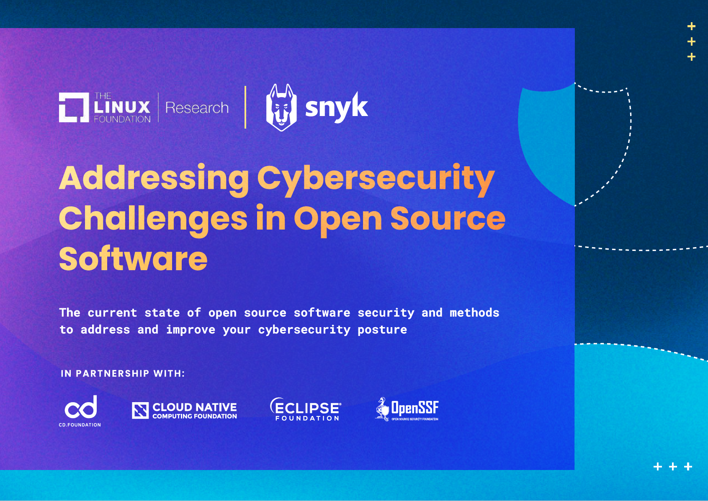

Open source software (OSS) has become an integral part of the technology landscape, as inseparable from the digital machinery of modern society as bridges and highways are from global transportation infrastructure. According to one report, typically 70% to 90% of a modern application stack consists of pre-existing OSS, from the operating system to the cloud container to the cryptography and networking functions, sometimes up to the very application running your enterprise or website. Thanks to copyright licenses that encourage no-charge re-use, remixing, and redistribution, OSS encourages even the most dogged of competitors to work together to address common challenges, saving money by avoiding duplication of effort, moving faster to innovate upon new ideas and adopt emerging standards.

开源软件（OSS）已成为技术领域不可或缺的一部分，就像桥梁和高速公路是全球交通基础设施施密不可分一样，已经和现代社会的数字机器紧密结合在一起。据报告显示，现代应用程序栈通常由 70％ 至 90％ 的现有开源软件组成，从操作系统到云容器，再到加密和网络功能，甚至是支撑企业或网站运行的应用程序本身。由于版权许可证鼓励免费重复使用、重新混合和重新分发，开源软件鼓励企业合作共同解决共同的挑战，即使是最激烈的竞争对手，也可通过避免重复工作来节省资金，并更快地创新和采用新兴标准。

However, this ubiquity and flexibility can come at a price. While OSS generally has an excellent reputation for security, the communities behind those works can vary significantly in their application of development practices and techniques to reduce the risk of defects in the code, or to respond quickly and safely when one is discovered by others. Often, developers trying to decide what OSS to use have difficulty determining which ones are more likely to be secure than others based on objective criteria. Enterprises often don't have a well-managed inventory of the software assets they use, with enough granular detail, to know when or if they're vulnerable to known defects, and when or how to upgrade. Even those enterprises willing to invest in increasing the security of the OSS they use often don't know where to make those investments, nor their urgency relative to other priorities.

然而，这种普遍性和灵活性是有代价的。 虽然 开源软件通常在安全方面享有盛誉，但这些作品背后的社区在降低代码缺陷风险中的应用开发实践和技术，或在他人发现缺陷时快速安全响应方面可能存在很大差异。 通常情况下，试图决定使用哪种 开源软件的开发人员很难根据客观标准确定哪些 开源软件比其他 开源软件更安全。 企业通常没有对其使用的软件资产进行良好管理的清单，没有足够详细的细节来了解它们何时或是否易受已知缺陷的影响，以及何时或如何升级。 即使那些愿意投资增强其使用的开源软件安全性的企业，也经常不知道在哪些方面进行投资，以及这相对于其他优先事项的紧迫性。

However, fighting security issues at their upstream source - trying to catch them earlier in the development process, or even reduce the chances of their occurrence at all - remains a critical need. We are also seeing new attacks that focus less on vulnerabilities in code, and more on the supply chain itself - from rogue software that uses "typosquatting on package names to insert itself unexpectedly into a developer's dependency tree, to attacks on software build and distribution services, to developers turning their one-person projects into "protest-ware" with likely unintended consequences.

然而，在上游源头上解决安全问题 - 试图在开发过程的早期发现它们，甚至减少它们发生的机会 - 仍然是一个关键的需求。我们也看到了新的攻击，它们较少关注代码中的漏洞，而更多地关注供应链本身 - 从使用“包名称上的域名仿冒将自己意外插入开发人员的依赖树”的流氓软件，到对软件构建和分发服务的攻击，再到开发人员将他们的单人项目变成可能会产生意想不到的后果“抗议软件”。

To address the urgent need for better security practices, tools, and techniques in the open source software ecosystem, a collection of deeply invested organizations came together in 2020 to form the Open Source Security Foundation (OpenSSF), and chose to house that effort at the Linux Foundation. This public effort has grown to include hundreds of active participants across dozens of different public initiatives housed under 7 working groups, with funding and partnership from over 75 different organizations, and reaching millions of OSS developers. This report presents analysis that we intend to use to help support that effort. You can see a complete copy of my prepared testimony at: Testimony to the US House Committee on Science and Technology - Open Source Security Foundation (openssf.org).

为了满足开源软件生态系统中对更好的安全实践、工具和技术的迫切需求，一系列深度投资的组织在 2020 年聚集在一起，成立了开源安全基金会 （OpenSSF），并选择将这项工作设在 Linux 基金会。这项公共努力已经发展到包括数十个不同公共计划的数百名积极参与者，这些计划位于7个工作组下，来自超过75个不同组织的资金和合作伙伴关系，并覆盖了数百万个开源软件开发者。本报告介绍了我们打算用来帮助支持这项工作的分析。您可以在以下位置查看我准备的证词的完整副本：美国众议院科学和技术委员会的证词 - 开源安全基金会（openssf.org）。

**Brian Behlendorf**

**布赖恩·贝伦多夫**

**General Manager, Open Source Security Foundation**

**总经理，开源安全基金会**

**The Linux Foundation**

**Linux 基金会**

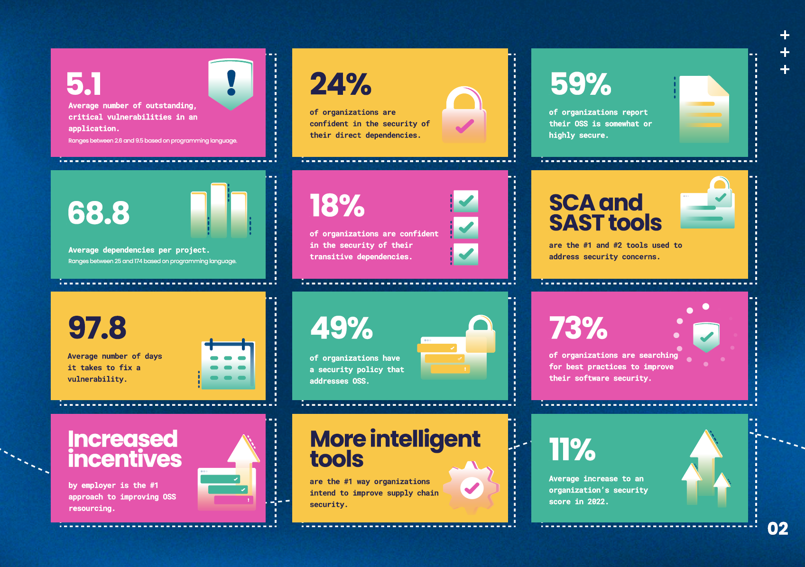

| | |  |
|----|----|----|
| 5.1 Average number of outstanding, critical vulnerabilities in an application. Ranges between 2.6 and 9.5 based on programming language.  | 24% of organizations are confident in the security of their direct dependencies. | 59% of organizations report their OSS is somewhat or highly secure. |
| 5.1 平均每个应用程序存在的重要漏洞数量。 根据编程语言的不同，重要漏洞数量的范围在 2.6 到 9.5 之间。| 24% 的组织对它们的直接依赖的安全性感到有信心。| 59％ 的组织报告称，他们的开源软件在一定程度上或高度安全。 |
| 68.8 Average dependencies per project. Ranges between 25 and 174 based on programming language. | 18% of organizations are confident in the security of their transitive dependencies. | SCA and SAST tools are the #1 and #2 tools used to address security concerns. |
| 68.8 每个项目的平均依赖项。 根据编程语言的不同，依赖项的数量在25到174之间变化。| 18% 的企业对其传递依赖项的安全性感到有信心。 | 软件组成分析（SCA）和 静态应用程序安全测试（SAST）工具是解决安全顾虑使用的排名第一和第二的工具。|
| 97.8 Average number of days it takes to fix a vulnerability. | 49% of  organizations have a security policy that addresses OSS. | 73% of organizations are searching for best practices to improve their software security. |
| 97.8 平均修复漏洞所需的天数。 | 49% 的组织拥有涵盖开源软件安全的安全策略。 | 73% 的组织正在寻找提高软件安全性的最佳实践。|
| Increased incentives  by employer is the #1 approach to improving OSS resourcing. | More intelligent tools are the #1 way organizations intend to improve supply chain security. | 11% Average increase to an organization’s security
score in 2022. |
| 雇主提供更多的激励措施是改善开源软件资源配置的第一途径。 | 更加智能的工具是组织机构试图提高供应链安全性的第一选择。| 11% 组织在2022年的安全分数平均提高百分比 |

## Introduction

## 介绍

Open source software (OSS) has had a tremendous impact on the development and distribution of the software we depend on today.
Through its collaborative and open way of both developing and sharing software components, OSS has served as a key engine for innovation and encouraged the widespread reuse and sharing of core software components. Today, nearly all applications are composed of components dependent upon other components, creating a supply chain that involves hundreds of components and multitiered dependencies.

开源软件 (OSS) 对我们今天所依赖的软件的开发和分发产生了巨大影响。通过其开发和共享软件组件的协作和开放方式，开源软件已成为创新的关键引擎，并鼓励核心软件组件的广泛重用和共享。 如今，几乎所有应用程序都由依赖于其他组件的组件组成，从而形成了一个涉及数百个组件和多层依赖项的供应链。

Organizations of all sizes are heavily reliant on software, and much of that software supply chain consists of open source software components. Because of this, open source software has cybersecurity implications: the software supply chain is an attractive entry point for people and organizations interested in theft, disruption, or exploitation for economic or political gain. The attack surface today is changing from those in traditional cybersecurity threat models. Defects in small libraries that are widely used across the software ecosystem can cause systemic risk, as we've seen with incidents such as Log4shell.

各种规模的组织都严重依赖软件，其中大部分的软件供应链包含开源软件组件。正因为如此，开源软件具有网络安全的影响：软件供应链是入侵者利用进行盗窃、破坏或为了经济或政治利益而开发的一个有吸引力的入口点。如今，攻击面正在从传统的网络安全威胁模型中改变。在整个软件生态系统中广泛使用的小型库中的缺陷可能会导致系统性风险，正如我们在 Log4shell 等事件中所见到的那样。

### Security challenges

### 安全挑战

Addressing the security of open source software components requires a different approach from traditional approaches of securing proprietary, vendor-supported software. The more loosely structured and community focused nature of OSS development presents a more challenging environment for addressing software security. The distribution of OSS projects is bookended by a small number of large visible projects (like the Linux kernel and Kubernetes) to a very large number of small projects. Smaller projects typically have fewer contributors and resources, and are therefore more likely to adopt a minimalist approach to development and security.

解决开源软件组件的安全问题需要与保护专有、供应商支持软件的传统方法不同的方法。开源软件的开发结构更加松散和以社区为重心，这种性质使得解决软件安全问题变得更具挑战性。开源软件项目的发布范围从少数几个大型可见项目（如Linux内核和Kubernetes）到非常多的小型项目。小型项目通常具有更少的贡献者和资源，因此更有可能采用简单的方法来对待开发和安全。

The tremendous benefits and prevalence of OSS in organizational software, combined with the vulnerability of the OSS software supply chain, puts us at a crossroads. Organizations and companies that use open source software need to become more aware of what dependencies they are using, proactively and regularly monitoring all components for usability, trustworthiness, and vulnerabilities. Ultimately, open source software is a two-way street: consumers of open source software must contribute back to the OSS communities to ensure the health and viability of the dependencies they rely on. Merely using open source software, without contributing back, is not enough. What is required is both to 1) incorporate the nature of OSS dependencies into standard cybersecurity and development practices and 2) contribute back to the OSS communities that organizations rely on.

开源软件在组织软件中所带来的巨大好处和普及性，加上开源软件供应链的脆弱性，让我们处于一个十字路口。使用开源软件的组织和公司需要更加了解它们所使用的依赖项，积极地和定期地监控所有组件的可用性、可信性和漏洞。最终，使用开源软件与回馈开源社区应该是一种互惠互利的关系：开源软件的消费者必须向开源软件社区做出贡献，以确保他们依赖的依赖项的健康和可行性。仅仅使用开源软件而不进行贡献是不够的。需要的是将开源软件依赖项的性质纳入标准的网络安全和开发实践中，并向组织依赖的开源软件社区做出贡献。

### Research approach

### 研究方法

This report focuses on OSS security perspectives and how to improve OSS security and sustainability.

本报告的关注点在开源软件安全，以及如何改善开源软件的安全性和可持续性。

Research began in March 2022 with fifteen interviews of open source software maintainers and cybersecurity experts. These qualitative interviews helped to shape the scope of the research and the design of the quantitative survey instrument.

研究始于 2022 年 3 月，进行了 15 次开源软件维护者和网络安全专家的访谈。这些定性访谈有助于塑造研究范围和设计定量调查工具。

**A worldwide survey was fielded in April 2022, targeting the following roles:**
- Individuals who contribute to, use, or administer Oss
- Maintainers, core contributors, and occasional contributors to OSS
- Developers of proprietary software to use OSS
- Individuals with a strong focus on software supply chain security

**2022 年 4 月，针对以下角色进行了一次全球调查：**
- 贡献、使用或管理开源软件的个人
- 开源软件的维护者、核心贡献者和偶尔的贡献者
- 使用开源软件的专有软件开发人员
- 强烈关注软件供应链安全的个人

**The survey included four sections:**
- Screening questions and demographics
- OSS security perspectives. Sample size is 539 and margin of error (MoE) is +/- 3.6% at a 90% confidence level.
- OSS best practices for secure software development. Sample size is 72. Only OSS maintainer and core contributors were invited to complete this section of the survey. Because of the technical detail that was characteristic of this section, it was not addressed as part of this report and instead will be discussed in a separate report to be published in 2022 Q3.
- Improving OSS security. Sample size is 433 and margin of err (MoE) is +/-4.0% at a 90% confidence level.

**该调查包括四个部分：**
- 筛选问题和人口统计学信息
- 开源软件安全视角。样本量为 539，置信度水平为 90%，误差率(MoE)为 +/- 3.6%
- 为安全软件开发提供最佳实践。样本量为 72，只邀请了开源软件维护者和核心贡献者完成本部分的调查。由于这一部分的技术细节较多，本报告没有对其进行讨论，将在2022年三季度发表的另一份报告中进行讨论。
- 改进开源软件安全。样本量为 433，置信度水平为 90%，误差率(MoE)为 +/- 4.0%。

For more information about this research approach and sample demographics, see the methodology section of this paper.
The data provided by Snyk is based on over 1.3 million projects and was collected from April 1, 2021 until March 31, 2022. Snyk's efforts were primarily focused on understanding how five key languages/ecosystems (.Net, Go, Java, JavaScript, and Python) are influencing the complexity of the software supply chain. This data was gathered from the use of Snyk Open Source, a static code analysis (SCA) tool free to use for individuals and open source maintainers.

更多有关此研究方法和样本统计信息的信息，请参阅本文的方法部分。
Snyk 提供的数据基于超过 130 万个项目，采集周期为 2021 年 4 月 1 日至 2022 年 3 月 31 日。Snyk 的工作主要集中在了解五种关键语言 / 生态系统（.Net、Go、Java、JavaScript 和 Python）如何影响软件供应链的复杂性上。这些数据是通过使用 Snyk 开源工具收集的，该工具是一个静态代码分析（SCA）工具，供个人和开源维护人员免费使用。

## Open source software security perspectives

## 开源软件安全观点

Initial questions in this survey were designed to understand organizational commitment to security that covers OSS development and use and beliefs about the security of the OSS and its dependencies in use. Responses to these questions suggest that organizations collectively have been slow to make software security a priority.

该调查的初始问题旨在了解组织在涵盖开源软件开发和使用方面的安全承诺以及对正在使用的开源软件及其依赖性安全性的信念。对这些问题的回答表明，组织在使软件安全成为优先事项方面进展缓慢。

### Many organizations do not have a security policy that covers OSS

### 许多组织没有涵盖开源软件的安全政策

One of the most startling findings of this research, as shown in Figure 1, is that only 49% of organizations have a security policy that covers OSS development or use. 34% of organizations indicate that they do not have a security policy for OSS development and usage, and 17% of respondents were not sure if their organization had a plan or not. If we prorate this 17% based on the existing distribution of responses, the number of organizations with a security policy covering OSS rises from 49% to 59%, and those without a policy rise from 34% to 41%.

这项研究最惊人的发现之一是，如图 1 所示，只有 49％ 的组织拥有涵盖开源软件开发或使用的安全策略。34％的组织表示，他们没有开源软件开发和使用的安全策略，17％的受访者不确定他们的组织是否有计划。如果将这17％根据现有的回答分布来按比例分配，则拥有涵盖开源软件的安全策略的组织数量从49％上升到59％，而没有策略的组织则从34％上升到41％。


```text
Figure 1: Organizations with a security policy covering OSS

图1：有涵盖开源软件的安全政策的组织

Do you have an open source security policy in place for open source development or usage? (select one)

您是否已为开源软件的开发或使用制定了开源安全政策？（请选择一项）

Yes：
是

No：
否

Total：
不知道（英文应该是错了，坐标轴上是Don't know）
```

Having a security policy covering OSS indicates that you have a security action plan that includes the many OSS components in use. Without a software security policy, organizations may expose themselves to a significant amount of financial and reputational risk because they may not be evaluating software before its inclusion and/or may not be prepared for the inevitable updates due to software vulnerabilities (OSS or not).

拥有涵盖开源软件的安全策略表示您拥有包含许多使用的开源软件组件的安全行动计划。如果没有软件安全策略，组织可能会面临相当大的财务和声誉风险，因为他们可能没有在将软件包含进项目之前进行评估，或者可能没有为由于软件漏洞（无论是开源软件还是其他软件）而不可避免的更新做好准备。

Note that we intentionally did not have any special requirements on how the security policy covering OSS was stated. Some organizations have a single policy on software, and then only have specific statements for OSS in the relatively few cases where OSS would be sensibly different. This would be an application of the so-called "Hellekson's Law" ("a more specific policy can be improved for the general case by removing delimiters that narrow the policy scope, "e.g., deleting "open source" from an "open source software" policy typically improves it). For our purposes this is fine. We simply let the respondents identify whatever applied to their organization.

请注意，我们有意没有对涵盖开源软件的安全策略有任何特殊要求。一些组织只有一个关于软件的策略，然后仅在开源软件有相对少的情况下才有特定的声明。这是所谓的“Hellekson 定律”的应用（“通过删除缩小策略范围的分隔符，例如，从“开源软件”策略中删除“开源”，可以改进通用情况下的更具体策略）。对于我们的研究目的来说，这是可以接受的。我们只是让受访者确定他们所在组织适用的情况。

The one benefit of the distribution shown in Figure 1 is that we can statistically compare and contrast the characteristics of organizations with a security policy against those without one. Understanding these comparative differences helps us describe the OSS security journey that organizations are on.

图 1 所示的分布的一个好处是，我们可以对拥有安全策略的组织与没有安全策略的组织进行统计学比较和对比。了解这些比较差异有助于我们描述组织在开源软件安全方面的旅程。

### Small organizations shoulder disproportionate OSS security risk

### 小型组织承担着不成比例的开源软件安全风险

This survey included organizations of various sizes (based on the number of worldwide employees). The survey sample was distributed by organization size as follows: small organizations (44%, 1-499 employees), medium organizations (20%, 500-4,000 employees), large organizations (35%, 5,000+ employees), and 1% don’t know or are not sure.

本次调查涵盖了各种规模的组织（根据全球员工人数划分）。调查样本按组织规模分布如下：小型组织（44％，1-499 名员工），中型组织（20％，500-4,000 名员工），大型组织（35％，5,000 名及以上员工），1％ 不知道或不确定。

The measure of security policy covering OSS by organizational size is shown in Figure 2. Immediately noticeable is the difference in distributions between organizations with 1-499 employees and those with 500 employees or more. Just 41% of small organizations have an OSS security policy, compared to 56%-57% of larger organizations. This significant difference indicates that small organizations behave differently than larger organizations when it comes to OSS security policy adoption.

按组织规模衡量涵盖开源软件的安全政策的情况如图 2 所示。立即显着的是，1-499 名员工的小型组织和 500 名员工以上的组织之间的分布差异。只有 41% 的小型组织拥有开源软件安全政策，而大型组织的开源软件安全政策采用率在 56%-57% 之间。这个显著的差异表明，小型组织在开源软件安全政策采用方面的行为与大型组织不同。

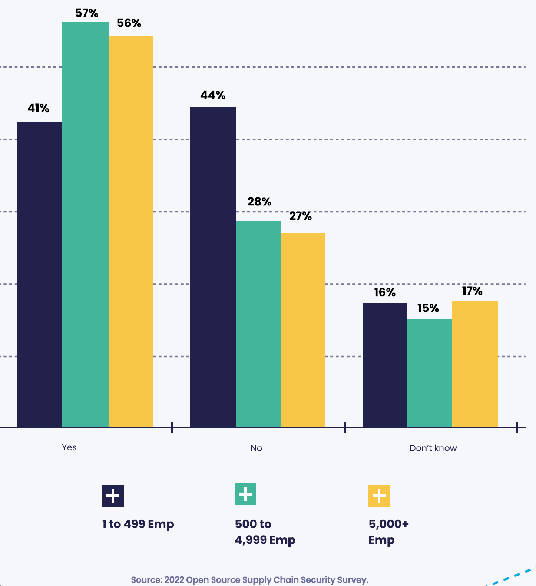

```text
Figure 2: A distribution of OSS security policy by organization size

图 2：按组织规模分布的开源软件安全策略

Do you have an open source security policy in place for open source development or usage? (select one) by Enterprise size

您是否有针对开源软件开发或使用的开源安全策略？按企业规模（选择一项）


Yes: 
是

No: 
否

Don't know: 
不知道

1 to 499 Emp: 
员工数 1～499

500 to 4999 Emp: 
员工数 500~4999

5000+ Emp: 
员工数 5000+

Source: 2022 Open Source Supply Chain Security Survey.
来源：2022年开源供应链安全调查。
```

One reason that small organizations are OSS security challenged is economies of size. Small organizations have small IT staff and budgets, and the functional needs of the business often take precedence so that the business can remain competitive. Lack of resources and time were the leading reasons why organizations were not addressing OSS security best practices.

小型组织开源软件安全面临挑战的原因之一是规模经济。小型组织拥有较少的 IT 人员和预算，业务的功能需求通常具有优先性，以使业务能够保持竞争力。缺乏资源和时间是组织未能解决开源软件安全最佳实践的主要原因。

While it is disappointing that 44% of small organizations do not have an OSS security policy, an additional concern is that close to 30% of larger organizations also do not have an OSS security policy. Small organizations can rationalize increased financial, reputational, and legal risk, but this becomes tenuous for medium organizations and insupportable for large organizations with 5000+ employees. Medium and large organizations likewise complain about not enough having resources or time to address OSS security needs. Surprisingly, a lack of awareness about security best practices is more often identified by large organizations as a reason for not attending to OSS security needs than lack of time.

虽然令人失望的是，44% 的小型组织没有开源软件安全策略，但更令人担忧的是，接近 30% 的大型组织也没有开源软件安全策略。小型组织可以理性地解释为增加财务、声誉和法律风险，但对于 5000 多名员工的中型和大型组织来说，这变得岌岌可危。中型和大型组织同样抱怨没有足够的资源或时间来应对开源软件安全需求。令人惊讶的是，大型组织更常常将缺乏安全最佳实践的意识视为不关注开源软件安全需求的原因，而不是时间不足。

### Many Organizations score poorly on OSS security

### 许多组织在开源软件安全方面得分低

We asked organizations how secure their open source software is today. Responses to this question are shown in Figure 3. Overall, 59% of organizations feel their OSS is either somewhat secure or highly secure. For organizations with an OSS security policy, this value rises to 70%. It falls to 45% for organizations without a security policy.

我们询问了组织关于他们的开源软件安全性的评估。这个问题的回答如图 3 所示。总体而言，59% 的组织认为他们的开源软件在某种程度上是安全的或者非常安全的。对于有开源软件安全策略的组织，这个比例上升到了 70%。而对于没有安全策略的组织，这个比例则下降到了 45%。

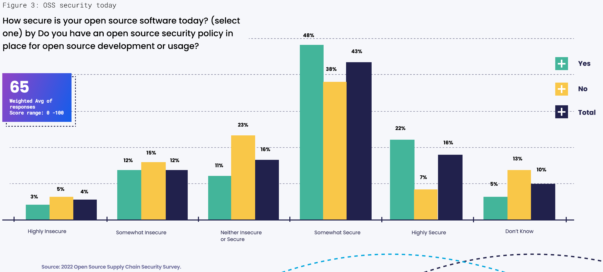

```text
Figure 3: OSS security today

图 3：当今的开源软件安全情况

How secure is your open source software today? (select one) by Do you have an open source security policy in place for open source development or usage?

您的开源软件今天有多安全？按您是否有一个用于开源开发或使用的开源安全策略进行分组（选择一项）

65
Weighted Avg of responses
Score range: 0 -100

65
回答的加权平均分
分数范围：0～100

Yes：
是

No：
否

Total：
综合

Highly Insecure：
非常不安全

Somewhat Insecure：
有些不安全

Neither Insecure or Secure：
中性

Somewhat Secure：
有些安全

Highly Secure：
非常安全

Don’t Know：
不知道

Source: 2022 Open Source Supply Chain Security Survey.
来源：2022年开源供应链安全调查。
```

A simple weighted average of all responses shows a composite score of 65 for all organizations, which is a poor grade.
Organizations with an OSS security policy score a 70, and organizations without a policy score a 58.

简单的加权平均所有回答的分数显示，所有组织的综合分数为 65 分，这是一个不好的分数。拥有开源软件安全策略的组织得分为 70 分，而没有策略的组织得分为 58 分。

### The secure development of OSs is also at risk

### 开发或使用开源软件的安全问题同样存在风险

Similarly, Figure 4 shows how secure the process for developing or using OSS is today. Using the same responses shown in Figure 3, the results are nearly identical. Across all organizations, 59% believe that their development processes are somewhat secure or highly secure. This value rises to 73% for organizations with an OSS security policy and falls to 47% for organizations without.

同样，图 4 展示了开发或使用开源软件的过程的安全性。使用图 3 中展示的相同回答，结果几乎相同。在所有组织中，59% 的人认为他们的开发过程是相对安全或高度安全的。对于拥有 OSS 安全策略的组织，这个值升至 73%，而对于没有安全策略的组织，则下降至 47%。

Figure 4: Security of OSS development and use today

图 4：如今的开源软件开发和使用的安全性

How secure is your process for developing or using open source software today? (select one) by Do you have an open source security policy in place for open source development or usage?

您是否已经针对开源开发或使用实施了开源安全策略？（选择一项）按照您是否对开源开发或使用实施了安全策略，您认为您目前的开源软件开发或使用流程有多安全？（选择一项）

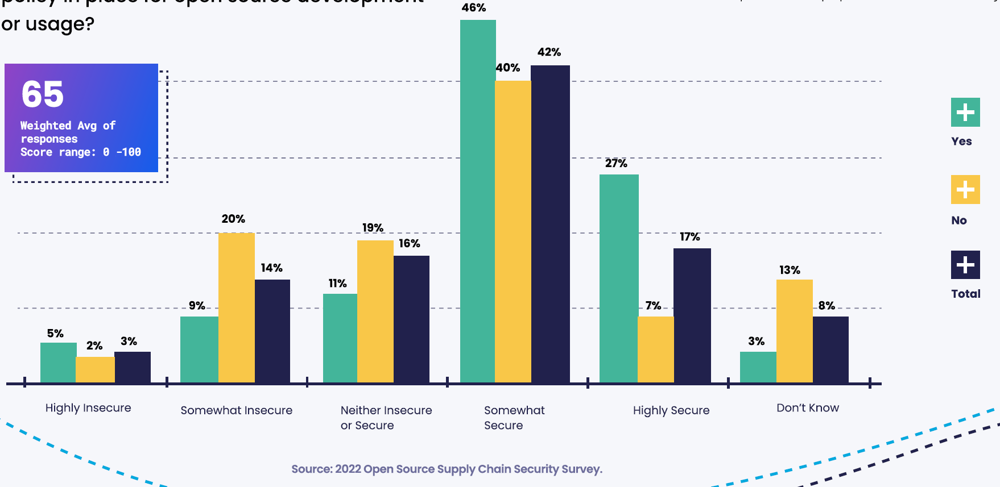

```plaintext
65
Weighted Avg of responses
Score range: 0 -100

65
回答的加权平均分
分数范围：0～100

Yes：
是

No：
否

Total：
综合

Highly Insecure：
非常不安全

Somewhat Insecure：
有些不安全

Neither Insecure or Secure：
中性

Somewhat Secure：
有些安全

Highly Secure：
非常安全

Don’t Know：
不知道

Source: 2022 Open Source Supply Chain Security Survey.
来源：2022年开源供应链安全调查。
```

The similarity of this distribution when compared to Figure 4 also yields a weighted average of 65 and organizations with the security policy score 71 and organizations without a policy 58.

与图 4 相比，这个分布的相似性也产生了一个加权平均值为 65，安全策略得分为 71，没有策略的组织得分为 58。

Across organizations, there is a belief that the security of OSS development and use will improve to a weighted average score of 72 by the end of 2022 and 77 by the end of 2023. Later in this report, you will see that an organizational cornerstone of their
OSS security strategy is for the vendor community to provide security tools with greater intelligence. Other key elements of their OSS security strategy include a more complete understanding of best practices for secure software development and greater CI/ CD automation to eliminate manual actions and opportunities that expose the pipeline to security risks.

跨组织而言，人们认为到 2022 年底，OSS 开发和使用的安全性将提高到加权平均分数为 72，到 2023 年底将提高到 77。在本报告的后面部分，您将看到，组织制定的 OSS 安全策略的基石是让供应商社区提供更具智能的安全工具。他们的 OSS 安全策略的其他关键要素包括更全面地了解安全软件开发的最佳实践，并实现更多的 CI / CD 自动化以消除手动操作和可能导致安全风险的机会。

### Who drives OSS security policies?

### 谁推动了开源软件安全策略？

Figure 5 superficially creates a conundrum: how do organizations without a top-down OSS security policy have people responsible for defining OSS security policy? Additionally. not having an OSS security policy doesn't mean that groups aren't addressing OSS security in ad hoe ways.

图 5 表面上制造了一个难题：没有由上而下的开源软件安全策略的组织如何有负责定义开源软件安全策略的人？此外，没有开源软件安全策略并不意味着各组没有以临时方式解决开源软件安全问题。

Across organizations, just 31% vest responsibility for defining an OSS security policy in the hands of a CIS and/or security team. The second leading choice of multiple teams at 16% suggests that instead of policy being established by a CIS, it evolves across the Software Development Life Cycle (SDLC) based on the focus of the team. Because a security focus should exist across the CI/CD pipeline, multiple teams are needed to implement OSS security policy. Reliance on open source maintainers at 13% overall can be workable 1f the maintainers are either part of the organization or known to the organization - but it sdems recklessly optimistic to put trust in OSS projects with unknon provenance.

跨组织而言，仅有 31% 的组织将定义 OSS 安全策略的责任归属于 CIS（计算机信息安全）和 / 或安全团队。16% 的多个团队作为第二选择表明，政策的制定不是由 CIS 确定的，而是根据团队的重点在软件开发生命周期 (SDLC) 中逐步形成。由于在 CI/CD 管道中应存在安全重点，因此需要多个团队来实施 OSS 安全策略。总体上依赖于开源维护者的 13% 可能是可行的，前提是维护者要么是组织的一部分，要么已知于组织，但是如果信任来源未知的 OSS 项目，这种做法似乎过于乐观。

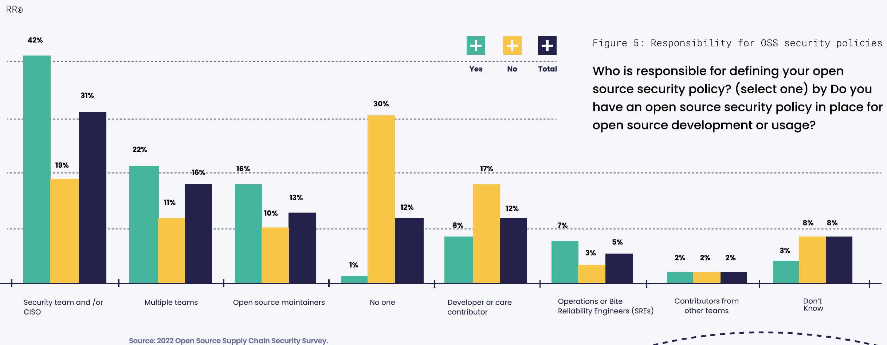

```plaintext
Figure 5: Responsibility for OSS security policies
Who is responsible for defining your open source security policy? (select one) by Do you have an open source security policy in place for open source development or usage?

图5：开源安全策略的责任
谁负责制定您的开源安全策略？（选择一项）按您是否有适用于开源开发或使用的开源安全策略？

Yes：
是

No：
否

Total：
综合

Security team and /or CISO：
安全团队/CISO

Multiple teams：
多个团队

Open source maintainers：
开源维护者

No one：
没有人

Developer or care contributor：
开发人员或贡献者

Operations or Bite Reliability Engineers (SREs)：
运维或可靠性工程师（SREs）

Contributors from other teams：
其他团队的贡献者

Don’t Know：
不知道

Source: 2022 Open Source Supply Chain Security Survey.
来源：2022年开源供应链安全调查。
```

The percentages in Figure 5 are especially revealing. Across organizations with an OSS security policy, 80% vest the definition of an OSS security policy with the CISO/security team, multiple teams, or open source maintainers. This contrasts with organizations without an OSS security policy where 40% of these same groups are involved with OSS security in some capacity.

在图 5 中的百分比特别说明了问题。在有开源安全策略的组织中，80％的组织将开源安全策略的定义授予CISO/安全团队、多个团队或开源维护人员。这与没有开源安全策略的组织形成对比, 在没有开源安全策略的组织中，同样的团队有40％以某种方式参与开源安全。

Perhaps one positive indicator in Figure 5 is that only 30% of organizations without an OSS security policy admit that no one is addressing OSS security. This means that 70% of these organizations are addressing OSS security in part through ad hoc means, suggesting that organizations without an OSS security policy are not completely adrift and have some grassroots activities to address OSS security needs.

或许在图 5 中令人欣慰的一个指标是，仅有 30% 的没有开源安全策略的组织承认没有人在处理开源安全。这意味着 70% 的这些组织通过一些临时手段部分地解决了开源安全问题，表明没有开源安全策略的组织并非完全漂泊无助，有一些基层活动来解决开源安全需求。

### Organizations are not effectively managing the security of their dependencies

### 组织未能有效地管理其依赖项的安全性

Dependencies are a characteristic of modern development. Direct dependencies are typically components or services called directly by your code. Indirect or transitive dependencies are essentially dependencies of your dependencies (in typically many tiers).

依赖项是现代开发的一个特征。直接依赖通常是被你的代码直接调用的组件或服务。间接或传递依赖实际上是您依赖的依赖（通常是多个层次）的依赖。

Vulnerabilities exist in component code for many reasons.
Contributing factors include the programming language used, the CI/CD process in use, the education and skill of the developer in developing secure software, and the scope of testing.
Complicating matters is that vulnerability management is not a perfect science. Vulnerability scanning normally identifies many false positives based on the information available to the scanning tool. Conversely, an actual vulnerability in a component may not matter if the code linked to the vulnerability is never executed and/or will only provide trusted data to the vulnerable code.

组件代码存在漏洞的原因有很多。其中的因素包括使用的编程语言、使用的 CI/CD 过程、开发人员在开发安全软件方面的教育和技能以及测试的范围。复杂化问题的是，漏洞管理并不是一门完美的科学。漏洞扫描通常会基于扫描工具可用的信息识别出很多误报。相反，如果与漏洞相关的代码从未被执行，或者只会向漏洞代码提供可信数据，那么组件中的实际漏洞可能就不重要了。

What is known is that organizations are not well-positioned to manage their vulnerabilities. Only one response in Figure 6 indicates that organizations are confident in the security of their direct dependencies.

已知的是，组织机构无法很好地管理它们的漏洞。在图6中，只有一个回答表明组织机构对其直接依赖项的安全性感到有信心。

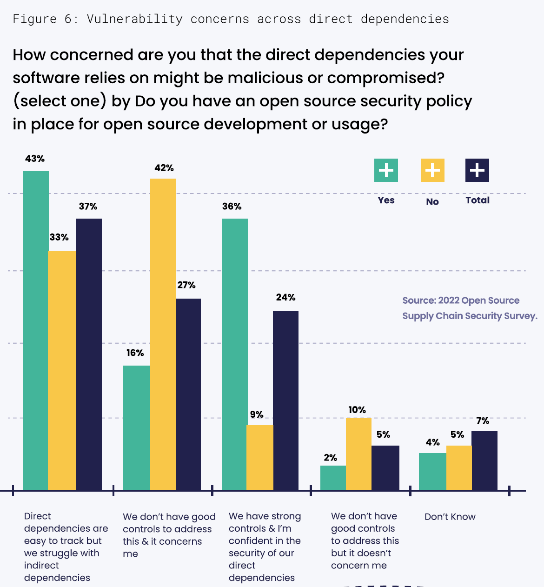

```c
Figure 6: Vulnerability concerns across direct dependencies
图 6：对直接依赖项的漏洞担忧

How concerned are you that the direct dependencies your software relies on might be malicious or compromised? (select one) by Do you have an open source security policy in place for open source development or usage?
你对软件所依赖的直接依赖项可能是恶意或受到攻击有多担忧？（选择一个）你是否已经为开源开发或使用制定了开源安全策略？

Yes：
是

No：
否

Total：
综合

Source: 2022 Open Source Supply Chain Security Survey.
来源：2022年开源供应链安全调查。

Direct dependencies are easy to track but we struggle with indirect dependencies
直接依赖项易于跟踪，但我们难以处理间接依赖项

We don’t have good controls to address this & it concerns me
我们没有好的控制措施来解决这个问题，这让我感到担忧

We have strong controls & I’m confident in the security of our direct dependencies
我们有强有力的控制措施，我对我们的直接依赖关系的安全性感到有信心

We don’t have good controls to address this but it doesn’t concern me
我们没有好的控制措施来解决这个问题，但我并不担心

Don’t Know：
不知道
```

Across all organizations, only 24% have confidence in the security of their direct dependencies. This value rises to 36% for organizations that have an OSS security policy but falls to just 9% of organizations without such a security policy.
Organizations reporting that dependencies are easy to track (37%) may be correct in understanding their dependencies, but this doesn't mean that these dependencies are collectively secure.

所有组织中，只有 24% 的组织对其直接依赖项的安全性感到有信心。对于有开源安全策略的组织，这个值上升到 36％，但对于没有安全策略的组织，这个值只有 9％。
报告依赖项项易于跟踪的组织（37％）可能正确地理解了它们的依赖项，但这并不意味着这些依赖项总体上是安全的。

### Snyk - Dependencies drive complexity

### Snyk - 依赖关系驱动复杂性

Dependencies are one of the key components driving much of the conversation about the software supply chain. Professionals in both development and security teams are increasingly aware that securing their enterprise does not depend entirely on their organization. Instead, we are having to look further and further, down the rabbit hole of "Where did this code come from?" It's hard enough to understand where everything originated when you're trying to test code written in-house. When you add dependencies two, three, or more levels deep, it becomes daunting to even consider the problem.

依赖项是推动软件供应链讨论的关键组成部分之一。开发和安全团队的专业人员越来越意识到，保护他们的企业并不完全依赖于他们的组织。相反，我们不得不越来越深入地查看“这段代码来自哪里？”的问题。当您尝试测试内部编写的代码时，了解所有代码的起源已经很难了。当您添加两个、三个或更深层次的依赖项时，甚至考虑这个问题都变得令人生畏。

The libraries we call in our code, the code snippets we pull from the internet, and the tools we include in container configurations are all examples of direct dependencies. In each of these cases we are relying on third-party code explicitly to fulfill a specific need or purpose.

直接依赖项是我们在代码中调用的库、从互联网获取的代码片段以及包含在容器配置中的工具等。在这些情况下，我们明确地依赖第三方代码来满足特定的需求或目的。

Measuring the number of dependencies per project, therefore, makes a good starting point for understanding how complex the problem of tracking dependencies really is. As shown in Figure 7, the average number of dependencies per project stretches from Python, with 25 dependencies per project, to JavaScript's 173 per project.

因此，衡量每个项目的依赖关系数量是了解跟踪依赖关系问题的复杂性的好起点。如图 7 所示，每个项目的平均项数量从 Python 的 25 个到 JavaScript 的 173 个不等。

Does that mean JavaScript is inherently more complex than .Net (49 dependencies), Go (56 dependencies), or Java (40 dependencies)? Not necessarily. In the case of JavaScript, each dependency often has a single purpose and small scope, rather than a library that fulfills multiple purposes with a large scope.

这是否意味着 JavaScript 本质上比 .Net（49 个依赖项）、Go（56 个依赖项）或 Java（40 个依赖项）更复杂？不一定。在 JavaScript 的情况下，每个依赖项通常只有一个目的和小的范围，而不是一个具有大范围的多个目的的库。

Neither approach is more or less secure than the other but knowing which dependencies you rely on (and how trustworthy they are) is an important part of vulnerability management.
Sadly, only 24% of the respondents in this survey felt they had strong controls in place to handle the security of their dependencies.

这两种方法都不比另一种更安全，但了解你依赖的依赖项（以及它们的可信度）是漏洞管理的重要组成部分。不幸的是，在此次调查中，只有 24% 的受访者认为他们已经采取了强有力的措施来处理其依赖项的安全性。

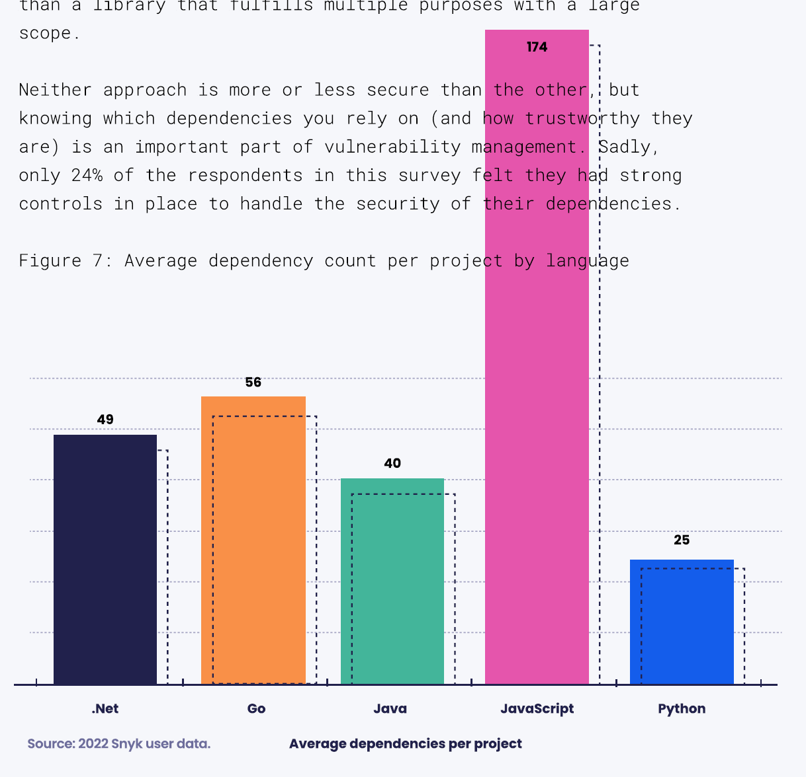

```plaintext
Figure 7: Average dependency count per project by language
图 7：按语言每个项目的平均依赖项数量

（下面几个编程语言不翻译）
.Net
Go
Java
JavaScript
Python

Source: 2022 Open Source Supply Chain Security Survey.
来源：2022年开源供应链安全调查。

Average dependencies per project
平均每个项目的依赖项数量
```

Recent efforts by the US Government to encourage, and even mandate, organizations to create a Software Bill of Materials (SBOM) is evidence of how important it is to have a handle on dependencies. Tracking direct dependencies is a significant issue by itself. Indirect, or transitive, dependencies mark the real start of complexity. Each of the libraries referenced in a project incorporates additional code to perform its own function, and each of those third-party libraries may rely on other libraries as well. Organizations who want a complete accounting of their transitive dependencies should be requiring SBOMs from their suppliers and investing in tools to consume these SBOMs.

美国政府最近鼓励甚至强制要求组织创建软件清单（SBOM）的努力，证明了掌握依赖项关系的重要性。追踪直接依赖项本身就是一个重大问题。而间接或传递性依赖项才是复杂性的真正开始。每个在项目中引用的库都会包含额外的代码来执行其自身的功能，而每个这样的第三方库可能也依赖于其他库。想要完整记录传递依赖关系的组织应该要求其供应商提供 SBOM，并投资于消费这些 SBOM 的工具。

Figure 8 is patterned directly after Figure 6, except that it focuses on transitive dependencies. Transitive dependencies are objectively more difficult to evaluate as the level of dependency increases. The result is that fewer organizations believe that their transitive dependencies are secure

图 8 直接复制了图 6 的结构，不过它专注于间接依赖项。随着依赖程度的增加，间接依赖项的评估变得更加困难，因此，越来越少的组织认为它们的间接依赖项是安全的。

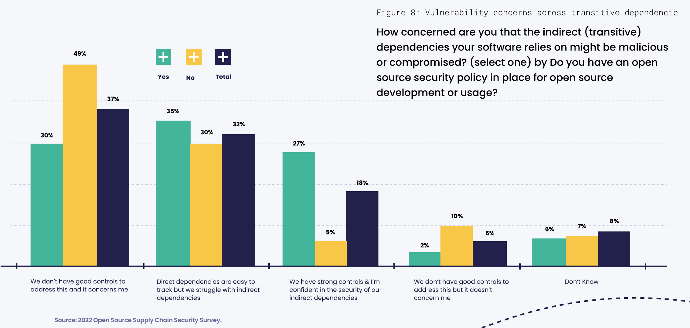

```plaintext
Figure 8: Vulnerability concerns across transitive dependencie
图 8：跨传递依赖项的漏洞问题

How concerned are you that the indirect (transitive) dependencies your software relies on might be malicious or compromised? (select one) by Do you have an open source security policy in place for open source development or usage?
您担心您的软件间接（传递）依赖项可能存在恶意或被攻击的风险吗？ （选择一项） 您是否为开源开发或使用制定了开源安全策略？
```

Figure 8 shows that just 18% of organizations are confident in the security of their transitive dependencies. Once again, this value rises to 27% for organizations that have an OSS security policy but plummets to just 5% for organizations without a security policy.

图 8 显示，只有18%的组织对其传递依赖项的安全性有信心。同样，这个值对于制定了开源安全策略的组织上升至27％，但对于没有安全策略的组织则下降至5％。

A recent discussion with David A. Wheeler, a leading authority on OSS security, yielded this insight, "I think many organizations often don't update their OSS software, even when the older version of the OSS has widely-known vulnerabilities. That's not unique to OSS, many organizations also often don't update old versions of proprietary software with widely-known vulnerabilities

与开源软件（OSS）安全方面的权威专家大卫·A·惠勒（David A. Wheeler）的最近一次讨论得出了这样的见解：“我认为许多组织经常不更新他们的开源软件，即使旧版本的开源已经被广泛知晓的漏洞所影响。这不仅仅是开源的问题，许多组织也经常不更新旧版本的专有软件，而这些软件也有广泛已知的漏洞。”

### Snyk - Dependency creates vulnerability

### Snyk - 依赖关系创建了漏洞

How many vulnerabilities are there in my project? We estimated this by totaling known vulnerabilities in a particular project combined with the known vulnerabilities of its dependencies (presuming that the vulnerabilities in the dependencies were exploitable). The Net projects in our data had 23 vulnerabilities per project on average, with Go at 34, Java at 90, JavaScript having 47, and Python at 36.
This covers both errors introduced in development and vulnerabilities in transitive dependencies. According to Snyk's data, approximately 40% of all vulnerabilities are from these transitive dependencies. We further broke down the count of vulnerabilities per project in Figure 9 to highlight the effect of severity by language.

我的项目中有多少漏洞？我们通过汇总一个特定项目中已知的漏洞以及其依赖项的已知漏洞数量来估计。假设依赖项中的漏洞是可利用的。我们的数据中，.Net 项目平均有 23 个漏洞，Go 项目有 34 个漏洞，Java 项目有 90 个漏洞，JavaScript 项目有 47 个漏洞，Python 项目有 36 个漏洞。
这包括开发中引入的错误和传递依赖项中的漏洞。根据 Snyk 的数据，大约 40% 的漏洞来自这些传递依赖项。我们在图 9 中进一步分解了每个语言的漏洞计数，以凸显严重性的影响。

A large part of the value of SCA tools is finding where vulnerabilities are being introduced by the use of known bad libraries. Is your code incorporating an older version of a library with known vulnerabilities? Is the package still maintained or is it abandoned? Did you accidentally get a library pretending to be the one you actually wanted? These are just a few of the potential issues that could get a package flagged.

SCA 工具的很大一部分价值在于发现由于使用已知存在漏洞的库所引入的漏洞。您的代码是否正在使用一个存在已知漏洞的旧版库？该软件包是否仍在维护中或已被放弃？您是否意外获取了一个假冒您实际需要的库？这些也只是可能会导致软件包被标记的一些潜在问题。

Knowing the number of vulnerabilities in your own project helps you understand how your efforts compare to global numbers. Organizations that see data far different from the baseline number of vulnerabilities in a project can investigate the causes of a disparity. It could be as simple as different ways of measuring the same metric. On the other hand, the difference in numbers could indicate poor coding practices or a large number of old libraries being part of a standard. Without policies and standards that require vulnerability tracking, you may never know.

了解自己项目中漏洞的数量有助于了解自己的努力与全球数据相比的情况。看到与项目中基线漏洞数量迥然不同的数据的组织可以调查差异的原因。这可能只是衡量同一指标的不同方法。另一方面，数字的差异可能表明糟糕的编程实践或大量的旧库作为标准的一部分。如果没有要求跟踪漏洞的政策和标准，您可能永远不会知道。

Figure 9: Average count of vulnerabilities by language and severity

图 9：按语言和严重程度划分的平均漏洞数量

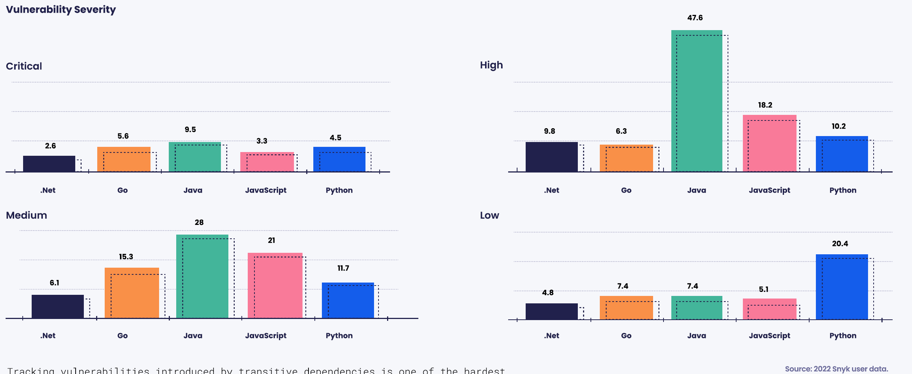

```plaintext
Vulnerability Severity
漏洞严重程度

Critical：
严重

High：
高危

Medium：
中危

Low：
低危

（编程语言不翻译）
.Net
Go
Java
JavaScript
Python

Source: 2022 Snyk user data.
来源：2022年 Snyk 用户数据。
```

Tracking vulnerabilities introduced by transitive dependencies is one of the hardest challenges in DevOps today. Think about a project that has fifty dependencies; if the average project has five critical vulnerabilities, just the first level of dependencies could lead to 200+ critical vulnerabilities. Each layer down expands the problem dramatically. Luckily, most vulnerabilities are tightly constrained by the factors needed to exploit them.

跟踪由传递依赖引入的漏洞是当今 DevOps 面临的最大挑战之一。考虑一个有 50 个依赖项的项目；如果平均每个项目有 5 个严重漏洞，那么仅第一级依赖关系就可能导致 200 多个严重漏洞。每一层依赖都会大大扩大问题的规模。幸运的是，大多数漏洞都受到利用所需因素的严格限制。

## How organizations are addressing and prioritizing their cybersecurity needs

## 组织如何解决和优先考虑其网络安全需求

A key finding of this research is that security, as it applies to OSS, is a rapidly evolving domain. Each of the primary threat vectors (source threats, build threats, and dependency threats) identified in the SLSA (Supply Chain Levels for Software Artifacts) model will require multiple actions on the part of most organizations to address.
However, because OSS security is also rapidly evolving, increased functionality and tool consolidation should help reduce the complexity that organizations face in addressing software supply chain security needs.

该研究的一个关键发现是，与开源软件(OSS)相关的安全性是一个快速发展的领域。SLSA（软件工件供应链级别）模型中确定的每个主要威胁向量（源威胁、构建威胁和依赖威胁）都需要大多数组织采取多个行动来应对。然而，由于开源软件的安全性也在快速发展，增加功能和工具整合应该有助于减少组织在应对软件供应链安全需求方面面临的复杂性。

This section of the report describes how organizations are addressing how vulnerabilities in code are found, how security of OSS components is evaluated, what security-focused tools are being used, and what security-related activities are most important.

本报告的这一部分描述了组织如何解决代码中的漏洞如何被发现，如何评估开源组件的安全性，使用了哪些专注于安全的工具，以及哪些与安全相关的活动最为重要。

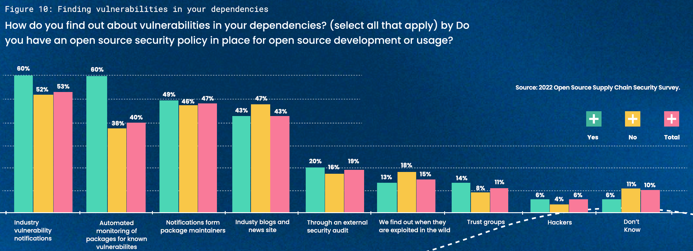

```plaintext
Figure 10: Finding vulnerabilities in your dependencies
How do you find out about vulnerabilities in your dependencies? (select all that apply) by Do you have an open source security policy in place for open source development or usage?

图表 10：发现依赖项中的漏洞
您如何了解依赖项中的漏洞？（选择所有适用项）按照您是否有针对开放源代码开发或使用的安全策略进行筛选。

Source: 2022 Open Source Supply Chain Security Survey.
来源：2022 年开源供应链安全调查。

Industry vulnerability notifications
行业漏洞通知

Automated monitoring of packages for known vulnerabilites
自动监测已知漏洞的软件包

Notifications form package maintainers
来自软件包维护者的通知

Industy blogs and news site
行业博客和新闻网站

Through an external security audit
通过外部安全审计

We find out when they are exploited in the wild
我们发现了漏洞当它们在外面被利用了

Trust groups
信任的群体

Hackers
黑客

Don’t Know
不知道
```

### Organizational approaches to identifying vulnerabilities in dependencies

### 组织内识别依赖漏洞的方法

A common question in addressing OSS security is how to comprehensively identify vulnerabilities across your dependencies. Figure 10 shows that there are four commonly used techniques to identify vulnerabilities. The leading approach practiced by 53% of organizations is to subscribe to one or more vulnerability catalogs from CISA (US-CERT), NIST (NVD), MITRE (CVE), security product & service vendors, and/or catalog aggregators (like FIRST) that aggregate content from leading worldwide sources. These subscriptions have the advantage of pushing vulnerability notifications to their subscribers.

在处理开放源代码软件（OSS）安全问题时，一个常见的问题是如何全面地识别依赖关系中的漏洞。图10显示了四种常用的识别漏洞的技术。53%的组织采用的主要方法是订阅来自CISA（美国国家信息安全局），NIST（美国国家标准与技术研究所），MITRE（通用漏洞披露系统）以及安全产品和服务供应商和/或目录聚合器（例如FIRST）的一个或多个漏洞目录，这些目录汇集了来自全球领先的信息源的内容。这些订阅的优点是向其订阅者推送漏洞通知。

The second leading approach is automated monitoring — or scanning of packages for known vulnerabilities — and is practiced by 49% of organizations. One challenge with this approach is that it’s often difficult to map vulnerability reports to the component(s) containing the vulnerabilities. For example, there may be a vulnerability reported in some component foo, but often there are many components and forks named foo so users often can’t be confident when a report is relevant. While it’s a best practice to scan code formulaically based on time, changes to the code base and the identification of relevant vulnerabilities, a comprehensive approach to this technique is still on the horizon.

第二个主要方法是自动化监控或扫描已知漏洞的软件包。这种方法被49%的组织所采用。这种方法的一个挑战是，往往很难将漏洞报告映射到包含漏洞的组件上。例如，可能会报告某个组件foo中存在漏洞，但通常有许多命名为foo的组件和分支，因此用户经常无法确定报告的相关性。虽然根据时间、代码库的更改和相关漏洞的识别来公式化地扫描代码是最佳实践，但是这种技术的全面方法仍然需要探索。

Notifications from package maintainers are leveraged by 47% of organizations and can provide a conduit to keep packages updated when supported by maintainers. Industry blogs and news sites are used by 43% of organizations and can facilitate the timely delivery of information for a better sense of importance.

软件包维护者的通知被47%的组织所利用，当维护者支持时，可以提供更新软件包的渠道。行业博客和新闻网站被43%的组织使用，可以促进及时传递信息，以获得更好的重要性感知。

### Snyk - How long will it take to fix?

### Snyk - 需要多长时间来修复？

Once a vulnerability has been identified, the next logical question is “How long is this going to take to fix?” The answer is all too often, “I don’t know. It’s complicated.” Unsurprisingly, the question becomes even more complex when we apply it to the software supply chain. Our dependence on third-party code, especially transitive dependencies, often make that question difficult or impossible to answer.

一旦发现漏洞，下一个合理的问题是“修复需要多长时间?” 答案往往是：“我不知道。这很复杂。” 不出所料，当我们将其应用于软件供应链时，这个问题变得更加复杂。我们对第三方代码的依赖，尤其是传递依赖，经常使得这个问题难以或不可能回答。

Looking at the average time to fix by language in Figure 11, we see that Snyk’s data shows that Go has the best time to fix at 49 days, while .Net is the obvious laggard at 148 days to fix a vulnerability. While some maintainers might be able to fix vulnerabilities in days or hours, there have been a few vulnerabilities that took years to remediate.

观察图 11 中按语言分组的平均修复时间，我们可以看到 Snyk 的数据显示 Go 语言具有最佳的修复时间，为 49 天，而 .Net 则是明显的落后者，需要 148 天来修复漏洞。虽然一些维护者可能能够在几天或几小时内修复漏洞，但也有一些漏洞需要数年时间才能修复。

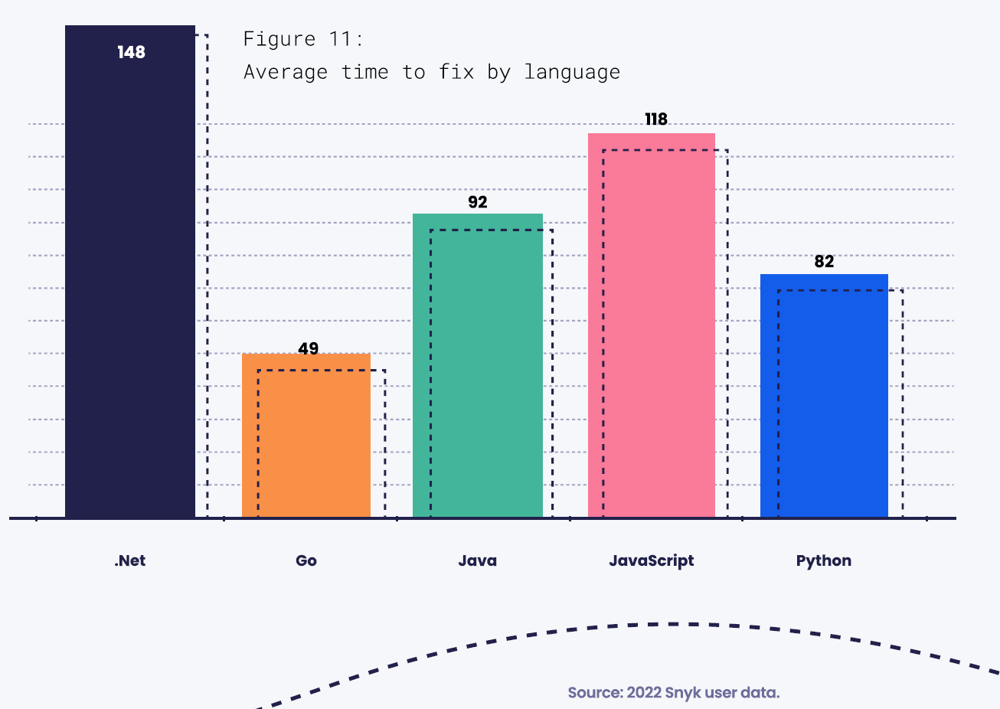

```plaintext
Figure 11:
Average time to fix by language

图 11：
按语言修复漏洞的平均时间

（坐标轴编程语言不翻译）

Source: 2022 Snyk user data.
来源：2022 年 Snyk 用户数据。
```

We expect that popularity and awareness influence the time to fix. A popular project is more likely to attract other collaborators, and additional collaborators can speed up incident response time. In addition, if a project is popular, awareness by users (including via technical press news) is likely to be larger.

我们预计受欢迎程度和意识会影响修复时间。一个受欢迎的项目更有可能吸引其他协作者，而额外的协作者可以加快事件响应时间。此外，如果一个项目很受欢迎，用户（包括通过技术新闻媒体）的关注度可能会更高。

A popular project can affect a significant portion of all projects. As an example, the Spring Framework library is found in 9% of all Java projects. The team responsible for Spring Framework responded quickly to fix the Spring4Shell remote code execution vulnerability when it was identified in the spring of 2022. But what if that vulnerability had existed in a less responsive yet popular package?

一个受欢迎的项目可能影响所有项目的重要部分。例如，Spring 框架库在所有 Java 项目中都有 9％的使用率。当在 2022 年春季发现 Spring4Shell 远程代码执行漏洞时，负责 Spring 框架的团队迅速做出了修复。但如果该漏洞存在于一个反应较慢但受欢迎的软件包中会怎样呢？

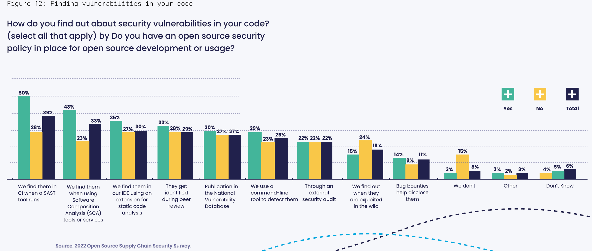

```plaintext
Figure 12: Finding vulnerabilities in your code
How do you find out about security vulnerabilities in your code? (select all that apply) by Do you have an open source security policy in place for open source development or usage?

图 12：发现代码中的安全漏洞
如何发现您的代码中的安全漏洞？（选择所有适用项）根据您是否制定了开放源代码安全策略来决定。

We find them in CI when a SAST tool runs
我们在 CI 中运行 SAST 工具时发现它们

We find them when using Software Composition Analysis (SCA) tools or services
我们在使用软件构成分析（SCA）工具或服务时发现它们

We find them in our IDE using an extension for static code analysis
我们在 IDE 中使用静态代码分析扩展程序时发现它们

They get identified during peer review
它们在同行评审期间被识别

Publication in the National Vulnerability Database
发布到国家漏洞数据库

We use a command-line tool to detect them
我们使用命令行工具检测它们

Through an external security audit
通过外部安全审计

We find out when they are exploited in the wild
我们在它们被实际利用时发现

Bug bounties help disclose them
赏金计划有助于披露它们

We don’t
我们不知道

Other
其他

Don’t Know
不知道
```

### Organizational approaches to identifying vulnerabilities in code

### 组织内识别代码漏洞的方法

Finding security vulnerabilities in code requires multiple approaches, much like finding vulnerabilities in dependencies.
Figure 12 identifies the leading ways that developers find security vulnerabilities. The leading approach used by 39% of organizations, of the options included in the survey, is to use a SAST (Static Application Security Testing) tool. SAST tools are immensely useful during development because they can be configured to run automatically as part of a CI (continuous integration) process and can often identify specific line(s) of code responsible for a vulnerability.

发现代码中的安全漏洞需要多种方法，就像发现依赖项中的漏洞一样。
图表 12 显示了开发人员发现安全漏洞的主要方式。在调查包括的选项中，39% 的组织使用 SAST（静态应用程序安全测试）工具，这是最常用的方法。SAST 工具在开发过程中非常有用，因为它们可以配置为作为 CI（持续集成）过程的一部分自动运行，并且通常可以确定负责漏洞的具体代码行。

The second leading approach practiced by 33% of organizations, among the survey options, is to use an SCA (software composition analysis) tool. Use of these tools can be automated, and they typically address manifest scanning and binary scanning to identify known security vulnerabilities, licensing issues, or quality problems. While this capability is more closely associated with finding vulnerabilities in dependencies, including SCA in the build process helps OSS security activities to shift left.

第二个主要方法是SCA（软件构成分析）工具，SCA工具被在调查选项中的33%中的组织使用。使用这些工具可以自动化，并且通常涉及清单扫描和二进制扫描，以识别已知的安全漏洞、许可问题或质量问题。虽然这种能力更与发现依赖项中的漏洞密切相关，但将SCA纳入构建流程有助于将开源软件的安全活动向左移动。

Finally, a SAST tool can be used within an IDE providing the developer with a more immediate, hands-on, and configurable approach to manual security testing. What this approach lacks in automation is more than compensated for in direct and timely developer involvement. Figure 12 shows that 30% of organizations leverage this approach.

最后，SAST工具可以在集成开发环境（IDE）中使用，为开发人员提供更直接、及时和可配置的手动安全测试方法。虽然这种方法缺乏自动化，但直接且及时的开发人员参与可以弥补这一不足。图12显示，30% 的组织利用这种方法。

Although just 29% of organizations use peer review to help identify vulnerabilities in code, peer review and a reliance on multifunctional teams is a best practice and cornerstone of agile development.

尽管只有29%的组织利用同行评审来帮助发现代码漏洞，但同行评审和依赖于多功能团队是敏捷开发的最佳实践和基石。

Although this particular survey question did not offer tool choices other than SCA and SAST, Figure 14 does and confirms the leading popularity of SCA and SAST tools.

尽管此项调查问题未提供除SCA和SAST之外的工具选择, 但图14提供了其他工具的流行度, 并确认了SCA和SAST工具的领先流行度。

### Snyk - Dependencies in the real world

### Snyk - 现实中的依赖关系

When talking about direct and transitive vulnerabilities, the actual pervasiveness of transitive vulnerabilities is easy to overlook or dismiss. As observed earlier, nearly 40% of the vulnerabilities we detect originate in third-party code. Two examples of recent, high profile vulnerabilities, Log4Shell and Spring4Shell, give us an opportunity to compare the nature of direct vs. transitive dependencies in the real world.

当谈到直接和传递性漏洞时，我们容易忽视或忽略传递性漏洞的实际普遍性。正如先前观察到的，检测到的近40％的漏洞源于第三方代码。最近出现的两个备受关注的漏洞 “Log4Shell” 和 “Spring4Shell” 为我们提供了比较现实世界中直接依赖和传递性依赖性质的机会。

Last Christmas, Log4Shell was the bane of security teams and developers across the globe. The log4j-core project has been used extensively to enable logging in millions of projects. Because of this, nearly 52% of the vulnerabilities we detected were present because of a direct dependency on the log4j-core code base. (It’s important to note that we counted direct dependencies first, so a project with both direct and indirect dependencies would be counted as direct.)

去年圣诞节，Log4Shell 是全球安全团队和开发人员的噩梦。log4j-core 项目已被广泛使用，在数百万项目中启用日志记录功能。由于这个原因，我们发现的近52％的漏洞存在于直接依赖 log4j-core 代码库的项目中。（需要注意的是，我们首先计算直接依赖项，因此既有直接依赖项又有间接依赖项的项目将被视为直接依赖项。）

In contrast to Log4j, over 90% of the Spring Framework core was transitive, called by code one layer or more removed from the developer. The Spring Framework can be described as the ‘plumbing of enterprise applications’, which helps explain why it’s a transitive dependency so often. This is a very common example of how vulnerable code gets incorporated into projects, and why it’s important to track transitive vulnerabilities.

与 Log4j 相比，超过90％的Spring框架核心是传递性的，Spring框架由代码调用而距离开发人员一层或更多层。Spring 框架可以被描述为“企业应用程序的管道”，这有助于解释为什么它经常是一个传递性依赖项。这是一个非常常见的漏洞代码被纳入项目的例子，也是为什么跟踪传递性漏洞很重要的原因。

### Prerequisites to using OSS

### 使用开源软件的前提条件

Using open source components can help to reduce cost, speed time to market, and free staff up to engage in more innovation and value- added activities. There is no “right way” to evaluate the security of OSS packages, but Figure 13 indicates that on average organizations use three of the approaches listed.

使用开源组件可以降低成本，加速产品进入市场的时间，以及释放员工从事更多的创新和增值活动。虽然评估开源软件包的安全性没有“正确的方法”，但是图 13 表明了组织平均使用列出的三种方法。

The most common approach used by 44% of organizations is to have developers examine source code. A review of source code can speak volumes about the quality of the code, which is highly correlated with its security.

最常见方法是让开发人员检查源代码，该方法被44%的组织机构所采用。对源代码的审查可以充分说明代码的质量，这与其安全性高度相关。

A second approach relied on by 40% of organizations is to assess the community that supports the project or component. An active community and an organized approach to contribution and maintainership are seen as positive signs for a project.

第二种方法是评估支持项目或组件的社区，该方法被40%的组织机构所依赖。一个活跃的社区和有组织的贡献和维护方法被视为项目的积极信号。

The third most popular strategy, observed at 36% of organizations, is using third-party tools to help developers find and vet components.

第三种最受欢迎的策略，在36% 的组织中观察到，是使用第三方工具来帮助开发人员查找和审核组件。

A variety of additional manual activities are used by organizations, including reviewing the frequency of releases/ commits (35%), analysis of registry/package manager information (33%), and reviewing usage statistics such as repository ratings or download statistics (30%). These help establish the viability and commitment of the community to the component.

组织使用各种额外的人工活动，包括查看发布/提交的频率（35%），分析注册表/包管理器信息（33%），以及查看使用情况统计信息，例如存储库评级或下载统计信息（30%）。这些有助于建立社区对该组件的可行性和承诺。

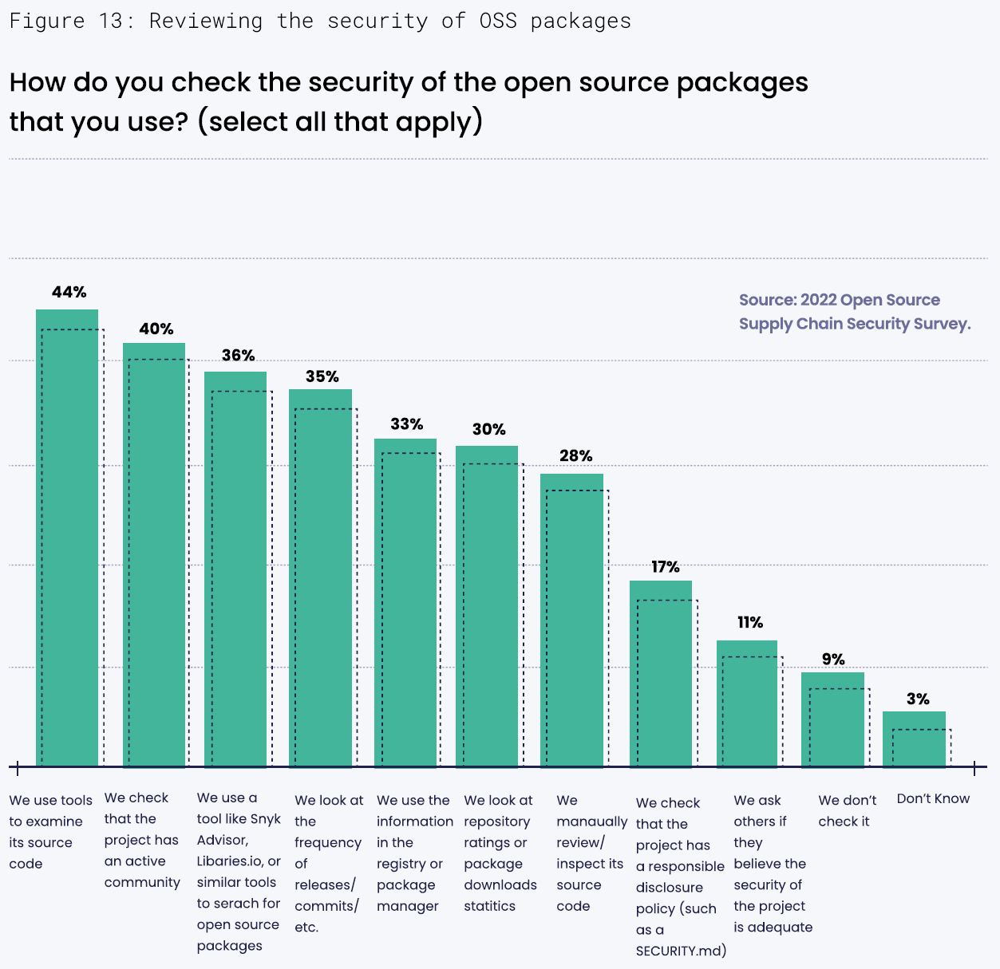

```plaintext
Figure 13: Reviewing the security of OSS packages
图 13：审查开源软件包的安全性

How do you check the security of the open source packages that you use? (select all that apply)
你如何检查你使用的开源软件包的安全性？（选择所有适用项）

Source: 2022 Open Source SupplyChainSecuritySurvey.
来源：2022 年开源供应链安全调查。

We use tools to examine its source code
我们使用工具检查其源代码

We check that the project has an active community
我们检查该项目是否有一个活跃的社区

We use a tool like Snyk Advisor, Libaries.io, or similar tools to serach for open source packages
我们使用像 Snyk Advisor、Libraries.io 或类似的工具搜索开源包

We look at the frequency of releases/ commits/ etc.
我们查看发布 / 提交等的频率

We use the information in the registry or package manager
我们使用注册表或包管理器中的信息

We look at repository ratings or package downloads statitics
我们查看存储库评级或软件包下载统计信息

We manaually review/ inspect its source code
我们手动检查其源代码

We check  that the project has a responsible disclosure policy (such as a SECURITY.md)
我们检查该项目是否有负责任的披露策略（例如 SECURITY.md）

We ask others if they believe the security of the project is adequate
我们询问其他人是否认为该项目的安全性足够

We don’t check it
我们不检查它

Don’t Know
不知道
```

### Using multiple security testing tools is an OSS best practice

### 使用多个安全测试工具是开源软件的最佳实践

On average, organizations in the study used between two and three security testing tools. Using third-party tools can significantly improve your OSS security posture because of their scope, scalability, automation potential, and coverage across the SDLC. As budgets, resources, and time allows; using more tools can be advantageous since they all add value in different ways.

平均而言，研究中的组织使用了两到三种安全测试工具。使用第三方工具可以显著改善您的 OSS 安全状况，因为它们的范围、可扩展性、自动化潜力和覆盖整个 SDLC。在预算、资源和时间允许的情况下, 使用更多工具可能是有利的，因为它们都以不同的方式增加价值。

Figure 14 shows that preference is higher for SCA tools (47%) than for any other tool category. The ability of SCA tools to identify vulnerabilities and license compliance across an organization’s portfolio of components and dependencies, in a highly automated way, is immensely valuable.

图 14 显示，对 SCA 工具的偏好高于任何其他工具类别（47%）。SCA 工具在高度自动化的方式下，可以识别组织组件和依赖项组合中的漏洞和许可证合规性，这是极其有价值的。

Figure 14: Security tools in use when developing OSS

图 14：在开发 OSS 时使用的安全工具

What security tools do you regularly use when developing open source software? (select all that apply) by Do you have an open source security policy in place for open source development or usage?

在开发开源软件时，您定期使用哪些安全工具？（选择所有适用项）您是否针对开源开发或使用制定了开源安全策略？

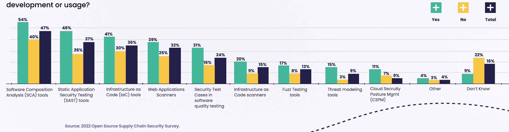

```plaintext
Software Composition Analysis (SCA) tools
软件组件分析工具（SCA）

Static Application Secuirty Testing (SAST) tools
静态应用程序安全性测试 (SAST) 工具

Infrastructure as Code (IaC) tools
基础设施即代码 (IaC) 工具

Web Applications Scanners
Web 应用程序扫描器

Security Test Cases in software quality testing
软件质量测试中的安全测试用例

Infrastructure as Code scanners
基础设施即代码扫描器

Fuzz Testing tools
模糊测试工具

Threat modeling tools
威胁建模工具

Cloud Secruity Posture Mgmt (CSPM)
云安全姿态管理（CSPM）

Other
其他

Don’t Know
不知道
```

Other than SCA tools, additional choices become complex based on the organization’s approach to DevOps and preferences regarding security testing. SAST tools (37%), IaC tools (36%), and web application scanners (32%) all effectively compete for developer and security team attention. Web application scanners and fuzz testing tools together make up the dynamic application security testing (DAST) tool domain. Realistically, the use of both SAST and DAST tools makes sense because both help organizations find vulnerabilities. However, IaC tools are invaluable in helping to script and automate CI/CD activities, eliminating many of the manual and ad hoc activities that consume time that could be better spent elsewhere.

除了 SCA 工具之外，根据组织的 DevOps 方法和安全测试偏好，其他选择会变得复杂。SAST 工具 （37%）、IaC 工具 （36%） 和 Web 应用程序扫描程序 （32%） 都有效地争夺了开发人员和安全团队的注意力。Web 应用程序扫描程序和模糊测试工具共同构成了动态应用程序安全测试 （DAST） 工具域。实际上，同时使用 SAST 和 DAST 工具是有意义的，因为两者都可以帮助组织发现漏洞。但是，IaC 工具在帮助编写脚本和自动化 CI/CD 活动方面非常宝贵，消除了许多耗时的手动和临时活动，省下的时间可以更好地花在其他地方。

An honorable mention goes out to the remaining tools on the list. Some of these tools are relatively new, but each of them offers a unique value proposition that adds value to improving OSS security.

我们还要向剩下的工具表示敬意。这些工具中有些是相对较新的，但它们每一个都有独特的价值主张，为提升开源软件安全增添了价值。

Examining the tool use profiles of organizations with a security policy versus those without provides an overview of where organizations often start their OSS security journey, and what this journey looks like as it matures.

分析具有安全策略和没有安全策略的组织在使用工具方面的差异，可以提供有关组织开始和成熟过程中的开源软件安全旅程的概述。

### The most important ways to improve OSS security

### 提升开源软件安全最重要的方法

The data in Figure 15 is likely the most important collection of key findings in this report. When asked which of the following activities are important to improving the security of OSS, organizations were permitted to give multiple responses.

图 15 中的数据可能是本报告中最重要的关键发现集合。当被问及以下哪些活动对提高开放源码软件的安全性很重要时，允许各组织作出多重回答。

The most important activity — confirmed by 59% of organizations — identified a desire to have vendors add increased intelligence to, and to be responsible for, security tooling. There are two ways to interpret what this means. The first is that end user organizations view the vendor community as a force multiplier, because more intelligent tools can ease the burden on developers or security professionals in exchange for licensing fees. Organizations and vendors both perceive this as a win-win scenario assuming competitive market dynamics. An alternative way to interpret this is that end-user organizations are struggling to understand how to address security concerns and welcome the opportunity to share/grant this responsibility to vendors and service providers who have more extensive expertise.

最重要的活动， 得到59%的组织证实， 确定了让供应商增加安全工具智能并负责安全工具的愿望。有两种方法可以解释这意味着什么。第一种解释是，最终用户组织将供应商社区视为力量倍增器，因为更智能的工具可以减轻开发人员或安全专业人员的负担，以换取许可费。假设市场动态竞争激烈，组织和供应商都认为这是一个双赢的局面。另一种解释方式是，最终用户组织正在努力了解如何解决安全问题，并乐于与具有更广泛专业知识的供应商和服务提供商共享 / 授权这种责任。

Another way to look at this is that end user organizations have scarce resources, and more intelligent tools are expected to provide higher value in a transparent way (meaning having no or inconsequential impact on developer productivity). This is the most seamless way to improve software security without material changes to process models.

另一种看待这个问题的方式是，终端用户组织资源有限，更加智能的工具预计以透明的方式提供更高的价值，意味着对开发人员生产率没有或者只有微不足道的影响。这是在不对过程模型进行重大更改的情况下提高软件安全性的最无缝方法。

The second most important activity is to source comprehensive best practices/certifications for secure software development (cited by 52% of organizations). The strong interest by end user organizations in best practices for secure software development is exciting to see. This suggests that these organizations are invested in understanding how to address OSS security. The good news is that there are already several trusted sources who can address this need:

- There are a variety of sources to identify best practices/ certifications for evaluating projects themselves. This includes the OpenSSF Best Practices badge, the OpenSSF Scorecards project, the CNCF paper on best practices for supply chain security, and SLSA (<https://slsa.dev>)
- This also suggests an interest in encouraging developers to learn best practices & acquire certifications. The good news is that these are available. For example, OpenSSF’s developing secure software (LFD121) provides both a training course and certification of completion for individuals who pass the final exam. This course is sponsored by the OpenSSF which is part of the Linux Foundation.

第二个最重要的活动是为安全软件开发提供全面的最佳实践/认证（52%的组织引用）。最终用户组织对安全软件开发最佳实践的浓厚兴趣令人兴奋。这表明这些组织在了解如何解决开放源码软件安全问题方面进行了投资。好消息是，已经有几个值得信赖的来源可以满足这一需求：

- 有多种来源可以确定评估项目本身的最佳实践/认证。这包括OpenSSF最佳实践徽章，OpenSSF记分卡项目，CNCF关于供应链安全最佳实践的文件和SLSA（<https://slsa.dev>）。
- 这也表明鼓励开发人员学习最佳实践和获得认证的兴趣。好消息是这些都可用。例如，OpenSSF 的安全软件开发（LFD121）提供培训课程和通过期末考试获得认证的个人证书。该课程由 OpenSSF 赞助，是 Linux 基金会的一部分。

Figure 15: Activities for improving the security of open source software

图 15：改善开源软件安全的活动

Which of the following activities are important to improving the security of the open source software supply chain? (select all that apply)

以下哪些活动对于改善开源软件供应链的安全性很重要？（选择所有适用项）

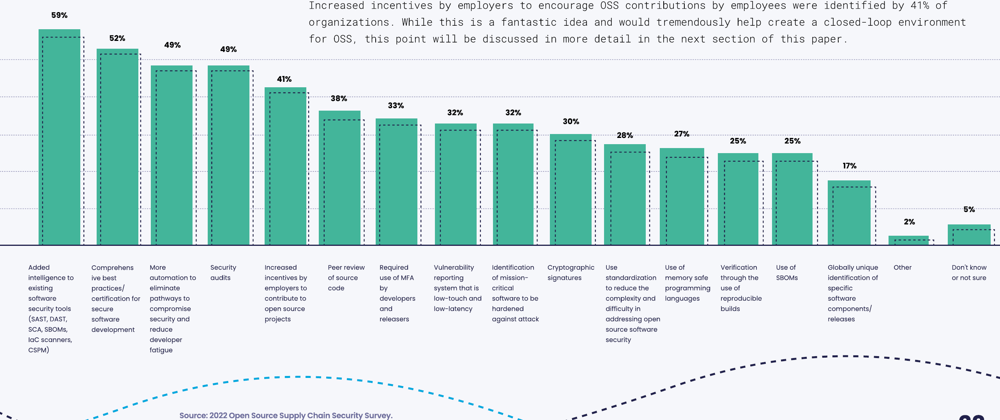

```plaintext

Added intelligence to existing software security tools (SAST, DAST, SCA, SBOMs, IaC scanners, CSPM)
增加软件安全工具的智能化（SAST，DAST，SCA，SBOM，IaC 扫描程序，CSPM）

Comprehens ive best practices/ certification for secure software development
全面的安全软件开发最佳实践 / 认证

More automation to eliminate pathways to compromise security and reduce developer fatigue
更多自动化以消除威胁安全的途径并减轻开发人员的负担

Security audits
安全审计

Increased incentives by employers to contribute to open source projects
雇主提供更多的激励鼓励员工参与开源项目

Peer review of source code
源代码的同行评审

Required use of MFA by developers and releasers
要求开发人员和发布者使用多因素认证

Vulnerability reporting system that is low-touch and low-latency
低成本、低延迟的漏洞报告系统

Identification of mission-critical software to be hardened against attack
识别需要加强防攻击的关键软件

Cryptographic signatures
使用加密签名

Use standardization to reduce the complexity and difficulty in addressing open source software security
标准化以减少处理开源软件安全性的复杂性和难度

Use of memory safe programming languages
使用内存安全编程语言

Verification through the use of reproducible builds
通过使用可重现构建来验证

Use of SBOMs
使用 SBOMs

Globally unique identification of specific software components/ releases
全球唯一标识特定软件组件 / 发布版本

Other
其他

Don't know or not sure
不知道或不确定

Source: 2022 Open Source Supply Chain Security Survey.
来源：2022 年开源供应链安全调查。
```

In third place for most popular activities around secure software development, we see a tie between increased automation to reduce attack surfaces and security audits, which were cited by 49% of organizations. The use of IaC tools can provide a reliable path to increased automation of CI CD activities.
These tools have proven to be popular across organizations in this survey, and in the right hands, they can be extremely effective. Security audits are also a valuable way to gauge the current state of security for some or all of the organization’s applications. However, security audits — as measured through the eyes of maintainers who participated in the survey — were not valued nearly as highly. While security audits can be invaluable at comprehensively assessing an organization’s security risks, the organization must be positioned to act upon the findings of that audit —  which seems a bridge too far for organizations without a security policy. However, note that there were only 72 maintainers participating in this survey, and 78% of them had not participated in an external security audit. It’s possible that security audits are so rare that few software developers have experienced them (and thus can only guess about their advantages).

最受欢迎的安全软件开发活动，增加自动化以减少攻击面和安全审计并列第三，这两项活动被 49% 的组织提到。使用基础架构即代码（IaC）工具可以提供可靠的路径来增加 CI CD 活动的自动化。

这些工具在本次调查中已被证明受到组织的欢迎，在正确的使用下可以非常有效。安全审计也是衡量组织某些或所有应用程序当前安全状态的有价值方式。但是，从参加调查的维护者的角度来衡量安全审计，它们的价值远不如前两项。虽然安全审计可以全面评估组织的安全风险，但组织必须有能力对审计结果进行行动 - 这对于没有安全策略的组织来说似乎过于困难。但请注意，本次调查只有 72 名维护者参加，其中 78％的人没有参加过外部安全审计。安全审计可能非常罕见，以至于很少有软件开发人员经历过它们（因此只能猜测它们的优势）。

Increased incentives by employers to encourage OSS contributions by employees were identified by 41% of organizations. While this is a fantastic idea and would tremendously help create a closed-loop environment for OSS, this point will be discussed in more detail in the next section of this paper.

41%的组织认为雇主为鼓励雇员贡献开放源码软件而采取的激励措施有所增加。虽然这是一个绝妙的主意，并且将极大地帮助创建开源软件的闭环环境，但本文的下一节将更详细地讨论这一点。

## The IT industry must take a more active rol to improve OSS securit and sustainability

## IT 行业必须承担更积极的角色，以改善开源软件的安全性和可持续性

Open source software has thrived as an alternative engine of innovation for organizations and developers alike. The pervasive use of OSS is testimony to the impact that it has had on the IT industry. However, OSS security and quality requires a full lifecycle commitment which creates additional investments in resources, time, and developers when compared to current practice. This section of the report introduces a variety of OSS security and sustainability challenges and solicits advice from organizations on how to address them.

开源软件作为组织和开发人员等的替代创新引擎而蓬勃发展。 开源软件的广泛使用证明了它对 IT 行业的影响。 然而，开源软件的安全性和质量需要完整生命周期的承诺，与当前实践相比，这会导致在资源、时间和开发人员方面产生额外的投资。 报告的这一部分介绍了各种开源软件安全和可持续性挑战，并征求组织关于如何解决这些挑战的建议。

### Improving the security of oss development

### 改进开源软件开发的安全性

Organizations and developers are no strangers to the importance of best practices for secure software development. The significance of best practices for OSS development was initially voiced in Figure 15 as the 2nd most important activity for improving OSS security. Best practices have been voiced again by 73% of organizations in Figure 16 as the leading way IT industry organizations can improve the security of OSS development. IT industry organizations (such as the Linux Foundation) have taken this responsibility seriously and are delivering best practices content across a variety of channels.

通过提供最佳实践来改善开源软件开发的安全性，这再次表明了最佳实践的重要性。IT 行业组织（例如 Linux 基金会）已经认真对待这一责任，并通过多种渠道提供最佳实践内容。
组织和开发人员对安全软件开发最佳实践的重要性并不陌生。 在图 15 中， 开源软件开发最佳实践的重要性最初被表述为提高开源软件安全性的第二重要活动。 图 16 中，73% 的组织再次表示最佳实践是 IT 行业组织提高开源软件开发安全性的主要方式。 IT 行业组织（如 Linux 基金会）认真对待这一责任，并通过各种渠道提供最佳实践内容。

The 2nd leading improvement, identified by 61% of organizations, is providing tools for analyzing and remediating security vulnerabilities in OSS components. This need is being addressed as part of the OpenSSF’s open source Software Security Mobilization Plan. This plan was released at the Open Source Software Security Summit II in Washington DC on May 12-13, 2022. This plan is available at <https://openssf.org/oss-security-mobilization-plan/>.

第二个主要改进是为分析和修复开源软件组件的安全漏洞提供工具，61% 的组织认可这一点。这个需求正在 OpenSSF 的开源软件安全动员计划中得到解决。该计划于 2022 年 5 月 12 日至 13日在华盛顿特区举行的 “开源软件安全峰会 II” 上发布。该计划可在 https://openssf.org/oss-security-mobilization-plan/ 获取。

Figure 16: How organizations can improve the security of OSS development

图 16：IT 行业组织可以如何提高开源软件开发的安全性

What are some of the ways that IT Industry Organizations could improve the security of developing open source software? (select all that apply)

以下哪些方法是 IT 行业组织可以提高开源软件开发安全性的方法？（选择所有适用项）

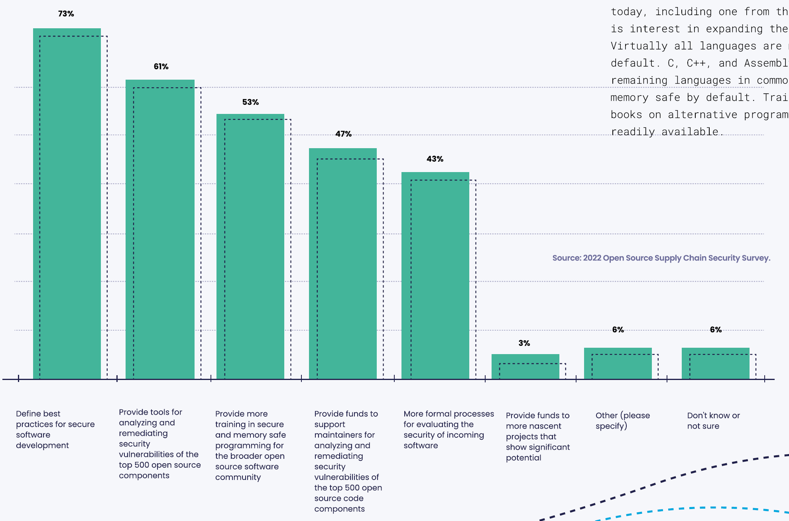

```plaintext
Source: 2022 Open Source Supply Chain Security Survey.
来源：2022 年开源供应链安全调查。

Define best practices for secure software development
定义安全软件开发的最佳实践

Provide tools for analyzing and remediating security vulnerabilities of the top 500 open source components
提供分析和修复前 500 个开源组件的安全漏洞的工具

Provide more training in secure and memory safe programming for the broader open source software community
为更广泛的开源软件社区提供更多的安全和内存安全编程培训

Provide funds to support maintainers for analyzing and remediating security vulnerabilities of the top 500 open source code components
为支持分析和修复前 500 个开源代码组件的维护者提供资金

More formal processes for evaluating the security of incoming software
更正式的流程来评估入站软件的安全性

Provide funds to more nascent projects that show significant potential
为显示出重大潜力的新兴项目提供资金支持

Other (please specify)
其他（请具体说明）

Don't know or not sure
不知道或不确定
```

The 3rd ranked improvement identified in Figure 16 by 53% of organizations is to provide more training in secure and memory safe programming. Sadly, many software developers have not been trained on how to develop secure software. As noted earlier, there are some courses available today, including one from the OpenSSF, and there is interest in expanding these courses further. Virtually all languages are memory safe by default. C, C++, and Assembly are the only remaining languages in common use that are not memory safe by default. Training courses and books on alternative programming languages are readily available.

在图 16 中被 53% 的组织认可的改进方法是提供更多安全和内存安全编程方面的培训，该方法是排名第三的改进建议。不幸的是，许多软件开发人员并没有接受过如何开发安全软件的培训。正如前面提到的，今天已经有一些课程可用，包括来自 OpenSSF 的课程，并且有兴趣进一步扩展这些课程。几乎所有语言默认情况下都是内存安全的。默认情况下，几乎所有语言都是内存安全的。C、C++ 和汇编是常用的唯一默认不内存安全的语言。关于替代编程语言的培训课程和书籍随时可用。

### Improving open source software resourcing

### 改进开源软件资源分配

OSS resourcing is a growing challenge because of the need to improve the security and quality of OSS components. The Open Source Software Security Mobilization Plan, put forward by the OpenSSF, aims to address the following:

- Secure OSS production. Focus on preventing security defects and vulnerabilities in code and open source packages in the färst place.
- Improving vulnerability discovery and remediation. Improving the process for finding defects and fixing them.
- Shorten ecosystem patching response time. Shorten the response time for distributing and implementing fixes.

开放源码软件的资源资源是一个日益严峻的挑战，因为需要提高开放源码软件组件的安全性和质量。OpenSSF提出的开源软件安全动员计划旨在解决以下问题：

- 安全的的开源软件生产。专注于防止代码和开源包中的安全缺陷和漏洞。
- 改进漏洞发现和修复。改进发现缺陷并修复缺陷的过程。
- 缩短生态系统补丁响应时间。缩短分发和实施修补程序的响应时间。

This plan is estimated to cost in the vicinity of $70 million to $110 million per year and is designed to provide a blueprint and services including education, training, tools, and processes to secure the top OSS projects. While this plan will provide a useful model for OSS projects in general, there are millions of ongoihg OSS projects. How will funding for many of these projects be accomplished?

这个计划的预计成本大约为每年 7,000 万至 1.1 亿美元，旨在提供一个蓝图和服务，包括教育、培训、工具和流程，以保障顶级开源项目的安全。虽然这个计划将为一般的开源项目提供有用的模型，但仍有数百万正在进行的开源项目需要资金支持。那么这些项目的资金来源将是如何解决的呢？

Figure 17 addresses this dilemma. The leading response shared by 63% of organizations suggests that employers should provide or increase an incentive to contributors of meaningful OSS projects.
If end-user organizations elected to "give back" to the oss communities they depend on, it would attract more contributors and improve the security and quality of those OSS components.

图 17 解决了这个困境。63% 的组织表示，最重要的反应是雇主应该提供或增加对有意义的开源软件项目贡献者的激励。
如果最终用户组织选择 “回馈” 他们依赖的开源软件社区，它将吸引更多的贡献者，提高这些开源软件组件的安全性和质量。

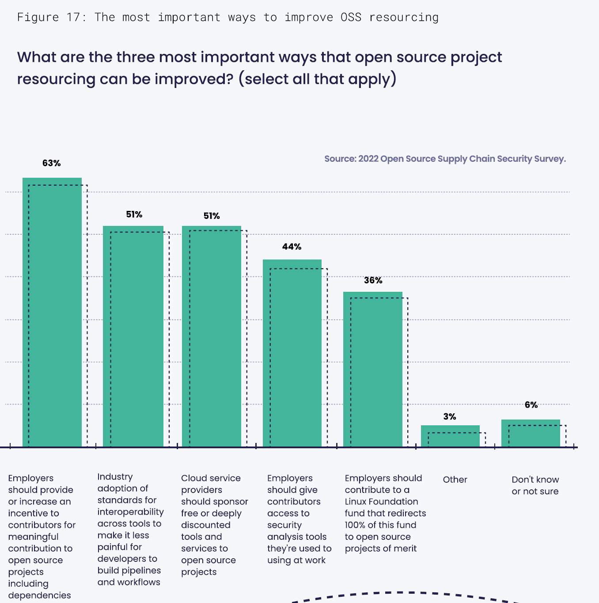

```plaintext
Figure 17: The most important ways to improve OSS resourcing
图 17：提高开源软件资源的最重要方式

What are the three most important ways that open source project resourcing can be improved? (select all that apply)
什么是改进开源项目资源的三个最重要的方法？（选择所有适用的选项）

Source: 2022 Open Source Supply Chain Security Survey.
来源：2022 年开源供应链安全调查。

Employers should provide or increase an incentive to contributors for meaningful contribution to open source projects including dependencies
雇主应该提供或增加对做出有意义的开源项目贡献者的奖励，包括其依赖项

Industry adoption of standards for interoperability across tools to make it less painful for developers to build pipelines and workflows
行业应采用跨工具的互操作性标准，以减少开发人员构建管道和工作流程的痛苦

Cloud service providers should sponsor free or deeply discounted tools and services to open source projects
云服务提供商应为开源项目赞助免费或深度折扣的工具和服务

Employers should give contributors access to security analysis tools they're used to using at work
雇主应给予贡献者使用其在工作中熟悉的安全分析工具的权限

Employers should contribute to a Linux Foundation fund that redirects 100% of this fund to open source projects of merit
雇主应向 Linux 基金会基金捐赠资金，将该基金的 100％重新分配给有价值的开源项目

Other
其他

Don't know or not sure
不确定或不确定
```

Industry adoption of standards for interoperability across tools and discounted resources provided by CSPs (Cloud Service Providers) to OSS projects resonate across 51% of organizations in this study.
Interoperability concerns were frustrating and are a characteristic of immature markets. The fragmented nature of today's software security markets suggests that consolidation will occur and help address this problem although the timeframe is unknown.

该研究显示，51％的组织对行业采用工具间互操作性标准以及CSP（云服务提供商）提供的折扣资源产生共鸣。互操作性问题令人沮丧，是不成熟市场的一个特征。当今软件安全市场的分散性表明，尽管时间框架不确定，但整合将发生并有助于解决这个问题。

The concept of cloud service providers providing support for secure OSS development is intriguing. Having access to a portfolio of tools adept at secure software development at deeply discounted prices would be a win for developers. It could also be a win for CSPs as an on-ramp to more conventionally priced runtime services.
However, whether this idea has been vetted with CSPs is unknown as is their overall receptivity to the idea.

云服务提供商为安全的开源软件开发提供支持的概念令人感兴趣。以深度折扣价格获得一系列适用于安全软件开发的工具组合对于开发者来说是一种胜利。对于云服务提供商而言，它也可能是一个通向更常规价格的运行时服务的入口。
然而，该想法是否已经经过了云服务提供商的审查，以及云服务提供商对该想法的整体接受程度尚不清楚。

44% of developers at organizations also embrace having their employer establish a sandbox for developing OSS projects using the same tools they are already familiar with. This is also an intriguing idea and would qualify as yet another perk provided by an employer to their employees who contribute to material OSS projects.

44% 的组织开发人员赞同让雇主建立一个沙箱，使用他们已经熟悉的相同工具进行开源软件项目的开发。这也是一个有趣的想法，可以作为雇主提供给为重要的OSS项目做出贡献的员工的另一个福利。

Although the ideas presented as responses in Figure 17 are speculative, they all reflect the realization that secure OSS development will require additional investment which needs to be provided by the community that benefits from the value derived from OSS.

尽管图 17 中呈现的想法都是推测性的，但它们都反映了这样一个认识：安全的开源软件开发需要额外的投资，而这些投资需要由受益于开放源码软件价值的社区提供。

### Snyk - Broken Containers

### Snyk - 损坏的容器

Vulnerability management is complicated enough to start with, but the advent of containers, virtual machine images, IaC, and microservices complicate it even further. While many organizations are still improving how to handle vulnerabilities in their own code, and starting to examine direct and transitive dependencies in depth, fixing the vulnerabilities introduced by containers is still a struggle. Container images (among other constructs) are often "black boxes" that organizations do not examine further.

漏洞管理本来就很复杂，但容器、虚拟机镜像、IaC 和微服务的出现使得漏洞管理更加复杂化。虽然许多组织仍在改进如何处理其自己的代码中的漏洞，并开始深入研究直接和传递依赖项，但修复由容器引入的漏洞仍然很困难。容器镜像（以及其他构造）通常是组织不进一步检查的“黑匣子”。

Returning to our examples of recent vulnerabilities, as of the time of this writing, only 8% of container projects with Spring Framework dependencies have fully remediated the Spring4Shell vulnerability. In contrast, Log4Shell has been resolved in nearly 25% of all containers.

回到我们最近漏洞的示例，截至本文撰写时，只有 8% 的容器项目使用 Spring Framework 依赖项已经完全解决了 Spring4Shell 漏洞。相比之下，几乎 25% 的容器已经解决了 Log4Shell 漏洞。

Because containers can be ephemeral, the act of creating and destroying containers provides an opportunity for implementing updates that could occur rapidly and significantly improve existing vulnerability dynamics. Changing the code in one container configuration could potentially result in hundreds of updated containers. The flip side is that one container configuration forgotten or missed can also easily result in the same number continuing to be vulnerable. This later challenge is one readily resolved through the use of SBOMs.

由于容器可以是短暂的，创建和销毁容器的过程为实施更新提供了机会，这些更新可能会快速地显著改善现有的漏洞动态。在一个容器配置中更改代码可能会导致数百个更新后的容器。另一方面，如果一个容器配置被遗忘或错过，同样数量的容器也很容易继续存在漏洞。后面的这种挑战可以通过使用SBOMs轻松解决。

### Improving OSs sustainability

### 提高开源软件的可持续性

OSS sustainability is an important topic for anyone who depends on OSS. For small OSS projects maintained by a single person, challenges exist. Sustainability requires continuity over time. To achieve this requires the successful ability to transfer maintainer responsibilities to additional maintainers.

对于任何依赖于开源软件的人来说，开源软件的可持续性是一个重要的话题。对于由单个人维护的小型开源软件项目，存在一些挑战。可持续性需要长时间的连续性。要实现这一点，需要成功地将维护者的职责转移给其他维护者。

Figure 18 helps prioritize key activities to help address OSS sustainability. Across organizations, 64% report that maintainers should plan for their own retirement by bringing new maintainers into the project. This is the preferred path forward but requires attention to nontechnical activities focused on process and communication. Adding a second maintainer to a project and transferring responsibility from the original maintainer are likely to be some of the most difficult activities a project must overcome.

图 18 有助于优先考虑能帮助解决开源软件的可持续性的关键活动。在各个组织中，64% 报告称维护者应该通过引入新的维护者来规划自己的退休计划。这是未来的首选方案，但需要关注流程和沟通等非技术活动。向项目添加第二个维护者并从原始维护者转移责任可能是项目必须克服的一些最困难的活动之一。

Recognizing the challenges of transferring project responsibility, 58% of organizations believe that if a project reaches its end of life the retiring maintainer should clearly identify on the repo that the software is no longer being maintained.

认识到转移项目责任的挑战，58%的组织认为，如果项目到达其生命周期的终点，退休维护者应该在代码库中清楚地标识出软件不再得到维护。

An alternative path for transferring maintainership responsibility is to find a foundation or IT industry organization that will create a new home for the project. 55% of organizations endorsed this path forward although it may prove to be nearly as complex as independently finding a new maintainer.

转移维护责任的另一种选择是寻找一个基金会或IT行业组织，为项目创建一个新的家。55% 的组织支持这种前进的方式，尽管它可能证明几乎与独立寻找新的维护者一样复杂。

Figure 18: Improving OSS sustainability
How should open source software sustainability be addressed if the maintainer(s) on a project decide to retire? (select all that apply)

图 18：提高 OSS 的可持续性
如果项目的维护者决定退休，应如何解决开源软件的可持续性问题？（选择所有适用项）

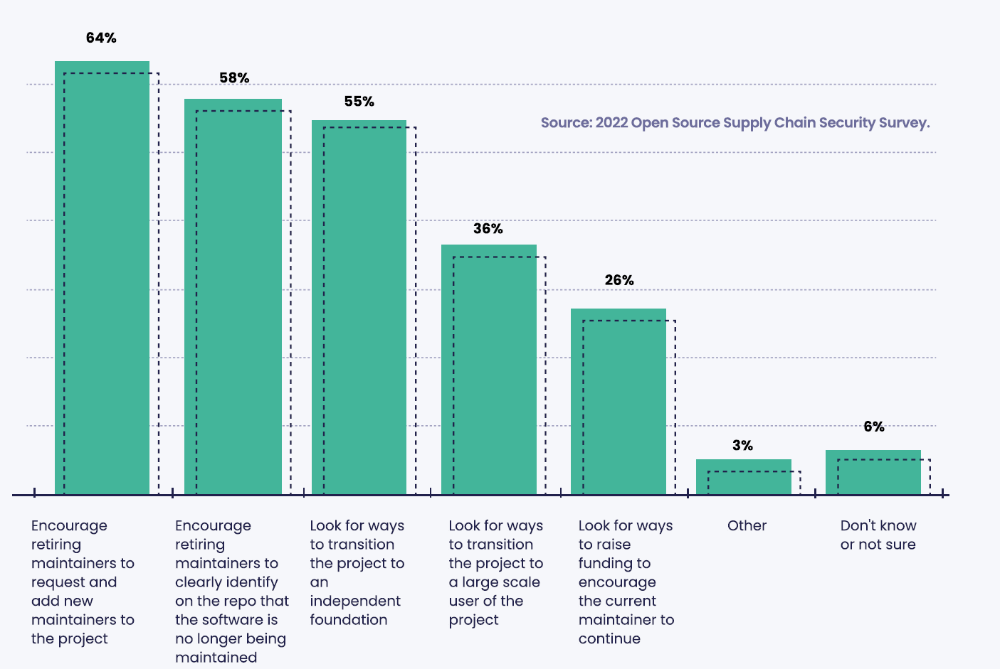

```plaintext
Source: 2022 Open Source Supply Chain Security Survey.
来源：2022 年开源供应链安全调查。

Encourage retiring maintainers to request and add new maintainers to the project
鼓励退役维护者请求并添加新的项目维护者

Encourage retiring maintainers to clearly identify on the repo that the software is no longer being maintained
鼓励退役维护者明确在存储库上标识软件不再维护

Look for ways to transition the project to an independent foundation
寻找将项目转移到独立基金会的方式

Look for ways to transition the project to a large scale user of the project
寻找将项目转移到大规模项目用户的方式

Look for ways to raise funding to encourage the current maintainer to continue
寻找筹集资金的方法，以鼓励当前维护者继续维护

Other
其他

Don't know or not sure
不确定或不清楚
```

## Conclusions and recommendations

## 结论和建议

### Too many organizations are not prepared to address OSS security needs

### 太多组织没有准备好应对开源软件安全需求

Across the 500+ organizations participating in this OpenSSF survey, at least 34% did not have an OSS security policy in place (Figure 1). The percentage of organizations without a security policy is likely to be around 40% after prorating those respondents who didn't know the status of an OSS security policy for their employer. OSS use is pervasive across end-user organizations and IT vendors/service providers (who somewhat evenly comprise our sample) and the 60/40 yes/no split on having an OSS security policy persists across virtually all 22 industries represented in our sample. This indicates that not having an OSS security policy is not specific to certain industries or organization types but instead is widely found across business environments.

在参与本次 OpenSSF 调查的 500 多个组织中，至少有 34％没有制定开源软件（OSS）安全策略（图 1）。在按比例计算那些不知道其雇主的 OSS 安全策略状况的受访者后，没有安全策略的组织比例可能达到 40％左右。OSS 在终端用户组织和 IT 供应商 / 服务提供商中普及（它们在样本中几乎均衡），而在我们样本中代表的几乎所有 22 个行业中，60/40 的有 / 无 OSS 安全策略分布均存在。这表明，没有 OSS 安全策略不是特定于某些行业或组织类型，而是广泛存在于商业环境中。

### Small organizations must prioritize developing an OSS security

### 小型组织必须优先考虑制定开源软件安全政策

In the wake of numerous high-profile attacks across the software supply chain over the last several years, this finding is disappointing. Every organization needs to have a CISO and OSPO (open source Program Office) or a person or persons vested with key CIS and OSPO responsibilities.
We recognize that small organizations with less than 500 people were significantly more likely to not have an OSS security policy (Figure
2). Small organizations, therefore, need to prioritize and limit their CISO and OSPO agenda so it can be achievable with a partial FT. Once key CISO and OSPO capabilities are resident in the organization an OSS security policy will follow.

在过去几年中，软件供应链中发生了许多备受瞩目的攻击，这一发现令人失望。每个组织都需要有一位 CISO（首席信息安全官）和 OSPO（开源项目办公室）或一位或多位负责关键 CIS 和 OSPO 职责的人员。
我们认识到，少于 500 人的小型组织更有可能没有开源软件安全策略（图 2）。因此，小型组织需要优先考虑并限制其 CISO 和 OSPO 议程，以使其成为部分全职任务。一旦关键的 CISO 和 OSPO 能力在组织中得到了落实，OSS 安全策略就会随之而来。

### Using additional security tools is a leading way to improve osS security

### 使用更多的安全工具是提高开源软件安全性的一种主要方式

There are at least 10 tool categories that have a focus on addressing OSS security. Organizations on average use 2.8 security tool categories among the survey options. SCA and SAST tools are the leading tools used to address OSS security among those options (Figure 14). The use of IaC tools (which indirectly address security) and web application scanners (part of the DAST category) round out the portfolio that many organizations use.

至少有 10 个工具类别专注于解决开源软件安全问题。在调查选项中，组织平均使用 2.8 个安全工具类别。软件组成分析（SCA）和 静态应用程序安全测试（SAST）工具是解决开源软件安全问题中最常用的工具（见图 14）。使用 IaC 工具（间接解决安全问题）和 Web 应用程序扫描器（动态应用程序安全测试 DAST 类别的一部分）是许多组织使用的其他工具。

The security tools market has numerous tool categories because the overall domain extends from source code management through build, package, delivery, and deployment. This is basically the entire software lifecycle. Software security must be managed across each step and accomplishing all of this with just two or three tool categories is not feasible. Therefore, organizations should take a closer look at adjacent and complementary security tools markets and determine where incremental tools can add the most value.

安全工具市场拥有众多的工具类别，因为整个领域从源代码管理到构建、打包、交付和部署都有涉及，基本上涵盖了整个软件生命周期。必须在每个步骤上管理软件安全性，但仅使用两到三个工具类别来完成所有这些工作是不可行的。因此，组织应该仔细研究相邻和互补的安全工具市场，并确定增量工具可以在哪些方面增加最大价值。

Figure 14 also shows that organizations with an OSS security policy have a higher frequency of security tool use than those organizations without an OSS security policy. This same dynamic is in place based on organizational size where large organizations have a higher frequency of security tool use than small organizations. Security tool use is therefore one of the most obvious and powerful ways to improve your OSS security posture.

图 14 还显示，具有开源软件安全策略的组织比没有开源软件安全策略的组织更频繁地使用安全工具。同样，大型组织比小型组织使用安全工具的频率更高。因此，使用安全工具是改善开源软件安全状况的最明显和最强大的方法之一。

### Collaborate with vendors to create more intelligent security tools

### 与供应商合作创建更智能的安全工具

Adding greater intelligence to existing software security tools is viewed by organizations as one of the most important ways to improve OSS security across the supply chain (Figure 15). While tool vendors may see this more as business as usual, tool users see this as a critical requirement to empower existing resources.
Because most end-user organizations are resource constrained in IT, a critical objective is to find ways that existing developers can be more productive without adding to their workload. Increased tool intelligence and automation are examples of how to improve software security in a way nearly transparent to developers.

对于组织来说，将现有软件安全工具加强智能化是提高整个供应链中的开源软件（OSS）安全性的最重要途径之一（图 15）。虽然工具供应商可能认为这是日常工作，但工具用户认为这是赋予现有资源的关键要求。
由于大多数终端用户组织在 IT 方面受到资源限制，因此一个关键目标是找到在不增加工作量的情况下提高现有开发人员工作效率的方法。增强工具的智能化和自动化就是如何在几乎不影响开发人员的情况下提高软件安全性的例子。

### Implementing best practices for secure software development is the other leading way to improve OSS security

### 实施安全软件开发的最佳实践是改善开源软件安全的另一种主要途径

Understanding best practices for secure software development is identified repeatedly as the leading or a leading way to improve the security of the open source software supply chain (Figures 15 and 16). A primary reason why there is so much interest in best practices is that developing secure software encompasses the entire breadth of the software lifecycle. At each waypoint, from source code management, build services, and packaging to software delivery and deployment there are numerous best practices that need to be followed. This includes literally hundreds of best practices. The Linux Foundation has developed an outstanding free course and certification on developing secure software (LFD121) which can be found on OpenSSF.org.

理解安全软件开发的最佳实践是提高开源软件供应链安全的主要或领先方法之一，这在图 15 和 16 中被反复提到。人们对最佳实践如此感兴趣的一个主要原因是，开发安全软件涵盖了软件生命周期的整个广度。在每个航点，从源代码管理、构建服务和打包到软件交付和部署，都需要遵循许多最佳实践。这包括数百种最佳实践。Linux基金会开发了一个关于开发安全软件（LFD121）的优秀免费课程和认证，可以在 OpenSSF.org 上找到。

### Use automation to reduce your attack surface

### 使用自动化减少攻击面

Infrastructure as Code (IaC) tools provide a way to script manual activities so that they can be automated (Figure 15). Reducing or eliminating manual command line-driven CI/CD activities provides fewer ways for developers to skirt policy, bend rules, make mistakes, and expose CI/CD activities to external threats. Use of IaC tools and lad scanners provides organizations with a way to streamline and automate CI/CD activities while simultaneously eliminating some threat vectors, While there will always be use cases for manual intervention by developers, minimizing the need for this is a best practice.

基础设施即代码（IaC）工具提供了一种脚本手动活动的方式，使它们可以自动化（图 15）。减少或消除手动命令行驱动的 CI/CD 活动为开发人员提供了更少的方法来绕过策略、改变规则、犯错误以及将 CI/CD 活动暴露给外部威胁。使用 IaC 工具和漏洞扫描工具为组织提供了一种简化和自动化 CI/CD 活动的方式，同时消除了某些威胁向量。虽然开发人员总是会有手动干预的用例，但最小化对此的需求是最佳实践。

### Consumers of open source software should give back to the Communities that support them

### 开源软件的消费者应该回馈支持他们的社区

The introduction to this paper mentioned that open source software is at a crossroads. Those open source projects that experience significant growth must evolve from their modest and somewhat informal origin to address a more demanding and security conscious community of users. This transition does not come easily because it requires increased resources, time, processes, and security. The use of open source software has often been a one-way street where users see significant benefit with minimal cost or investment. In order for larger open source projects to meet user expectations it will be important for organizations to give back and close the loop to improve open source software sustainability. Employers need to provide additional incentives to employees who have material maintainer or core contributor open source roles or responsibilities. This would also serve to encourage a higher level of participation by developers in open source projects to ensure the flow of new talent.

本文的介绍提到，开源软件正处于十字路口。那些经历了显著增长的开源项目必须从其谦逊且有些非正式的起源中发展出来，以应对更苛刻、更注重安全的用户社区。这个转变并不容易，因为它需要增加资源、时间、流程和安全方面的投入。使用开源软件通常是单向的，用户可以在最小的成本或投资下获得显著的利益。为了满足用户的期望，较大的开源项目需要回馈和关闭循环，以提高开源软件的可持续性。雇主需要为那些有实质性维护者或核心贡献者开源角色或责任的员工提供额外的激励。这也将有助于鼓励开发人员更高级别地参与开源项目，以确保新人才的流动。

## Methodology

## 方法

The objective of this research was to understand the following:

- The current state of open source software security
- Security practices across the open source software supply chain
- Secure development practices
- How the security and sustainability of open source software can be improved

本研究的目的是了解以下内容：

- 开源软件安全的当前状态
- 开源软件供应链中的安全实践
- 安全开发实践
- 如何改善开源软件的安全性和可持续性

This research project was initiated in 2022 01 at the request of the OpenSSF. The primary research vehicle would be a survey of OSS developers, maintainers, core contributors, and security professionals. However, the research was preceded by interviews with fifteen OSS maintainers and security subject matter experts.
These qualitative interviews were performed to ensure that the survey included key security topics important to the OSS community.

该研究项目应 OpenSSF 的要求于 2022 年 1 月启动。主要的研究工具将是对开源软件开发人员，维护者，核心贡献者和安全专业人员的调查。然而，在研究之前，对十五名开放源码软件维护者和安全主题专家进行了访谈。进行这些定性访谈是为了确保调查包括对开放源码软件社区很重要的关键安全主题。

Interviews occurred in March 2022 and the survey was fielded in April 2022. Data was analyzed and this report was drafted as well as peer reviewed in May 2022.

访谈在 2022 年 3 月进行，调查在 2022 年 4 月进行。于2022 年 5 月 进行了数据分析，起草了本报告并进行了同行评审。

All Figures in this survey include results that are rounded to the nearest whole integer percent value. Therefore, totals for segmentation data may not always add to 100%.

本调查中的所有图表结果均按最接近的整数百分比值四舍五入。因此，分段数据的总和可能不总是 100%。

This was a long survey with an average time to complete of 20+ minutes. The completion rate for this survey was under 50%. This explains why there is some variation in the sample size for the above segmentation variables.

本调查为长篇问卷，平均完成时间超过 20 分钟。本次调查的完成率不足 50%。这就解释了上述分段变量样本大小存在一定变异性的原因。

Compretensstive screening enteria were to ensure respondents wouildi have a thigh probability of being able to answer all survey questions. Screening criteria included involvement im open source software, experience in the development or use of open source software, employed or looking for employment, and respondents who self-identify as a real person.

为确保受访者有可能回答所有调查问题，采用了综合筛选标准。筛选标准包括参与开源软件、开源软件的开发或使用经验、在职或寻找工作以及自我确认为真实人士的受访者。

The qualitative dimension of this project included in-depth interviews with selected individuals across industries and in federal cybersecurity policy development or involvement with maintaining open source software.

该项目的定性维度包括对各行各业的选定人士的深入访谈，涵盖了联邦网络安全政策的制定者或参与维护开源软件维护的个人。

## About the Authors

## 关于作者

**Stephen Hendrick**

**斯蒂芬·亨德里克**

Stephen Hendrick is Vice President of research at the Linux
Foundation where he is the principal investigator on a variety of research projects core to the Linux Foundation's understanding of how open source software is an engine of innovation for producers and consumers of information technology. Steve specializes in primary research techniques developed over 30 years as a software industry analyst. Steve is a subject matter expert in application development and deployment topics including DevOps, application management, and decision analytics. Steve brings experience in a variety of quantitative and qualitative research techniques that enable deep insight into market dynamics and has pioneered research across many application development and deployment domains. Steve has authored over 1,000 publications and provided market guidance through syndicated research and custom consulting to the world's leading software vendors and high-profile startups.

斯蒂芬·亨德里克是 Linux 基金会的研究副总裁，他是许多研究项目的首席调查员，这些项目对 Linux 基金会了解开源软件如何成为信息技术生产者和消费者创新引擎至关重要。亨德里克 先生专注于基于 30 多年软件行业分析师开发的主要研究技术。他是应用开发和部署主题的领域专家，包括 DevOps、应用程序管理和决策分析。亨德里克 先生拥有多种定量和定性研究技术的经验，能够深入洞察市场动态，并在许多应用程序开发和部署领域开创了研究。亨德里克 先生已经撰写了超过 1000 篇出版物，并通过综合研究和定制咨询向世界领先的软件供应商和高知名度的初创企业提供市场指导。

**Martin Mckeay**

**马丁·麦基**

Martin Mckeay is Snyk's Senior Editorial Research Manager, where he works with teams across the company to build reports that increase the knowledge base of security professionals and developers. With over twenty years as a security professional, Martin started his career in help desk operations, continuously building to more complex and diverse roles over the years. Over the last seven years,
Martin has developed the skills to turn data into intelligence and translate 'geek speak' into language understandable by mere mortals.

马丁·麦基是 Snyk 的高级编辑研究经理，他与公司各个团队合作，制作报告，以增加安全专业人员和开发人员的知识库。马丁在安全专业方面已经有超过 20 年的经验，他的职业生涯始于帮助台运营，多年来不断发展到更复杂和多样化的角色。在过去的七年中，马丁已经开发了将数据转化为情报的技能，并将 “极客语言” 翻译成普通人可以理解的语言。

## Acknowledgements

## 致谢

This document was authored with the support and collaboration of the following individuals and organizations: Stephen Augustus (Cisco), Brian Behlendorf (Linux Foundation), Hilary Carter (Linux Foundation), Randall Degges (Snyk), Brian Demers, Michael Dolan (Linux Foundation), Kim Lewandowski (Chainguard), Oleg Nenashev (Dynatrace), Mike Milinkovich (Eclipse Foundation), Megan Moore (Synk), Nick O'Leary (FlowForge), Christina Oliviero (Linux Foundation), Ashwin Ramaswami (Plaintext Group), Clark Roundy (Eclipse Foundation), Jed Salazar (Chainguard), Melissa Schmidt (Linux Foundation), Robert Scholte (Apache), Micah Silverman (Snyk), Daniel Stenberg (WolfSSL), Kate Stewart (Linux Foundation), Liran Tal (Synk), Adolfo Garcia Veytia (Chainguard), Derek Weeks (Linux Foundation), David A. Wheeler (Linux Foundation), Sarah Wills (Snyk).

本文档得到以下个人和组织的支持和合作：Stephen Augustus（思科）、Brian Behlendorf（Linux 基金会）、Hilary Carter（Linux 基金会）、Randall Degges（Snyk）、Brian Demers、Michael Dolan（Linux 基金会）、Kim Lewandowski（Chainguard）、Oleg Nenashev（Dynatrace）、Mike Milinkovich（Eclipse 基金会）、Megan Moore（Synk）、Nick O'Leary（FlowForge）、Christina Oliviero（Linux 基金会）、Ashwin Ramaswami（Plaintext Group）、Clark Roundy（Eclipse 基金会）、Jed Salazar（Chainguard）、Melissa Schmidt（Linux 基金会）、Robert Scholte（Apache）、Micah Silverman（Snyk）、Daniel Stenberg（WolfSSL）、Kate Stewart（Linux 基金会）、Liran Tal（Synk）、Adolfo Garcia Veytia（Chainguard）、Derek Weeks（Linux 基金会）、David A. Wheeler（Linux 基金会）和 Sarah Wills（Snyk）。

## Disclaimer

## 免责声明

This report is provided "as is." The Linux Foundation and its authors, contributors, and sponsors expressly disclaim any warranties (express, Implied, or otherwise), including implied warranties of merchantability, noninfringement, fitness for a particular purpose, or title, related to this report. In no event will the Linux Foundation and its authors, contributors, and sponsors be liable to any other party for lost profits or any form of indirect, special, incidental, or consequential damages of any character from any causes of action of any kind with respect to this report, whether based on breach of contract, tort (including negligence), or otherwise, and whether they have been advised of the possibility of such damage. Sponsorship of the creation of this report does not constitute an endorsement of its findings by any of its sponsors.

本报告按“原样”提供。Linux 基金会及其作者、贡献者和赞助商明确声明不提供任何形式的保证，包括但不限于对本报告的适销性、非侵权性、特定用途适用性或标题的默示保证。在任何情况下，Linux 基金会及其作者、贡献者和赞助商均不对任何其他方因与本报告有关的任何形式的间接、特殊、偶然或后果性损害负责，无论是基于合同违约、侵权（包括疏忽）还是其他原因，并且无论他们是否已被告知可能出现此类损害。赞助本报告的创建不构成任何赞助商对其调查结果的认可。


```plaintext

Founded in 2021, Linux Foundation Research explores the growing scale of open source collaboration, providing insight into emerging technology trends, best practices, and the global impact of open source projects. Through leveraging project databases and networks, and a commitment to best practices in quantitative and qualitative methodologies, Linux Foundation Research is creating the go-to library for open source insights for the benefit of organizations the world over.

成立于 2021 年的 Linux 基金会研究院探究开源合作不断扩大的规模，提供对新兴技术趋势、最佳实践和开源项目的全球影响的洞察。通过利用项目数据库和网络，并致力于量化和定性方法的最佳实践，Linux 基金会研究院正在创建开源洞见的去处，以造福全球组织。

Copyright 2022 The Linux Foundation
This report is licensed under the Creative Commons Attribution-NoDerivatives 4.0 International Public License.
版权所有 2022 Linux 基金会
本报告受到 知识共享 署名-禁止演绎 4.0 国际公共许可证的许可。

To reference this work, please cite as follows: Stephen Hendrick and Martin Mckeay, “Addressing Cybersecurity Challenges in open source Software,” foreword by Brian Behlendorf, Linux Foundation and Snyk, June 2022

请通过以下格式以引用本文：
斯蒂芬·亨德里克和马丁·麦基，“应对开源软件中的网络安全挑战”，前言由 布莱恩·贝伦多夫 所著，Linux 基金会和 Snyk，2022 年 6 月

Snyk is a developer-first security company that helps software-driven businesses develop fast and build securely. Snyk provides a platform to secure all of the critical components of today’s cloud native application development. Snyk is securing the industry leaders such as Google, Salesforce, Asos, BBC, and Asurion. For more information or to get started with Snyk for free, visit https://snyk.io.

Snyk 是一家以开发人员为先的安全公司，帮助以软件为驱动的企业快速开发和安全构建。Snyk 提供一个平台来保护当今云原生应用程序开发的所有关键组件。Snyk 正在保护行业领袖，如 Google，Salesforce，Asos，BBC 和 Asurion。有关更多信息或免费开始使用 Snyk，请访问 https://snyk.io。
```
