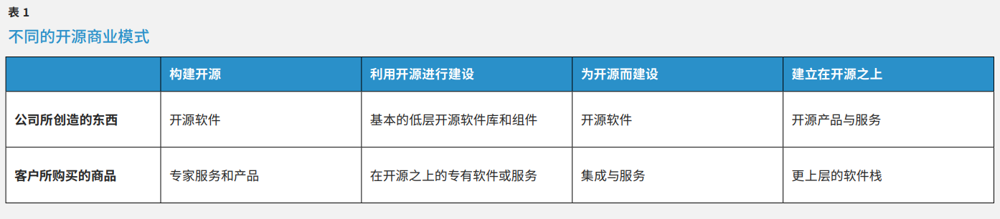
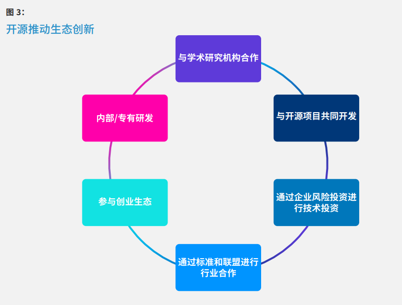
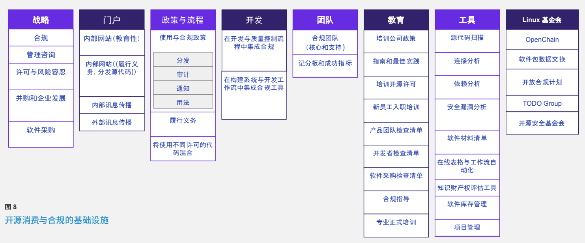
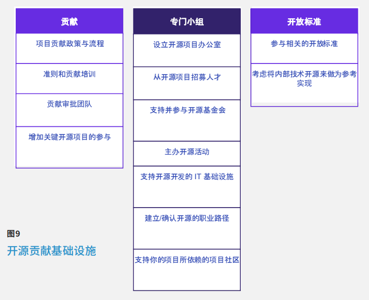
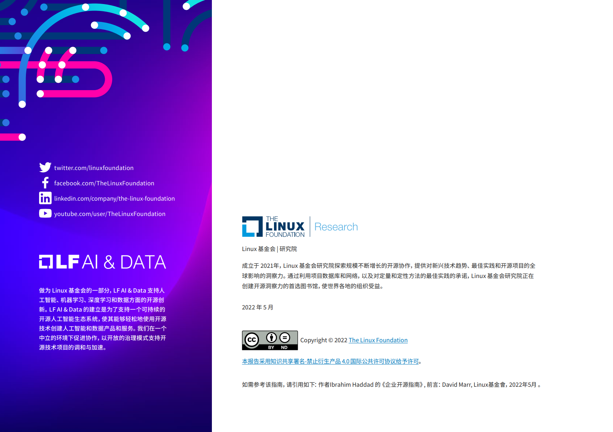

# 企业开源指南

## 制定与实施开源软件战略

**In partnership with:**

**2022年5月**

**Ibrahim Haddad, 博士**

**Executive Director, LF AI & Data Foundation**

**前言：David Marr, 副总裁，高通公司法律顾问**

## 前言

在开源早期，（来自企业的）许多作为仅只是临时的、即兴的、符合许可要求的。在某些地方，根本就没有人注意合规问题。这 并不是对当时任何特定的人的指控，因为不良的合规实践在现实世界会导致什么后果，在当时还是不确定。就像大多数新的实 践领域一样，我们在不断地发展才会走向成熟，例如，在留言板上发生了激烈的争吵，在网页上专门设立了 “耻辱堂”-- 列出 了那些已知的没有遵守许可条款的人，有的开源项目维护者甚至还威胁要提起诉讼。这些威胁性的诉讼，起初是由 “朝圣者” 提出的，他们要求的只是被告承诺负起许可里的相关义务（扣除向法院提起诉讼的费用）。但紧接着就有一些“投机者”，将许 可合规性诉讼视为有利可图的收入来源，这被认为是一种投机作为，而并非开源社区的本意，这让开源社区的领导者警觉了起 来 ，要 坚 决 抵 制 这 样 的 行 为 。

Ibrahim 在开源许可合规领域的经验丰富，这得益于他多年来在开源领域的卓越工作。他是那种在专业领域里出类拔萃的人， 只要你进入开源合规，就一定知道他。就我而言，我第一次听说 Ibrahim 是在 2005 年，地点是在曼哈顿上西区的一家咖啡 馆。我当时正在和哥伦比亚法学院的 Eben Moglen 教授谈话，Moglen 教授是通用公共许可第三版（GPL v3）的联合作者之 一，Moglen 教授很有礼貌地纵容了我关于当时在开源许可合规这一相对较新的领域人才匮乏的抱怨，特别是缺乏那些同时拥 有技术熟悉度和许可知识的必要技能。Moglen 教授认为我应该去会会 Ibrahim，于是，我在Ibrahim 的一次会议演讲中建立 了联系。多年来，我发现他是一位亲切的同仁。Ibrahim 是一位热心肠的人，不仅是在开源许可的合规性的领域颇有建树，而 且也热衷于将这些知识传授给更多的人。

在下面的篇幅中，作为读者的您，可以了解到开源对我们今天的数字世界有多么广泛的影响，以及如何推动现代社会，使得我 们拥有很多便利。促成这些成果的是那些编写和贡献社区代码项目的大批的程序员，这些项目反过来又被产品公司所消费。在 采用这些项目的公司中，软件工具、代码管理和法律相关的神秘混合体共同组成了我们所说的开源项目办公室，以管理各种开
源许可及其在软件工程流程中的无数相关义务。Ibrahim 的这本小册子让这个领域的所有复杂问题变得简单明。

**大卫-马尔** ，高通技术公司法律顾问部副总裁

## 摘要

开源软件（OSS）已经改变了我们的世界，成为我们数字经济的支柱和构筑数字世界的基础。从互联网和我们日常使用的移动 应用程序，到我们用来构建未来的操作系统和编程语言，开源软件都发挥了重要作用。它是技术行业的命脉。今天，开源软件 为数字经济提供动力，并实现了改善我们生活的科学和技术的突破。它存在于我们的手机、汽车、飞机之中，也存在于家庭、企 业和政府的治理之中。但是，在二十多年前，只有很少人听说过开源软件，它的使用也仅限于一小群专门的爱好者。

参与构建涉及软件的产品或服务的组织，无论其具体行业或部门如何，都有可能采用开源，并会参与到那些对其产品和服务至 关重要的开源项目。各组织正在创建开源项目办公室（OSPO）来管理他们的开源活动，这些活动包含了从采用开源软件、遵守 适用的许可到参与开放标准制定、基金会建设。

多年来，新的行业和数以千计的组织已经进入了开源生态系统。在早期，一些组织在没有适当的战略和执行计划的情况下贸然 走进开源，他们并没有获得益处。而另外一些组织则采取了慎重的方法，接受了开源软件的方法论和工程实践，这使得他们在 其行业或垂直领域的开源活动中脱颖而出，成为了领导者。为了指导企业对开源软件的持续使用和对开源生态系统的参与，企 业已经制定了适合其组织限制和行业挑战的开源战略。

本指南提供了一个实用和系统的方法来建立开源战略，制定实施计划，并加速组织的开源工作 。

## 导论

2000 年 12 月，IBM 宣布对 Linux 和开源软件投资 10 亿美元（换算为今天价值 15.8 亿美元），这是一个里程碑式的事件。 这一承诺大大提高了 Linux 作为替代性操作系统的知名度。其他公司开始评估Linux，并评估哪些开源软件组件值得企业资助 和采用。

企业级开源软件的可用性正在改变企业创建、开发、交付和维护产品和服务的方式。全球性的软件开发社区、开放的管理模 式、对源代码的公开访问，以及对经批准的开源许可的采用，都对企业的思维方式产生了渐进式的影响。现在，组织领导者对 如何采购、实施、测试、部署和维护软件有了不同的思考。这种转变可以带来一些好处 -- 降低开发成本、加快产品开发、提高代 码质量等等。

一个组织开启开源之旅的第一步就是了解开源，如何从开源工程的努力中受益，参与开源项目，并与行业参与者、大学和开源基 金会合作。虽然没有两个组织在使用和受益于开源方面完全相同，但所有成功的开源软件（OSS）实现都有两个共同的要素：一 个强大的开源战略和一个明确的执行计划。

一般来说，我们把开源战略定义为一个简明的、高层次的文档将组织的业务目标与开源软件的使用和管理部门的指导联系起 来。它是建立未来开源政策和流程的共同协定的参考文档。领导者必须考虑到他们的组织可以从开源战略中受益的方方面面。 例如，许多组织将其作为实施开源最佳实践和步骤的指令。

为了发展和实现开源软件（OSS）战略，组织还必须阐明一套业务层面的目标，并确定采用开源和为集成到其产品和服务的项目 做出贡献的所有限制。本指南将帮助你的领导团队制定一个适合贵司的战略--一个员工可以接受的战略，将你的开源软件开发 和工程化的方法从消极应对转变为积极主动。

## 利用开源软件

从我们携带的设备到控制我们关键基础设施的系统，开源软件已经成为现代 社会的重要组成部分。本节讨论了组织可以实现的六个战略目标，这取决于他 们如何采用开源软件，将开源软件如何纳入产品和服务，以及如何参与开源软 件项目及社区。

1.软件领导力 。正如房地产价值就是地理位置一样，软件已经成为每个行业 价值的决定性因素。软件的世界正在发生变化。开源曾经是边缘创业公司的 小众技术，现在已经成为财富 500^1 强公司的主流技术。[^1] 在各行业的垂直 软件栈中，开源的渗透率已经从占整个软件使用量的 20% 上升到 85%。无论 你身处哪个行业，无论你开发什么产品或软件，你都可能严重依赖开源。这种 对开源软件的大量采用彻底重塑了技术格局。但这也要求软件的领导力需要 发生转变，从封闭的专有软件模式转变为开放的开源软件模式，从使用开源 软件转变为构建、改进和完善开源软件的开发者社区。

2.企业对开源的依赖。 开源软件已经成为新的商业产品和服务的基础，其开发 模式对许多企业的软件开发工作流程至关重要。一个企业很少能在不使用开 源软件的情况下打造一个产品，或者采用一个不借鉴开源软件代码库的产品。

3.商业模式的适应性。 商业模式是通过产品或服务创造价值的架构。暂时不 论具体的许可要求，我们可以使开源软件适应各种商业模式，使开源软件适用 于几乎所有行业里的行业软件供应链。 表1 显示了一个企业使用开源软件实现 不同商业模式的各种方式。

4.产品改进。 开源软件可以通过两种方式改进企业的产品开发 （图1） ：

  - 直接地 ，透过内部活动加强企业的开源开发和自身的产品或服务： （1） 通 过开源项目满足内部研发和产品团队的要求， （2 ）将内部代码提交给开 源项目，从而减少开源代码分支和内部分支之间的差异，以及 （3） 帮助解 决合规问题和应对相关查询。

- 间接地 ，企 业 的 开 源 活 动 通 过 以 下 方 式 ，不 仅 能 提 高 自 身 人 才 的 技 能 同 时 也 帮助夯实了开源软件：（1）将产品中使用的上游代码变得更稳定；（2）参与 内部政策讨论和决策，确保公司支持开源开发；（3）通过思想领导力和持续 的代码贡献影响上游项目；（4）参与外部技术讨论，影响开源社区；(5）参与 内部技术讨论，使企业的方向与特定开源项目社区的方向一致。 构建开源 利用开源进行建设 为开源而建设 建立在开源之上 公司所创造的东西 开源软件 基本的低层开源软件库和组件 开源软件 开源产品与服务 客户所购买的商品 专家服务和产品 在开源之上的专有软件或服务 集成与服务 更上层的软件栈

5.聚焦/加速创新。 正如谚语所说，“众人拾柴火焰高”。在开源项目中，更是 人多手快。跨组织的协作者可以更快地对他们的共享代码进行修改和修订。 因 此 ，企 业 开 发 者 可 以（ 1 ）在 他 人 的 工 作 基 础 上 进 行 构 建 ，（ 2 ）在 上 游 开 源 尝 试新的功能和优化，要比在公司内部更快地实现技术上的突破；（3）将员工的 工作集中在更高的软件栈级别的差异化上，提高产品对消费者的独特价值。 在这样做的过程中，员工 为一个组织的整体创新途径做出了贡献。小型初 创企业可以更快地将新的想法推向市场，而大型公司可以尝试新的想法，而无 需面对丧失对其知识产权控制的风险。

6.开源研发有助于推动企业创新。 参与开源项目使企业能够利用外部的研发 实力（R&D），发现商业化的惊爆点机会，并利用这些突破性的产品和服务提 高企业进入市场的速度。对开源研发的共享访问推动了这种跨业务部门的创 新。它是许多创新加速器之一，如学术研究、企业风险资本、行业合作、内部研 发和创业生态等。

[^1]: Megan Barnett, “美国企业如何走向开源”, Fortune, Fortune Media IP Ltd., 2010 年 8 月 16 日；以及 Raju Shahi，”建立在开源世界之上的商业公司”，Hackernoon，Artmap Inc.，2020 年 6 月 9 日。

## 为企业开源做准备

IBM 在 2000 年对于开源的投资，开创了企业采用开源的模式。从那时起，成千 上万的公司进入了开源生态（ 图3 ）。所有这些公司在与开源软件以及社区合作 方面都有很多收获；通过企业的参与，开源模式已经成为软件开发的新常态。企 业若加入开源软件社区，如何最大限度地减少企业学习曲线，并能够加速消 费和参与的回报？以下部分将探讨作者从二十多年来企业在开源软件方面的 经验中获得的一些经验。

### 找出企业对开源软件的依赖性

提高组织的开源参与度的第一步是确认组织对开源软件的依赖程度。随着对 开源软件依赖性的增加，企业有几种选择可以探索。一种选择是关注许多业 务部门使用的软件。第二个选择是关注那些比其他软件具有更大合规风险的 软件。例如，移动应用程序和嵌入式硬件可能比你的数据中心代码带来更大 的风险。通过不断的追踪这些选项，你可以在多个业务部门或高风险领域展 示投资回报，并为获得更多资金和支持提出充足的理由。

另一个选择是把你的贡献集中在直接有利于贵司的战略和产品的上游项目 上，而不是在不同的相关的项目中纠结。如果你的企业认为开源工程是一个 成本中心，那么就把重点放在支持产品开发的开源项目上。 每年对组织的产品组合进行一次审查。确定哪些产品借鉴了哪些开源项目，然 后优先考虑那些支持最多产品的开源项目。这种方法使有限的软件工程资源 得到最大的利用。

### 找出企业的开源技能组合

一旦你确定了贵司在哪些方面依赖开源，然后就可以开始确定需要什么样的 专业知识了，以及是选择在内部发展还是从外部获取。通过从开源软件社区 雇用开源开发者，贵司可以获得技能、赞誉和指导的能力。

两到三个开源开发者雇员可以对一个大型项目（如 Linux 内核）产生明显的影 响。他们还可以为公司吸引到其他开发者成为贵司的雇员，并能够指导初级开 发人员。企业的目标是找到在社区中哪些得到了同行认可，并拥有影响力的开 发者。

在招聘开源开发者时要考虑这四个关键要素：技术领域的专业知识，开源方 法论和经验，工作实践，以及企业利益和候选人利益的一致性。当高级开源 开发者的兴趣和技能与企业在特定项目中的利益相一致时，激励他们就更容易。例如，一个 Linux 内存管理专家可能不喜欢在文件系统上工作，（所以最 好的选择是让内存管理专家仍然开发内存管理，）找到这样的匹配是建立长 久关系的关键。

### 考虑加入.TODO.小组

TODO Group 是一个由众多科技公司所组成的虚拟小组（集合），这些来自 企业的成员对各自的开源项目办公室的政策、实践和实用性开展协同合作。 成员的协作是作为 Linux 基金会下的一个社区项目来管理的，TODO 小组 是那些刚刚开始建立开源项目的公司的可用资源。TODO Group 写作了《开 源项目办公室指南》，其成员经常在各类开源会议上介绍最佳实践。请访问 todogroup.org 了 解 更 多 。要 加 入 ，请 联 系info@todogroup.org。

## 制定开源战略

开源软件是以规模化交付软件的最具影响力的方式。利用开放生态的力量来 解决复杂问题的能力是独一无二的，因为任何人都可以在其中贡献。开源是可 能比封闭源码的替代品更有影响力，前提是需要一个坚实可靠的开源战略引 领它时，方能实现开源的全部力量。 在制定开源战略时，有许多问题需要回答。企业应该在这个过程中尽早针对这 些问题，提出解决办法。一个开源战略应该解决四个基本要求（ 图4 ）：

1. 企业寻求参与的开源项目。

2. 企业希望密切联系的相关开源项目社区。

3. 企业开源治理的有效性。

4. 企业文化的开放性，以及它是否会欢迎或拒绝开源的努力与活动。

### 确定企业的目标

本节涵盖了一个组织在创建其开源战略之前需要解决的三个主要问题。

### 企业目标

开源战略如何帮助你实现企业的总体目标？

你回答的第一个问题将确定开源在你的整体企业目标中的位置。在许多领域 里，公司可以从开源的使用和贡献中获益。开源战略通常解决具体的需求。一 旦你确定了这些需求，你就可以把注意力集中在开源能给你的组织带来最大 好处的领域。你的目标可以包括以下任何一项：

- 创建一个长期的、高质量的路线图，在产品生态系统中占据领导地位。
- 降低构建和维护产品或服务的成本和复杂性。
- 建立一个差异化区隔的定位，以更高的利润率为目标。
- 通过构建开源替代品，使竞争产品或服务商品化。
- 提高产品和服务的整体质量。
- 通过公开的参与开源，提高外部知名度和品牌认可度。

### 知识产权战略

开源战略如何帮助你的组织实现其知识产权（IP）战略？

开源软件可以成为企业建立满足其需求的产品和服务的有效途径，而无需在 编码和设计方面投入大量资金。它往往是商业产品的原型，企业利用开源代 码开发产品或服务，并最终推向市场和销售。开源也是企业实现其知识财产 权战略的绝佳方式。开源许可与专有许可不同，因此企业必须考虑许可的差异 如何影响他们从开源的使用和开发中获益的能力。商业目标可以包括以下任 何一项：

- 确定一种许可战略，使组织能够从外部参与中获得最大的利益，并仍然能 够改进专有产品。
- 通过遵守产品和服务中使用的开源软件的许可来减轻知识产权风险。
- 通过改进核心的开源组件，显著地提升专有知识产权的差异。
- 将原来的专有源代码采用开源许可发布。

许多企业发现清单和模板对指导开源许可下的代码发布很有帮助。每个案例 都是不同的，但发布开源的机制是相似的。Linux 基金会已经创建了一个指 南 ，” 开始一个开源项目”，以指导组织完成这个过程，从项目的选择、预算 和法律考虑，到项目的启动和维护。它提供了一个样本清单，作为贵司从零开 始创建开源项目的绝佳案例，以便各个团队了解开源过程中所涉及的内容。

>开源许可与专有许可不同，因此组织必须考虑许可的差异如何影响该组织从开源的使用和发展中获益的能力识别你的参与阶段

### 通过开源提供机会

开源战略如何帮助你抓住本来无法实现的机会？

开源还提供了独特的机会，这些机会企业只有通过开源战略才能获得。其中 包括：

- 通过将研发投资集中在改善关键的开源技术，补充差异化的产品能力，从 而实现市场领导地位。
- 通过支持关键的开源倡议和联盟来捍卫现有的市场地位。
- 将选定的专有能力作为开源发布，以扰乱竞争对手或竞争性市场。
- 利用开源来创造公平的技术竞争环境。
- 在产品中纳入现成的开源商品化能力和市场加速器，以降低长期的售货 成本和交付产品的单价。

## 识别你的参与阶段

组织通过四种主要的开源软件策略：消费开源软件、参与、贡献和领导力。每 一种策略都要求企业在前一种策略上取得成功，而一个组织的进展程度完全 取决于该企业总体。 图5 说明了这四种主要策略。请注意，当一个企业从一个 阶段过渡到另一个阶段时，中间是有过渡期的，有一个重叠的区域。 工程师推动了消费和参与的早期策略。工程师利用各种开源组件的技术优点 来加快开发速度，但他们很少参与维护这些组件的项目。随着时间的推移，组 织的高层了解到这种开源软件使用的价值。随着开源软件获得牵引力，商业需 求开始推动这种开源软件的参与，参与开源软件有助于确定商业战略。 一些公司作为消费者实现了他们的目标。其他公司在参与的其他阶段看到了战 略优势。他们有时会设立一个开源项目办公室（OSPO）来监督这些阶段的战 略规划和执行。本节有助于确定贵司的开源现在在阶段，想要达到那个阶段， 以及如何到达。

### 消费

组织的共同出发点是采用开源。积极地消费开源组件将提高贵司的产品和服 务的差异化能力，可有效减少提供这些产品和服务的总体时间和成本。以下 是对这一战略至关重要的行动项目：

- 建立一个开源审查委员会（OSRB），作为所有开源活动的信息交流中心， 其中包括许可合规
- 使用战略分类方案，从而来指导关于消费什么开源软件的决定。
- 清点使用中的开源软件的许可，以确定企业是否遵守了所有的许可义务。
- 部署自动工作流程软件来评估/批准开源的使用。
- 为工程、产品管理和法律方面的人员和基础设施的增量投资制定计划，以 管理封闭源码和开源软件的复杂组合。

### 参与

一旦贵司成功地在产品或服务中使用了开源，就可以继续扩大战略了，参与到 开源社区中。除非贵司已经雇用了有经验的开发人员，否则可能需要更加密集 地参与到社区中，从而提高贵司的知名度，并开始吸引所需要的人才。以下是 参与这个阶段的必要行动项目： - 对社区交流平台保持关注，如聊天服务器、邮件列表、论坛和网站，以保 持对项目发展的关注。

- 对社区交流平台保持关注，如聊天服务器、邮件列表、论坛和网站，以保 持对项目发展的关注。
- 赞助项目活动和基金会，以增加企业的曝光度。
- 教育开发者如何参与开源项目并贡献。

### 贡献

一旦贵司意识到定期参与到开源社区的益处，就可以评估向项目和提交代码 的优势。代码贡献者有助于构建项目未来的功能，因此向那些对贵司的商业目 标至关重要的开源项目贡献源代码是影响这些项目和建立积极声誉的最佳途 径。以下是对这一战略至关重要的行动清单：

- 雇用一名专职主管来领导开源战略和管理开源项目办公室（OSPO)。
- 雇用对贵司的产品和服务至关重要的开源社区的贡献者和提交者。
- 部署开源协作工具，以支持开源的使用和提交。
- 增加开源开发者资源（投入)。
- 逐步投资于工程、产品管理和法律资源，以便与外部开源社区建立密切 联系。

### 领导力

开源战略的最高形式是领导力。开源的领导者通过与项目成员建立信任并保 持高水平的持续贡献来赢得其战略地位。领先的组织可以利用技术上的新兴 趋势。为了建立领导力，这种战略需要对目标开源社区和联盟进行较大投资。 以下是保持领导地位必不可少的行动清单：

- 在工程、产品管理和法律资源方面，对外部开源社区和行业联盟进行逐 步增加投资。
- 增加与目标开源社区的密切联系。
- 有选择地参与开放标准，以推动组织的需求和要求。
- 与开源基金会合作。
- 建 立 一 个 开 源 项 目 、组 织 或 基 金 会 。

>开源战略的最高形式是领导力。开源的领导者通过与项目成员建立信任，并保持高水平的持续贡献来赢得其战略地位。领先的组织可以有效利用技术上的新兴趋势

### 转型

作为一个技术驱动的组织，贵司已经在评估、使用和部署开源软件。你很可能 正在参与并可能对项目做出贡献。理想的情况是，你的开源团队指导这些工 作，减少风险，并利用你的参与来有利于你的战略。 图.6 说明了参与的阶段。 前面的阶段有无指导都会发生，而在领导阶段的成功只有在开源项目到位的 情况下才有可能发生。

图.6 还说明了四个关键战略和每个战略中的主要活动。目的是强调开源的逐渐 扩散和企业可以采取的行动，以让企业能加速采用，并在开源中积极地贡献。

## 为执行工作而建立基础设施

一旦贵司制定了开源战略，就需要建立基础设施来支持开源相关的工程。

图.7. 显 示 了 该 基 础 设 施 的 四 个 关 键 要 素 ：社 区 参 与 、开 源 贡 献 、开 源 合 规 和 开 源使用。

该基础设施支持组织和其开源项目之间的社区内所有的互动--包含消费、合 规和贡献代码。

### 从消费与合规开始

消费与合规是密切相关的，特别是在企业环境中，消费通常意味着在产品或服 务的一部分中使用开源。因此，我们经常把这些核心要素放在一起表示，至少 从基础设施的角度来看，因为任何对开源软件的商业使用都需要遵守相应的 许可。 图.8. 列出了这些组件。

1. 制定战略框架。 开源的合规性应包括法律合规性和风险容忍度战略、 并购（M&A）和企业发展、软件采购和管理合规性查询的框架。

2. 定义流程。 开 源 项 目 办 公 室（ O S P O ）定 义 了 贵 司 如 何 处 理 代 码 分 发 、 审计、通知和使用的流程和政策。此外，OSPO 还会发布内部政策，实 施强制遵守合规准则的流程，并提供关于开源许可的培训。

3. 公开分享你的计划。 我们建议建立两个网站来支持贵司的开源计划-- 一个用于企业内部交流，另一个用于和企业外部交流。组织在其内部 网上发布其开源政策和流程，在那里他们可以解释开源的合规性并引 导员工使用可用的服务。企业还可以利用其面向公众的网站来发布其 开源项目的信息，分享公告，并可能发布合规报告、通知和源代码。

4. 建立团队。 建立专门负责合规的团队。根据他们的角色和责任进行培 训。商定他们的成功指标。

5. 协助各方利益相关者 。对每一位处理软件采购、开发、分发和聘雇的 员工进行开源合规性教育。建立一个流程，让员工可以提出问题并获 得答案。

6. 获取工具。 考虑投资于能自动化发现和审计过程的软件组成分析工 具。这种工具将协助合规团队和各方利益相关者。

7. 将合规性整合到流程中。 将开源的合规性直接整合到开发和质量保证 （QA）流程中。理想情况下，应将合规性工具直接整合到构建系统中。

8. 参与到社区。 某些基金会专门关注开源的采购、分发和合规性。例 如，Linux 基金会托管了几个支持和实现开源合规活动的倡议。制定一 个参与这些基金会的计划可以使企业的整体业务目标受益。请参考文 末 Linux 基金会资源的章节，以获得这些倡议的链接。

### 执行核心的合规实践

每个组织都必须有关于开源软件的政策、准则和流程。因此，其中一些建议可 能并不完全适合贵司目前的合规性框架，但仍然可以把它们作为改进的思路。

1. 识别所有的源代码。 软件通过三个主要来源进入组织：由组织的开发 人员引入的源代码，通过第三方商业软件供应商引入的源代码，以及 GitHub 等开源渠道。我们推荐所有集成到产品或服务中的源代码都 要经过合规流程。通过这个过程，组织将确定源代码的来源和许可， 并制定一个计划来满足所有适用许可的义务。

2. 建立一个经常性的扫描模式。 组织采用各种方法来管理使用开源的审 批。鉴于开源软件的大规模采用，这些审批应保持尽可能的高效。一 些组织要求开发者申请正式的授权来使用开源，并在获得批准后才将 其与产品代码库整合。在某些情况下，开发人员在急于完成工作的情况 下，可能不会发出合规工单来请求授权使用所需的开源。因此，关键是 要有一个额外的检查点或方法来捕获进入软件栈的未经批准的开源。 贵司可以通过每隔 X 周定期对整个软件堆栈进行全面扫描，并识别没 有相应合规工单的组件来解决这种情况。每个组件将被创建一个新的 合规性工单，并通过正常的合规性验证过程推送. 。

3. 逐案核实合规性。 在某种情况下批准使用开源软件并不一定适用于所 有情况。合规问题可能会出现，这取决于使用特定组件的背景，以及 它与其他在不同许可（开源或专有）下许可的组件之间的互动。我们建 议，每次开发人员修改以前批准的开源组件或计划使用以前批准的组 件时，都要进行一次新的扫描。这样就会产生一份新的材料清单，许可 的确认，以及在当前情况下使用开源代码的核准。

4. 在升级开源组件的版本时要验证许可。 开源组件的许可变化可能发生 在项目主要版本的升级。当开发者升级开源组件时，我们建议验证许 可。如果许可有变化，则需要创建一个新的合规工单，以请求批准使用 当下在不同许可下的开源组件的最新版本。

5. 解决合规性问题。 当源代码扫描器检查代码库时，它可能会根据软件组成 分析（SCA）工具中配置的规则和策略来标记可能的问题。一旦合规性工 程师确认了这些标记的准确性，我们建议与开发人员一起解决这个问题， 对解决方案进行扫描，并从更新的源代码中生成一个新的材料清单。

6. 保存所有的许可信息。 我们建议保存所有相关的许可信息，如 COPYING、README 或 LICENSE 文件，为法律审查做准备。许多组织 要求开发者将这些文件附在特定的开源组件的合规工单上，这样工单审 查员就有了评估合规状态所需的所有信息。

7. 保持讨论记录。 按照之前的做法（保存许可信息），我们也建议在合规性 工单中保留一份导致批准或拒绝特定开源组件的讨论摘要。在试图确定 批准某一特定软件组件的依据以及如何解决可能存在的问题时，这样的 文件可以证明非常有用 。

8. 提供一个书面提议。 特定的开源许可要求项目通知软件的接受者各种 许可信息，并提供对源代码的访问。我们建议使用清晰的语言，并包括 产品或服务中使用的所有开源软件。组织通常把书面要约和开源许可信 息放在产品本身、产品文档和网站上。其位置得依据产品或服务的不同 而变化。

9. 管理对开源软件的修改。 我们建议在修订历史（又称变更日志文件）中 捕获所有对开源源代码的修改。在诸如重新发布修改过。的代码时，根 据有效的许可，将对源代码的修改标记。有些公司选择在提供原始的 开源源代码的同时提供公司贡献的补丁文件，以便公司的修改可以被识 别 ，并 与 原 始 开 源 包 分 开 。

10. .追踪退役的组件。 在某些情况下，开发者可能会停止使用以前批准 开源组件。我们建议开发者重新打开相应的合规工单，并更新工单以 反映这些已经退役的组件，并提供关于构建编号和具体使用信息的细 节。这一行动将触发给产品或服务用户的开源许可信息的更新。

11. .避 免 复 制 / 粘 贴 。 开发人员必须避免在没有批准文件的情况下将开源代 码复制和粘贴到专有或第三方源代码中（或反之）。这种行为会对许可 的合规产生严重影响。

12. 避免混合使用不同许可的源代码。 有些开源许可与其他许可不兼容， 有些则与专有许可不兼容。因此，我们建议在混合不同许可下发布的源 代码之前，寻求贵司的法律顾问的指导并获得批准。

13. 保留原始许可信息。 我们强烈建议保留任何开源组件中现有的版权、 归属和许可信息。

14. .更 新 外包 协 议 。 修订软件外包协议，以反映对开源合规做法的遵守，并 规定所有进入的源代码都要经过合规程序。

### 为贡献提供适当的架构

当归属把精力扩展到对开源项目的贡献时，就需要基础设施和框架来支持这 些行为，执行公司层面的贡献政策，并阻止临时性即兴做法。通常一个支持开 源贡献的基础设施有三个要素（ 图.9 ）。

- 对贡献的支持。 支持贡献是至关重要的，包括提交政策和流程；贡献参与 到开源项目的准则；对开发团队的培训，使他们了解政策和流程；负责批 准贡献请求的小组；以及向支持产品开发的开源项目做事情的明确计划。

- 设立专门的开源小组。 一个专门为参与上游的小组可能是有价值的。这 个小组，有时被称为开源项目办公室（OSPO），将支持与开源项目和基金 会的持续合作，并帮助建立组织的开源消费、合规性和合规性基础设施。

- 参与开放标准。 参与相关的开放标准机构和行业组织对开源贡献基础设 施至关重要。指派人员负责让组织及时了解相关标准的变化。

### 更新并购实践

更新有关并购或其他公司交易的政策和准则，以覆盖开源软件。如果贵司正在 考虑合并或收购，那么应该构建相应的合规计划，以提供必要的信息披露和 陈述层次。企业发展必须授权合规团队在任何合并或收购之前评估源代码， 以避免可能破坏协商或影响可能估值的意外情况。全面的代码评估保证了对 收购公司的软件资产的准确估值，并减少了意外的许可问题对未来价值的破 坏。企业还必须更新其要求披露开源资产的尽职调查做法，并向其员工提供 关于开源许可的指导。在购买协议中，收购方公司也可以包括要求对方在交易 中披露开源的条款。

### 参与合规性倡议

Linux 基金会托管了几个旨在改善自由和开源软件许可的合规性的计 划。OpenChain 和软件包数据交换（SPDX）是两个重要的 Linux 基金会开放 合规计划（Open Compliance Program）项目。我们强烈建议企业参与这些 计划，以支持自身的开源合规工作。

#### OPENCHAIN

OpenChain 项目是一个高质量的开源合规计划的标准。该项目通过使开源许 可合规性更直接、更一致来建立对开源的信任。OpenChain 由三个核心要素 组成：

1. OpenChain.规格 定义了每个质量合规计划必须满足的一组核心要求。
2. OpenChain.课程 为开源流程和解决方案提供了教育基础，并满足了 OpenChain 规格的一个重要要求。
3. OpenChain.一致性 允许组织展示他们对这些要求的遵守。因此，对 于软件供应链的参与者来说，开源许可的合规性变得更加可预测、可 理解和高效。 最重要的是，OpenChain 是一个不断增长的社区，社区的成员是开始开源合 规之旅的组织的优秀资源。

#### SOFTWARE.PACKAGE.DATA.EXCHANGE

软件生态系统已经变得越来越复杂且相互关联。一个公司不可能轻易地对其 软件资产和许可有一个准确和最新的看法。这种复杂性也阻碍了公司识别和抓 住机会来降低其软件成本。软件包数据交换（SPDX）解决了这种复杂性。

SPDX 是一种标准化的格式，用于捕获、存储和共享有关软件包的数据，如开 源软件包。SPDX 是一个由社区驱动的项目，托管在 Linux 基金会，帮助软件 开发者和工程师捕捉和分享关于软件包、许可和依赖性的重要元数据。 SPDX 还通过规范整个软件供应链的许可信息共享方式，帮助促进自由和开源 软件许可的合规性。它通过为公司和社区提供一种标准格式来分享有关软件 许可和版权的重要数据，从而精简和提高合规性，从而减少冗余。

## 为成功培养贵司的人才

### 为团队指定一个领导者

雇用或提拔一个对开源开发背后的方法论有深刻理解并具有领导特质的人， 来推动贵司的开源工作。候选人应该具备几个特点：

- 坚实的工程背景。

- 在开源组织中的人脉丰沛。

- 对开源许可的深刻理解。

- 具备行业最佳实践的知识。

- 在建立企业范围内的政策和流程方面的知识和经验。

- 了解与组织的产品和服务相关的技术知识。

- 具备开源的历史视角。

- 了解各种技术项目社区运作机理。

TODO Group 已经为这个角色发布了一个工作规范的模版，你可以根据自己的 需要进行定制：https://todogroup.org/blog/sample-job-req.

### 将开源职业道路正规化

在 贵 司 的 人 力 资 源（ H R ）系 统 中 创 建 一 个 开 源 开 发 人 员 的 路 线 图 ，以 便 被 雇 用 为开源开发人员的人看到他们在组织内而不是在其他地方的职业潜力。组织 还应该调整基于绩效的奖金，以包括开源开发工作目标。专有/封闭源代码开 发人员的绩效指标往往与开源开发人员的绩效指标不同。 在现实中，所有的现代开发者都必须使用开源；世上并不存在完全的闭源开发 者。相反，有时他们的代码会留在组织内部，有时他们会发布代码，也许是把 它贡献给第三方，或者作为一个新项目发布。人力资源的职业路线图和激励 措施应该反映每个组织的结构和对开源的态度。

最后，不管一般的公司其它政策如何，至少应该有一条允许开源开发者在家工 作。最近，我们目睹了各公司在家工作的政策发生了逆转；许多公司甚至禁止 或严格限制在家工作。在开源世界，在家工作的政策几乎是强制性的，因为开 源专家分布在地球的各个角落，而这一政策往往是雇用他们的唯一途径。灵 活的工作政策在操作上也有好处。

### 提供开源培训

教育是开源项目办公室的一个重要组成部分。它分为两类：扩大开源技术知识 的技术培训和确保员工了解使用开源软件的政策的合规培训。 培训旨在提高对开源政策和战略的认识，并围绕开源许可的问题和事实以及 在产品和软件组合中纳入开源的商业和法律风险建立共同的理解。培训也是 宣传和推广合规政策和流程以及培养合规文化的一个途径。 没有一个组织可以在一个特定的领域内雇佣所有顶级和最专业的开发人员。

这个理念也适用于Linux 内核和任何其他著名的开源项目。因此，贵司必须提 高开发人员在特定技术领域的能力，并对他们进行开源开发 模式和开源合法 合规的基本概念教育。培训课程的样本包括：

- 核心开源技术的技术培训。
- 开源开发的方法论。
- 开源许可的合规。

组织可以利用其他资源，如 OpenChain 课程和 Linux 基金会免费的 “开发人 员合规基础知识“ 培训课程。

### 鼓励内部协作

促进在其产品中使用相同开源项目的业务部门之间的内部合作，可以提高开 源工程团队的影响力。这些合作可以采取多种形式，如：

- 为产品开发人员提供培训。

- 举办关于特定主题或问题的研讨会。

- 开发新的功能。

- 排除故障并解决问题和错误。

- 对企业没有资源支持的现有代码进行上游处理。

- 帮助企业从一个旧的分叉版本过渡到主线版本。

这些内部合作有很多目的，其中有两个特别重要：

- 它们提高了开源团队在项目社区或企业内部团体中的知名度。

- 它们培养了内部的开源专业知识，为企业成为研发和产品团队的上游合 作伙伴做准备。

内部协作是具有挑战性的，特别是在大公司。开源使员工的激励与上游合作 关系的巨大利益相一致；团队合作能实现这些利益。

>内部协作是具有挑战性的，特别是在大公司。开源使员工的激励与上游合作关系的巨大利益相一致；团队协作能实现这些利益

### 提供灵活的.IT.服务

开发人员在开源开发中主要使用三个领域的 IT 服务。贵司的开源开发者应该 在内部使用这些服务：

- 知识共享（维基、协作编辑平台和公开的网站）。
- 交流和解决问题（邮件列表、论坛、Slack和类似的实时聊天）。
- 代码开发和发布（代码库和错误跟踪平台）。

建立灵活的 IT 服务，使开源的开发者可以以最小的摩擦在开源项目上进行交 流和合作。这些服务通常需要一个没有限制性 IT 政策的 IT 基础设施，因此这 个建议可能与现有的 IT 政策相冲突。解决这些冲突并允许开源开发者使用他 们需要的工具。

确保贵司采用的工具与外部使用的工具相匹配。贵司的许多基础设施服务将 随着贵司的开源文化而有机地发展，但如果了解它的必要性，那么就可以计划 它并指导其实施。

### 通过有意义的指标追踪进展

一旦一个组织开始实施开源的最佳实践，它将需要适当的衡量标准来驱动所 需的开发行为。然而，产品组织的传统指标并不能在开源开发中转移和应用。 例如，你可能会跟踪更改集或接受的代码行的数量来衡量你的开源开发的影 响，但你会错过有多个理想功能在上游实现的实例，因为你的开源开发者有效 地游说了上游的支持。在这种情况下，团队成员在上游的技术领导力减少了组 织在下游的维护工作。因此，你跟踪的指标应该考虑到这两种类型的活动。 首先，创建一个内部系统，跟踪开发人员的贡献和影响。衡量标准可以包括上 游开发、对产品团队的支持、知识转移（即指导、培训和通过维基、邮件列表、

论 坛 、S l a c k 等 的 分 享 ）、知 名 度（ 即 出 版 物 、访 谈 ）、新 开 源 项 目 的 启 动 以 及 与 其他团队或小组的内部合作。以下是一些需要考虑的主要指标。

1. 提交和核对补丁的数量。 提交和核对补丁的数量是最基本的跟踪指 标 。它 应 该 让 你 对 项 目 的 日 常 活 动 有 一 个 概 念 。它 包 括 谁 编 写 了 代 码 ， 它的提交项目，以及接受提交的日期等信息。把这个指标与下面的其 他指标结合起来，或者找出值得进一步定性分析的数据。

2. 补丁的类型。 我们可以把补丁的类型，或代码提交，分为六类 ：

- 错误修复

- 对现有功能的改进

- 实施新的次要功能

- 实施新的重要功能

- 提交测试案例和测试代码

- 撰写文档

3. 补丁接受率。 为一个开源项目写代码并不意味着能够在同行评审过程 中被接受。有时，开发者必须在很长一段时间内多次修改它。提交给项 目的补丁与接受到代码库的补丁数量之比是一个有价值的指标，可以 跟踪贵司的工程师是如何成功地让代码在第一时间被接受。

4. 作为协作项目的一部分而提交的补丁。 如果贵司的开源工程师直接代 表其他团队提交代码--与其他内部团体或外部组织（如大学）的协作， 那么你可能想跟踪这些提交对上游工作的影响。

5. 能见度。 通过开源工程，贵司可以在社区内影响一个项目的走向。开发 人员通过不断为项目及其开源社区做出高质量的贡献来赢得同行的尊 重。为了衡量开发人员的知名度，可以考虑跟踪出版物、博客文章、会 议发言和媒体提及的数量，例如，鼓励开发人员花时间提高他们的开 源领导力。

6. 新项目和倡议。 如果贵司目标之一是创建新的项目，以填补未满足的需 求，那么你可以跟踪启动的新项目的数量，并激励团队创建这些项目。

7. 对开放标准的贡献。 有时，一个开源项目为一个开放标准提供了现实 的参考。在这种情况下，你可以跟踪员工对开放标准的贡献。

### 将开源方法应用于内部项目

内源是将开源方法应用于企业内部的开发项目。其目的是在企业内部孵化与 开源社区内孵化相同的能力，并促进跨职能和涉及多个产品领域的新的员工 对员工的关系。开源原则在分布于企业内部的大型项目上运作良好。许多财富 500 强公司出于同样的原因在外部和内部都采用了这些原则：更快的发布、提 高 质 量 、增 加 创 新 、增 加 沟 通 和 信 息 共 享 、降 低 成 本 、增 加 和 更 有 效 的 合 作 ， 以及提高员工的士气和留存。

内源使得贵司准备好与外部开源社区的有效合作。它鼓励贵司员工与其他地 方的同事和外部开源成员进行互动，而毋需要转换背景。熟悉这种开发模式的 新员工可能更快融入贵司的工作流程。最后，商业伙伴可能已经在使用许多这 样的开发实践，因此贵司的采用可以加强与商业生态系统的整合。

#### 内源的实践

内源意味着代码库向企业的所有员工开源，并允许任何员工使用它们，可以对 项目进行改进，或根据需要分叉它们。建立一个团队，来管理代码、审查以及 应用代码的提交。使用内源方法的公司使用相同的邮件列表、聊天室和工单 系统，这些系统对组织中的任何人完全开放，用于讨论修改和提问。请查看参 考资料以了解更多关于实施内源做法的信息。

#### 基本的开源原则

实施正确的内源实践有几个基本原则。本节将分别介绍这些原则。

>支持贵司的开发人员出席和参与开源会议和活动，包括当地社区聚会、黑客马拉松和峰会。这种参与有助于他们与同行联系，建立关系，进行面对面的交流，并参与指导项目方向的技术讨论。

1. 透明度。 所有的内部软件项目在默认情况下应该对所有的员工都是可见 的，而且沟通渠道应该尽可能的开放。这种透明性使团队之间的交叉交 流成为可能，并为员工提供了一个感受共同责任感的机会。它也有利于 贵司中人们之间的临时沟通和关系建立。偶尔，项目需要额外的保护， 因为与他们的发展有关的敏感信息，这些可以对选定的小组和个人保 密 。然 而 ，这 些 应 该 是 例 外 ，而 不 是 常 规 。

2. 分叉。 允许任何可以看到内部代码的人创建一个副本（分叉），并自由 地进行修改，只要他们使这些分叉对所有人可见。这种方法鼓励组织 内各团队对软件堆栈有更多的了解和更好的整合，并交叉交流想法。

3. 拉 取 / 合 并 请 求 。 允许项目以外的人建议和提交修改。鼓励员工欢迎来 自自己团队以外的输入，并认真对待他们的提交。

4. 同侪评审。 同侪评审可以减少风格上的差异，促进有益的对话，并保证 项目的质量标准。对代码库有深刻理解的人应该在提交者提交代码之 前始终对其进行审查。这些同侪审查者也应该向提交者提供反馈，以 便后者随着时间的推移完善他们的风格，增加被接受的可能性。

5. 尽早发布，经常发布。 更频繁的发布，更少的功能和定期的更新发布， 对提高代码开发效率。

6. 测试。 将单元和集成测试直接纳入软件开发过程中，以便进行修改而 不必担心产生新的问题。尽早发现并解决潜在的问题，避免积累技术 债务。

7. 持续集成。 软件开发过程应实施持续集成，以自动测试每一个拟议的 变化。

8. 文档。 所有的软件项目都应该包括文档，描述软件是做什么的，为什么 它很重要，如何运行它，以及如何参与其开发过程。

9. 问题跟踪器。 每个人都应该能够提交 bug，提出功能请求，或提交问 题。所有内部项目的问题跟踪器都应该对这些提交的问题开放。这种 开放性增加了他们收到反馈的数量。它也扩大了其他团队的可用专业 知识。

### 提高开发者的能见度

#### 主办和参加开源活动

支持贵司的开发人员出席和参与开源会议和活动，包括当地社区聚会、黑客 马拉松和峰会。这种参与有助于他们与同行联系，建立关系，进行面对面的交 流 ，并 参 与 指 导 项 目 方 向 的 技 术 讨 论 。

如果贵司的开发者有其他人可能感兴趣的工作任务，那么就帮助这些开发者准 备演讲。考虑赞助大大小小的活动，以提高项目社区内的知名度。这些活动也 是寻找人才的绝佳场所!

同时查看 Linux 基金会的活动，确定与你的兴趣相关的活动。鼓励你的开发人 员扩展或分享他们的知识，或派管理代表去确定潜在的雇员和招募新的人才。

#### 与大学合作开展研究和开发项目

许多大学和学校都渴望与那些为学生提供学习机会的公司合作，因为公司能 够提供给学生获得真实世界软件开发经验的机会。这种关系也往往对参与的 公司有利，因为它可以成为在现有的开源社区发展和吸引新人才的好方法。组 织不可能在全球范围内雇佣所有的聪明人，所以他们需要找到一种方法来挖 掘新的知识，并在外部项目中影响有利的结果。

## 挑战

开源软件已经成为许多组织的默认选择，这些软件为互联网上一些最引人注 目的网站和服务提供动力。虽然开源软件的概念很简朴，但多年来组织如何 使用和采用开源，其蕴含的内容已经有了很大的发展。有些组织仍然在懵懂 无知中使用开源软件，而优秀的组织已经在开源做出重大努力，全面拥抱开源 软件（OSS），就像他们采用专用软件一样。在某些情况下，他们已经摆脱了组 织多年来使用的专有软件，转而采用他们可以修改和定制的开源软件。尽管开 源有着巨大的优势，但企业往往在采用开源软件和推进数字化转型方面举步 维艰。

一 般 来 说 ，组 织 通 常 在 五 个 领 域 面 临 重 大 挑 战 ：文 化 、流 程 、工 具 、连 续 性 和 教育（图10）。在每个挑战中，组织必须解决几个问题，以支持他们采用开源 方法和实践。

##### 文化

文化挑战往往来自于传统的软件开发实践与开源开发要求之间的差距。为了 弥合这一差距，聘请开源专家并请求他们培训其他不熟悉开源开发模式的员 工。开源专家可以提供如下指导帮助：

- 建立遵循开源开发实践的内部流程，即尽早发布、经常发布和同行评审。

- 提高部门之间的透明度，鼓励更多的跨职能合作。

- 围绕优绩制（meritocracy）的理想来组建工程团队。
- 建立适当的成功指标，鼓励开源和跨部门的贡献。

##### 流程

开源的开发是动态的，进展非常快，并且对合规性有独特的要求。软件驱动的 世界将把那些不调整其内部流程以支持开源开发的公司远远地抛在了后面。 开发人员必须能够迅速向上游提交代码，（方能赶上）因此，企业必须修改任 何阻碍开源开发的内部代码政策。

- 让一个团队负责维护开源的合规性，以避免法律问题，并为开源的使用 和提交建立一个简单的内部审批模式。

- 从高度复杂和繁琐的政策转向更直接的方法来接收、审查和批准源代码 的提交。

- 平衡法律、工程和开源的利益，并给予专门的开源团队一揽子审批核准的 权限，以便为许多开源项目的贡献扫清障碍。

- 根据提交代码的性质使用不同的批准级别（例如，修复简单错误的代码， 改进现有功能的代码，实现新功能的代码，或作为新项目种子的代码。

##### 工具

贵司创建的 IT 环境应该允许开发人员加入一个团队，而不需要对他们的工作 方式做任何重大改变。这些工具应该支持开源开发模式，满足开源项目办公室 （OSPO）的需求，并符合企业的 IT 准则。开源工程师需要更大的灵活性，通 过电子邮件、聊天和代码开发平台与外部参与者沟通，他们的 IT 工具必须为 让这种沟通更为便捷。例如，向开源项目发送的电子邮件绝不应包括声称内容
为电子邮件发件人公司的知识财产权的附件。

允许从公司账户与公共邮件列表沟通，不受阻碍。给工程师提供支持他们选择 的分布式开发的设备。确保所有的开源开发者可以在 Linux 上或通过单独的 兼容设备访问所有重要的内部工具和资源。支持在远程地点工作的完全分布 式团队，使他们能够通过虚拟专用网络（VPN）或类似技术连接到内部业务资 源。评估贵司的 IT 政策，并获得帮助中心支持，用安全的方法来解决远程员 工的 IT 问题。

##### 连续性

对于一些组织来说，连续性让人想到的是一份冗长、无聊的文件，没有人看。 当涉及到开源软件时，连续性是一个持续不断的挑战，因为组织要适应其业 务、业务战略和行业的变化。在实践中，我们可以将连续性分为三类：

- 开源战略的连续性： 告知当前和未来的员工不断发展的开源战略，并在 发生新的发展和变化时即时进行更新。

- 项目和优先事项的延续性： 确保继续参与开源项目和倡议，以持续地利 用组织环境中断或变化之前的任何势头。

- 行政支持和资金的连续性： 确保持续的财政和行政支持，并确保有足够 的资源来支持开源项目。公司的高层赞助对连续性至关重要，他们要在 整个组织内传达开源工作的价值和期望，以鼓励成功地采用、实施和在 开源项目中贡献。

##### 教育培训

开源软件是软件领域不可或缺的一部分，为用户和生态系统带来了巨大的利益。但要实现这些好处，企业必须通过教育和培训 来克服知识上的不足：

- 决策层培训 ：这些课程帮助决策层和管理人员理解和阐述建立有效的开源实践的基本概念。这类课程通常包括建立有效 的流程和战略的技巧，以消费开源软件，创建新的开源项目，参与到开源项目中，并在开放的生态系统中推动公司在软件 领域的领导地位。

- 决策层培训： 这些课程帮助决策层和管理人员理解和阐述建立有效的开源实践的基本概念。这类课程通常包括建立有效 的流程和战略的技巧，以消费开源软件，创建新的开源项目，参与到开源项目中，并在开放的生态系统中推动公司在软件 领域的领导地位。

- 导师计划： 为了增加开源知识和技术技能，各组织设立了导师计划，由资深的开源开发者以结构化的、通常是一对一的关 系指导初级开发者。其目的是传授知识和培训被指导者如何有效地与开源项目合作，并在此过程中提高他们在特定领域 的技术能力。

- 技术培训： 技术培训扩大了员工的技术知识基础。它解决了员工的弱点，提高了员工做新的和不同任务的技能。由于对开 源技能和最新开源技术培训的强烈需求，开源培训行业正在蓬勃发展。

#### 结束语

开源正在吞噬软件世界”[^2]，这是得到大众公认的。 掌握开源需要 一个包含开源消费、参与、贡献和领导力的策略。这些活动中的每一 项都需要在改善开源工程方面做出渐进的努力和投入：

- 消费： 建立内部基础设施，以实现正确的开源实践，并纳入开源 政策、流程、列表清单和培训。

- 参与： 开始在交流平台和活动中与开源社区接触。赞助项目和组 织对于贵司的产品所依赖的开源软件是必不可少的。

- 贡献： 雇用或培训开发人员专注于在开源项目中贡献，并部署必 要的工具来支持内部开源工程。

- 领导力： 增加与开源社区、开放标准机构和开源基金会的密切接 触。启动新的开源倡议，提高贵司在开源世界的曝光度。

通往开源的道路并没有什么秘密。如果贵司遵循本指南中的建议，那 么应该发现自己已经在路上了。
欢迎来到企业开源。

## Linux.基金会资源

### 出版物

- 企业中的开源合规性，第二版

- 兼并与收购交易中的开源审计

- 技术债务和开源开发：探讨如何更好地理解技术债务以及开源开发如 何帮助缓解技术债务问题

- GPL 合规实战

- 评估开源的做法，作为并购交易尽职调查的一部分

- 提高开源开发的影响力

- 使用开源

- 开源的开发模式是否适合贵司？

- 建立开源软件战略：关键考虑因素和战术建议

- 开放专有技术的简单方法：开源你的代码的高层次路线

- 上 游 优 先 ：加 强 开 源 开 发

### 计划

- Open Compliance Program
- TODO Group

### 项目

- OpenChain
- Software Package Data eXchange

### 指南

- Linux 基金会企业指南
- 招募开源开发者
- OpenChain 课程体系

### 免费培训

- Linux 基金会为开发者提供免费的合规培训

## 关于作者

Ibrahim Haddad 博士是 Linux 基金会的战略项目副总裁，他专注于促进一个厂商中立的环 境，以推进开源平台和赋能一代又一代的开源创新者。Haddad 领导着 LF 人工智能和数据基 金会，为编程、管理和扩展开源人工智能和数据项目的开发者提供一个值得信赖的枢纽。他以 及基金会的整体工作就是支持公司、开发人员和开源社区识别和贡献于解决行业挑战的技术 项目，使所有参与者受益。在加入 Linux 基金会之前，他曾在三星电子担任研发副总裁和开源 部门的负责人。在他的职业生涯中，Haddad 曾在爱立信研究院、开源开发实验室（OSDL）、 摩托罗拉、Palm、惠普和 Linux 基金会担任技术和组合管理职务。他以优异的成绩毕业于康科 迪亚大学（加拿大蒙特利尔），获得计算机科学博士学位。

## 免责声明

本报告是“按原样”提供的。Linux 基金会及其作者、贡献者和赞助者明确表示不提供任何明示、暗示或其它保证，包括与本报 告有关的适销性、非侵权性、特定目的适用性或所有权的暗示保证。在任何情况下，Linux 基金会及其作者、贡献者和赞助者都 不对任何其他方的利润损失或任何形式的间接、特殊、偶然或后果性的损害负责，这些损害来自与本报告有关的任何类型的诉 讼原因，无论是否基于违约、侵权（包括过失）或其他原因，也无论他们是否被告知这种损害的可能性。对本报告创作的赞助 并不构成任何赞助商对其结论的认可。

**感谢以下LINUX.基金会.APAC.开源布道者翻译.SIG.的成员，.**

**为本企业开源指南翻译成简体中文作出了贡献。.该团队成员包括:**

1. 赵振华，深圳市启锐信息技术有限公司
2. 刘天栋 Ted，开源社
3. 适兕, LF APAC 开源布道者
4. 王峰, 安势信息
5. 张岩, LF APAC 开源布道者

6. 侯胡的, LFAPAC 开源布道者

7. Donald Liu, Linux Foundation APAC
8. Maggie Cheung, Linux Foundation APAC
9. Michelle Ko, Linux Foundation APAC

