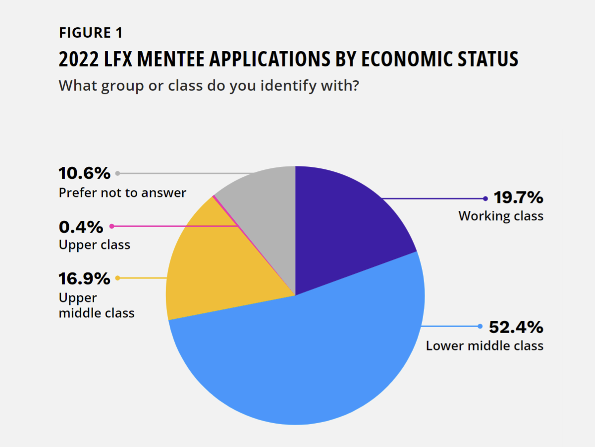
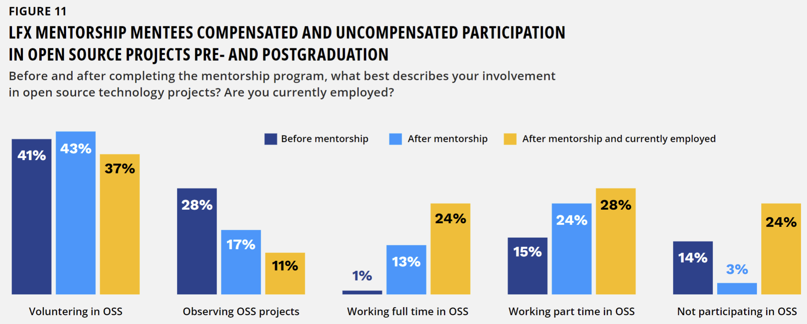

## Mentorship in Open Source

## Exploring the Intrinsic, Economic, and Career Value of Mentorship Programs

## 开源世界的导师关系

## 探索导师计划的内涵、经济和职业价值

**January 2023**

**2023 年 1 月**

**Jason Perlow, Editorial Director,**

**The Linux Foundation**

**Jason Perlow，编辑部主任，**

**Linux 基金会**

**Foreword by Julia Lawall, Senior Scientist,**
**French National Research Institute for Digital Science**
**and Technology (Inria-Paris)**

**前言作者 Julia Lawall**

**法国国家数字科学技术研究所（Inria-Paris）高级科学家**

**In partnership with**
**合作作者**

Contents
目录

```text
Foreword..........................................................................................3
Infographic: LFX Mentorship program...............................................................4
About the LFX Mentorship program study............................................................5
Introduction: The problem that mentorship aims to solve ..........................................6
The roots of mentorship programs in academia......................................................8
The history of mentorships in open source and the technology industry.............................9
The genesis of mentorship at the LF...............................................................9
Mentorships and their impact on succession and diversity within open source.......................11
  Improving diversity.............................................................................11
  A learning experience for mentees (and mentors).................................................12
  Confidence building.............................................................................13
  Community building through mentorship...........................................................15
Mentorship program challenges ....................................................................16
Career benefits of mentorship programs ...........................................................18
Conclusions ......................................................................................22
  Actionable insights ............................................................................22
Final thoughts....................................................................................23
Methodology ......................................................................................24
Demographics......................................................................................24
About the author..................................................................................25
Acknowledgments...................................................................................25
```

```text
前言............................................................................3
信息图：LFX 导师计划..............................................................4
关于 LFX 导师计划的研究...........................................................5
概述：导师计划希望解决的问题 .......................................................6
导师计划的学术依据................................................................8
开源界与技术界的导师关系历史........................................................9
LF 导师关系的起源.................................................................9
导师关系及其对开源演进和多样性的影响.................................................11
  改善多样性.....................................................................11
  学员（及导师）的学习经历.........................................................12
  建立信心......................................................................13
  通过导师关系建立社区............................................................15
导师计划的挑战 ..................................................................16
导师计划的职业价值 ...............................................................18
结论 ..........................................................................22
  可操作的见解 ....................................................................22
最后的思考.......................................................................23
方法论 .........................................................................24
人口统计学......................................................................24
关于作者........................................................................25
致谢............................................................................25
```

## Foreword

## 前言

The ability to create software is a magical thing. Out of nothing, only an idea, one can construct one’s own world as an object that performs some useful function, entertains, etc. Contributing to open source software provides the opportunity to take this to the next level, allowing the individual to contribute to something of interest to people worldwide. Nevertheless, different open source projects have different coding styles, standards of communication, preferred development tools, etc., and, to facilitate the development process, legitimately expect contributors to conform to a myriad of conventions that are not always written down. This is where mentorship comes in.

软件开发是一件很神奇的事情。只要有一个想法，一个人就可以从零开始，为自己的世界构建一个能执行某些功能的、娱乐性的工具。为开源软件做贡献，提供了一个新的机会，使得个人能为世界各地的人们感兴趣的事情做出贡献，可以将其提升到一个更高的水平。 尽管如此，不同的开源项目有不同的编码风格、通信标准、偏好的开发工具等，并且为了促进开发过程，很希望贡献者能够遵守一些约定，而这些约定并不总是用文字写下来了。 这就是导师关系的用武之地。

I have been involved in mentorship as a mentor for LFX, GSoC, and Outreachy and as a coordinator for the Linux kernel for Outreachy. Interns come to these programs with all different levels of coding skills and learn how they can contribute to software that today has become the foundation of all computing. The chance to work with a mentor provides the chance to explore ideas in a safe space, where the mentor can head off potential problems in algorithm design, coding style, and communication. In exchange, the mentor can ensure that the mentee is exposed to all of the information that the mentor would like a potential contributor to have. As the mentor and mentee in remote mentoring programs such as LFX and Outreachy often come from different countries and cultures, participating in such programs is also a wonderful way to learn more about the world.

我作为 LFX、GSoC 和 Outreachy 的导师，以及 Outreachy 的 Linux 内核的协调员，曾多次参与导师计划。当初有着不同级别的编码技能的实习生，参与到这些项目中，并学习如何为开源软件做出贡献，这些软件如今已成为所有的计算基础。与导师一起工作，提供了在安全空间中探索想法的机会，导师指导学生解决算法设计、编码风格和沟通方面的各种潜在问题。作为交换，导师可以确保学员接触到潜在贡献者能拥有的所有信息。由于 LFX 和 Outreachy 等远程指导项目的导师和学员通常来自不同的国家，拥有不同的文化，参与此类项目也是了解世界的绝妙方式。

Today, many of the mentees I have worked with have interesting jobs in the industry, while some have diverted to further studies. For some, the internship was one of many steps on the way to their current accomplishments, while for others, the internship represented a rupture in their career, from a position that they were not satisfied with to one that they found more rewarding. Some continue to do work related to the Linux kernel, others explore other directions, and some unexpectedly found their Linux kernel experience applicable in a different area. I am immensely proud of all of them. Mentorship is incredibly rewarding for the mentees, the mentors, and the organizations that benefit from the mentee’s contributions. I would like to thank the various organizations that make these internship programs possible.

今天，与我共事过的许多学员都在该行业找到了有趣的工作，而有些则转行继续深造。对于一些人来说，实习是他们获得当前成就的众多步骤之一，而对于另一些人来说，实习代表着他们职业生涯的断裂，从他们不满意的职位到他们认为更有价值的职位。 一些人继续从事与 Linux 内核相关的工作，另一些人探索其他方向，还有一些人意外地发现他们的 Linux 内核经验适用于不同的领域。 我为他们所有人感到无比自豪。 对于学员、导师和受益于导师计划的组织来说，辅导学员是令人难以置信的回报。 我要感谢让这些导师计划成为可能的各种组织。

**Julia Lawall**

**Senior Scientist, French National Research Institute for Digital Science and Technology (Inria-Paris)**

**Julia Lawall**

**法国国家数字科学技术研究所（Inria-Paris）高级科学家**

## Infographic: LFX Mentorship program

## FX导师计划


| | |  |
|----|----|----|
| Mentorship creates opportunities for a healthy succession of open source project contributions and leadership. | Mentorship encourages greater equity and accessibility for underrepresented groups to engage in open source projects. | 87% of mentees are students, 86% already participate in open source, and 88% are involved in IT broadly. |
| 导师计划为开源项目建设及社区领导力的良性迭代进行了支撑和创造了机会 | 导师计划鼓励弱势群体参与开源项目，以保障开源项目的公平性和可及性。 | 87% 的辅导对象是学生，86% 已经参与了开源，88% 或多或少的涉及和使用IT技术。 |
| 67% of mentees had never been paid for their open source involvement prior to beginning the mentorship. | Before completing the progam, 64% of mentees lacked some degree of confidence in their ability to engage in open source. | 69% of mentees have seen their career advance because of mentorship, with 47% saying that the program helped them get a job. |
| 在接触导师计划之前，67% 的学员从未因参与开源而获得过报酬。 | 在完成指导之前，64% 的辅导对象对他们参与开源的能力缺乏一定程度的信心。 | 69% 的辅导对象因为指导而看到了他们的职业发展，47% 的人表示该计划帮助他们找到了工作。 |
| 67% of employed mentees report an increase in their income after the program. | 52% of the mentees who are now employed are getting paid for their open source involvement. | 99% of former mentees recommend the program to others, and everyone involved says that the program was beneficial. |
| 67% 的在职辅导对象表示他们的收入在参与该计划学习和指导后有所增加。 | 52% 的在职辅导对象因参与开源项目而获得报酬。 | 99% 的前学员向其他人推荐了该计划，所有参与人员都表示该计划受益匪浅。|
| 90% of mentees have increased confidence in their ability to contribute to open source compared to before they started the program. | 85% of mentees are or are willing to continue contributing to the project they were involved in after mentorship. | One of the program’s challenges is recruiting mentees with the essential skills for open source development. |
| 与开始该计划之前相比，90% 的辅导对象对自己为开源做出贡献的能力更有信心。| 85% 的辅导对象正在或愿意在接受指导后继续为他们参与的项目做出贡献。 | 该计划的挑战之一是招募具备开源开发基本技能的学员。|

## About the LFX Mentorship program study

- Linux Foundation (LF) Mentorship helps build diverse communities of developers to address long-term project sustainability issues.
- LF Research assessed the effectiveness of the effort in addressing these issues and the career and economic benefits for mentees.
- The findings in this report are based on a survey of 100 graduates of the 2020 and 2021 LF Mentorship program.

## 关于 LFX 导师计划研究

- Linux基金会(以下简称LF)导师计划帮助建立多样化社区的开发人员，指导长期项目的可持续性问题。
- LF 研究并评估了解决这些问题的有效性以及学员的职业和经济利益。
- 本报告的调查结果基于对 2020 年和 2021 年 LF 导师计划的 100 名毕业生的调查。

## Introduction: The problem that mentorship aims to solve

## 简介：导师计划旨在解决的问题

Why is it necessary to have open source and LF mentorship programs?

为什么开源与LF导师计划是有必要的？

Open source communities face a two-fold problem: building diverse communities of developers and leadership succession. Mentorship programs help to solve the problem of ensuring robust succession and growth, where many new contributors become part of the community. Just as we require offspring as a human species to guar- antee the health and continuation of our legacy and culture long after the current generation is a living memory, new entrants enable open source to breathe new life and continuity into our communities.

开源社区面临两个方面的问题：建设多元化的开发者社区，以及领导力继承。导师计划有助于解决不断有新的贡献者参与的情况下，如何保障稳健的继承性以及社区成长的问题。就像我们需要作为人类物种的后代来保证我们的文化和遗产在当前这一代人成为鲜活记忆之后很长一段时间内可以持续影响和延续一样，社区的新晋成员能为我们的社区持续的注入新的活力和延续性。

We invest in our communities as beneficiaries of our open source legacy by giving new developers access to knowledge and expe- rience from more experienced participants. By helping new developers to begin, mentors can help ensure that the community continues to grow and thrive long after the founders of these projects cease their direct involvement.

我们通过让新晋的开发者从更有经验的参与者那里的获取知识和经验，作为开源遗产的受益者再投资于我们的社区中。通过协助新的开发者，导师可以协助并保证社区在项目创始人停止直接参与后很长一段时间内可以持续发展壮大。

Investing in our future by providing access to generational knowledge is not the only reason mentorship programs exist. We also wish to foster underrepresented groups—whether women, members of the LGBTQ+ community, people with disabilities, or non-native English speakers—to improve diversity within our communities. Shuah Khan, an open source fellow and Linux kernel maintainer, explains the grounding philosophy of the mentorship program, highlighting the importance of increasing diversity in open source communities, including the Linux kernel:

> “The end goal was to have a healthy and sustainable kernel community with diverse viewpoints. Diverse communities are healthy and thriving. Having a different viewpoint in the development process keeps them healthy and relevant and serves the needs of people globally. So, improving diversity and opening up the kernel community of people of different socioeconomic backgrounds was a huge component.”

通过代代相传的知识来投资我们的未来发展并不是导师计划存在的唯一原因。 我们还希望培养一些代表性不足的群体——无论是女性、LGBTQ+ 社区成员、残疾人还是非英语母语人士——以改善我们社区的多样性。 开源研究员和 Linux 内核维护者 Shuah Khan 解释了导师计划的基本理念，强调了增加开源社区多样性的重要性，包括 Linux 内核：
> “我们的最终目标是拥有一个有包容不同观点、健康且可持续的内核社区。 多元化的社区代表健康和繁荣。 在开发过程中拥有不同的观点可以使社区保持健康和活力，并满足所有人的需求。 因此，提高多样性和吸纳不同社会经济背景的人，是社区健康发展的一个重要组成部分。“

>*“Open source software is the backbone of a lot of our world infrastructure in financial, healthcare, telecommunications, you name it—critical*
>*internet infrastructure. So, as a result, keeping these communities healthy for the long term is paramount to keeping this infrastructure working.”*
>**—SHUAH KHAN, OPEN SOURCE FELLOW**
>**AND LINUX KERNEL MAINTAINER**

>“开源软件是我们世界上许多金融、医疗、电信等领域基础设施的支柱——关键的互联网基础设施。因此，保持这些社区的长期健康发展对于保持这些基础设施的运转至关重要。”
>—SHUAH KHAN，开源研究员和 Linux 内核维护者

It’s no secret that the open source community and surrounding culture are historically male-dominated. The LF is actively trying to remedy this by involving and engaging members of underrepresented minority communities, including those less economically advantaged.

众所周知，开源社区和周边文化历来由男性主导。 LF 正在积极尝试通过让代表性不足的群体社区的成员参与进来，包括那些经济条件较差的人，来改变这个现状。



|Figure 1|图 1|
|----|----|
| 2022 LFX MENTEE APPLICATIONS BY ECONOMIC STATU | 2022年LFX申请学员的经济状况 |
| What group or class do you identify with? | 你属于跟他组或者等级？|
| 10.6% Prefer not to answer | 10.5% 不想回答 |
| 19.7% Working Class| 19.7% 工薪阶层 |
| 0.4% Upper class | 0.4% 上等收入 |
| 16.9% Upper middle class | 16.9% 中上等收入 |
| 52.4% Lower middle class | 52.4% 中下等收入 |

An analysis of LFX Mentorship applicant data in **FIGURE 1**shows that 72% identify as belonging to the middle class.

图1中 LFX 导师计划的申请人数据分析表明，72%的人来自中产阶级。

Khan, who directs the LFX Mentorship program, states that addressing diversity within the open source community is a complex societal issue involving equitable access to resources and opportunities.

LFX导师计划的Khan指出，解决开源社区多样性的问题是一个复杂的社会问题，它涉及了获得资源和机会的公平性。

She says, “It is an issue of people not having equitable access to resources. We have to do our part to make those resources available to people equitably so that they are easier to access, easier for people to self- learn, and thus more accessible for people to get involved in open source and break down barriers. These barriers are based on your background, the language you speak, and also your financial situation and various other reasons.”*

她说，“这个问题涉及到人们无法公平的获取资源。我们必须要尽一份力量，让大家可以更容易的获得和学习，能公平的使用这些资源，打破障碍参与到开源社区中来。这些障碍通常是人们的背景、语言、财务状况和其他原因。”

Providing this kind of access means recognizing these barriers and tailoring services to respect the needs of diverse communities. This can take the form of offering paid mentorships in some instances and free mentorships in others. Khan explains,

提供对导师计划有差异的访问意味着确实存在这些障碍，并调整了对应的服务以尊重不同社区的需求。 比如通过在某些情况下提供付费指导和在其他情况下提供免费指导的形式。 Khan解释说，

>“The goal here is to ask, how do we make it easier for people to overcome those barriers? Can we give these folks a little lift by providing resources like free training, free webinars, and paid mentorships? We have added unpaid mentorships because not everyone wants to or can get paid to access this program, as they know our program is a limited resource, and unpaid or credit-only helps us scale it without the funding constraints. So, we try to make it accessible to different needs, career transitions, etc. Our unpaid programs are well received, and we can increase the number of mentees per project.”

>“这里，我们需要回答，如何让人们更容易克服这些障碍？ 能否通过提供免费培训、免费网络研讨会和付费指导等资源来帮助这些人？ 我们增加了无偿指导，因为导师计划是一种有限的资源，不是每个人都免费的，也不是每个人都希望通过导师计划赚钱，无偿的帮助我们在没有资金限制的情况下扩展它。 因此，我们试图让它满足不同的需求，比如职业转型等。我们的无偿项目很受欢迎，在每个项目中的也可以增加学员人数。”

>*“The problem we are trying to fix is a sustainable maintenance cycle. Bringing more people into open source is part of it, but there are many more steps.*”
>**—KATE STEWART, VICE PRESIDENT OF DEPENDABLE SYSTEMS, THE LINUX FOUNDATION**

>“我们试图解决是对项目周期性维护的可持续性。 让更多人参与开源是其中的一部分，但还有很多其他方面。”
>—KATE STEWART，Linux 基金会 副总裁

It is clear that without bringing in these diverse groups of people, open source culture becomes stagnant, putting our projects at risk in terms of their ability to retain talent and inspire new developers to join them as maintainers or core contributors.

很明显，如果不引入这些不同的人群，开源文化就会停滞不前，使我们的项目在留住人才和激励新开发者作为维护者或核心贡献者的吸引力方面面临风险。

Angela Brown, SVP and GM of events at the LF, explains the value of DEI initiatives from the perspective of acquiring talent. She says,

LF 高级副总裁兼活动总经理 Angela Brown 从获取人才的角度解释了 DEI 计划的价值。 她说，

>*“We have all these companies that desperately need open source talent, both now and in the coming years. How do we get people prepared for that? Diversity is a big aspect because that is where you’ll find a lot of this talent since these are previously overlooked groups.”*

>“我们拥有所有这些迫切需要开源人才的公司，无论是现在还是未来几年。 我们如何让人们为此做好准备？ 多样性是一个很大的方面，这是会发现很多这种人才的地方，他们也是之前被忽略的群体 。”

Not only does a lack of diversity hurt the acquisition and retention of talent, but it also translates to attracting fewer developers and is detrimental to code maintenance prospects for those projects. One mentee from the Kubernetes project discussed how mentorship and other DEI programs could help introduce under- represented perspectives into code development to the advantage of the project. As they explained,

缺乏多样性不仅会影响人才的获取和保留，导致更少的开发者的转化，最终不利于这些项目的代码维护。 Kubernetes 项目的一名学员讨论了导师计划和其他 DEI 计划如何帮助将少数派建议引入代码开发，从而使项目受益。 他们如此解释，

>*“Greater representation from these groups introduces different people with different mindsets looking at a project, so when there’s a problem, we can have various approaches to it, which will help it get solved even faster.”*

>“这些群体的代表性更强，可以让不同的人以不同的心态看待一个项目，所以当出现问题时，我们可以有不同的方法来解决它，这将有助于更快地解决问题。”

## The roots of mentorship programs in academia

## 导师计划的根源

Mentorship programs, specifically for fostering professional communities in the open source realm, have existed in the technology industry for about 17 years, with scholarly publications providing the basis for these programs dating back almost four decades.

在技术行业内，专门为开源领域培养社区方面专业人才的导师计划已经存在了大约 17 年，学术出版物为其奠定了近 40 年的基础。

These works are used to teach Semesters of Code, an evolving undergraduate curriculum that is being taught to computer science students at Johns Hopkins University on open source software engineering by adjunct faculty member Stephen Walli, who is a principal program manager at Microsoft’s Azure Office of the CTO, a board member of the Eclipse Foundation, and a member of the LF Research Advisory Board.

这些学术出版物用于半学年的代码学习课程，这是一门随着技术变化不断更新的本科课程，由兼职教员 Stephen Walli 向约翰霍普金斯大学计算机科学专业的学生讲解开源软件工程，他是微软 Azure 办公软件的 CTO，Eclipse 基金会的董事会成员，以及 LF 研究顾问委员会的成员。

Per Walli, the realization of the importance of mentorship programs began in the late 1980s with the research of Jean Lave, a social anthropologist at the University of California, Irvine, who introduced the concept of learning as participation in ongoing communities of practice. This challenged the conventional theories of learning and education, even to this day.

Per Walli 意识到导师计划的重要性始于 80 年代后期，当时加州大学尔湾分校的社会人类学家 Jean Lave 的研究引入了实习的概念，即参与正在发展中的实践社区。 这挑战了传统的学习和教育理论，直到今天。

Her first work, Cognition in Practice: Mind, Mathematics and Culture in Everyday Life (1988), was a treatise about how ordinary people can do mathematical work in their everyday lives without even realizing it. Her second book, authored with Etienne Wenger, Situated Learning: Legitimate Peripheral Participation (1991), was much more influential in education. In this book, Lave and Wenger proposed the theory that learning is a matter of legitimate peripheral participation in communities of practice.

她的第一部作品《实践中的认知：日常生活中的思维、数学和文化》（1988 年）是一篇关于普通人如何在日常生活中不知不觉地使用到数学的论文。 她与 Etienne Wenger 合着的第二本书 《情境学习：合法的边缘参与》 (1991) 在教育领域影响更大。 在这本书中，Lave 和 Wenger 提出了这样一个理论，即学习是在实践的社区群体中有合法边缘参与的认知过程。

According to Lave and Wenger, learning is not something that only happens in the classroom; it is a process that occurs through social interaction in everyday life. A community of practice is a group of people who share a concern or a passion for something they do and learn how to do it better as they interact regularly.

根据 Lave 和 Wenger 的理论，学习不仅仅是发生在课堂上的事情；而是一个通过日常生活中的社会互动发生的过程。 实践社区是一群人，他们对所做的事情有共同的关注或热情，并在定期沟通经验，交流如何做可以学习得更好。

For example, when children are born, they enter communities
of practice, such as their family, and begin to learn the skills and practices of those communities. As they grow older, they move into new communities of practice, such as their peer groups, and continue to learn the skills and practices associated with those communities.

举个例子，一个孩子出生，在一个家庭中生活，就像融入一个实践的社区一样，开始学习家庭里的技能和作法。 随着年龄的增长，他们进入一些新的环境，例如他们的同龄人群体，又继续学习与这些社区相关的技能和作法。

>**“My open source journey started with a question from a mentor in a workplace mentoring session. The question was, ‘what are you waiting for?’”**
>**—SHUAH KHAN, OPEN SOURCE FELLOW AND LINUX KERNEL MAINTAINER**

>“我的开源之旅始于一位导师在职场辅导会议上提出的问题。 问题是，‘你还在等什么？’”
>—SHUAH KHAN，开源研究员和 Linux 内核维护者

The situated learning theory describes the drivers of peripheral participation in communities of practice and is very helpful in understanding how people learn in the workplace. Many companies have started mentorship programs based on this theory to help employees learn the skills and practices they need to succeed in their jobs.

情境学习理论描述了外部环境在实践社区中具有一定的驱动因素，这对于理解人们如何在工作场所中学习非常有帮助。 许多公司已经开始根据这一理论开展导师计划，以帮助员工学习在工作中取得成功所需的技能和作法。

Mentorship programs have also been beneficial in other settings, such as schools. In a school setting, mentorship programs allow students to learn from more experienced students or teachers. These programs can also help students develop relationships with adults who can provide support and guidance.

导师计划在学校等其他环境中也大有裨益。 在学校环境中，导师计划引导学生向更有经验的学生或老师学习。 这些计划还可以帮助学生与可以提供支持和指导的成年人建立关系。

In work settings, mentorship programs allow employees to learn from their experienced peers as a learning pathway for career transition and advancing skills in their areas of interest.

而在工作环境中，导师计划允许员工向经验丰富的同事学习，作为职业转型和提升对感兴趣领域技能学习的途径。

### The history of mentorships in open source and the technology industry

### 开源和技术领域的导师制历史

Open source mentorships date back to 2005 with the introduction of Google’s Summer of Code, a program the company has run for the last 17 years. It targets college students and provides a stipend (of $1,500 to $6,600, depending on size and location) to work on an open source project. The program has expanded to include high school, postsecondary, and graduate students. Similarly, Google’s Code-In, targeted at 13 to 17-year-olds, ran from 2010 to 2019. Beyond Google, other companies are releasing technology industry mentorship programs, such as Microsoft, IBM, Amazon, Meta, and Red Hat. As with Summer of Code, these programs are typically 12 weeks long and take place during the summer. They are open to students at least 18 years of age who have completed one year of college.

开源导师制可以追溯到 2005 年，当时谷歌推出了 “谷歌的代码之夏”，该公司在过去 17 年中一直在运行该计划。 它面向大学生并提供津贴（根据规模和地点，提供1,500 美元到 6,600 美元）以从事开源项目。 该计划已扩大到包括高中生、大专生和研究生。 同样，谷歌的 “谷歌Code-In” 项目针对 13 至 17 岁的人群，从 2010 年持续到 2019 年。
除了谷歌，其他公司也在发布技术行业指导计划，例如微软、IBM、亚马逊、Meta 和红帽。 与”谷歌代码之夏”一样，这些项目通常为期 12 周，并在夏季向年满 18 岁且已完成一年大学学业的学生开放。

- **Microsoft Student Partners** is a global program that helps students learn about technology, build their technical skills, and connect with other students. The program provides students access to Microsoft products, technologies, and programs.

- **Microsoft Student Partners** 是一项全球计划，可帮助学生了解技术、培养技术技能并与其他学生联动。 该计划使学生能够访问 Microsoft 产品、技术和程序。

- **The IBM Pathfinder Mentoring Program** pairs IBM engineers, designers, and business professionals with university students in the same discipline and enables those students to receive personalized career guidance.

- **IBM Pathfinder Mentoring Program** 将 IBM 工程师、设计师和业务专家与同一学科的大学生配对，使这些学生能够获得个性化的职业指导。

- **The Amazon Mentorship Program** is a 12-week program that helps prepare participants for a career in software development. The program includes weekly lectures, coding challenges, and project work. Participants also can shadow Amazon software engineers and attend social events.

- **亚马逊导师计划**旨在帮助参与者为软件开发职业做好准备，为期12周。 该计划包括每周讲座、编码挑战和具体项目工作。 参与者还可以跟随亚马逊软件工程师参加社交活动。

- **Meta University** is a program for undergraduate and graduate students interested in pursuing a career in software engineering. The program includes coursework, internships, and research opportunities.

- **Meta大学**是一个面向有兴趣从事软件工程职业的本科生和研究生的项目。 该计划包括课程作业、实习和研究机会。

- **Red Hat Mentorships** is a program that helps students learn about open source software development. The program provides participants access to Red Hat products, technologies, and programs.

- **Red Hat Mentorships** 是一个帮助学生了解开源软件开发的计划。 该计划为参与者提供红帽产品、技术和程序的访问权限。

Nonprofit organizations like the Apache Software Foundation and the GNOME Foundation also offer mentorship programs.

Apache 软件基金会和 GNOME 基金会等非营利组织也提供导师计划。

- **The Apache Software Foundation** offers a 12-week mentorship program for students who want to contribute to Apache projects.**
- **Apache 软件基金会**为想要为 Apache 项目做出贡献的学生提供为期 12 周的导师计划。**

- The Software Freedom Conservancy **Outreachy** program provides internships for people from groups traditionally underrepresented in free and open source software, such as LGBTQ+. Outreachy does not require prior college attendance, only 18 years of age, to qualify for a mentorship.**Marina Zhurakhinskaya**, a Ukrainian software developer and prominent FOSS advocate, who lost her long battle with cancer in June of 2022, founded the program.
- Software Freedom Conservancy **Outreachy** 计划为传统上在自由和开源软件中代表性不足的群体的人们提供实习机会，例如 LGBTQ+(彩虹族)。 Outreachy(外延计划) 不需要事先上过大学，只需要满足18 岁就有资格获得指导。**Marina Zhurakhinskaya**创立了该计划，她是乌克兰的软件开发人员和著名FOSS 倡导者，她在 2022 年 6 月与癌症的长期斗争中离世。

## The genesis of mentorship at the LF

## LF 导师制的起源

The idea of mentorship at the LF initially came about to bring maintainers into the fold for its Linux kernel project. As with many open source projects, the kernel’s developer population has  grown organically—it is not a traditional hire and talent placement scenario. The need to replace developers over time is crucial to the stability and longevity of the project, and mentorship is one way to achieve this. The organization decided to become more intentional about how it could help new developers get up to speed and become productive members of the open source community.

LF 的指导思想最初是为了拉动开发者参与其 Linux 内核项目的维护。 与许多开源项目一样，内核的开发人员数量已经实现了自然增长——不依赖传统的招聘方式。 随着时间的推移，开发者更迭对于项目的稳定性和成长性至关重要，而导师制度是实现这一目标的一种方式。 因此，组织决定更加专注于如何帮助新开发者加快成为开源社区高效产出的成员。

The pilot mentorship program launched within the kernel community in 2019 had a few simple objectives: to help new developers feel welcome, learn the ropes, and accept their first code contributions. Khan identified these objectives and the goal of increasing diversity. She says,

>*“We identified three reasons for starting the program: diversity, community health, and sustainability. You have to inject new talent and bring in people, new developers that can take over at some point from the aging maintainer population and step into these important roles. So, we felt that the best approach at the time would be having these developers trained by maintainer experts in those areas.”*

2019 年在内核社区内启动的试点导师计划有几个简单的目标：让新的开发者有归属感、摸到门道并接受他们的第一个代码贡献。 Khan说，

>*“我们确定了启动该计划的三个原因：多样性、社区健康和可持续性。 必须注入新的人才并引入新的开发人员，他们可以在某个时候接替退休的维护人员并担任这些重要角色。 因此，我们认为最好的方法是让这些开发人员接受这些维护专家的培训。”*

Khan looked at previous examples of mentorship programs at other open source organizations and wanted to broaden mentorships outside of their student-centric focus by inviting industry professionals into the program. This also required unique accommodations that similar programs only previously had. Khan adds,

>*“I talked to people running mentorship programs at the time, such as Outreachy and Google Summer of Code, and how they viewed the shortcomings of those programs. One part that came up as a big thing was that it would be helpful to have it as a part- time program; thus, we added that early on. We also decided not to restrict it to students because career transition is very important. And I chose to run three sessions, spring, summer, and fall, like a college or university, so that it would be accessible to people globally.*

Khan 查看了其他开源组织以前的导师计划案例，并希望通过邀请产业界的专业人士加入该计划来扩大之前以学生为重点的指导。 这也是需要单独进行协调，之前并无先例。 Khan补充道，

>*“我与当时运行导师计划的人进行了交谈，例如 Outreachy 和 Google Summer of Code的相应人员，以及他们如何看待这些计划的缺点。 把该计划作为一个兼职项目是个很好的事情； 因此，我们很早就添加了这一点。 我们还决定不将其仅限于学生，因为职业转型非常重要。 我选择举办春季、夏季和秋季三个课程，就像学院或大学一样，以便所有的人都可以使用它。*

>*So, for example, the spring session is probably the one that people from the southern hemisphere could participate in because it is their summer. The summer session would be for other people and students. For others, they could fit into a three-month or six-month program.”*

>*例如，春季班可能是南半球的人可以参加，因为那是他们的夏天。 暑期班是为其他人和学生准备的。 对于其他人，他们可以参加为期三个月或六个月的课程。”*

> “Marina Zhurakhinskaya left an amazing legacy of initiatives to lift people up and change the lives of many. Marina’s passing is a big loss to the open source community and people working toward equity in open source.”
> —SHUAH KHAN, LFX MENTORSHIP PROGRAM LEAD

>“Marina Zhurakhinskaya留下了一系列让人惊叹的举措，来提升人们的境遇并改变许多人的生活。Marina的离世对于开源社区和致力于开源平等的人们来说是一个巨大的损失。”
>—SHUAH KHAN, LFX导师计划负责人

Another approach to attract industry professionals was opening the program to anyone, regardless of employment status. As Khan explains,

另一种吸引产业界专业人士的方法是向任何人开放该计划，无论其就业状况如何。 Khan解释：

>*“We don’t require applicants to be unemployed; they can be fully employed, part-time, or of any kind of status. We simply say if you can spend 20 to 40 hours a week learning and advancing your skills, you’re welcome to apply to our program.”*
>“我们不要求申请人脱产； 他们可以是全职、兼职或任何身份。 我们只是说，如果你每周能花 20 到 40 个小时学习和提高你的技能，欢迎你申请我们的项目。”

Khan also explains why they chose not to restrict participants based on demographics:

Khan 还解释了为什么他们选择不根据人口统计的数据来限制参与者：

>*“Other programs restrict their mentorships to students only or women and LGBTQ+. Some of these are 100% diverse in their population, which is excellent. However, they are fishing from a smaller pond to begin with, which purposefully restricts the size of their addressable communities and programs. We didn’t want to do that; we’re open to everyone.”*

>“其他项目将他们的指导仅限于学生或女性和 LGBTQ+。 其中一些在其人口中 100% 多样化，这非常好。 然而，他们面向比较垂直的人群，这刻意的限制了对应的社区和项目的规模。 我们不想那样做； 我们向所有人开放。”

The program, now known officially as LFX Mentorships, has since been expanded beyond the Linux kernel to include other open source projects under the LF umbrella, such as Cloud Native Computing Foundation (CNCF), Hyperledger, Open Mainframe Project, ELISA, Zephyr, RISC-V, and Automotive Grade Linux. (**FIGURE 2**)

该计划现在正式称为 LFX Mentorships，此后已扩展到 Linux 内核之外，包括 LF 旗下的其他开源项目，例如云原生基金会 (CNCF)、Hyperledger、Open Mainframe Project、ELISA、Zephyr、RISC -V 和AGL等社区和项目。 （图 2）

LFX Mentorships are fully matriculated; once a mentee has completed the program, they have “graduated” and are not eligible for additional mentorship for the program to provide opportunities for others. However, the possibility exists of becoming a mentor in the future. Several graduated mentees have been helping as co-mentors, sharing their experiences and realizing that mentoring is rewarding and a continuous learning path.

LFX导师计划是完全制定的；一旦学员完成了该计划，他们将“毕业”，并不再有资格获得额外的导师计划，以便为其他人提供机会。然而，未来有可能成为导师。一些毕业的学员已经作为合作导师提供帮助，分享他们的经验，并意识到导师工作是有益且持续学习的道路。

|Figure 2|图 2|
|----|----|
|LFX MENTORSHIP PROGRAM MENTEES’ PROJECTS | LFX导师计划学员项目 |
|What was the name of the mentorship project you worked on?| 你参与的辅导项目是什么名字？|
|CNCF projects| CNCF 项目 |
|Linux kernel bug fixing| Linux 内核错误修复 |
|Open Mainframe| 开放主机 |
|Hyperledger and blockchain projects| 超级账本和区块链项目 |
|Other| 其他 |

## Mentorships and their impact on succession and diversity within open source

## 导师制及其对开源项目内的继承和多样性的影响

### Improving diversity

### 提高了多样性

Ensuring project health is not just about attracting new developers to replace the old; it's also about improving diversity in the open source community to make it more representative of the world. The code submitted to the projects themselves reflects this, where different perspectives worldwide contribute unique features that make the project relevant on a broader scale. Khan provides an example of this from the perspective of energy conservation. She says,

确保项目健康不仅仅是吸引新的开发人员取代旧的开发人员；它还涉及改善开源社区的多样性，使其更具世界代表性。提交给项目本身的代码反映了这一点，世界各地的不同观点贡献了独特的特点，使项目在更大范围内具有相关性。Khan从节能的角度举了一个例子。 她说，

“We have kernel patches to improve power management on devices to help users from places like Africa and Southeast Asia, where they don't have as widespread access to charging infrastructure (for their laptops and mobile phones) as the rest of the world. They might not even have 24/7 electricity, which might be a luxury. California residents now realize they need backups with the wildfires they have been experiencing recently. So, these patches help conserve energy so that applications aren’t power hogs; this is critical to companies that sell products in these areas of the world. Different viewpoints come from diverse experiences, and open source software expresses their needs. We call this scratching our own itch, which results in unique features that benefit us all. That’s where diversity of thought comes into play.”

“我们用内核补丁来改善设备的电源管理，以帮助来自非洲和东南亚等地的用户，在这些地方，他们无法像世界的其他地区那样方便地访问充电的基础设施（用于给他们的笔记本电脑和手机充电）。他们甚至可能没有24小时/7天的全天候电力，这可能是一种奢侈。加州居民现在意识到，他们需要备份电力，以应对最近遭遇的野火。因此，这些补丁有助于节约能源，使应用程序不再那么耗电；这对于在世界上这些地区销售产品的公司来说至关重要。不同的观点来自不同的经历，开源软件表达了他们的需求。我们称此为“挠痒痒”，每个人都有自己的痒处，这会产生有益于我们所有人的独特功能。这就是思想多样性发挥作用的地方。”

Although the program is open to everyone by design, the LF has focused on getting more women and other underrepresented groups involved in LFX Mentorship programs.

尽管该计划在设计上向所有人开放，但LF一直专注于让更多的女性和其他代表性不足的群体参与LFX导师计划。

“We are trying to reach out to groups historically underrepresented within the open source community,” said Khan. “We did a big push, for example, to Black colleges and Hispanic colleges in the summer of 2021 to raise awareness, as a part-time program, to give them the flexibility to work from anywhere, and we are expanding that globally. We don’t require participants to be just students, either. When we say we are inclusive, we don’t say this will be just for women, LGBTQ+, or any particular denomination or group. We say this applies to anybody who wants to get involved with open source but does not know how to get started. So far, these are how our efforts have been, and we’ve seen more women participate. But it could be better. We have consistently improved our numbers since the program's inception in 2019. Our participation from women sits at 20% compared to 17% in 2019.”

Khan说：“我们正在试图接触那些在开源社区中历史上代表性不足的群体。” “例如，我们在2021年夏天大力推动黑人学院和西班牙裔学院提高认识，参加一项兼职计划，让他们能够灵活地在任何地方工作，我们正在向全球扩展这一点。我们也不要求参与者只是学生。当我们说我们具有包容性的时候，我们并不是说这将只针对女性、LGBTQ+或任何其他的特定教派或群体。我们认为，这适用于任何想加入开源但不知道如何开始的人。到目前为止，这就是我们所做的努力，而且我们看到更多的女性参与其中。但这可能会更好。自2019年该计划启动以来，我们的人数一直在不断提高。与2019年的17%相比，我们的女性参与率提高到了20%。

Kate Stewart, vice president of dependable systems at the LF, is passionate about bringing new talent and participants into open source projects. In fact, mentorship programs have been instrumental in recruiting new maintainers and advancing projects without direct funding, such as SPDX (Software Package Data Exchange). According to Stewart, “My involvement in mentorship programs began with the SPDX side from the Google Summer of Code. Way back when the project started, this was the only way we were able to make forward progress on some of our tools.”

LF可靠系统副总裁Kate Stewart热衷于将新的人才和参与者引入开源项目。事实上，在没有直接资金资助的情况下，导师计划有助于招募新的维护人员和推进项目发展，例如SPDX（软件包数据交换）。根据Stewart的说法，“从Google编程之夏开始，我参与SPDX项目的导师计划。早在项目开始时，这是我们能够在某些工具上取得进展的唯一途径。”

>“One big reason it’s fulfilling is that this makes a difference in people’s lives. That little bit of encouragement, that little bit of lift, and having access to a mentor they can talk to and ask, is my patch good?”

>“它令人满意的一个重要原因是，它改变了人们的生活。一点点的鼓励，一点点的提升，还有一个可以交谈的导师，可以询问我的补丁好吗？”

### A learning experience for mentees (and mentors)

### 学员（和导师）的一次学习经历

Mentorship programs can be helpful for both the mentee and the mentor. Mentees can benefit from having someone to look up to and learn from. As Khan notes, mentors can benefit from the satisfaction of helping others grow and develop and introduce them to new approaches to software development. She adds,

导师计划对学员和导师都有帮助。有一个值得仰望和学习的导师，可以使学员受益。正如Khan所指出的，导师可以从帮助他人成长和发展的满足感中获益，也可以从学员那里了解软件开发的新方法。她补充说，

>“Mentors could be locked into a way of doing things, as they have been in their role as maintainers for a very long time. So, when somebody new comes in and tries something new, you look at that new approach and go, oh! That makes sense; that’s another way to do things. So, the mentors themselves learn from mentoring. When I’m looking at patches for analysis sent from mentees who are fixing bugs, I am looking at different parts of the kernel that I am not familiar with in some cases. And sometimes, I need to go deep and understand what I am looking at before I can answer the questions from mentees in these areas, so it’s beneficial to me.”

>“导师可能会形成了一种固定的做事方式，因为他们担任维护者的角色已经很长时间了。所以，当有新人进来尝试新事务时，你看到那种新方法有效，会很吃惊！这是有道理的; 是另一种做事的方式。所以，导师自己也会从指导中学习进步。当我查看分析学员提交的修复bug的补丁时，我同时也会查看到内核的不同部分，这些部分在某些情况下我并不熟悉。有时，对于学员提出的某些领域的问题，我需要深入分析才能回答，这对我来说也是受益的过程。”

The design of the kernel’s mentorship program helps new developers familiarize themselves with the kernel development process and provide them with guidance and support from more experienced developers. The program is also open to established developers who want to contribute to the kernel but need help with the process. Working with an experienced maintainer can inspire mentees to become maintainers themselves. As one mentee told us,

内核导师计划的设计目的，是帮助新开发人员熟悉内核的开发过程，并为他们提供更有经验的开发人员的指导和支持。该计划也还面向那些想要为内核做出贡献，但需要帮助的成熟开发人员。与经验丰富的维护人员一起工作，可以激励学员成为维护人员。正如一位学员告诉我们的那样，

>“Due to the mentorship program, I was able to understand the mindset of the maintainers … and I would happily take the responsibility of maintaining a project if anyone offers me the opportunity.”

>“由于导师计划，我能够理解维护人员的心态......如果有人给我机会，我很乐意承担维护项目的责任。”

Mentors can teach new developers about the culture and customs of the open source community, as well as the technical aspects of working on open source projects. They may offer guidance and support while also being a source of inspiration for innovative concepts. In addition, mentorship programs can help build relationships between people of different ages, experiences, and backgrounds. Khan explains,

导师可以向新开发人员传授开源社区的文化和习俗，以及从事开源项目的技术方面的知识。他们可以提供指导和支持，同时也是创新概念的灵感来源。此外，导师计划可以帮助不同年龄、经历和背景的人之间建立关系。Khan解释说，

>“One big reason it’s fulfilling is that this makes a difference in people’s lives. That little bit of encouragement, that little bit of lift, and having access to a mentor they can talk to and ask, is my patch good? Or is my communication good on this email list? Or even how we can help them respond to an upstream email conversation. As a mentor, I might ask that they pose specific questions upstream for effective communication. Or the mentee might say to me that the maintainer hasn’t responded to their patch. I can then say, as a mentor, give them more time to respond. Having someone who can watch over you and be an advocate is a big help when you are getting started in open source; it makes you more confident in understanding how the communication dynamic works.”

>“它令人满意的一个重要原因是，它改变了人们的生活。一点点的鼓励，一点点的提升，还有一个可以交谈的导师，可以询问我的补丁好吗？或者我在这个电子邮件列表中的沟通是否良好？ 甚至我们可以帮助他们回复上游的邮件问话。作为导师，我可能会要求他们提出具体问题，以便进行有效的沟通。也许学员可能会告诉我，维护者还没有对他们的补丁做出回应。作为导师我可以说，给他们多一点的时间来回应。当一个人刚开始接触开源项目时，如果有人可以在一旁监督并给与指导是一个很大的帮助；这会让你更有信心去了解项目运作的动态方式。”

> *"You have to understand the technical skills to be an effective maintainer, but you also have to have a lot more social intelligence. Code is easy. People are hard.Maintainership is about people management."*

>“要成为一个有效的维护者，你必须理解技术技能，但你还必须具备更多的社交智能。代码很简单，但人们很难处理。维护工作涉及到与人的管理。”

As Kate Stewart says, a maintainer requires a unique combination of technical skills and relationship management.

正如Kate Stewart所说，项目的维护者需要兼具技术能力和关系管理能力。

>“There is a recognition that the maintainership tasks are different than the coding tasks. Many people like to code, but this is a different set of skills. You have to understand the technical skills to be an effective maintainer, but you also have to have a lot more social intelligence. Code is easy. People are hard. Maintainership is about people management.”

>“人们意识到，维护任务与编码任务不同。许多人喜欢编码，但维护任务需要一套不同的技能。你必须了解技术技能，才能成为一名有效的维护人员，但你还必须拥有更多的社交智慧。管理代码很简单。维护好人员很难。维护工作是关于人员管理的。”

Mentorship can also be a fulfilling experience for retired people who can pass on their expertise to the next generation of programmers to stay active in the technology industry. Stewart discusses the individuals she recruits in former executive roles at major corporations to act as mentors:

对于退休人员来说，导师计划也是一种充实的体验，他们可以将自己的专业知识传授给下一代的程序员，让他们在科技行业保持活跃。Stewart讨论了她在大公司的前高管职位中招募的担任导师的人员：

>“Many experienced people are retiring—so how do we keep them engaged? These folks have a lot of skills, so how do they pass them on, and how can it become something they enjoy doing? A friend of mine is a couple of years older than me, and he retired from NXP. He’s sitting around at home, puttering around. And I am saying to myself, how can I lure him into working on some open source projects? It’s rewarding and effective for people who have had a full career, don’t want to do a full-time job, but still want to keep their hand in things and be effective.”

>“许多有经验的人都要退休了，我们如何让他们参与进来呢？这些人有很多技能，如何传承，如何让他们继续做喜欢的事情？我的一个朋友比我大几岁，他从NXP退休了。他闲坐在家里，到处闲逛。我在想，怎样才能吸引他从事一些开源项目呢？这些人已经有了完整的职业生涯，不想做全职工作，但仍然希望自己动手做事并保持高效，加入开源项目是有益的，也是有效的。”

### Confidence building

### 构建信心

While any community needs some form of guidance and support for its members, this is especially true in the open source world. The development of open source software presents unique challenges. Volunteers often develop it, and they may not have professional experience. This also influences their desire to engage in open source in the first place, as expressed by 100 LFX Mentorship mentees surveyed in 2022. FIGURE 3 shows almost two-thirds of mentees lacked some confidence in their ability to engage in open source before they joined the program.

任何社区都需要为其成员提供某种形式的指导和支持，在开源世界中尤其如此。开源软件的开发带来了独特的挑战。志愿者经常编程，但他们可能没有专业的开源项目经验。这也影响了他们参与开源项目的愿望，正如2022年接受调查的曾经参与LFX导师计划的100名学员所表达的那样。图3显示，近三分之二的学员在加入LFX之前对他们参与开源项目的能力缺乏信心。


|Figure 3| 图 3|
|----|----|
|CONFIDENCE OF MENTEES IN CONTRIBUTING TO OPEN SOURCE PROJECTS BEFORE MENTORSHIP PROGRAM| 在参加导师计划之前，学员对开源项目做出贡献的信心|
|Before the mentorship program, which of the following best describes your level of confidence with respect to engaging in open source?| 参加导师计划之前，以下哪项最能描述您对参与开源项目的信心程度？|
|Not confident| 不自信|
|Somewhat confident| 有一些自信|
|Confident| 自信|
|Very confident| 非常自信|
|Extremely confident| 极其自信 |

One of the positive outcomes of surveying mentees was the reported increase in confidence that mentorship programs create. FIGURE 4 shows that 90% of mentees report increased confidence compared to their level before starting the program.

据报告，对学员进行调查的一个积极结果是，导师计划使他们的信心有所增加。图4显示，90%的学员表示，与开始该计划之前的水平相比，他们的信心提高了。


|Figure 4| 图 4|
|---|---|
|MENTEE CONFIDENCE IN CONTRIBUTING TO OPEN SOURCE PROJECTS AFTER MENTORSHIP| 在完成导师计划之后，学员对开源项目做出贡献的信心|
|After completing the mentorship program, which of the following best describes your level of confidence with respect to engaging in open source?| 在完成指导计划后，以下哪项最能描述您对参与开源的信心程度？|
|Prefer not to answer| 不想回答|
|Stayed the same| 保持一致|
|Decreased| 降低了|
|Decreased significantly| 极大地降低了|
|Increased| 提升了|
|Increased significantly| 提升幅度很大|

Qualitative interviews confirmed these results. One mentee interviewed from the Linux kernel project said they decided to join the program to level up their technical skills but also gained confidence in communicating with the community for help and advice. They explained,

定性访谈证实了这些结果。采访了一位来自Linux内核项目学员表示，他们决定加入导师计划是为了提升自己的技术技能，但同时也获得了与社区沟通以寻求帮助和建议的信心。他们解释说，

>“I found that the kernel community was extremely patient with me… as I dealt with the fact that I need to accept help, suggestions, and advice.”

>“我发现内核社区对我非常耐心......我接受了我需要帮助、给与建议和给与忠告的事实。”

Another mentee from CNCF shared a similar reflection on their increased confidence because of the program:

另一位来自CNCF的学员，分享了他们因该导师计划而增强信心的类似经验：

>“I believe my ability to explain myself or to present myself has increased … now, whenever I face a problem, I just publicly go on Slack, and I just say I’m facing issues.”

>“我确信，在解释或展示自己的作品方面，我的能力有所提高......现在，每当我遇到问题时，我都会去上Slack，说明我遇到了什么问题。”

Mentorship can provide these individuals with the skills and knowledge to succeed. Khan elaborates,

导师制可以为这些人提供成功所需的技能和知识。Khan详细说明，

>“Mentees are getting direct access to experts in those projects and benefiting from the experience of maintainers. They get a one-on-one meeting with the maintainers and experts. They can bounce ideas off of mentors before submitting their upstream contributions. That’s a huge confidence-building factor.

>“学员们可以直接接触这些项目的专家，并从维护人员的经验中受益。他们与这些维护人员和专家进行一对一的会谈。在提交代码贡献之前，他们可以征求导师的意见。这是一个巨大的建立信心的因素。

So, for example, with the 13 mentees I mentored this last summer, some of the questions they asked me were interesting, such as, was our community open? If we send patches, will you review them? And they ask other development questions, such as the length of the development processes of particular vendors, the ideal time to send patches, how long it takes for a maintainer to review the patches, etc. All of these are questions that come up in one-on-one conversations. They have to sort through a lot of information as part of being a contributor to an open source project, and sifting through that is hard for them. So, when they have one-on-one relationships with mentors, it helps.”

例如，去年夏天我指导了13名学员，他们问我的一些问题很有趣，例如，我们的社区是否开放？ 如果我们发送补丁，你会审查它们吗？他们还问了一些其他的开发问题，例如特定需求的开发过程的有多长、提交补丁的理想时间、维护人员审查补丁需要多长时间等。所有这些问题都是在一对一的对话中出现的。作为一个开源项目的贡献者，他们必须整理大量的信息，而筛选这些信息对他们来说很困难。因此，当他们与导师建立一对一的关系之后，导师会提供很多指导。”

### Community building through mentorship

### 基于导师计划构建的社区

>“ After graduating from the program, I went on to start my own open source projects in the JuliaLang community. ... I was confident enough that I could start working on my own project to attract open source contributions someday.”

>“从该项目毕业后，我在JuliaLang社区开启了自己的开源项目......我有足够的信心，有朝一日我可以开始自己的项目，吸引开源参与者贡献。”

Mentorship can also help to foster a sense of community within the open source world. By providing guidance and support, mentors can help to create an environment where people feel welcome and valued. This, in turn, can encourage more people to participate in open source projects, which can only serve to improve the quality of the software produced. As one mentee told us,

导师计划还有助于在开源世界中培养社区意识。通过提供指导和支持，导师可以帮助营造一种氛围环境，让参与者感到受欢迎和受到重视。这反过来又可以鼓励更多的人参与开源项目，这种良性循环非常有助于提高软件的质量。正如一位学员告诉我们的那样，

>“Apart from the technical skills I picked up from my mentorship project, I also learned the art of communicating technical ideas with like-minded people … I could convey my ideas properly, and even though I was just expecting clarifications on what I should not implement, I received a lot of support from the community to kickstart my first open source project.”

>“除了从导师计划项目中学到的技术技能外，我还学会了如何与志同道合的人交流技术想法......我可以恰当地传达我的想法，即使我只是想澄清不应该归我实施的内容，我也依然得到了社区的大力支持，因此我启动了第一个开源项目。”

When thinking about how mentorship programs benefit open source, it’s important to consider other intangibles in addition to bringing in new developer blood and how they address diversity issues. Khan states it’s not simply a balance sheet:

在衡量导师计划对开源项目的意义时，除了引入新的开发人员血液以及他们带来的多样性问题之外，还必须考虑其他的无形资产。Khan说这不仅仅是一份资产负债表：

>“Bringing in new developers and training them is obvious, right? When new developers come in, they bring in a new point of view, injecting relevant new ideas like when companies hire new people.

>“引入新的开发人员并对他们进行培训，这是显而易见的，对吧？当新的开发人员参与时，他们会带来新的观点，注入新的想法，就像公司雇用新人一样。

Similarly, teaching open source philosophy and the importance of open source early on, in the early part of their careers, will be beneficial to them. It’s also beneficial to have more trained open source developers—they come in and already understand the ecosystem, and part of our training helps them understand that ecosystem. All of that is beneficial—it all comes back to the question of the benefits of open source in the first place. So, it’s hard to prove the bottom line. Training and mentoring new developers are part of that bottom line—all this time and money I spend is not a balance sheet. It’s an intangible benefit that you cannot prove. Yes, it’s beneficial, but you cannot put a dollar amount on it.”

同样，在他们职业生涯的早期，尽早传授开源的哲学和开源的重要性，对他们是非常有益的。让更多训练有素的开源开发人员参与进来，也是有益的，他们有的进来时已经对开源生态系统有所了解，而我们的部分培训可以更进一步帮助他们了解该生态系统。所有这些都是有益的，这一切都回到了开源的好处这个问题上。因此，很难证明开源的盈亏状况。培训和指导新的开发人员代表盈亏的一部分，我花费的所有时间和金钱都不是资产负债表的最终表示。这是无法证明的无形利益。是的，它是有益的，但你没法在资产负债表上加上一笔，哪怕是一美元。”

By completing the mentorship program, mentees are subject to the inner workings of creating and maintaining open source projects. This exposure inspires them to continue contributing to projects. As one mentee said, “I have been actively contributing to open-source ever since.” Another mentee shared how their experience supporting a new project during the program made them confident in starting their own projects:

完成导师计划项目后，学员将参与到创建和维护开源项目的内部工作。这种接触将激励他们继续为此项目做出贡献。正如一位学员所说，“从那以后，我一直在积极地为开源做出贡献。” 另一位学员做了分享，说明他们在项目期间所获得的经验，如何让他们对开启的一个新项目充满了信心：

>“After graduating from the program, I went on to start my own open source projects in the JuliaLang community. I had seen the ins and outs of project ideation to the completion of an industry- grade software feature. I was confident enough that I could start working on my own project to attract open source contributions someday.”

>“从该项目毕业后，我在JuliaLang社区开启了自己的开源项目。我已经了解了从构思项目到打造行业级别软件功能的来龙去脉。我有足够的信心，有朝一日我可以开始自己的项目，吸引开源参与者贡献。”

The LFX Mentorship program can claim a high success rate as to the disposition of mentees toward open source contribution post-graduation. Eighty-five percent of mentees are or are willing to continue contributing to the project they were involved in after mentorship, as illustrated in FIGURE 5.

LFX导师计划在学员毕业后对开源贡献的影响方面，具有很高的成功率。如图5所示，85%的学员正在或愿意在接受指导后，继续为他们参与的项目做贡献。


|Figure 5|图 5|
|---|---|
| DISPOSITION OF LFX MENTORSHIP PROGRAM MENTEES TOWARD CONTINUING OPEN SOURCE CONTRIBUTION POSTGRADUATION | LFX导师计划学员对毕业后持续开源贡献的意向 |
| Are you willing to contribute to the project you were mentored in? | 你愿意为你所指导的项目做出贡献吗？ |
| Yes, and I have been since completing my mentorship | 是的，自从完成我的导师计划以来我一直在做贡献 |
| Yes, I would be willing to continue contributing to the project | 是的，我愿意继续为该项目做出贡献 |
| No, I am currently unable to commit time to the project | 不，我目前无法为该项目投入时间 |
| No, the project no longer overlaps with the work I do | 不，该项目不再与我所做的工作有交集 |
| No, there are other reasons I can't continue working on this project | 不，还有其他原因我不能继续从事这个项目 |
| Prefer not to answer | 不想回答 |

## Mentorship program challenges

## 导师计划的挑战

"Financial incentives are not effective motivators for open source developers in general."

"一般来说, 对于开源开发人员，经济激励并不是有效的激励因素。"

While mentorship programs can help bring underrepresented groups into the field of software engineering and help refresh the maintainer population, there is still room for improvement.

虽然导师计划可以帮助将代表性不足的群体带入软件工程领域，并对维护人员群体的更新有所助力，但仍有改进的余地。

While the LFX Mentorship program has thousands of applicants every year, the selection process weeds out many people who cannot commit to the program. For one, the programs can be time-consuming and require considerable commitment from participants. In many ways, LFX Mentorship participation as a mentee and mentor follows the self-selection model of open source participation. Even more problematic is the need to get more mentors involved; a lack of mentors can lead to frustration and discouragement for the mentees.

虽然LFX导师计划每年都有成千上万的申请者，但选拔过程淘汰了许多无法参与该计划的人。一方面，这些计划可能很耗时，并且需要参与者做出相当大的承诺。在许多方面，LFX导师参与计划包含受训者和导师，他们需要遵循参与开源的自我选择模式。更大的问题是需要让更多的导师参与进来；导师的缺席会导致受指导者感到挫败和沮丧。

To encourage more mentors to join these programs, Kate Stewart would like to see more recognition and incentives for the mentors themselves.

为了鼓励更多的导师加入这些项目，Kate Stewart希望看到对导师本身的更多认可和激励。

>"One of our biggest challenges for mentorship is, how do we get to scale? The scientific work has illustrated that people don’t stick around once they are there—some do, and some don’t. So, we have maintainer burnout. So, the question is, how do you get the people who have been mentored to do the next generation of mentoring so we can scale up instead of everything falling on the maintainers?

>“我们在指导方面面临的最大挑战之一是，我们如何扩大规模？科学研究表明，人们不会甘于现状，各有取舍。所以，我们会有维护者惰性。那么问题来了，你如何让接受过指导的人继续参与指导下一代，从而帮助我们扩大规模，而不是一切责任都落在维护者身上？

>Motivating graduates to co-mentor is proving to be successful. Some graduates view the opportunity to co-mentor with an experienced mentor as an opportunity to learn and something they can show as an achievement. Financial incentives are not effective motivators for open source developers in general."

>事实证明，激励毕业生担任共同导师是成功的。一些毕业生认为与经验丰富的导师共同指导也是他们学习的机会，同样利于他们展示自己的成就。一般对于开源开发人员来说，经济激励并不是有效的激励因素。”

>"Most of our funding goes to diversity. Many recipients of event travel funding are women from all over the world, so it gives us a more diverse set of people participating in our events compared with what we see in the mentorship program."

>“我们的大部分资金得到了多元化的使用。许多活动的差旅资助收益者都是来自世界各地的女性，因此与我们在导师计划中看到的相比，它让参与我们活动的人更加多样化。”

Mentorship programs can help bring underrepresented groups into the field of software engineering, but they face significant challenges in attracting diverse participants and ensuring they have a rewarding experience once involved. Adequate training and support for mentors and mentees can help address these challenges. Additional resources can make it easier for everyone involved to get the most out of the experience. In addition, by connecting individuals from different backgrounds and experiences, mentorship programs can help create a more diverse and inclusive community within software engineering.

导师计划可以帮助将代表性不足的群体带入软件工程领域，但他们在吸引不同的参与者并确保他们一旦参与后获得有益的经验方面面临重大挑战。对导师和受训者的充分培训和支持可以帮助应对这些挑战。额外的资源可以让所有相关人员更轻松地充分利用他们的经验。此外，通过将来自不同背景和经验的个人联系起来，导师计划可以帮助在软件工程中创建一个更加多样化和包容的社区。

Some of this support can come in the form of funding. Angela Brown, SVP and GM of events at the LF, discussed the value of funding an individual’s participation in a program or event. She offers travel funding to early career professionals to attend open source events within her portfolio. When reviewing the demo graphics of those who have previously received funding, she notes,

其中一些支持可以以资金的形式提供。 LF的高级副总裁兼活动总经理Angela Brown讨论了资助个人参与计划或活动的价值。她为早期职业专业人士提供差旅资金，以参加她投资组合中的开源活动。在审查那些先前获得资助的人的demo图形时，她指出，

>"Most of our funding goes to diversity. Many recipients of event travel funding are women from all over the world, so it gives us a more diverse set of people participating in our events compared with what we see in the mentorship program."

>“我们的大部分资金得到了多元化的使用。许多活动的差旅资助收益者都是来自世界各地的女性，因此与我们在导师计划中看到的相比，它让参与我们活动的人更加多样化。”

Diversity funding is one way to encourage greater representation in the network of early-career open source developers and expose them to more career opportunities within and outside of the mentorship program.

多元化资助是鼓励早期职业开源开发人员在网络中有更多代表性并让他们在指导计划内外获得更多职业机会的一种方式。

But while training and other resources within mentorship programs can help improve the programs themselves, there are also fundamental problems attracting individuals into mentorship programs due to the limited supply of interdisciplinary software developers trained in embedded systems and software engineering regardless of gender, identity, or socioeconomic background.

但是，尽管导师计划中的培训和其他资源可以帮助改进计划本身，但由于受过嵌入式系统和软件工程培训的跨学科软件开发人员供应有限，无论性别、身份或社会经济背景状况如何，吸引个人参与指导计划也存在根本性问题。

This makes it challenging to find qualified individuals willing to participate as mentors and mentees. In addition, many potential mentees may be reluctant to join a program because they do not have the necessary skills or experience.

这使得很难找到愿意作为导师和参与受训的合格人员。此外，许多潜在的学员可能不愿意加入某个项目，因为他们不具备必要的技能或经验。

The problem is not necessarily a lack of technology professionals. A rebound in the percentage of computer science and information degrees conferred by U.S. universities followed a period of decline, accounting for almost 5% of all degrees in 2020, according to the National Center for Education Statistics.[^1] According to the U.S. Bureau of Labor Statistics, the expectation is that employment for all computer and math-related jobs will grow 15% over the next decade.[^2]

问题不一定是缺乏技术专业人员。根据美国国家教育统计中心的数据，美国大学授予的计算机科学和信息技术学位比例在经历了一段时间的下降后出现反弹，2020年占所有学位的近5%。[^1] 根据美国劳工统计局的数据，预计所有计算机和数学相关工作的就业人数在未来十年内将增长 15%。[^2]

Instead, it is a question of a skill sets gap. Many of these prospective open source developers do not live in geographies where the required skills are taught in educational institutions.

相反，这是一个技能差距的问题。许多这些潜在的开源开发人员并不居住在教育机构教授所需技能的地区。

These limiting factors have led to a disproportionate underrepresentation of mentees from those parts of the world. Seventy-six percent of respondents to the survey indicated that they lived in the Asia-Pacific region, whereas 14% said they lived in EMEA. Only 10% said they lived in the Americas. (See the Demographics section.)

这些限制因素导致来自世界这些地区的受训者比例过低。76%的调查受访者表示他们住在亚太地区，而14%的人表示他们住在EMEA（欧洲、中东和非洲）。只有10%的人表示他们住在美洲。（请参阅人口统计部分。）

[^1]: National Center for Education Statistics. 2022. Undergraduate Degree Fields. Condition of Education. U.S. Department of Education, Institute of Education Sciences. Retrieved 11/23/2022, from <https://nces.ed.gov/programs/coe/indicator/cta>.

[^1]: 国家教育统计中心。2022. 本科学位领域。教育状况。美国教育部教育科学研究所。于2022年11月23日从 <https://nces.ed.gov/programs/coe/indicator/cta> 检索。

[^2]: U.S. Bureau of Labor Statistics. 2022. “Computer and Information Technology Occupations: Occupational Outlook Handbook”. Retrieved 11/23/2022, from <https://www.bls.gov/ooh/computer-and-information-technology/home.htm>.

[^2]: 美国劳工统计局。2022. “计算机和信息技术职业：职业展望手册”。于2022年11月23日从 <https://www.bls.gov/ooh/computer-and-information-technology/home.htm> 检索。

## Career benefits of mentorship programs

## 导师计划的职业福利

In addition to improving community health by fostering diversity and cultivating a new generation of open source developers within these projects, mentorship programs can have a transformative economic impact on mentees' lives after they graduate.

通过这些项目可以促进多样性和培养新一代开源开发者以改善社区健康，除此之外，导师计划还可以对学员毕业后的生活产生变革性的经济影响。

Receiving compensation and being able to cover living expenses is a key concern for mentees when contributing to open source projects. **FIGURE 6** shows that two-thirds of LFX Mentorship mentees had no prior experience getting paid for their open source involvement before beginning the mentorship.

在为开源项目做出贡献时，是否可以获得足以支付生活费用的报酬，是学员关注的一个关键问题。**图6**显示，在参加LFX导师计划的学员中，有三分之二的人表示，在此之前没有通过参与开源项目而获得报酬的经历。

The lack of compensation is partially due to many mentorship program applicants still needing to fully enter the professional world. Per **FIGURE 7**, before joining the mentorship program, 85% were students; after completing the program, 63% of former mentees had at least a part-time job.

缺乏酬劳的部分原因是，许多参加导师计划的申请人要求完全进入专业领域。根据**图7**，85%的申请人在加入导师计划之前还是学生；而63%的学员完成该项目后获得至少一份兼职工作。

Regarding overall compensation before and after graduation, 67% of those employed and willing to discuss the subject saw their incomes increase after graduation from the mentorship program. (**FIGURE 8**).

关于毕业前和毕业后的总体薪酬，67%的就业者和愿意讨论该话题的人表示，其收入自导师计划毕业后有所增加（**图8**）。

Mentorship programs can also create new and increased career opportunities for mentees. Participating in a mentorship program can give mentees access to resources and knowledge that are difficult to find elsewhere. After graduation, many mentees find that they have a more extensive network of contacts in their chosen field, which can lead to better job opportunities.

导师计划也可以为学员创造更多新的职业机会。参加导师计划可以让学员获得其他地方难以接触到的资源和知识。毕业后，许多学员发现，在所选领域，他们拥有更广泛的人脉网络，这可以带来更好的工作机会。

Mentors often have a wealth of experience and can provide mentees with valuable advice on which direction to take in their careers. The connection to such an experienced individual is often invaluable for a young professional.

导师通常有丰富的经验，可以为学员提供关于职业发展方向的宝贵建议。与这样一个经验丰富的人建立联系，对于一个年轻的技术人员来说往往是无价的。

Mentors are often well-respected members of the industry and can provide mentees with recommendations or introductions that can help them get the job they want. As FIGURE 9 shows, 69% of LFX Mentorship mentees have seen their career advance or new career opportunities emerge due to participating in the mentorship program.

导师通常是受到行业同仁尊敬的专家，可以为学员提供推荐或引荐，帮助他们找到心仪的工作。如图9所示，参加LFX导师计划的学员中，有69%因此获得了职业提升或新的职业机会。


| Figure 6 | 图6 |
| ---- | ---- |
| COMPENSATION OF MENTEES BEFORE BEGINNING THE LFX MENTORSHIP PROGRAM | 参加LFX导师计划前的学员薪酬 |
| Before the mentorship program, did you receive financial compensation for your contributions to open source projects? | 在参加导师计划项目前，你收到过开源项目贡献的经济补偿吗？ |
| Prefer not to answer | 不想回答 |
| No, I did not receive financial compensation | 不，我未曾收到过经济补偿 |
| Yes, but not enough to cover my living expenses | 是的，但不足以满足我的生活开支 |
| Yes, enough to cover my living expenses| 是的，且足以满足我的生活开支 |
| Yes, my compensation was more than enough to cover my living expenses| 是的，且薪酬在支付生活开支后有结余 |


| FIGURE 7 | 图7 |
| ---- | ---- |
| EMPLOYMENT STATUS OF LFX MENTORSHIP PROGRAM MENTEES POSTGRADUATION  | 参加LFX导师计划项目的学员毕业后的就业状况 |
| Before and after completing the mentorship program, what best describes your involvement in open source technology projects? | 在完成导师计划项目之前和之后，哪一个最能描述您参与开源技术项目的状态？|
| Before mentorship |  导师计划前 |
| After mentorship | 导师计划后 |
| Full-time student | 全日制学生 |
| Part-time student | 非全日制学生 |
| Salaried employee | 带薪职工 |
| Working full time above minimum wage | 高于最低工资的全职工作 |
| Working part time | 兼职工作 |
| Vounteer(full or part time)| 志愿者（全职或兼职）|
| Others | 其他 |


| Figure 8 | 图8 |
| ---- | ---- |
| CHANGES IN INCOME LEVELS OF LFX MENTORSHIP PROGRAM GRADUATES | LFX导师计划项目毕业后的收入级别变化|
| If currently employed, has your income increased following your participation in a mentorship program? | 如果目前受雇，在参与导师计划项目后你的收入是否增加？ |
| Prefer not to answer | 不想回答 |
| No | 没有 |
| Yes | 是的 |


| Figure 9 | 图9 |
| ---- | ---- |
| NEW CAREER OPPORTUNITIES FOR LFX MENTORSHIP PROGRAM GRADUATES| LFX导师计划毕业后的新职业机会 |
| Did your mentorship program help  you to advance your career (e.g., you received a promotion, a raise, or found  a new job with greater opportunities)? | 你的导师计划是否有助于你的职业发展（例如，使你获得了晋升、加薪或找到了机会更大的新工作）？ |
| Yes, my career has advanced|是的，我的职业有所进步|
| Not yet | 还没有 |
| Not yet, but I have new oppotunities to do so because I was a mentee | 还没有，但是因为我曾是学员，我有新的职业发展机会|
| No, I have not been able to advance my carrer | 不，我的职业发展没有进步 |


| Figure 10 | 图10 |
| ---- | ---- |
| DISPOSITION OF LFX MENTORSHIP  PROGRAM GRADUATES  ON THE IMPACT OF THEIR  EMPLOYMENT STATUS | LFX导师计划毕业生的就业情况，导师计划对其就业的影响 |
| Did your mentorship program help  you to find a new job? When did you complete your mentorship program? | 你的导师计划是否帮助你找到了一份新工作？你什么时候完成导师计划的？ |
| Yes | 是的 |
| No, but I am looking for a job | 还没有，但我正在找新工作 |
| No, I am not looking for a job | 还没有，我没在找工作 |
| No, I was already employed | 不，我已经就业了 |
| Prefer not to answer | 不想回答 |



| FIGURE 11 | 图11 |
| ---- | ---- |
| LFX MENTORSHIP MENTEES COMPENSATED AND UNCOMPENSATED PARTICIPATION  IN OPEN SOURCE PROJECTS PRE- AND POSTGRADUATION | LFX导师制学员在毕业前和毕业后有偿和无偿参与开源项目 |
| Before and after completing the mentorship program, what best describes your involvement  in open source technology projects? Are you currently employed? | 在完成导师计划之前和之后，哪一个最能描述您参与开源技术项目的状态？您当前是否就业？|
| Before mentorship |  导师计划前 |
| After mentorship | 导师计划后 |
| After mentorship and currently employed | 导师计划后且当前已就业 |
| Volunteer in  OSS | 开源软件志愿者 |
| Observing OSS projects | 观察开源软件项目中 |
| Working full time in OSS | 全职投入开源软件项目 |
| Working part time in OSS | 兼职投入开源软件项目 |
| Not partcipate in OSS | 没有参与开源软件项目 |

>“The project clarified my vision of where I would like to take my career and where I would like to go within the mainframe. The vision that I have right now is because of that project.”

>“该项目明确了我的职业规划，以及我希望在大型机行业里走向何方。我现在的职业愿景就是源于参加过的这个项目。”

Employment is often a gauge of career advancement, and  47% said that the program helped them get a job. (**FIGURE 10**)
就业往往是职业发展的一个衡量标准，47%的人表示该计划帮助他们找到了工作。（**图10**）

For those LFX Mentorship program graduates who have jobs, how does this relate to being compensated for open source work? **FIGURE 11** shows that over half of those employed receive payment for their open source involvement.

参加LFX导师计划项目毕业后有工作的人，他们的薪酬与开源工作的报酬有什么关系？**图11**显示，超过一半的员工因参与开源活动而获得报酬。

The LFX Mentorship program clearly changes the lives of its mentees. **FIGURE 12** shows that 58% of participants believe the program had a significant or transformative impact on their careers. One mentee interviewed by the Open Mainframe Project told us,

LFX导师计划显然改变了学员的生活。**图12**显示，58%的参与者认为该计划对他们的职业生涯产生了重大或变革性影响。Open Mainframe项目采访的一位学员告诉我们，

>“The project clarified my vision of where I would like to take my career and where I would like to go within the mainframe. The vision that I have right now is because of that project.”

>“该项目明确了我的职业规划，以及我希望在大型机行业里走向何方。我现在的职业愿景就是源于参加过的这个项目。”

But perhaps the most astonishing part of the LFX Mentorship program is the level of satisfaction among its graduates. **FIGURE 13** illustrates that 99% of former mentees would recommend the program to others, and everyone involved acknowledges that the program was beneficial.

LFX导师计划最令人惊讶的数据也许是毕业生的满意度。**图13**显示，99%的前学员会向其他人推荐该计划，所有参与的人都承认该计划是有益的。


| Figure 12 | 图12 |
| ---- | ---- |
| PERCEIVED VALUE IN THE BENEFITS OF THE LFX MENTORSHIP PROGRAM AMONG GRADUATED MENTEES | 毕业学员对LFX导师计划的益处的价值感受|
| What statement below best describes the benefit you derived from your mentorship program? (select all that apply) | 以下哪项陈述最能描述您从导师计划中获得的收益？（选择所有适用项） |
|Completing the program provides me  useful experiences and references|完成该计划为我提供了有用的经验和参考|
|I see significant benefit from the program in helping me find and succeed in future jobs|我认为该计划在帮助我找到未来工作并取得成功方面有很大的帮助|
|Completing the program was transformative to my career and employment opportunities|完成该计划对我的职业生涯和就业机会产生了变革性影响|
|I see some benefit from the program in helping me find and succeed in future jobs|我认为该计划在帮助我找到未来工作并取得成功方面有一些好处|
|I see significant benefit to my current job|我认为对我当前工作有巨大好处|
|I see some benefit to my current job|我认为对我当前工作有一些好处|
|I didn't see any benifit| 我没有发现任何好处|
|58% of participants believe the program had both a significant and transformative impact on their careers.|58%的参与者相信导师计划对他们的职业生涯产生了巨大的和变革性的影响|


| Figure 13 | 图13 |
| ---- | ---- |
| DISPOSITION OF LFX MENTORSHIP PROGRAM  GRADUATES REGARDING THE OVERALL BENEFIT | LFX导师计划毕业生的总体收益分布|
| Would you recommend the mentorship program to others? | 你会向他人推荐导师计划吗？ |
| Prefer not to answer | 不想回答 |
| No | 不 |
| Yes | 是的 |

## Conclusion

## 结论

Despite ongoing challenges with scale, mentorship programs, including LFX Mentorship, help college and university students and young professionals gain experience with open source software development, which advances their careers and helps to build a healthy and diverse community of new contributors and maintainers across LF and open source projects.

尽管在规模方面存在持续的挑战，但包括LFX导师在内的导师计划帮助大学生和年轻专业人员获得开源软件开发的经验，这将促进他们的职业发展，并有助于在LF和开源项目中建立一个由新的贡献者和维护者组成的健康、多样化的社区。

The three primary takeaways from the study are:

1. LFX Mentorship participants had prior involvement in open source and IT from a student’s perspective but lacked confidence
and work experience. Their confidence improved after participation.
2. Mentees find employment and increased income after the conclusion of the mentorship, and they frequently receive payment
for their contributions to open source.
3. The mentorship program is helping build a confident, diverse community of open source developers.

该研究的三个主要结论是：

1. LFX导师制参与者从学生的角度出发，他们曾参与过开源和IT项目，但缺乏信心以及工作经验；参与后，他们的信心有所提高。  
2. 辅导结束后，学生们找到了工作，收入也增加了，他们经常收到报酬感谢他们对开源的贡献。  
3. 导师计划有助于建立一个自信、多元化的开源开发者社区。  

### Actionable insights

### 可操作的见解

The LFX Mentorship program is making our project communities more diverse, helping mentees find jobs, and demonstrating overall value, but where do we go to improve scale?

LFX导师计划正在使我们的项目社区更加多样化，帮助学员找到工作，并展示整体的价值，但我们该如何扩大规模呢？

#### Educate multiple stakeholders on the program's successes

#### 在项目成功方面对多个干系方进行宣传教育

LF projects that have invested in LFX Mentorships should be proud of their impact and aware of their return on investment for future funding consideration. Those projects that do not have mentorships in place and are unsure whether a mentorship program will benefit them at their current state of development need only to look to the example set by projects such as the Linux kernel, CNCF, ELISA, Hyperledger, and Open Mainframe—each is devoting significant resources to this effort for the outcomes this report identifies. Additionally, we request our member companies to encourage and promote mentoring by allowing their employees to mentor.

已投入LFX导师的LF项目应为其影响感到自豪，并了解其投资回报，以供未来资金考虑。那些没有导师的项目，并且不确定导师制计划在当前的发展状态下是否会使他们受益，他们只需要看看Linux内核、CNCF、ELISA、Hyperledger和Open Mainframe等项目所树立的榜样，每个项目都在为本报告确定的结果投入大量资源。 此外，我们通过让我们的成员公司员工自行指导的方式，使成员公司鼓励指导、和提高指导水平。

#### Encourage continued financial support from the open source community

#### 鼓励开源社区延续资金支持

An investment in mentorship is an investment in the future health of open source projects. The financial incentive offered to mentees to join the program meets a fundamental need for people at the outset of their careers. Similarly, it may be worth exploring ways to compensate mentors who invest significant time, which may comprise a combination of financial reward with support in the form of human resources, tooling, and other nonfinancial benefits.

对导师的投资是对开源项目未来健康状况的投资。向学员提供的加入该计划的经济激励满足了人们在职业生涯初期的基本需求。同样，值得探索的是如何补偿投入大量时间的导师，这可能包括财务奖励与人力资源、工具和其他非财务利益形式的支持的组合。

As member and partner organizations benefit heavily from the open source projects themselves, they should view funding mentorship as an investment in their own software’s sustainability, increasing the likelihood of a steady stream of future talent that is trained on the platforms they use. An example of this is the recently launched [LFX Mentorship Showcase](https://events.linuxfoundation.org/lfx-mentorship-showcase/), which allows graduating mentees of the LFX Mentorship program to showcase the work they completed during their session term and connect with prospective employers from our member companies.

由于成员和合作伙伴组织从开源项目本身中受益匪浅，因此他们应该将资助导师关系视为对自己软件可持续性的投资，从而增加在他们使用的平台上培训稳定未来人才的可能性。这方面的一个例子是最近推出的[LFX导师展示会](https://events.linuxfoundation.org/lfx-mentorship-showcase/)，它允许LFX导师计划的毕业生展示他们在课程期间完成的工作，并与我们成员公司的潜在雇主进行联络。

#### Address geographic barriers that the report identifies

#### 解决报告中定位到的地理阻隔

As Southeast Asian participants represent more than 70% of the LFX Mentorship program, this is a powerful indicator that we need  to understand the reasons for the gap and improve the geographic makeup of the mentee population in other regions, such as North  America and Europe.

目前东南亚参与者占LFX导师计划的70%以上，这是一个强烈的信号，我们需要了解这种差距的原因，并改善其他地区（如北美和欧洲）学员人口的地理组成。

#### Use tooling for productivity to help maintainers mentor without burnout

#### 使用工具提高生产力，以帮助维护人员在指导过程中避免倦怠

The amount of time that mentors invest directly with their mentees is significant, so the more we can use tools to create a “one-to-many” type of paradigm will improve the program’s scalability. Examples of this are in play, such as the [15-minute “Speed Mentorships”](https://events.linuxfoundation.org/archive/2020/open-source-summit-north-america/features/speed-mentoring/) recently tested at Open Source Summit North America 2022 and [LF Live: Mentorship](https://events.linuxfoundation.org/lf-live-mentorship-series/), a series of webinars held for remote learning that can be attended on demand.

导师与学员直接投入的时间非常长，因此我们越能使用工具来创建“一对多”类型的范例，就越能提高项目的可扩展性。这方面的例子正在进行，例如最近在2022年北美开源峰会上测试的[15-minute “Speed Mentorships”](https://events.linuxfoundation.org/archive/2020/open-source-summit-north-america/features/speed-mentoring/)和[LF Live: Mentorship](https://events.linuxfoundation.org/lf-live-mentorship-series/)，这是一系列为远程学习举办的网络研讨会，可根据需要参加。

-----

## Final Thoughts

## 最后的感想

The LFX Mentorship program is clearly a success, and we should be doing all that we can to encourage more investment in this valuable initiative. By educating stakeholders on the successes of mentorship programs, seeking donations and funding from among our members and partners, addressing geographic barriers, and using tooling for productivity, we can ensure the longevity of the program and also create a more diverse, confident open source developer community for the long term. By leveraging the power of mentorships, we can continue to improve our open source projects and ensure they remain vibrant for years to come.

LFX导师计划显然是成功的，我们应该尽一切努力鼓励更多的投资于这项宝贵的计划。通过对参与方进行导师计划取得成功的宣传教育，从我们的成员和合作伙伴中寻求捐款和资金，解决地理障碍，并使用工具提高生产力，我们可以确保计划的持久性，并长期创建一个更多元、更自信的开源开发者社区。通过利用导师制的力量，我们可以继续改进我们的开源项目，并确保它们在未来几年保持活力。

We would like to thank our mentors for volunteering their time to share their valuable experience in formal mentoring programs and in hosting LF Live Webinars

我们要感谢我们的导师自愿抽出时间分享他们在正式指导计划和举办LF Live网络研讨会方面的宝贵经验。

## Methodology

## 研究方法

- The completion of a survey of graduates of the LF Mentorship program took place from January through March 2022.

- After eliminating duplicate and incomplete records, this analysis is based on 74 participants who came from the 2021 mentorship class, with the remainder completing the program in 2020.

- For N = 100, the margin of error is +/- 8.2% @ 90%.

- After the completion of the initial survey, more than 20 mentees provided additional qualitative feedback.

- Percentage values may not add exactly to 100% due to rounding

- 2022年1月至3月完成了LF导师计划毕业生调查。

- 在消除重复和不完整的记录后，本分析基于来自2021辅导的74名课程参与者，其余学生将于2020年完成课程。

- 对于N=100，误差范围为+/-8.2%@90%。

- 初始调查完成后，20多名学员提供了额外的定性反馈。

- 由于进行了取整运算，百分比值可能无法精确增加到100%

## Demographics

## 统计数据特征

A survey of 100 graduates of the 2020 and 2021 LF Mentorship programs yielded the results. Three-quarters of the respondents lived in an Asian country during their mentorship, and 82% were 18–24 years old. Of those currently employed, 69% work in the information technology industry.

对2020年和2021 LF导师计划的100名毕业生进行的调查得出了结果。四分之三的受访者在担任导师期间生活在亚洲国家，82%的受访者年龄在18-24岁。在目前就业的人中，69%在信息技术行业工作。

| Figure 14 | |
| ---- | ---- |
| SELECTED DEMOGRAPHICS OF THE 2022 LF MENTORSHIP SURVEY| 2022年LF导师调查的选定人口统计 |
| Mentorship class | 指导班级 |
| Location during mentorship | 指导期间所在位置 |
| Americas | 美洲 |
| EMEA| 欧洲、中东和非洲 |
| Asia Pacific | 亚洲太平洋|
| Age | 年龄 |
| Industry of employment | 就业行业 |
| Other industries | 其他行业 |
| Information Technology (IT vendor or sevice provider) |  信息技术（IT 厂商 或 服务提供商）|

## About the author

## 关于作者

Jason Perlow is a veteran of the information technology industry with over 25 years of experience as an independent consultant for the financial sector and a systems architect, technology strategist, and technical writer at Unisys, IBM, Dimension Data, and Microsoft. Jason led the 8th, 9th, and 10th annual LF Jobs Reports. He co-authored the 2021 State of Open Source in Financial Services research and, as editorial director, is the lead content writer, editor, and manager for LF Projects, LF Research, and Linux.com. In 1999, Jason was the founding senior technology editor of Linux Magazine, where he led coverage of the formation of the LF and has had an op-ed technology column on ZDNET, covering enterprise technology since 2008.

Jason Perlow是信息技术行业的资深人士，拥有超过25年的金融行业独立顾问经验，也是Unisys、IBM、Dimension Data和Microsoft的系统架构师、技术策略师和技术作家。Jason领导了第8、第9和第10届LF年度工作报告。他与人合著了《2021金融服务研究中的开放源码状态》（State of Open Source in Financial Services research），作为编辑总监，他是LF Projects、LF research和Linux.com的主要内容撰写人、编辑和经理。1999年，Jason是Linux Magazine的创始高级技术编辑，他在该杂志上领导了LF的形成报道，并在ZDNET上开设了op-ed技术专栏，自2008年起涵盖企业技术。

## Acknowledgments

## 致谢

作者希望感谢我们的赞助商，CNCF、Hyperledger基金会、安全应用程序中启用Linux（ELISA）项目、开放大型机项目和开源安全基金会（OpenSSF）对本研究的支持。特别感谢LF的同事Shuah Khan、Kate Stewart和Angela Brown的见解；Hilary Carter、Lawrence Hecht、Steve Hendrick、Anna Hermansen、Christina Oliviero和Melissa Schmidt提供定量分析和运营支持；以及参加本次调查的所有LFX导师，尤其是本次研究的受访者。

## Note

## 注释

This report has been updated since its original release on 01.16.23. This second version, released on 01.19.23, corrects errors found in the original text and graphics.

本报告自2013年1月16日首次发布以来已进行了更新。当前为第二个版，发布于2023年1月19日，修正了原始文本和图形中的错误。


Invest in building a stronger and more diverse community of qualified developers and engineers. LFX Mentorship makes it easy to sponsor and help train the next generation of open source developers by serving the key needs of the community. The program received 10,700 applications, accepted 600+ applicants, and paid $1.5M in stipends. Since its inception in 2019, LFX Mentorship Programs have trained 414 new developers. Several of our graduates are now gainfully employed and continuing to contribute to open source projects. We strongly believe in and are committed to providing learning pathways for new developers of all backgrounds.

投资于建设一个更强大和多样化的合格开发人员和工程师社区。LFX Mentorship通过满足社区的关键需求，为赞助和帮助培训下一代开源开发人员提供了便利。该计划收到了10,700份申请，接受了600多名申请人，并支付了150万美元的津贴。自2019年成立以来，LFX Mentorship计划已经培训了414名新的开发人员。我们的一些毕业生现在已经稳定就业，并继续为开源项目做出贡献。我们坚信并致力于为所有背景的新开发人员提供学习路径。


Founded in 2021, LF Research explores the growing scale of open source collaboration and provides insight into emerging technology trends, best practices, and the global impact of open source projects. Through leveraging project databases and networks and a commitment to best practices in quantitative and qualitative methodologies, LF Research is creating the go-to library for open source insights for the benefit of organizations the world over.

LF研究院成立于2021年，探索不断扩大的开源合作规模，并提供新兴技术趋势、最佳实践和开源项目的全球影响力的见解。通过利用项目数据库和网络，并致力于定量和定性方法论的最佳实践，LF研究正在为全球组织打造一座开源见解的图书馆，以造福全球。

Copyright © 2023 The Linux Foundation

版权所有 © 2023 Linux基金会

This report is licensed under the Creative Commons Attribution-NoDerivatives 4.0 International Public License. To reference the work, please cite Jason Perlow, “Mentorship in Open Source,” foreword by Julia Lawall, The Linux Foundation, January 2023.

此报告受创作共用许可证Attribution-NoDerivatives 4.0 International Public License保护。 在引用这项工作时，请引用Jason Perlow的“开源中的导师制”，由Julia Lawall撰写的前言，The Linux Foundation，2023年1月发布。


The CNCF, part of the LF, hosts critical components of the global technology infrastructure, including Kubernetes, Prometheus, and Envoy. CNCF brings together the industry’s top developers, end users, and vendors and runs the world’s largest open source developer conferences. For more information, please visit www.cncf.io.

CNCF（云原生计算基金会）是 LF（Linux 基金会）的一部分，承载着全球技术基础设施的关键组件，其中包括 Kubernetes、Prometheus 和 Envoy。CNCF 聚集了行业顶尖的开发者、最终用户和供应商，并举办全球最大的开源开发者大会。欲了解更多信息，请访问 www.cncf.io。


The ELISA project aims to make it easier for companies to build and certify Linux-based safety-critical applications—
systems whose failure could result in loss of human life, significant property damage, or environmental damage. ELISA members are working together to define and maintain a common set of tools and processes to help companies demonstrate that a specific Linux-based system meets the necessary safety requirements for certification. Launched in February 2019, ELISA works with Linux kernel and safety communities to agree on what to consider when using Linux in safety-critical systems. The project has several dedicated working groups that focus on providing resources for system integrators to apply and use to analyze qualitatively and quantitatively on their systems.

ELISA项目旨在帮助企业更轻松地构建和认证基于Linux的安全关键应用程序- 这些系统的故障可能导致人员生命的丧失、重大财产损失或环境破坏。ELISA成员共同努力，定义并维护一套通用的工具和流程，帮助企业证明特定的基于Linux的系统满足必要的安全认证要求。ELISA于2019年2月推出，与Linux内核和安全社区合作，以就在安全关键系统中使用Linux时要考虑的内容达成一致。该项目有几个专门的工作组，专注于为系统集成商提供资源，以进行定性和定量分析其系统的应用和使用。


Hyperledger Foundation is an open source community focused on developing a suite of stable frameworks, tools, and libraries for enterprise-grade blockchain deployments. It is a global collaboration hosted by The LF and includes leaders in finance, banking, the Internet of things, supply chains, manufacturing, and technology. Built under technical governance and open collaboration, individual developers, service, and solution providers, government associations, corporate members, and end users are all invited to participate in developing and promoting these game-changing technologies.

Hyperledger Foundation（超级账本基金会）是一个致力于开发稳定框架、工具和库以适用于企业级区块链部署的开源社区。它是由LF（Linux Foundation）托管的全球合作项目，包括金融、银行、物联网、供应链、制造业和技术领域的领导者。在技术治理和开放合作的基础上构建，鼓励个人开发者、服务和解决方案提供商、政府协会、企业会员和终端用户参与开发和推广这些具有改变游戏规则的技术。


The LF’s training program features courses developed and taught by expert instructors, many of whom are wellrespected professionals in the open source community. Our certification team performs comprehensive industry and job analyses to ensure every professional certification program we offer meets our exceedingly high standards. Led by our outstanding customer success team, we deliver responsive support and customized training solutions to enable individual and business to successes.

LF的培训计划包括由专家讲师开发和教授的课程，其中很多人在开源社区中拥有很高的声誉。我们的认证团队会进行全面的行业和工作分析，以确保我们提供的每个专业认证计划都满足我们极高的标准。在我们出色的客户成功团队的带领下，我们提供响应迅速的支持和定制培训解决方案，以促使个人和企业的成功。


The Open Mainframe Project was founded in 2015 as a focal point for deploying and using Linux and open source in a mainframe computing environment. With a vision of open source on the mainframe as the standard for enterprise-class systems and applications, the project’s mission is to build community and adoption of open source on the mainframe by eliminating barriers to open source adoption on the mainframe, demonstrating value of the mainframe on technical and business levels, and strengthening collaboration points and resources for the community to thrive. Open Mainframe Project is home to more than 22+ projects and working groups, including ADE, Ambitus, ATOM, CBT Tape, COBOL Check, COBOL Programming Course, COBOL Working Group, ConsoleZ, Feilong, GenevaERS, Linux Distributions Working Group, Mainframe Open Education, Mentorship, Polycephaly, Software Discovery Tool, TerseDecompress, Tessia, Zowe, and Zorow.

开放大型计算机项目（Open Mainframe Project）成立于2015年，旨在成为在大型计算机环境中部署和使用Linux和开源的焦点。该项目的愿景是将开源在大型计算机上作为企业级系统和应用的标准，其使命是通过消除在大型计算机上采用开源的障碍，展示大型计算机在技术和业务层面的价值，以及加强合作关系和资源，推动大型计算机上开源的社区建设和采用。开放大型计算机项目拥有22多个项目和工作组，包括ADE、Ambitus、ATOM、CBT Tape、COBOL Check、COBOL编程课程、COBOL工作组、ConsoleZ、Feilong、GenevaERS、Linux发行版工作组、大型计算机开放教育、导师计划、Polycephaly、软件发现工具、TerseDecompress、Tessia、Zowe和Zorow等。


The OpenSSF is a cross-industry organization that brings together the industry’s most important open source security initiatives and the individuals and companies that support them. The OpenSSF commits to collaboration and working both upstream and with existing communities to advance open source security for all.

OpenSSF是一个跨行业组织，汇集了行业中最重要的开源安全倡议以及支持它们的个人和企业。OpenSSF致力于合作，并在上游和现有社区之间共同推动开源安全的发展。
