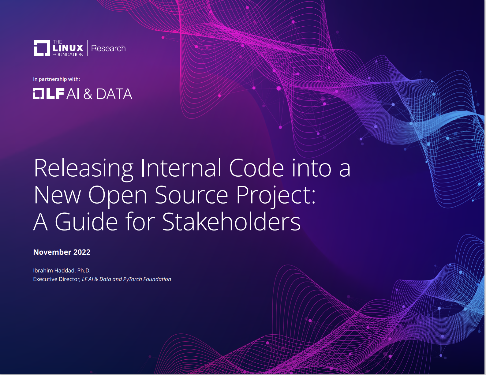
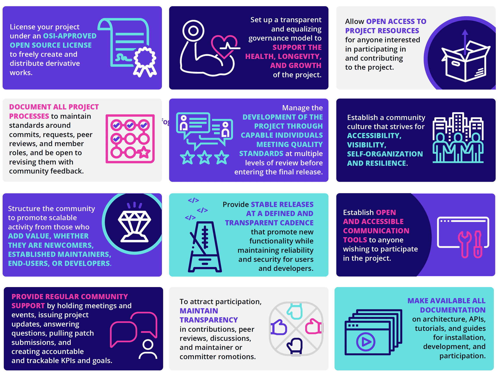
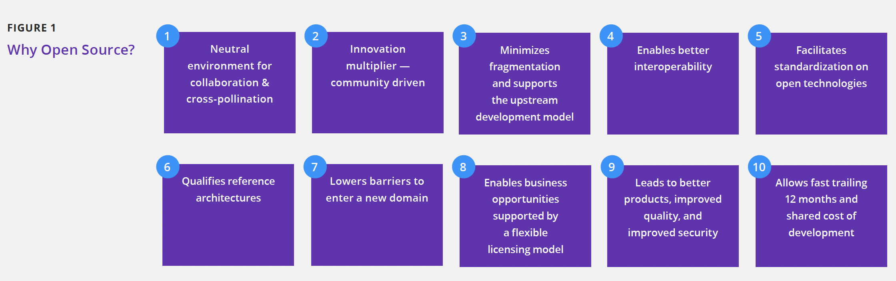
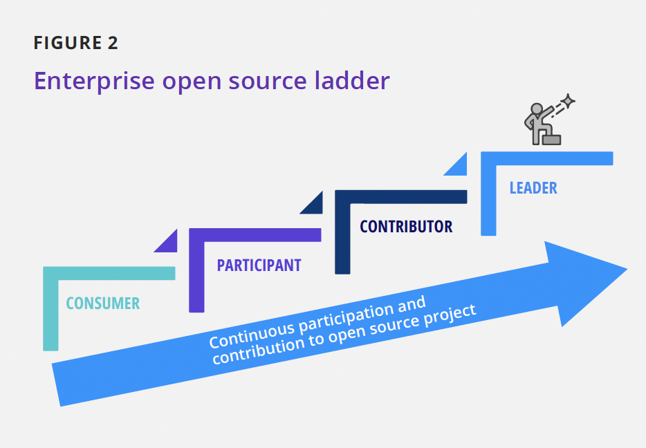
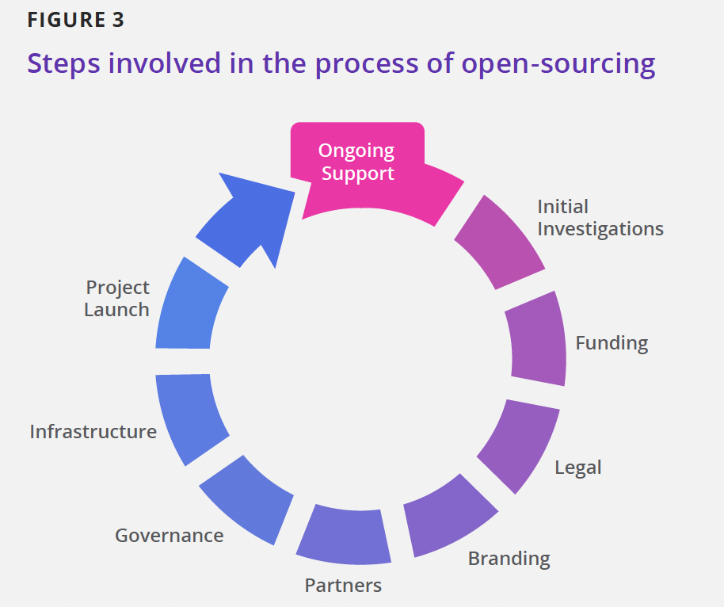

# Releasing Internal Code into a New Open Source Project: A Guide for Stakeholders

# 将内部代码发布为一个新的开源项目：干系人指南

**November 2022**

**2022年11月**

Ibrahim Haddad, Ph.D.

Executive Director, *LF AI & Data and PyTorch Foundation*

Ibrahim Haddad 博士

*LF AI & Ddata 和 PyTorch 基金会*  执行董事

**In partnership with:**

**联合：**

**Contents**

**目录**

[Infographic 4]

[信息图 4]

[Abstract 5]

[摘要 5]

[Introduction 6]

[概述 6]

[Initial investigations 8]

[前期调查 8]

[Make the business case to open source 8]

[开源商业方案 8]

[Evaluate possible ways to open source 8]

[评估可能的开源方式 8]

[Project funding 9]

[项目资金 9]

[Legal considerations 9]

[法律考虑 9]

[Confirm ownership of all the code 9]

[确认代码所有权 9]

[Conduct intellectual property review 10]

[进行知识产权审查 10]

[Choose the open source license 10]

[选择开源许可证 10]

[Apply license terms to the code 11]

[应用许可证条款到代码 11]

[Code clean-up 11]

[清理代码 11]

[Project branding 12]

[项目品牌 12]

[Develop a trademark strategy and policy 12]

[制定商标战略和政策 12]

[Domain names 12]

[域名 12]

[Creative assets 12]

[创意资产 12]

[Register external accounts 12]

[注册外部账户 12]

[Develop a certification/compliance strategy 12]

[制定认证/合规策略 12]

[Recruit business partners 12]

[招募商业伙伴 12]

[Establish project governance 13]

[建立项目治理制度 13]

[Set up project infrastructure 14]

[建立项目基础设施 14]

[Apply recommended practices for your GitHub repo 14]

[为你的 GitHub 仓库应用推荐做法 14]

[Project launch 15]

[项目启动 15]

[Prepare the announcement 15]

[准备公告 15]

[Press and analyst relations 15]

[媒体和分析师关系 15]

[Announce and launch the project 15]

[宣布并启动项目 15]

[Summary of recommended practices for running an open source project 16]

[运营一个开源项目的实践经验 16]

[License 16]

[开源协议使用 16]

[Governance 16]

[治理模型 16]

[Access 16]

[使用权 16]

[Processes 16]

[流程 16]

[Development 16]

[项目发展 16]

[Community 16]

[社区运营 16]

[Community structure 16]

[社区结构 16]

[Releases 17]

[版本发布 17]

[Communication tools 17]

[沟通工具 17]

[Transparency 17]

[透明度 17]

[Documentation 17]

[文档工作 17]

[Ongoing support 18]

[持续支持 18]

[Support the community 18]

[支持社区 18]

[Support project infrastructure 18]

[支持项目基础设施 18]

[Endnotes 18]

[尾注 18]

|   |   |   |
| ---- | ---- | ---- |
| License your project under an OSI-APPROVED OPEN SOURCE LICENSE to freely create and distribute derivative works.    根据 **OSI批准的开放源代码许可证** 来许可你的项目以自由创建和分发衍生品。 |  Set up a transparent and equalizing governance model to SUPPORT THE HEALTH, LONGEVITY, AND GROWTH of the project.   建立一个透明平等的治理模式，以**支持项目健康、长期发展和增长**。 |  Allow OPEN ACCESS TO PROJECT RESOURCES for anyone interested in participating in and contributing to the project. 允许任何有兴趣参与项目且做出贡献的人**公开访问项目资源**。 |
| DOCUMENT ALL PROJECT PROCESSES to maintain standards around commits, requests, peer reviews, and member roles, and be open to revising them with community feedback.    **记录所有项目过程**，以维护有关提交、请求、同行评审和成员角色的相关标准，并对基于社区反馈的修订保持开放。 | Manage the DEVELOPMENT OF THE PROJECT THROUGH CAPABLE INDIVIDUALS MEETING QUALITY STANDARDS at multiple levels of review before entering the final release.    在进入最终版本前，通过满足质量标准的合格人员进行多级审校来管理项目开发。 | Establish a community culture that strives for ACCESSIBILITY, VISIBILITY, SELF-ORGANIZATION AND RESILIENCE.   建设社区文化，努力实现**可访问性、可见性、自组织性和弹性**。 |
| Structure the community to promote scalable activity from those who ADD VALUE, WHETHER THEY ARE NEWCOMERS, ESTABLISHED MAINTAINERS, END-USERS, OR DEVELOPERS.   构建社区来为**贡献价值的人**推广扩展活动，**无论他们是新人、固定维护人员、最终用户还是开发者**。 | Provide STABLE RELEASES AT A DEFINED AND TRANSPARENT CADENCE that promote new functionality while maintaining reliability and security for users and developers.    **以明确和透明的节奏稳定发布**，以推广新功能，同时为用户和开发人员维持可靠性和安全性。 | Establish OPEN AND ACCESSIBLE COMMUNICATION TOOLS to anyone wishing to participate in the project.    为任何希望参与项目的人提供**开放和可访问的沟通工具**。 |
| PROVIDE REGULAR COMMUNITY SUPPORT by holding meetings and events, issuing project updates, answering questions, pulling patch submissions, and creating accountable and trackable KPIs and goals.    通过召开会议和活动、发布项目更新、回答问题、提交补丁以及创建可度量可追踪的KPI目标，**定期提供社区支持**。 | To attract participation, MAINTAIN TRANSPARENCY in contributions, peer reviews, discussions, and maintainer or committer romotions.   为了吸引参与者，在贡献、同行评审、讨论和维护者或提交者宣传中**保持透明度**。| MAKE AVAILABLE ALL DOCUMENTATION on architecture, APIs, tutorials, and guides for installation, development, and participation.    **公开所有文档**，包括架构、API、教程以及安装、开发和参与指南。 |

## Abstract

## 摘要

Corporate participation in open source has reached an all-time high and continues to grow as companies realize the value of consuming and contributing to open source projects. The nature of corporate participation continues to evolve, as companies increasingly discover that open sourcing proprietary technologies can create new sources of value and stronger product ecosystems.

随着企业意识到消费和贡献开源项目的价值，其在开源方面的参与度已达历史新高，且持续增长。企业越来越多地发现，开源自有技术可以创造新的价值源和更强大的产品生态, 其参与的性质在不断演进。

Open sourcing a proprietary technology involves far more than just making the source code available. There are many ways of building or joining communities to use and help maintain the project, which is why it should be a well-ordered and deliberate process.

开源一种自有技术不只是局限在源代码开放，有很多种方式来建立或加入社区，以应用并帮助维护项目，因此它应当是一个条理清晰且深思熟虑的过程。

For companies that plan to open source proprietary code as a standalone open source project, this paper offers a high-level overview of the process and provides a sample checklist that can help ensure that all tasks are properly captured and executed.

对于有计划开源自有代码成为一个独立开源项目的企业，本文给出了该过程的顶层概述，并提供了一个示例的检查清单，有助于确保正确识别和执行所有任务。

## Introduction

## 概述

Open source software (OSS) has been shifting the software industry into a new paradigm, moving from developing propri- etary code behind closed doors to developing code that parties can share, modify, and redistribute openly. The key benefits of this shift include reducing development costs and software component complexity, developing reusable, common, off-the- shelf software assets, increasing flexibility, and benefiting from the innovation multiplier factor of community-driven development projects. Organizations that embrace the open source model as a positive means of building software will increase their chances of retaining their competitive advantage. Figure 1 illustrates the various strategic advantages that OSS offers to organizations adopting it and contributing to it.

开源软件（OSS）一直在并将持续推动软件行业发展到一种新范式，从闭门开发专有代码，转向为开发各方可以公开共享、修改和重新分发的代码。这种转变的主要好处在于降低开发成本和软件组件复杂性，开发可复用的通用标准软件资产，提高灵活性，并受益于社区驱动开发项目带来的多重创新。组织将开源模式作为构建软件的积极手段，可以增加其保持竞争优势的机会。图 1 说明了开源软件为采纳和促进开源软件的组织所提供的各种战略优势。

During the previous two decades, organizations have realized the benefits of using and contributing to open source projects in their products and services. This has created a trend of organizations setting up Open Source Program Offices (OSPOs) to manage all aspects of OSS, including the use of and compliance with OSS licenses, contribution to OSS projects, and community-building around key OSS technologies.

在过去的二十年中，企业组织已经意识到在其产品和服务中采纳和贡献开源项目的好处。这导致设立开源项目办公室（OSPO）成为一种趋势，组织通过它来管理开源软件的各个方面，包括开源软件许可证的使用和遵守、对开源软件项目的贡献以及围绕开源软件关键技术的社区建设。

|  |  |   |   |    |
|--| -- | --- | ---| --- |
| **FIGURE 1**  |  |   | |
| **图 1** |  |   | |
| **Why Open Source ?**  |  |   | ||
| **为何开源？**  |  |   | |
| 1. Neutral environment for collaboration & cross-pollination   1. 适于合作和交流的中立环境 | 2. Innovation multiplier — community driven   2. 创新加速器——社区驱动 | 3. Minimizes fragmentation and supports the upstream development model   3. 最小化碎片，支持上游开发模式  | 4. Enables better interoperability   4. 实现更好的互操作性 | 5. Facilitates standardization on open technologies  　5. 促进开放技术的标准化 |
|6. Qualifies reference architectures   6. 合格的参考架构 | 7. Lowers barriers to enter a new domain   7. 降低进入新领域的阻碍 | 8. Enables business opportunities supported by a flexible licensing model   8. 通过灵活的许可模式支持商业机会  |  9. Leads to better products, improved quality, and improved security   9. 带来更好的产品、改善质量并提升安全性 | 10. Allows fast trailing 12 months and shared cost of development   10. 允许快速跟踪12个月并分担开发成本 |

|  |  
| --- |
| **FIGURE 2** |
| **图 2** |
| **Enterprise open source ladder**   **企业开源阶梯**|
| **CONTRIBUTOR**   **贡献者** |
| **PARTICIPANT**   **参与者** |
| **CONSUMER**   **消费者** |
| **LEADER**   **领导者** |
| **Continuous participation and contribution to open source project**   **对开源项目的持续参与和贡献** |

|  |
| --- |
| **FIGURE 3** **图 3** |
|**Steps involved in the process of open-sourcing**   **开源过程的相关步骤** |
| **Ongoing Support**   **持续支持** |
| **Initial Investigations**   **前期调查** |
| **Funding**   **资金支持** |
| **Legal**   **法务** |
| **Branding**   **品牌建设** |
| **Partners**   **合作伙伴** |
| **Governance**   **治理** |
| **Infrastructure**   **基础设施** |
| **Project Launch**   **项目发布** |

Figure 2 illustrates four primary OSS enterprise strategies: consumption of OSS, participation, contribution, and leadership. Each strategy requires an enterprise to succeed at the previous strategy, and how far an organization advances depends entirely on the enterprise. Engineering drives the early strategies of consumption and participation. Engineers use various open source components for their technical merits to speed up development, but they participate little in the projects that maintain these components. Over time, higher levels of the organization learn about the value of this OSS usage. As OSS gains traction, business needs begin to drive such OSS involvement, and OSS efforts contribute to a determined business strategy. Some companies achieve their goals as consumers. Other companies see strategic advantages in other stages of involvement and in most cases they set up an OSPO to oversee strategic planning and execution through these stages.

图 2 说明了四种主要的OSS企业战略：OSS 消费、参与、贡献和领导。每一项战略都要求企业在前一项战略中取得成功，而组织的进步程度完全取决于企业。工程推动了消费和参与的早期战略。工程师使用各种开源组件以提高开发速度，但他们很少参与维护这些组件的项目。随着时间的推移，组织的高层了解到 OSS 使用的价值。随着 OSS 的发展，业务需求开始推动 OSS 的参与，OSS 的努力有助于确定业务战略。一些公司实现了作为消费者的目标。其他公司在参与的其他阶段看到了战略优势，在大多数情况下，他们设立了一个 OSPO 来监督这些阶段的战略规划和执行。

As part of the third stage---contributing to open source---organizations often choose to contribute key proprietary technologies to open source with various motivations, such as the following:

作为第三阶段——贡献开源——的一部分，组织通常会以各种动机为开源贡献关键专有技术，例如：

- Providing a reference implementation to a standard
- 提供标准的参考实现
- Ensuring that critical software remains viable
- 确保关键软件持续可用
- Undercutting the competition
- 削弱竞争对手
- Commoditizing a market
- 开辟商业化市场
- Partnering with others and promoting goodwill in the developer community
- 与他人合作并提升在开发者社区的信誉
- Driving market demand by building an ecosystem
- 准确把握市场需求，构建上下游生态
- Offering customers the ability to support themselves and add custom
features
- 支持客户自助服务及增加自定义功能

Open sourcing with the wrong motivation will often have a negative effect on achieving the desired outcome and can disrupt the relation of the enterprise with the communities of specific open source projects.

带有错误动机的开源通常会对实现预期结果产生负面影响，并可能破坏企业与特定开源项目社区的关系。

This paper identifies questions to ask, practices to consider, and steps to take when making a proprietary technology open source. Figure 3 illustrates the various steps involved in the process of open sourcing internal code and launching it as an open source project. These steps are not necessarily executed in a linear order and several of them can be taking place in parallel. Our goal with this paper is to provide a basic template that organizations can adjust to accommodate their own policies and strategies.

本文确定了在开源专有技术时要明确的问题、要考虑的实践以及要采取的具体步骤。图 3 说明了将内部代码发布为一个开源项目过程中涉及的各个步骤。
这些步骤不一定按顺序逐个执行，其中一些步骤可以并行进行。本文的目标是提供一个基本模板，组织可以根据自己的政策和战略按需调整。

## Initial investigations

## 前期调查

When open sourcing proprietary technology, it is important to thoroughly evaluate the reasons for the transition and align internal incentives and metrics accordingly. Open sourcing for the wrong reasons could have the opposite effect than is originally intended. To successfully open source a project, you must have the right reasons or motivations.

在开源自有技术时，必须彻底评估转型的原因，并相应地调整内部激励和相应指标。出于错误的动机进行开源可能会产生与最初预期相反的效果。想要成功地开源项目，你必须得有正确的理由或动机。

### Make the business case to open source

### 开源商业方案

There are many sound business reasons for open sourcing propri- etary code, such as the following:

有许多合理的商业理由来开源自有代码，比如：

- Strengthening the ecosystem for the product or service you are building
- 强化正在开发中的产品或服务的生态系统

- Improving product quality by engaging business partners and customers in enhancing features and fixing bugs
- 吸引业务合作伙伴和客户参与增强功能和修复缺陷，以提升产品质量
- Providing a reference implementation to a standard, thereby driving the adoption of your software as a de facto implementation
- 为某个标准提供参考实现，从而推动该软件成为事实上的标准实现

- Commoditizing non-strategic layers of a software stack
- 推动软件栈的非战略层面商业化
- Pushing the value line higher and forcing more innovation
- 推动更高价值和更多创新
- Partnering with open source communities and increasing goodwill within the developer communities
- 与开源社区合作，提升在开发者社区的好感度  

Equally, there are many counterproductive reasons to open source proprietary code. These arguments should act as red flags:

同样地，开源自有代码也有许多因素会导致事与愿违。以下这些应当作为危险信号：

- You want others to maintain a codebase you still need so that you can stop investing in that code
- 希望有其他人来维护你依然需要的代码库，以便你自己可以停止对该代码的持续投入
- You want to retire code with unique functionality that you will nolonger maintain or use in your products
- 希望淘汰那些你不打算再维护或使用的独特功能的代码
- The source code links directly to code you cannot release under an open source license
- 源代码直接链接到了你不能在开源许可证下发布的代码

Now that you have a business case for open sourcing your code at your organization, the next step is to determine the actual path to open source.

你现在已经有了在组织中开源代码的商业案例，下一步就是要确定具体的开源方式。

### Evaluate possible ways to open source

### 评估可能的开源方式

There is no single way to achieve the possible goal, and it's not an exercise that your organization has to do alone. In most cases, there are multiple options that you can explore, such as the following:

并不存在什么唯一的方法来达成可能的目标，并且这也不是要你的组织必须单独完成的。在大多数情况下，你可以探索多种可能性，例如：

- Evaluate the technology and determine whether you should open source any other components
- 做好技术评估并确定是否应该同时开源其他组件
- Analyze existing open source projects your company could join as a major participant, reducing your need to create new infrastructure and a new community
- 分析那些适合你的公司作为主要参与者加入的已有开源项目，尽量避免创建新的基础设施和新的社区
- Explore the possibility of launching the planned open source project with some of your existing clients and partners
- 探索与客户和合作伙伴一起发布计划中的开源项目的可能性
- Evaluate the option of launching and hosting the planned open source project in an open source foundation with a record of launching and sustaining successful open source projects.
- 评估有发布并维护成功的开源项目的开源基金会，通过其发布和托管计划中的开源项目。

## Project funding

## 项目资金

Once you have made the business case for open source, you'll need a project plan and time-phased budget covering the costs to launch and maintain the project over time. Some of the costs are one-time and others are recurring. Examples of such costs include the following:

商业方案一旦开源，你就需要制定一个项目计划以及各阶段的预算，包括随着时间的推移启动和维护项目的成本；这些费用中的一部分是一次性的，而其他的则可能反复出现。举例来说，这类成本可能包括：

- Internal legal efforts leading to posting the code publicly
- 通过有计划的内部法务活动指引公开的代码发布
- Ongoing IT project infrastructure and cloud credits (when applicable)
- 持续的 IT 基础设施和云服务配额（如适用）支持
- Trademark management
- 商标管理
- Creative and branding (logo, website, signage at events, etc.)
- 创意及品牌设计（徽标、网站、活动标识等）
- Project management
- 项目管理
- Regularly scheduled open source license compliance and security scans
- 需要定期执行的开源许可证合规性和安全性扫描
- Community events and hackathons
- 社区活动与黑客马拉松

## Legal considerations

## 法律考量

On the legal side, there are five major activities that need to be executed. These include:

在法律层面，有 5 个主要的活动需要执行，包括：

1. Confirming ownership of all the source code intended for open source
2. Conducting intellectual property review
3. Choosing an open source license
4. Applying the license terms to the code and updating the license information in the source code
5. Cleaning up the source code before posting it in public

 

1. 确认开源项目相关的所有源代码的所有权
2. 进行知识产权审查
3. 选择一个开源许可证
4. 应用许可证条款到代码并更新源代码中的许可证信息
5. 在公开发布前清理源代码

In the following subsections, we cover these various activities and provide recommendations where applicable.

在下面的小节中，我们将介绍这些活动，并提供适当的建议。

#### Confirm ownership of all the code

#### 确认代码所有权

One of the risks in open sourcing proprietary technology is the accidental inclusion of third-party proprietary code as part of the open sourced code. Before releasing any code under an open source license, it is highly recommended that an organization holds all the rights and permissions necessary to open source the code.

开源自有技术的风险之一是意外将第三方专有代码作为开源代码的一部分。在根据开源许可证发布任何代码之前，强烈建议组织确认拥有开源代码所需的所有权利和权限。

Some of the steps in this exercise include the following:

可以按照以下步骤方式执行：

- Auditing the source code with a software composition analysis (SCA) tool 1
- 使用软件组成分析工具(SCA)审计源代码 1

- Identifying third-party source code---open source or commercial
- 识别第三方代码，确定是开源的还是商业的
- Determining whether you have the right to open source any found third-party commercial code under an open source license; if the answer is no, you cannot open source some third-party code, then you need to provide alternate code
- 确认你是否有权根据开源许可证对任何发现的第三方商业代码进行开源；如果答案是否定的，则无法开源那些第三方代码，你需要提供可替代代码

### Conduct intellectual property review

### 进行知识产权审查

Software likely subject to patent or other intellectual property claims is not an ideal candidate for open source release. Here are questions to ask to help you with this exercise:

可能受到专利或其他知识产权保护的软件，不是开源发布的理想候选软件。回答以下问题可以帮助你完成此活动：

- Does the code disclose or realize any inventions the company plans to protect through patents?
- 该代码是否披露或实现了公司计划通过专利保护的任何发明？
  - If the answer is yes, then you need to decide whether to remove the code, establish an IP policy, or make a nonassertion pledge. In all cases, your legal counsel will make the appropriate recommendations for next steps when such a scenario arises.
  - 如果答案是肯定的，那么需要决定是移除代码、建立 IP 策略还是做出不声明承诺。在任何情况下，一旦出现这种情形，你的法律顾问都会为接下来的步骤提出适当的建议。

- Will the source code release trigger patent claims against the open-source software?
- 该源代码的发布会引发对开源软件的专利索赔吗？
  
  - If the answer is yes, then you have to remove and replace the protected code or seek appropriate licenses or permissions.
  - 如果答案是肯定的，那么你必须移除并替换受保护的代码，或寻求更适合的许可证或权限。

- Does the name you chose for the open source project (assuming you're starting a new project) protectable under trademark law? Does the name or any trademarks associated with or registered to the project present any risk of infringement claims?
- 你为开源项目所选的名称（假设您正启动一个新项目）是否受商标法保护？与项目相关的或已注册的名称或商标是否存在侵权索赔风险？

#### Choose the open source license

#### 选择开源许可证

The license of an open source project determines the rights to use, copy, modify, and distribute the code. The choice of license for an open source project is an essential factor in determining the openness of the project. Open source projects should only use licenses that the [Open Source Initiative](https://opensource.org/) has approved. Such licenses allow software to be freely used, modified, and shared. To be approved by the Open Source Initiative, a license must go through its [license review process](https://opensource.org/approval) to confirm that the license satisfies its [Open Source Definition](https://opensource.org/osd) (OSD). You may come across many other licenses that are incompatible with the OSD. Most of these licenses are "Source Available" licenses that commonly include restrictions or limitations on the use and/or distribution of the software. These restrictions often render the licenses incompatible with the OSD.

开源项目的许可证定义了使用、复制、修改和分发代码的权利。开源项目的许可证选择是决定项目开放性的一个重要因素。开源项目只能使用[Open Source Initiative](https://opensource.org/)已批准的许可证。这类许可证允许软件自由使用、修改和共享。要获得Open Source Initiative的批准，许可证必须通过[license review process](https://opensource.org/approval)确认其满足[Open Source Definition](https://opensource.org/osd) (OSD)。你可能会遇到许多其他与 OSD 不兼容的许可证。这些许可证中的大多数是"Source Available"许可证，通常包括对软件的使用和/或分发的约束或限制。这些限制通常使许可证与 OSD 不兼容。

It is always recommended to adopt an OSI-approved open source license. The choice of the specific license depends on the specific goals you want to achieve as an organization. We preview in this section some of the questions that will drive a discussion on this topic and help you make a decision on the license to adopt.

始终建议采用 OSI 批准的开源许可证。具体许可证的选择取决于你作为一个组织想要实现的具体目标。在本节中，我们将预览一些问题，这些问题将推动关于此主题的讨论，并帮助你决定所要采用的许可证。

- Do you want to relinquish control over how others use and distribute the code?
- 是否要放弃控制他人如何使用和分发代码？
- Do you want to allow others to use the code in commercial programs and products?
- 是否允许他人在商业程序和产品中使用该代码？
- If others use the code in their program and sell it for money, do you want a percentage of those revenues?
- 如果他人在其程序中使用代码并将其出售，你想要获得这些收入的一部分吗？
- If others use and distribute the code and improve it (e.g., fix bugs or add features), do you want them to contribute those improvements back to the project?
- 如果他人使用和分发代码并对其进行改进（例如修复漏洞或增加特性），你是否希望他们将这些改进贡献给项目？

What licenses will you accept for contributed code?

你希望在何种许可证下接受贡献代码？

- Will you require a Developer Certificate of Origin (DCO) or a Contributor License Agreement (CLA) as a contribution requirement?
- 是否需要开发者溯源认证（DCO）或贡献者许可协议（CLA）作为贡献要求？

There may be additional questions to consider as part of this exercise, which is mainly driven by your legal counsel and tech- nology leaders within your organization.

作为此活动的一部分，可能还需要考虑其他问题，这主要由你的法律顾问和组织内的技术领导者推动。

>##### DCO
>
>##### DCO

>The DCO sign-off process ensures that every single line of code accepted into a project has a clear audit trail. It is a developer's certification that they have the right to submit code for inclu- sion into the project. The Linux kernel process, for instance, requires all contributors to sign off their code, which indicates that the contributor certifies the code, as outlined in the [DCO](https://developercertificate.org/). The signature communicates that the contributor has created or received the contribution under an appropriate open source license that incorporates it into the project's codebase under the license indicated in the file. The DCO establishes a chain of people who take responsibility for the licensing and prove- nance of contributions to the project.>

>DCO 签署流程确保了项目中接受的每一行代码都有清晰的审计跟踪。这是开发者有权提交代码到项目中的凭证。例如，Linux 内核流程要求所有贡献者为其提交的代码做签名，以示贡献者证>明自己的代码如[DCO](https://developercertificate.org/)所述。 签名表明贡献者根据适当的开源许可证创建或接收了贡献，该许可证根据文件中所示的许可证将其纳入项目的代码>库。DCO 建立了一个负责许可和证明项目贡献的人员链。

>Some projects require either developers or their employers to sign a CLA. Unlike the DCO, the text of CLAs can vary signifi- cantly from project to project, so the terms of any given CLA may have different effects. The purpose of a CLA is to ensure that the guardian of a project's outputs has the necessary ownership or grants of rights >over all contributions to allow them to distribute under the chosen license. In some cases, this even means that the contributor will grant an irrevocable license, which allows the project to distribute the contribution as part of the project.

>有些项目要求开发者或其雇主签署 CLA 。与 DCO 不同，CLA 的内容可能会因项目而异，因此任何给定的 CLA 条款可能具有不同的效果。CLA 的目的是确保项目产出的监护人对所有贡献拥有必要的所有权或授予的权利，以允许他们在选定的许可证下进行分发。在某些情况下，这甚至意味着贡献者将授予不可撤销的许可，允许项目将贡献作为项目的一部分进行分发。

#### 应用许可证条款到代码

Once the source code has been cleaned up following the recommendations provided in a previous step, it is time to apply the license terms to the code. This exercise includes the following steps:

一旦按照上一步中提供的建议清理了源代码，就应该将许可条款应用于代码。该项活动包括以下步骤：

- Add a license file in the root directory of the component containing the full license text. For instance, if you are posting the code on GitHub, you will provide a **LICENSE.md** file containing the full text of the open source license
- 在包含完整许可文本的组件的根目录中添加许可文件。例如，如果你在 GitHub 上发布代码，就要提供一个 **LICENSE.md** 文件，其中包含开源许可证的全文。
- Add license header and copyright notice to every source code file
- 向每个源代码文件添加许可证头信息和版权声明
- Clearly designate the license on the project's website, any frequently asked questions (FAQ) that you provide, and the download page if applicable
- 在项目网站上明确指定许可证、常见问题（FAQ）以及下载页面（如果适用）
- Use SPDX2 License List "short identifiers" in source files
- 在源文件中使用 SPDX2 许可证列表“短标识符”

#### Code clean-up

#### 清理代码

Another risk to open sourcing a project is the inclusion of private information, confidential communications, and trade secrets. To minimize this risk, you can take the following actions:

开源一个项目的另一种风险是，包含了私有信息、通信凭证以及商业秘钥等。为了最小化此类风险，可以参考下列行动项：

- Remove any exposure of nonpublic application programming interfaces (APIs).
- 移除暴露的任何非公开应用程序接口（API）。
- Remove any comments containing employee names or personally identifying information, product code names, road maps, future product descriptions, or disparagements.
- 删除任何包含员工姓名或个人识别信息、产品代号、路线图、未来产品描述或贬损的评论。
- Remove any unused or obsolete code from the source code to increase the likelihood of the community's making contributions.
- 从源代码中删除任何未使用或过时的代码，以增加社区做出贡献的可能性。
- Create and include a file that contains the license and copyright notices of all third-party software and, if applicable, make the source code available.
- 创建并包含一个包含所有第三方软件的许可证和版权声明的文件，并在适用时提供源代码。
- If the source code has dependencies on third-party code, then provide the necessary information to the community; it's preferred that the code does not have any dependencies on non-open source components.
- 如果源代码有第三方代码的依赖，则需向社区提供必要的信息；最好避免代码对非开源组件的依赖。
- Remove any third-party proprietary code.
- 删除所有第三方私有代码。

  - Add a license file in the root directory of the component containing the full license text. For instance, if you are posting the code on GitHub, you will provide a **LICENSE.md** file containing the full text of the open source license.
  - 在包含完整许可文本的组件的根目录中添加许可文件。例如，如果你在 GitHub 上发布代码，就要提供一个 **LICENSE.md** 文件，其中包含开源许可证的全文。

## Project branding

## 项目品牌

Project branding includes a number of activities that should be considered and are discussed in the following subsections.

项目品牌建设包括一些应该考虑的活动，我们在下面的小节中讨论。

### Develop a trademark strategy and policy

### 制定商标战略和政策

- Agree on a name/mark for the project.
- 约定项目的名称/标志。
- Perform a knockout search to determine whether the registrations
  will succeed.
- 通过淘汰式搜索确定名字是否被占用。
- Specify internal contact for trademark (if not counsel).
- 指定商标的内部联系人（该联系人不能是律师）。
- Develop a registration strategy:
- 制定注册策略：
  - Which classes of goods/services apply?
  - 适用于哪些类别的商品/服务？
  - Which countries to prioritize?
  - 哪些国家要优先考虑？

- Register the tradename and trademark.
- 注册商号和商标。

### Domain names

### 域名

- Register domains and set up redirects.
- 注册域名并设置重定向。

### Creative assets

### 创意资产

- Create the logo, logo package, and visual assets.
- 设计 logo、logo 包装和视觉资产。
- Create and publish on the website the logo usage guidelines.
- 设计并在网站上发布 logo 使用指南。

#### Register external accounts

#### 注册外部账号

- Set up the project organization name on GitHub.
- 在 GitHub 上创建项目组织名。
- Set up \@projectname on various social media platforms such as Twitter, LinkedIn and Facebook.
- 在不同社交媒体平台如 Twitter、LinkedIn 和 Facebook 上创建 @项目名称 账号。

#### Develop a certification/compliance strategy

#### 制定一个认证/合规战略

- Decide the criteria projects must meet to claim compatibility with the parent project.
- 制定合规标准，如果某项目对外声明与母项目兼容，需遵循此标准。
- Create a specification document and tools that can verify whether a custom build of the project complies with the specification.
- 创建规范文件和可验证项目的定制构建是否符合规范的工具。
- Agree on the name/mark for the certification program.
- 约定认证项目的名称/标志。
- Develop a trademark policy/FAQ if you wish to control the use of the project name. Ask these questions to drive a conversation on the topic:
- 如果你想控制项目名称的使用，就制定一个商标政策/常见问题列表。提出下面这些问题，以引导关于该主题的对话：

  - May distributors, user groups, or developers register domain names that include the project's name?
  - 贡献者、用户组或开发者是否可以注册含有项目名称的域名？

  - Will the project run certification programs allowing others to use the mark for modified products?
  - 该项目是否会实施认证程序，以允许其他人使用修改后的商标？
- Create a certification test suite.
- 创建认证测试套件。
- Establish a contract with a testing facility.
- 与测试机构建立契约。
- Schedule the first year of plugfests.
- 安排第一年的互操作性测试。

### Recruit business partners

### 招募商业伙伴

- Approach business partners that will benefit the most from the project for public support on launch day.
- 与将从项目中受益最多的商业伙伴接触，以便在启动日获得公开支持。
- Secure commitments from key partners to encourage employee participation in the project and have some basic commitments.
- 确保得到主要合作伙伴的承诺，鼓励他们的员工参与项目并提供一些基础的贡献。
- Approach compatible projects, communicate how the new project will benefit them and prepare them for the announcement.
- 接洽兼容的项目，沟通新项目将如何使他们受益，并让他们为公告做好准备。
- Anticipate conflicts where existing projects misinterpret the launch as competition and defuse them before they start.
- 预测哪些现有的项目会误认为此项目与他们有竞争关系，并提前化解。
- Give business partners early access to project source code.
- 让商业伙伴尽早接触到项目源代码。
- Work with partners to establish a joint value proposition and reference stack for shared customers.
- 与合作伙伴合作，为共享客户建立一个联合价值主张和参考堆栈。

### Establish project governance

### 建立项目管理制度

Governance determines who has influence and control over the project beyond what is legally required in the open source license. A project's governance model establishes a collaboration framework that addresses difficult questions, such as the following:

治理制度决定了谁对项目的影响和控制超出了开源许可中的基本要求。一个项目的管理制度建立了一套解决以下疑难问题的协作框架，如：

- **Contributions**
- **项目贡献**
  - Who makes decisions for code inclusion and releases, and how?
  - 谁来决定代码的收录和发布，以及如何决定？
  - Who can be the lead maintainer or architect for the project (larger projects have more than one)?
  - 谁是项目的主要维护者或架构师（较大的项目有不止一个）？
  - How can the project contributors become maintainers or committers?
  - 项目的贡献者如何成为维护者或提交者？

- **Direction and Finance**
- **方向和资金**
  
  - How can the project raise money, and who decides how this money is spent?
  - 项目如何筹备资金，谁可以决定资金的用途？
  - Should the project have a Technical Steering Committee (TSC) or a
Conformance and Certification Committee? Who can be on them?
  - 该项目是否应该有一个技术指导委员会（TSC）或合规性认证委员会？谁可以加入它们？
  - Who decides the project's direction and road map?
  - 谁来决定项目的方向和路线？

- **Transparency**
- **透明度**
  - Who can participate in the discussions and decide on critical matters?
  - 谁能参与讨论并决定关键事项？
  - How transparent are the decision-making processes?
  - 决策过程的透明度如何？
  - Can anyone follow the discussions and meetings that take place in the project?
  - 谁能参与项目中发生的讨论和会议？
- **Reuse**
- **复用**

  - What compliance requirements are there for redistributing, modifying, or using the software?
  - 对重新分发、修改或使用软件有什么合规要求？
  - How can the project enable contributors and downstream redistributors to comply with these requirements?
  - 项目如何使贡献者和下游的再分配者遵守这些要求？

- **Copyright and Trademark**
- **版权和商标**
  - Who owns the copyright on contributed code?
  - 谁拥有贡献代码的版权？
  - How can users license the project's branding?
  - 用户如何许可项目的品牌？

Typically, the initial maintainers of the project form the TSC of the project. These individuals are likely from the founding orga- nization(s) of the project. The goal is to grow the TSC over time to include high-value contributors.

通常情况下，项目的初始维护者构成项目的 TSC。这些人通常来自项目的创始组织。我们的目标是随着时间的推移增加TSC的成员，吸引高价值的贡献者。

- **Project governance**

- **项目管理制度**

  - Identify members of the TSC.
  - 确定 TSC 的成员。
  - Identify primary duties of the TSC, such as the following:
  - 确定 TSC 的主要职责，如：
    - Overseeing software architecture and implementation activities
    - 监督软件架构和实施活动
    - Drafting the release plan and road map
    - 起草发布计划和路线
    - Working with other open source projects on which the new project depends
    - 与项目所依赖的其他开源项目合作

    - Setting the criteria for accepted/rejected code
    - 制定接受/拒绝代码的标准
    - Managing source code security issues
    - 处理源代码安全问题
  
- **Project processes:** A project with a high degree of openness will have clearly defined processes for how things work in the community and how to contribute to the project. For starters, a clear development process should outline how to incorpo- rate code into the project, the release process and schedule of the project, and any requirements developers need to meet to get their code accepted. This should also include guidelines for participation that demonstrate community best practices for things like patch submissions, feature requests, bug reports, and signing off on code contributions.
- **项目流程：** 一个高度开放的项目会清楚地定义社区工作事务流转以及如何为项目做出贡献的流程。对于新手来说，一个清晰的开发流程应该展示如何将代码合入项目、发布流程和项目的计划表、开发者需要满足的要求，还应该包含诸如补丁提交、功能请求、bug 报告以及代码贡献签名等的社区最佳实践的参与准则。
  - Feature request
  - 功能请求
  - Release management
  - 发布管理
  - Code submission
  - 代码提交
  - Bug reporting
  - Bug 报告
- **Project agreements**
- **项目协议**
  - Develop a third-party contribution agreement to govern how the project will manage contributions from the community.
  - 制定一个第三方贡献协议，以治理项目如何管理来自社区的贡献。

### Set up project infrastructure

### 建立项目基础设施

- Documentation
- 文档
- Project website
- 项目网站
- Wiki
- Wiki
- Community communication channels
- 社区交流频道
  - Mailing list
  - 邮件列表
  - Live chat (e.g., Slack, Internet Relay Chat (IRC))
  - 即时通讯（如 Slack、互联网中继聊天（IRC））
- Collaboration platforms
- 协作平台
  - Wiki
  - Wiki
  - GitHub repositories (or manage your own git servers)
  - GitHub 仓库（或者自己搭建 git 服务器）
- Bug tracking and feature requests
- 缺陷追踪和功能请求
- Build system
- 构建系统

### Apply recommended practices for your GitHub repo

### 推荐你的 GitHub 仓库实行的措施

1. Use the [REPOLINTER](https://github.com/todogroup/repolinter)
   tool created by the [TODO Group](https://todogroup.org/) to identify common issues in GitHub repos.

2. Secure your GitHub account with [two-factor
   authentication](https://docs.github.com/en/authentication/securing-your-account-with-two-factor-authentication-2fa/configuring-two-factor-authentication).

3. Ensure that every repo includes a **LICENSE** file.

4. Add a **README** file to your repos welcoming new community members to the project and explaining why the project is useful and how to get started.

5. Add a **CONTRIBUTING** file to your repos explaining how to contribute to the project to other developers and your community of users. At a high level, the file would explain what types of contributions are needed and how the process works.

6. Add a **CODEOWNERS** file to define individuals or teams responsible for code in a repository.

7. Add a **CODE \_ OF \_ CONDUCT** file that sets the ground rules for participants' behavior and helps facilitate a friendly, welcoming environment. While not every project has a **CODE \_ OF \_ CONDUCT** file, its presence signals that this is a welcoming project to contribute to and defines standards for engaging with the project's community.

8. Provide documentation on the release methodology, cadence, criteria, etc.

9. Document your project governance and make it available on the project's repo.

10. Add a **SUPPORT** file to let users and developers know how to get help with your project. You can either add how and where this file handles security issues, put it at the project's top-level **README**, or refer to security documentation.

11. Set up an issue template and pull request templates that help you customize and standardize the information you'd like contributors to include when they open issues and pull requests in your repository.

12. Achieve and maintain your project's [OpenSSF Best Practices](https://bestpractices.coreinfrastructure.org/en) [Badge](https://bestpractices.coreinfrastructure.org/en) (previously called the Core Infrastructure Initiative Best Practices Badge).

13. Identify who will handle security issues (this could be a team) and set up a separate email account.

14. Consider having the project become a CNA (CVE Numbering Authority).

15. Include an SPDX short-form identifier in a comment at the top of each file in the repo wherever reasonably possible.

16. Adopt the [GitHub DCO app](https://github.com/apps/dco) to enforce a "Signed off-by:" tag in each commit. The DCO is an easy way for contributors to certify that they wrote or otherwise have the right to submit the code they are contributing to the project. The app enforces the DCO on Pull Requests. It requires all commit messages to contain the **Signed-off-by** line with an email address that matches the commit author.

17. Use English as the default universal language for anything you publish on GitHub. You can support a second language, but English should be the primary language of communica- tion toward a universal
    audience.

 

1. 使用通过 [TODO Group](https://todogroup.org/) 创建的 [REPOLINTER](https://github.com/todogroup/repolinter) 工具识别你仓库的通用问题。

2. 通过 [双重身份认证](https://docs.github.com/en/authentication/securing-your-account-with-two-factor-authentication-2fa/configuring-two-factor-authentication) 提高 GitHub 账号的安全性。

3. 每个仓库包含一个 **LICENSE** 文件。

4. 在你的仓库中添加一个 **README** 文件，欢迎新的社区成员，阐述该项目的重要性，介绍开始方法。

5. 在你的仓库中添加一个 **CONTRIBUTING** 文件，向其他开发者和你的用户社区介绍如何为项目做贡献。更深一步，你也可以说明项目需要什么类型的贡献，以及如何贡献。

6. 添加一个 **CODEOWNERS** 文件来说明谁负责版本库中的代码。

7. 添加一个 **CODE\_OF\_CONDUCT** 文件，为参与者的行为制定基本规则，并帮助促进一个友好、欢迎新人的环境。虽然不是每个项目都有 **CODE\_OF\_CONDUCT** 文件，但它的存在表明这是一个欢迎贡献的项目，并定义了参与项目社区的标准。

8. 提供关于发布方法、节奏、标准等等的文件。

9. 记录你的项目管理，并将其放在项目仓库里。

10. 添加一个 **SUPPORT** 文件，让用户和开发者知道如何获得你项目的帮助。你可以在项目根目录下添加一个 **README** 说明如何处理安全问题，也可以链接到安全文档。

11. 设置一个 issue 模板和 pull request 模板，帮助你定制和规范你希望贡献者在你的仓库中打开 issue 和 pull request 时包含的信息。

12. 实现并保持你的项目的 [OpenSSF 最佳实践](https://bestpractices.coreinfrastructure.org/en)[徽章](https://bestpractices.coreinfrastructure.org/en)。
    (以前称为核心基础设施倡议最佳实践徽章)。

13. 确定谁来处理安全问题（可能是一个团队），并且建立一个单独的电子邮件账户。

14. 考虑让该项目成为CNA（CVE编号机构）。

15. 在合理的情况下，在仓库中每个文件的顶部的注释中包括一个 SPDX 的短式标识符。

16. 采用 [GitHub DCO app](https://github.com/apps/dco)，在每次提交中强制使用 "Signed off-by: " 标签。DCO 是一种简单的方法，可以让贡献者证明他们写了或有权利提交他们所贡献的代码。该应用程序在 pull request 上执行 DCO。它要求所有的提交信息必须包含**Signed-off-by** 行，并带有与提交作者匹配的电子邮件地址。

17. 在 GitHub 上发布的任何内容都要使用英语作为默认的通用语言。你可以支持第二种语言，但英语应该是与全球受众交流的主要语言。

## Project launch

## 项目启动

### Prepare the announcement

### 公告的准备

- Brief launch partners.
- 简要介绍合作伙伴
- Check that all project infrastructure is running, secure, and scalable.
- 检查所有项目基础设施是否正在运行、安全且可扩展。
- Subscribe key project personnel to project mailing lists.
- 为关键项目人员订阅和配置项目邮件列表。
- Make sure internal developers join and continually monitor the live chat.
- 确保内部开发人员加入并持续对内部沟通进行监控。

### Press and analyst relations

### 媒体以及舆情监测

- Establish launch strategy and timeline.
- 制定启动策略和时间表。
- Draft press release and get signoff from all involved parties.
- 起草新闻稿并征得所有相关方的同意。
- Identify spokesperson and media contact.
- 确定发言人和媒体联系人。

- Create internal and external FAQ.
- 创建内部和外部常见问题解答(FAQ)。
- Manage ongoing press and analyst relations.
- 对媒体和舆情进行持续监测。
- Develop the ongoing public relations/analyst relations strategy.
- 制定持续的公共关系/舆情分析战略。
- Engage a PR/AR firm if needed to deliver fully on the strategy.
- 如果需要，外部聘请 PR/AR 公司以全面实施该战略。

### Announce and launch the project

### 宣布并启动项目

- Release source code.
- 发布源代码。
- Publish a road map, even if it is preliminary.
- 发布一份路线图，即使它是不成熟的设想。
- Follow the open source development model.
- 遵循开源开发模式。
- Monitor effects of PR/AR strategy across touchpoints.
- 综合监控和分析 PR/AR 策略带来的效果。

## Summary of recommended practices for running an open source project

## 运营一个开源项目的实践经验

### License

### 开源协议的使用

OSI-approved open source license offering the freedom to create and distribute derivatives.

通过OSI 批准的开源许可证赋予项目创建和发行衍生产品的自由。

### Governance

### 治理模型

A governance model that gives equal footing to all current and future contributors to the project. Open source projects with an open and transparent governance model have better chances to grow, have a healthy environment, and attract developers and adoptees.

一种为项目的所有当前和未来贡献者提供平等地位的治理模型。 具有开放透明治理模型的开源项目有更好的发展机会，以及健康发展的生态，并会吸引更多的开发人员和采用者。

### Access

### 使用权

Project resources are accessible to any users or developers interested in the project. Anyone can participate in the project, and any participant can earn committer rights by contributing and building trust with the project's community.

对项目感兴趣的任何用户或开发人员都可以访问项目资源。 任何人都可以参与该项目，任何参与者都可以通过贡献和与项目社区建立信任关系来获得提交者的权利。

### Processes

### 流程

- General project processes are documented for requesting a feature, reporting bugs, submitting code, etc.
- 一般来说项目中比如提出功能需求，为项目提交错误报告，提交代码等都会被文档记录。
- Source code contributions are only committed through the project's defined process for incoming contributions.
- 源代码的贡献需要通过达成共识的提交流程进行。
- All code goes through a peer review process.
- 所有代码都经过同行评审过程。
- The process to become a committer/maintainer/reviewer is enforced by the project for consistency.
- 由于项目需要确保一致性，成为提交者/维护者/审查者需要严格遵守流程。
- The project's community revises its processes based on incoming feedback to ensure they continue to meet the project's needs as it grows and scales.
- 项目社区根据反馈修改其流程，以确保随着项目的发展和规模变化不断满足和适应项目的需求。

### Development

### 项目的发展

- Responsibility for development is allocated to the individuals with the best capacity to deliver.
- 发展的责任需要分配给具有最佳交付能力的个人
- The project enforces quality standards when merging code.
- 项目在合并代码时需要严格执行质量标准。
- The project implements multiple levels of review before entering the final release.
- 项目在发布版本前需要进行多级审核。
- Peer review is mandatory and public.
- 同行评审是强制性的和公开的。

### Community

### 社区的运营

- Accessible to newcomers---open development generally strives for inclusiveness.
- 对新手友好 —— 项目通常都是开放式开发。
- Focused on visibility with emphasis on open decision-making processes and communication.
- 社区注重开放的决策过程和沟通方式， 突出项目的治理透明和可视化。
- Self-organizing; individuals contribute in their areas of interest or those of their employers.
- 良性的社区是自驱型组织； 项目中的参与者，无论是个人还是组织都积极的在其关注和擅长的领域对项目做出贡献。
- Resilient to organizational change, given that leadership comes with experience. If individuals cease to participate, there are others to take their place.
- 由于领导力来自经验和演进，因此参与项目需要能够适应组织的变化。 如果有开发者停止参与，也会有别的开发者代替他们。

### Community structure

### 社区结构

- Meritocracy drives advancement and acceptance. Contributors who provide the most value to the community are granted project leadership roles.
- 采用精英管理推动社区的形成。 那些为社区提供最大贡献的参与者会被社区选为项目的领导角色。
- The project welcomes newcomers who have the freedom and access to participate in public discussions, development, and testing.
- 项目欢迎积极参与公共讨论、开发和测试的贡献者加入。
- The project's hierarchy is scalable because it consists of maintainers who oversee specific bodies of code in levels that can be added or removed as needed based on the size of the community.
- 项目的层次结构是可扩展的，负责监督不同代码区块的维护者组成了代码维护团队，随着社区的规模的变化，这个维护管理的层级可以根据需要增加或减少。
- Anyone can submit patches, and both developers and users are involved in the testing process. The roles of developer and user are closely integrated with open source development, allowing users to have a more direct path to influencing the project.
- 任何人都可以提交补丁，开发人员和用户都参与了测试过程。 开发者和用户的角色与开源开发紧密结合，让用户有更直接的途径来影响项目。

### Releases

### 版本发布

- To protect certain users from the instability of rapidly developing software, projects provide stable releases that restrict the addition of experimental features to provide a reliable version that better supports use cases that rely on stability.
- 项目在不断的迭代，为了让某些用户避免使用不稳定的开发中版本，项目会将部分新的实验特性进行有限制的发布，确保用户在稳定版本中使用已经有过案例测试过的功能。
- Weekly or monthly stable releases provide users and developers with the newest functionality after it has been tested.
- 每周或每月为用户和开发者提供经过测试后的最新功能的稳定版本。
- Long-term stable versions extend to longer periods and often only include security patches and bug fixes.
- 长期稳定版本扩展到更长的发布周期，而且通常只包括安全补丁和错误修复。
- The project has a defined cadence for its releases, with set goals per release.
- 项目需要有明确的发布节奏和每个版本的既定目标。
- The release cadence and the goals to be met by each release are known to all project stakeholders.
- 发布节奏和每次发布要达到的目标是所有项目利益相关者都需要周知的。

### Communication tools

### 沟通工具

Tools, including mailing lists, Slack, and IRC, are available and open to anyone wishing to participate in the project.

包括邮件列表、Slack 和 IRC 等在内的有效工具都可以被项目选用，并开放给任何希望参与该项目的人。

### Transparency

### 透明度

Open source communities must be as transparent as possible to attract new participation, such as contribution transparency, peer review transparency, transparency of discussions, and transparency of promotion to committer or maintainer.

开源社区必须尽可能透明以吸引新的人参与，例如贡献透明度、同行评审透明度、讨论透明度以及向提交者或维护者晋升的透明度。

### Documentation

### 文档工作

Availability of documentation covering architecture, APIs, installation guides, developer guides, development processes, participation guides, tutorials, etc.

文档是社区的重要组成，需要提供涵盖体系结构、API、安装指南、开发人员指南、开发过程、参与指南、教程等的文档，便于新用户了解项目，开发者参与项目。

## Ongoing support

## 持续支持

After the project has launched, it is essential to monitor the vitality of the external community and support the project in various areas to nurture it and support the growth of its community.

项目启动之后，应对外部社区的活跃度进行持续跟踪，并从各个领域对项目提供支持，从而对其进行扶植并支持相关社区的成长。

### Support the community

### 对社区的支持

- Meet regularly with key stakeholders.
- 定期与主要干系人沟通。
- Issue regular project updates through the website, PR, and social media.
- 通过网站、公关和社交媒体定期发布项目更新信息。
- Respond to questions from the community in communication channels.
- 通过沟通渠道回复来自社区的提问。
- Review patch submissions and pull them into the codebase as necessary.

- 对提交的补丁进行审查并在必要时拉入代码库。

- Coordinate events to cultivate community and promote the technology.

- 通过活动协调，实现社区培育和技术推广。

- Develop a set of KPIs for project success, track these metrics, and develop and implement plans to ensure the attainment of these goals.
- 为项目成功量身定制一套KPI，跟踪这些指标，制定计划并落实，以确保实现这些目标。

### Support project infrastructure

### 对项目基础设施的支持

- Keep content on the website and wiki up to date.
- 确保网站和Wiki的实时更新。
- Provide ongoing guidance to trademark counsel.
- 及时为商标律师提供指导。
- Manage trademark over time.
- 常态化的商标管理。
- Manage domain registrations and renewals.
- 域名注册和续订管理。
- Monitor and moderate communication channels (mailing lists, IRC,
    forums, etc.).
- 交流平台的监督与引导(邮件列表，IRC，论坛等)。
- Maintain press and analyst relations.
- 媒体、评论员的关系维护。
- Develop the ongoing PR/AR strategy, and engage with a firm to
    provide an appropriate level of service.
- 制定可持续的PR/AR战略，并通过与公司合作，谋求相应的服务支持。

## Endnotes

## 尾注

1. SCA tools are applications that support software development teams to ensure open source license compliance and improve the security of the code. At a high level, they perform automated scans on source codebases. The tools also help the team identify open source components and their license and flag any known security vulnerabilities.

2. The Software Package Data Exchange® (SPDX®) is an open standard for communicating software bill of material information between organizations as well as from upstream open source projects into an organization.

 

1. SCA工具是软件开发团队用来检测开源许可证合规性并提高代码安全性的一系列应用程序。高级的SCA工具可以对源代码库进行自动扫描。它们还可以帮助团队识别开源代码组件及其许可证，并对已知的安全漏洞进行标记。
2. 软件包数据交换®(SPDX®)是一项可用于组织之间或上游开源项目到组织间传递的软件物料清单开放标准。

## Conclusion

## 总结

There are many ways to successfully open source proprietary technology. This paper provides a high-level overview of the process and can be used as a base for a more detailed internal plan. It is important to acknowledge that this checklist may not be complete and differs between organizations and projects. The goal is to provide the most common tasks associated with open sourcing internal projects and make them available to ease the process. While this process may seem complex and lengthy, many organizations have successfully followed similar procedures to bring internal code to market as an open source project and, in the process, have automated a lot of tasks and used project management tools to coordinate and track all tasks.

开源专有技术成功的途径多种多样。本文对这个流程提供了一种高级概括，可作为进一步制定详细内部计划的基础。需要强调的是，应当意识到这个清单可能并不完整，并且在不同组织和项目之间也有差异。其目标是提供与内部开源项目相关的最普遍任务，并帮助它们简化流程。虽然这个过程看起来可能复杂又漫长，但许多组织已经通过遵循类似过程，成功将内部代码作为开源项目推向市场。同时，这个过程也将很多任务环节自动化，并使用项目管理工具来协调和跟踪所有任务。

For more information on creating successful open source projects and working with open source communities, please visit the Linux Foundation website for a host of free resources available to help you with your open source journey.

了解更多关于创建成功开源项目以及与开源社区合作的信息，请访问Linux基金会网站，在这里您将获得大量免费资源，助您开启开源之旅。

**Acknowledgments**

**鸣谢**

The author would like to express his sincere appreciation to his Linux Foundation colleagues Hilary Carter, Jason H. Perlow, and Melissa Schmidt for their valuable reviews and feedback. This report has benefited immensely from their experiences and contributions.

作者对Linux基金会同事Hilary Carter、Jason H. Perlow和Melissa Schmidt表示衷心的感谢，感谢他们的宝贵点评和反馈意见。这份报告极大地得益于他们的经验和贡献。

**Linux Foundation resources**

**Linux基金会资源**

- E-book: [A Deep Dive into Open Source Program Offices](https://www.linuxfoundation.org/tools/a-deep-dive-into-open-source-program-offices/)
- 电子书：[《带你深入开源项目办公室》](https://www.linuxfoundation.org/tools/a-deep-dive-into-open-source-program-offices/)

- E-book: [Guide to Enterprise Open Source](https://linuxfoundation.org/tools/guide-to-enterprise-open-source/)
- 电子书：[《企业开源指南》](https://linuxfoundation.org/tools/guide-to-enterprise-open-source/)

- E-book: [Open Source Compliance in the Enterprise](https://www.linuxfoundation.org/publications/open-source-compliance-enterprise/)
- 电子书：[《企业开源合规性》](https://www.linuxfoundation.org/publications/open-source-compliance-enterprise/)
- E-book: [Open Source Audits in Merger and Acquisition](https://www.linuxfoundation.org/resources/open-source-audits-merger-acquisition-transactions/) [Transactions](https://www.linuxfoundation.org/resources/open-source-audits-merger-acquisition-transactions/)
- 电子书：[《并购交易中的开源审计》](https://www.linuxfoundation.org/resources/open-source-audits-merger-acquisition-transactions/)

- [Linux Foundation Enterprise Guides](https://www.linuxfoundation.org/resources/open-source-guides/)
- [《Linux基金会企业指南》](https://www.linuxfoundation.org/resources/open-source-guides/)

- [Linux Foundation Open Compliance Program](https://compliance.linuxfoundation.org/)---Resources to support organizations with open source compliance.
- Linux基金会开源规范(https://compliance.linuxfoundation.org/)——组织开放源码合规支持资源

- [TODO Group](http://todogroup.org/)---Open community of practitioners and organizations that collaborate on best practices, tools, and other ways to run successful open source programs.
- [TODO工作组](http://todogroup.org/)——一个由从业人员和组织组成的开放社区，他们通过最佳实践、工具和其他方式进行协作，以成功运行开源程序。

- [Software Package Data Exchange®](https://spdx.dev/) (SPDX®)
- [软件包数据交换（SPDX® ）](https://spdx.dev/) (SPDX®)

**Feedback**

**意见反馈**

The author apologizes in advance for any spelling mistakes or possible errors and is grateful to receive corrections and suggestions for improvements via [ibrahimatlinux.com/contact.html](http://www.ibrahimatlinux.com/contact.html)

作者为任何拼写错误或其他可能存在的错误提前表示歉意，并对通过ibrahimatlinux.com/contact.html (http://www.ibrahimatlinux.com/contact.html)收到的更正和改进建议表示感谢。

**About the author**

**作者简介**

Dr. Ibrahim Haddad is Vice President of Strategic Programs at the Linux Foundation. He focuses on facilitating a vendor-neutral environment for advancing the open source AI platform and empowering generations of open source innovators by providing a neutral, trusted hub for developers to code, manage, and scale open source technology projects. Haddad leads the LF AI & Data Foundation and the PyTorch Foundation. His work and the work of both foundations support companies, developers, and the open source community in iden- tifying and contributing to the technological projects that address industry and technology challenges for the benefit of all participants.

Ibrahim Haddad博士是Linux基金会战略项目副总裁。他致力于为开发人员提供一个集编码、管理和扩展为一体的开源项目中心，从而打造一个与供给侧无关的环境来推进开源AI平台，进而为几代开源创新者提供支持。Haddad领导着LF人工智能与数据基金会和PyTorch基金会。他及这两个基金会都在为支持公司、开发人员和开源社区开展的解决行业与技术挑战、造福所有参与者的技术项目的识别和贡献而努力。

**Twitter:**
[@IbrahimAtLinux](https://twitter.com/ibrahimatlinux)

**推特:**
[@IbrahimAtLinux](https://twitter.com/ibrahimatlinux)

**Website:** [IbrahimAtLinux.com](IbrahimAtLinux.com)

**网址:** [IbrahimAtLinux.com](IbrahimAtLinux.com)

**Fun project:** [Tux NFT Club](https://tuxnft.club/)

**有趣项目:** [Tux NFT Club](https://tuxnft.club/)

**Disclaimer**

**免责声明**

This report is provided "as is." The Linux Foundation and its authors, contributors, and sponsors expressly disclaim any warranties (express, implied, or otherwise), including implied warranties of merchantability, non-infringement, fitness for a particular purpose, or title, related to this report. In no event will The Linux Foundation and its authors, contributors, and sponsors be liable to any other party for lost profits or any form of indirect, special, incidental, or consequential damages of any character from any causes of action of any kind with respect to this report, whether based on breach of contract, tort (including negligence), or otherwise, and whether they have been advised of the possibility of such damage. Sponsorship of the creation of this report does not constitute an endorsement of its findings by any of its sponsors.

本报告“按原样”提供。Linux基金会及其作者、贡献者和赞助商明确否认任何承诺（明示、暗示或其他），包括与本报告相关的可销性、不侵权、适合特定目的或标题的暗示性承诺。在任何情况下，Linux基金会及其作者、贡献者和赞助者都不对任何其他方的利润损失或任何形式的间接的、特殊的、偶然的或任何性质的后果性损失负责，无论是基于违反合同、侵权行为（包括过失），还是其他原因，以及他们是否被告知这种侵害的可能性。赞助编写本报告并不代表任何发起者对其调查结果的认可。

Founded in 2021, Linux Foundation Research explores the growing scale of open source collaboration, providing insight into emerging technology trends, best practices, and the global impact of open source projects. Through leveraging project databases and networks, and a commitment to best practices in quan- titative and qualitative methodologies, Linux Foundation Research is creating the go-to library for open source insights for the benefit of organizations the world over.

Linux 基金会研究部成立于2021年，旨在研究日益扩大的开源协作规模，提供对于新兴技术趋势、最佳实践和开源项目全球化影响的洞察。基于对项目数据库与网络的利用，并承诺使用定量和定性方法的最佳实践，Linux 基金会研究部正在打造开源见解的首选资料库，造福于世界各地的组织机构。

Copyright © 2022 [The Linux Foundation](https://linuxfoundation.org/)

版权所有 © 2022 [Linux 基金会](https://linuxfoundation.org/)

This report is licensed under the [Creative Commons Attribution-NoDerivatives 4.0 International Public License](https://creativecommons.org/licenses/by-nd/4.0/).

本报告采用[知识共享署名4.0国际许可协议（CC4.0）](https://creativecommons.org/licenses/by-nd/4.0/)进行许可。

To reference the work, please cite as follows: Ibrahim Haddad, "Artificial Intelligence and Data in Open Source: Challenges and Opportunities for Mass Collaboration at Scale," foreword by Dr. Seth Dobrin, March, 2022.

如需了解详细工作内容，请参考原文：“开源中的人工智能和数据：大规模集同的挑战和机遇”，作者：Ibrahim Haddad，Seth Dobrin博士（序），2022年3月。
