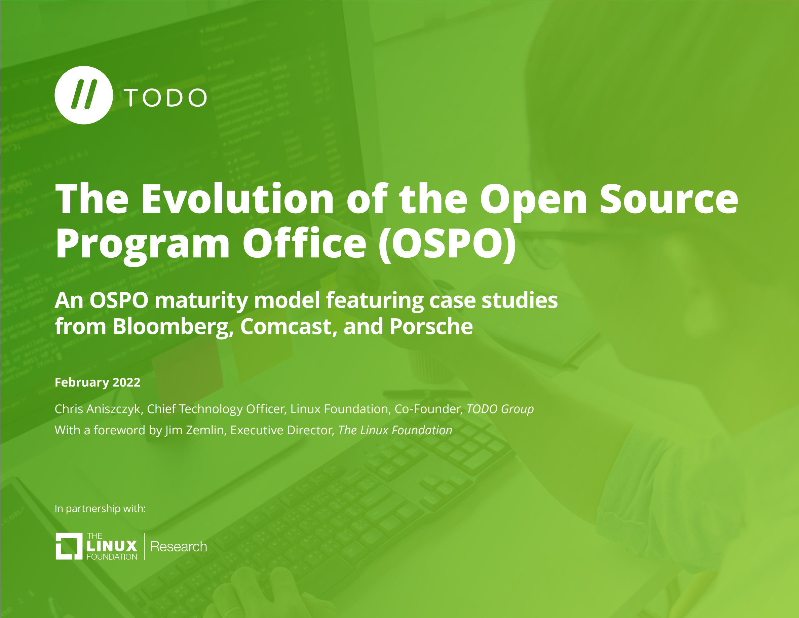
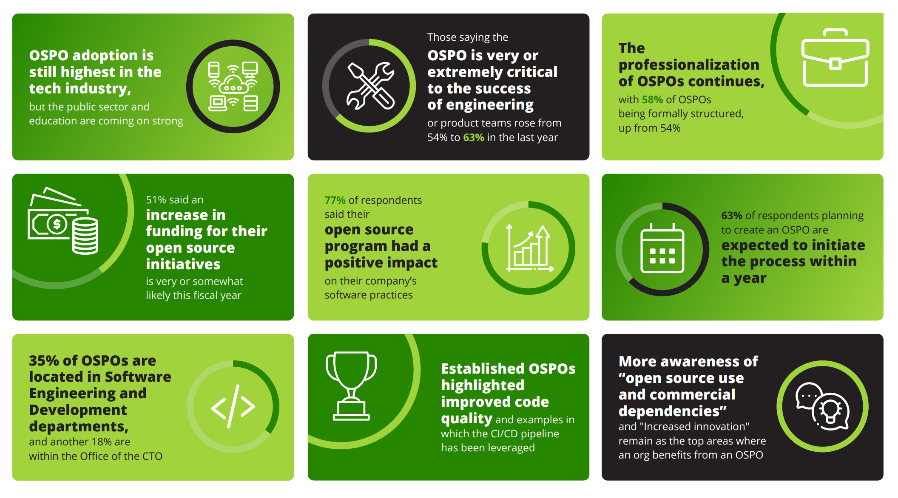
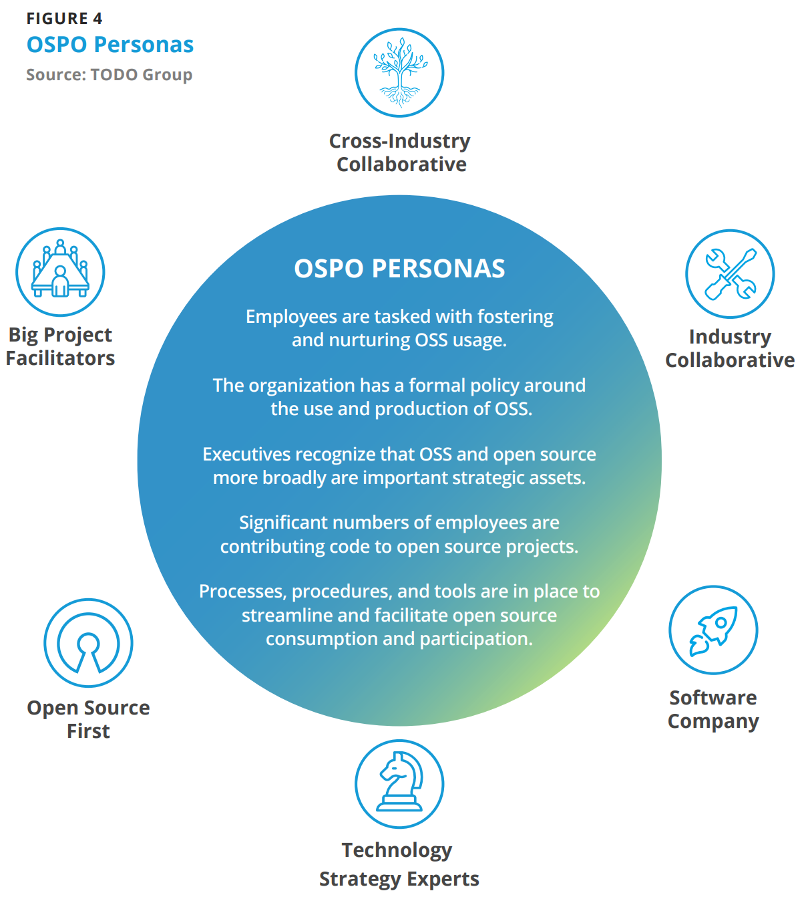

# 开源办公室演进

## 基于彭博社、康卡斯特和保时捷的开源办公室成熟度模型特征

**2022年2月**

Chris Aniszczyk, Linux 基金会 CTO，TODO Group联合创始人

前言：Linux 基金会执行董事 Jim Zemlin

## 目录

[前言](#前言)

[总结](#总结)

[调查方法和受访者构成](#调查方法和受访者构成)

[主要调查发现](#主要调查发现)

[五阶段 OSPO 成熟度模型](#五阶段-OSPO-成熟度模型)

[阶段 0：临时使用开源软件](#阶段-0临时使用开源软件)

[阶段1：提供开源软件合规性、清单和开发人员教育](#阶段1提供开源软件合规性清单和开发人员教育)

[阶段2 ：鼓励使用开源软件和生态系统参与](#阶段2-鼓励使用开源软件和生态系统参与)

[阶段3：托管开源软件项目和发展社区](#阶段3托管开源软件项目和发展社区)

[阶段4：成为战略决策合作伙伴](#阶段4成为战略决策合作伙伴)

[OSPO 原型](#descriptOSPO-原型)

[行业内协助](#行业内协助)

[跨行业协助](#跨行业协助)

[大项目推动者](#大项目推动者)

[开源优先](#开源优先)

[技术战略专家](#技术战略专家)

[软件公司](#软件公司)

[OSPO 案例研究](#OSPO-案例研究)

[公司简介](#公司简介)

[彭博社](#彭博社)

[康卡斯特](#康卡斯特)

[保时捷](#保时捷)

[结论：OSPO 的未来](#结论OSPO-的未来)

[OSPO 检查清单](#OSPO-检查清单)

[阶段1](#阶段1)

[阶段2](#阶段2)

[阶段3](#阶段3)

[阶段4](#阶段4)

[致谢](#致谢)

[免责声明](#免责声明)

## 前言

虽然开源软件 (Open Source Software， OSS)随着开发人员自下而上的快速采用而有机地出现，但随着时间的推移，使用开源软件的企业意识到他们需要创建治理结构和"护城河"，以确保合规地使用这种新兴的范式转换技术。开源软件在加速技术创新方面如此强大、对开发人员和"解决问题"的工程师如此有吸引力的元素——透明、快速迭代、协作创新——是法律团队经常关注的特征，也与传统技术开发战略背道而驰。

人们很快就清楚地认识到，开源不仅是一个可行的选择，而且是技术创新的关键途径。企业意识到他们需要适应这种新的创新方式，否则就有落后的风险。在这种背景下，最初的组织工作重点是确保开发人员遵守开源许可证并维护一份可用的开源软件清单。在技术性组织中，开源估值是企业文化不可分割的一部分，并且经常嵌入到产品中；话题通常远远超出许可证合规性，而是探索这些公司如何利用开源社区来加速和改进产品开发，同时保持商业优势。从这两个维度上看，开源办公室 (OSPO) 的种子已经萌发、成长为促进合规地使用开源软件的正规程序。随着时间的推移，在新成立的OSPO的大力支持下，我们见证了更多的开源项目的采用、贡献和社区范围内的参与。

TODO小组的存在是为了促进开源软件使用和社区建设方面的最佳实践。这越来越意味着授权企业和组织创建有效的
OSPO 计划。我们发布了许多广受好评的关于如何构建 OSPO计划的指南和工具包。本报告旨在提供一个更广泛的框架，以了解 OSPO 的原型以及我们在与数千家企业和组织合作时所看到的成熟阶段，因为他们已经完成了开源之旅。我们还想捕捉一些真实的 "用户旅程" ，用真实的人的真实声音讲述他们的真实体验。我们希望他们的见解能让现有和潜在的 OSPO 领导者了解促进开源的细微差别。这项工作为这些旅程提供了指导和路线图，因为 OSPO 的概念和结构随着开源运动而不断发展。

**Jim Zemlin**

**Linux 基金会执行董事**

|      |      |      |
|--- | --- | --- |
| OSPO 的采用率在科技行业中仍然最高，但在公共部门和教育机构正强劲增长    | 那些认为OSPO对工程或产品团队的成功非常或极其关键的人在去年从54%上升到63%   | OSPO 的专业化仍在继续，58% 的 OSPO 正在正式组建，高于此前的 54%   |
| 51% 的人表示，本财年他们的开源计划很有可能或有可能增加资金   | 77% 的受访者表示他们的开源项目对其公司的软件实践产生了积极影响    | 63%计划创建OSPO的受访者预计将在一年内启动该流程   |
| 35% 的 OSPO 位于软件工程和开发部门，另外 18% 位于 CTO 办公室内   | 已建立的OSPO突显了在改进代码质量和利用CI/CD管道方面的示例   | 组织从 OSPO 中受益的主要领域是对“开源使用和商业依赖”和“增加创新”有了更多认识   |

## 总结

在我们对开源实践的第四次 TODO小组 调查中，我们发现 OSPO
正朝着拥有更多专用资金和资源的更专业的组织发展。这种演变符合大小组织中开源软件和开发实践持续增长和接受的持续主题。为了更深入地了解
OSPO 的演变，我们采访了著名 OSPO
项目的领导者，包括一些最具影响力的技术公司，如红帽、微软和
VMware，以及一些最具标志性的汽车品牌和最大的媒体和娱乐公司之一。我们询问了他们的计划是如何开始的以及它们是如何演变的。基于这些访谈和调查数据，我们制定了一个五阶段的
OSPO 成熟度模型，从 (1) 临时使用开源软件到 (2) 解决合规性和许可问题到
(3) 鼓励参与到 (4) 贡献代码，以及最后，到 (5)
孵化开源有意义的项目。在本报告中，我们详细介绍了每个阶段，并开发了一些
OSPO
组织的原型。作为该过程的一部分，我们对三个不同行业（媒体、金融服务和汽车）中三个
OSPO 的演变进行了三个案例研究，每个案例都构建为 OSPO 各个阶段的旅程。在
OSPO 运动二十多年后，OSPO
的作用已发展成为专业知识的核心来源，并在全球具有前瞻性思维的公司制定和实施技术战略方面发出强有力的声音。

## 介绍

OSPO 的兴起大致反映了开源软件在当今世界组织内构建和运行最重要的技术应用程序的扩张。[精心设计的 OSPO](https://github.com/todogroup/OSPOdefinition.org)是组织开源运营和结构[的能力中心。](https://github.com/todogroup/OSPOdefinition.org)它的角色可以包括设置代码使用、分发、选择、审计和其他政策，以及培训开发人员、确保法律合规以及促进和建立有利于组织战略的社区参与。 OSPO 的概念大约有 20 年的历史，但在过去十年左右才真正开始加速。大多数著名的技术基础设施公司（例如亚马逊、VMware、思科）和消费技术公司（例如Apple、Google、Facebook 和 Twitter）都有 OSPO 或正式的开源规划。所有人都在鼓励他们的员工为对其业务和安全具有战略意义的开源项目做出贡献。

OSPO 在早期最初专注于许可证合规性，如今在组织内部经常发挥更广泛的作用。 OSPO通过促进最佳开源软件实践和参与开源软件社区来提高开发人员的效率，从而对开发人员和其他员工进行有关开源软件的教育。随着时间的推移，OSPO 已经从参与现有开源项目发展为在更广大的社区内创建和启动项目。高层管理人员更有可能承认开源技术在加速创新和在多个受益者之间分摊软件开发成本方面发挥的关键作用。 OSPO的任务在关键方面取得了进展，包括：

- 创建内部框架和工具以有效和高效地使用开源项目代码

- 就组织应如何指导员工参与开源以及支持哪些项目提供战略和战术指导

- 评估开源项目，并就将项目纳入组织的长期技术计划的风险和回报提供战略指导，重点关注开发人员的经验和效率

随着这种趋势的发展，人们更加依赖开源软件并开发测量指标来衡量 OSPO对组织的影响、每个组织对开源项目的影响，以及由 OSPO 及其上级组织创建和维护的项目的总体健康状况。 OSPO 的形成类似于组织首次开始建立 CISO 作为对安全事件的反应。建立这些安全能力中心的组织保护并武装自己，以创造更美好的未来。而那些没有经历、安全实践不佳的组织遭受了财务上的影响。

简而言之，随着时间的推移，OSPO 所关注的内容已经与他们的新角色相匹配。本报告的目的有两个：介绍最新的年度 OSPO 调查的主要发现，并通过与领先的从业者和专家的访谈为这些结果提供参考。我们在由 Linux 基金会主办的组织 TODO小组 的主持下进行了调查和采访。 TODO 是一个开放的组织团体，他们在实践、工具和其他方式上进行协作，以执行成功和有效的开源项目和计划。

## 调查方法和受访者构成

从 2021 年 6 月 10 日到 6 月 29 日，TODO 小组与 Linux Foundation Research 和 New Stack 合作进行了这项调查，以更好地了解 OSPO 的形成、运作和演变。这是 TODO小组连续第四年进行这项调查。我们通过社交媒体和直接电子邮件向 Linux 基金会、TODO小组和New Stack订阅者列表征集受访者。最终数据集包括来自 1,141 名调查参与者的回复。我们从至少有两名员工的 932 个组织中得出结论。受访者的构成与往年略有不同，更多人将自己描述为"个体经营者"或"不工作"。在 2021 年的调查中，与往年相比，为科技公司工作的受访者减少了。受访者来自各行各业，包括教育、电信、媒体、金融服务、政府、交通和汽车、医疗保健和零售。按行业划分的受访者百分比增幅最大的是政府、教育和零售业。

**图1 OSPO普及率：各行业于2018-2021年**

**资料来源： 2021年OSPO调查**

| 图内文字翻译  |
|--- |
| 技术（软件或 IT）   |
| 其他    |
| 教育 |
| 电信、通信或媒体 |
| 金融服务 |
| 政府 |
| 交通和汽车 |
| 卫生保健 |
| 零售 |
| 制造和原材料 |
| 国防 |
| 公用设施 |
| 保险 |

### 主要调查发现

随着 OSPO 调查的受访者数量在 2021 年显着增加，调查受访者的构成发生了变化，以反映整体经济，而不仅仅是技术（尽管回复仍然以技术为主）。与 2019 年相比，对 OSPO 角色、优先级和价值观的看法出现了一些趋势。尽管所有组织规模的组织中，拥有 OSPO 计划的组织的响应百分比都有所下降，但在大型组织中下降幅度最小。这种下降可能反映了调查构成的变化：它包括教育和政府等行业，这些行业的开源项目还处于起步阶段。这种下降也可能与 COVID-19 带来的经济和人员配置挑战有关。

即便如此，OSPO 运动仍有发展空间。显然，OSPO 倡导者必须更有效地传达专门创建 OSPO 和使用开源软件以及更广泛地为开源社区做出贡献的价值。调查显示，组织使用的开源软件多于他们对开源项目的贡献，而做出回应的组织并不完全了解 OSPO：

- 19% 的受访者表示他们从未听说过 OSPO。

- 28% 的受访者表示他们认为 OSPO 没有商业价值。

- 35% 的没有 OSPO 的组织表示他们没有考虑开设 OSPO。

该调查还揭示了充满希望的信号。与去年相比，受访者认为，由于宏观经济状况，本财年为其公司的开源计划提供的资金将增加的可能性是去年的两倍。为此，51% 的人表示很有可能或可能增加资金。调查数据显示，从 54% 增加到 63% 的受访者表示 OSPO 对其工程或产品团队的成功非常或极其重要。 OSPO 也通过正式的组织架构变得更加专业。 2021 年的调查发现，58% 的 OSPO 是正式的，高于 2020 年的 54%。在调查的开放式部分中，受访者强调了 OSPO 的许多有价值的好处，例如提高代码质量、更好地利用开源软件工具（如持续集成） /持续交付 （CI/CD）
，以及外部协作（开源）和内部协作（内部开源）之间的积极联系。

OSPO 的主要职责发生了一些变化。维持开源许可证合规审查和监督的调查参与者从 68% 下降到 59%，认为这是一项主要责任。对于大型非科技公司，合规仍然是最常被提及的主要责任，占 86%。将与开发者社区互动作为主要责任的比例从 48% 上升到 56%。在与生态系统参与和宣传相关的几个积极指标中，对开发人员关系和参与的重视将内部开源项目的外部贡献从 38% 增加到 47%。

## 五阶段 OSPO 成熟度模型

随着 OSPO 的激增并变得越来越普遍，OSPS已经成熟。通过将与 OSPO 领导者和专家的对话反映到 OSPO 调查结果，我们开发了一个 OSPO 成熟度模型来描述 OSPO 的典型演变。该模型是通用的：组织的规模和类型会影响 OSPO 的成熟度。在较大的组织中，多个业务部门可能会开发不同的开源方法，每个方法都有不同的技术文化；而纯数字技术公司更有可能更早地使用开源软件并为之做出贡献，并且更容易接触到开源技术和概念。

考虑一下企业基础架构软件提供商 VMware。它的工程师与网络、云和其他关键领域的许多开源社区合作并为之做出贡献，仅仅是因为他们知道，使用开源进行构建可以为社区和 VMware 的客户带来更好的结果和更高的互操作性。相比之下，红帽是第一家上市的开源公司。它在开源软件上建立了整个业务实践，压缩了成熟度生命周期，实际上，使整个公司成为了一个 OSPO。如今，红帽将更多资源用于早期生命周期活动，例如教育内部利益相关者（例如，销售团队、营销人员、新工程员工）和促进上游社区的协作。对于我们研究中的大多数其他公司，成熟度模型的一般阶段在消费、贡献、协作和参与以及领导力方面密切地映射了组织的开源软件轨迹。我们访谈的一些组织还设定参与和使用开源项目的指标。

这些指标可能包括开源软件项目中的工程参与率（拉取请求、评论、提交）、开源活动的出席和参与、撰写的博客文章、发表的演讲以及利用业余时间参与开源项目等等。更高级的开源组织可能有关于项目成功增长的指标，这些项目由他们自己的工程团队发起或部分创建。一些领先的组织，例如 康卡斯特、VMware 和 Red Hat，已经构建或正在构建高级度量和测量工具。

也就是说，即使是这些设置精准跟踪指标的组织也不会明确使用指标来跟踪或设置开源软件目标。以微软为例，该组织曾经几乎完全专注于专有软件，但现在已成为开源项目的主要支持者，并在其自己的产品中广泛使用开源软件。 "我们专注于让我们的开发人员更容易使用 \[开源软件\]，我们鼓励他们回馈他们所依赖的项目。我们跟踪整体参与情况，但OSPS确实在个人或团队层面设定了目标，" 微软 OSPO 前负责人 Stormy Peters 说。 "我们的开发人员可以自愿将他们的公司 ID 与他们的 GitHub 登录名关联起来，这使我们能够衡量公司层面的参与度。"[^1]大多数情况下，指标的系统收集和分析发生在采用的后期阶段，此时开源软件成为企业和大型组织的技术路线图和战略的关键要素，同时伴随着 OSPO 计划、预算、和工作人员。

**图2 OSPO 的四个阶段**

**来源：TODO 小组**

|      |      |      |      |       |
|--- | --- | --- | --- | --- |
| 高    |      |      | 领导   成为战略决策伙伴    | 第 4 阶段  |
|     |     |     | 积极参与   主办 OSS 项目与发展社区   | 第 3 阶段   |
| 执行能力   |     | 社区教育   宣传 OSS 使用和生态系统参与   |     | 第 2 阶段    |
|     | 法律教育   提供 OSS 合规性、清单、开发人员教育  |    |     | 第 1 阶段   |
| 低   | 采用   临时采用OS   |     |     | 第 0 阶段   |
|     | 无   | 低   | OSPO 水平   | 高   |

## 阶段 0：临时使用开源软件

今天，几乎所有的组织都使用开源软件。他们采用和最初使用它的方式各不相同。他们可能将开源软件用作产品或工具中的构建模块或库，或供应商产品堆栈的关键部分或支持供应商的服务产品。开发人员可以将开源软件用于快速原型设计或微服务和小型应用程序。开发人员还经常采用开源软件开发工具，例如集成开发环境 (IDE)，或构建在开源之上的工具，例如 GitHub 和 GitLab。现代云原生应用程序几乎默认使用开源系统进行容器编排、可观察性、数据存储、消息传递等。在应用程序的前端，开发人员严重依赖开源库和框架。 Red Hat 报告称，" [90% 的 IT
领导者都在使用企业开源。](https://www.redhat.com/en/enterprise-open-source-report/2022) " [Synopsys](https://www.synopsys.com/software-integrity/resources/analyst-reports/open-source-security-risk-analysis.html) 等软件组成分析供应商确定超过 75% 的代码库包含开源组件。[^2]

换句话说，几乎每个组织都在使用开源软件。然而，最早的采用形式是临时的，开发人员使用现成的工具和技术解决问题。这种"临时采用"通常意味着很少考虑默认情况下的许可合规性或使用开源和分发使用开源组件构建的产品的长期影响。在大多数情况下，一些工程师正在积极寻找开源，而工程组织的其他成员可能会巧合地使用开源，但并不认为其活动依赖于开源。因此，组织既没有专注于开源的集中团队，也没有顶级开源战略。这些至关重要，因为一旦采用这些开源组件，默认情况下，这些组件就会成为组织软件供应链的一部分，这使得战略方法变得更加必要。

## 阶段1：提供开源软件合规性、清单和开发人员教育

一般来说，当一个组织意识到几乎所有来自工程、开发部门和职能部门的人员都在使用开源产品和代码时，就会形成一个 OSPO。这种使用通常是内部的，而不是客户或用户的产品或服务的一部分。实际上，任何拥有大量 IT 功能和先进的在线或以应用程序为中心的组织都使用开源，因为开源在整个技术堆栈中无处不在--从 Linux 服务器和 MySQL 数据库到 Node.js 和 Python 等编程语言以及 React 和 Vue.js 等前端框架。

在这个早期阶段，组织经常为 OSPO 使用许多不同的名称。例如， IBM 最初将其程序化开源工作称为"[开源指导委员会"](https://citeseerx.ist.psu.edu/viewdoc/download?doi=10.1.1.136.5657&rep=rep1&type=pdf) 。然而，在所有情况下，处于阶段1的组织都认识到开源软件是其业务和技术战略的关键部分。他们了解开源软件项目的安全实践与专有软件公司的不同。例如，开源软件项目的披露规则往往比专有项目的披露规则更严格。因此，他们必须识别其法律和安全风险。风险缓解策略包括谨慎的许可、开发人员教育和严格的盘点。

### 管理法律风险和许可

组织的法律团队或技术领导者倾向于推进OSPO 的阶段1开发，以确保其员工（以及承包商、供应商等）都根据其许可条款使用开源软件，并且使用 开源软件不会使其面临法律风险。可以使用的开源软件许可证有[几十个。](https://opensource.org/licenses/category)在 2020 年的调查中，受访者将合规列为大公司 OSPO 的最大优势，而合规仍然是中型公司的第二大优势。 "公司一开始通常会很困惑。没有针对许可证合规性的政策，开发人员会做他们认为正确的事情，" 弗里德里希-亚历山大大学埃尔兰根-纽伦堡开源软件教授 Dirk Riehle 说：

> *我曾经走进一家公司，一位开发者说：我们没有开源政策。另一个打趣道：我们有，而且是：没有开源。第三个皱着眉头评论道："你在说什么？一段时间以来，我们一直在为开源项目做出贡献。" 这并不罕见。他们最终将建立一个开源办公室，负责处理开源的使用和贡献。*[^3]

虽然开源软件用户一直考虑合法合规，但一些开源软件贡献者设计了新的许可证，以阻止大型云服务商创建基于开源项目的专有服务。其中最突出的是Affero通用公共许可证 ( [AGPL](https://web.archive.org/web/20020806074857/http:/www.affero.org/oagpl.html))。公司可能会使用根据本许可条款发布的开源软件向其客户提供专有软件即服务 (SaaS)，但如果 AGPL 条款确实违反了许可，则开源软件的作者可能有理由起诉该公司没有明确区分内部和外部交付。许多企业的部门间也有内部财务收费系统，进一步模糊了付费服务和内部服务之间的界限。

### 教育开发者

为了保持合规性，处于 OSPO 成熟阶段 1 的组织创建了教育计划，以帮助其开发人员决定何时使用开源软件来创建新产品或服务。 "许多没有接受过开源教育的开发人员认为，因为他们没有购买软件，所以没有涉及许可，因为他们没有签署合同，" VMware 开源营销和战略总监Suzanne Ambiel说。 "开源软件可能是免费的——就像无价之宝一样——如果以不合规的方式使用，它也可能代价高昂。 **开源软件**总是带有许可证。任何 OSPO 最重要的角色之一是确保开发人员了解不同许可选择的含义。"[^4]

通过开发人员教育，高级管理人员通常认可开源软件的价值和重要性。在此类程序中，开发人员学习：

- 不同许可证类型的细微差别

- 引入新的开源软件产品的正式批准流程

- 不合规地消费开源软件的真正风险，包括在没有正式许可的情况下使用项目中的产品或代码

- 使用贡献者许可协议 (CLA) 来涵盖组织为开源做出贡献的开发人员

有时组织会在此阶段引入正式的 CLA 政策。它还可以为判断开源软件项目的健康状况提供指导，作为其决定在组织的技术堆栈或基础设施中使用哪个开源软件的标准的一部分。

### 清点软件清单

开发人员可能随机性地部署开源软件而不是系统地对他们的工作进行分类。法律团队和技术领导倾向于推动组织中使用的所有开源软件的清单。这样的清单将组织代码存储库（例如 GitHub、GitLab）和系统中的开源软件逐项列出。阶段1的组织设置特定的软件清单流程以创建组织范围的软件材料清单 (SBOM)。借助此清单，法律团队（通常与 OSPO 团队合作）可以持续监控开源软件的使用情况并标记法律、安全或其他项目风险。通过详细的 SBOM，首席技术官 (CTO) 或首席信息官 (CIO) 等技术领导可以识别并密切监控最关键的业务用途并保护组织安全。

## 阶段2 ：鼓励使用开源软件和生态系统参与

在组织认识到开源软件的价值以及对合规性、教育和 SBOM 的需求之后，他们开始意识到使用开源软件的经济利益并寻求扩展它。阶段2的 OSPO 创建了诸如推广使用经批准的开源软件产品的大使等内部机制，关于良好开源软件"卫生"的教育计划，以及用于开源软件技能建设和认证的技术培训或学费报销。通过这些举措，组织可以扩大其对开源软件的使用并扩大其信息，即开源软件不仅重要，而且比专有软件产品更可取和更可获取专利。

员工教育包括制定与开源软件项目交互的最佳实践，例如如何请求功能、提交错误报告和贡献基本代码。在此阶段，该组织加强了其协作能力，并体验了开源软件项目和社区的社交生活。在这一点上，OSPO 向员工和经理传达了为开源软件做出贡献而不仅仅是使用开源软件的重要性。这种外展活动包括倡导和推动活动赞助、在公共编码论坛中预定项目负责人和维护者作为演讲者或小组成员，以及为关键任务开源软件项目确保组织资源（例如人才、资金）。

对于组织而言，积极和可见的参与会产生多种好处：更好的知名度、更好的声誉、更有吸引力的雇主。为此，许多非技术组织在著名的开源软件活动上购买展位，以与这些社区进行更多互动，并招募喜欢在开源软件生态系统中工作的开发人员。活跃于开源领域的技术公司可能会将教育计划扩展到希望与开源软件社区和供应商互动的客户。 Red Hat 开源高级总监 Deborah Bryant 说： "我们从客户那里收到了很多请求，他们要求帮助和指导如何参与开源，或者如何为项目做出贡献或与我们合作。"[^5]

随着他们进入阶段2，组织开始鼓励他们的开发人员从事对其运营至关重要的开源软件项目，以使开发人员成为高度活跃的贡献者或主要维护者。对于技术组织来说，为一个著名的开源软件项目聘请贡献者是一项有价值的投资：他们的大多数贡献者，例如，Linux 内核（Linux 操作系统的核心组件和计算机硬件和软件之间的关键接口）都是全职员工 (Full Time Employee，FTE)，他们的工作是为 Linux 编写代码。

在技术部门之外，更少的组织可以分配开源工作的全职员工，但他们正在这样做。例如，康卡斯特 和 Bloomberg 的员工全职从事开源软件项目。在生命周期的这个阶段，OSPO 开始探索如何简化开发人员使用开源软件的流程。这种开发人员效率可能包括简化 CLA、将具有可接受许可证类型的开源软件添加到票务系统以便快速批准、促进开源软件架构和现有软件的重用（内部采购的一种变体）以及标准化库选择和开源开发工具，从而融合 OSPO 和平台运营职责。

在这个阶段，组织向 OSPO 寻求有关如何积极参与开放生态系统的指导。 Futurewei Technologies的OSPO负责人Chris Xie说： "你必须确保回馈与获得的一样多。你不希望人们认为你只是在通过开源获利而不回馈社区。" "我们强烈考虑到这一点——比以往任何时候都更加强烈。"[^6] 电信等受监管行业的公司还必须了解其国家出口法律并驾驭政治紧张局势，以保护开源软件社区并避开国际纠葛。[^7] "我们始终希望确保我们的贡献真正开放，造福社区，造福整个行业，" Xie谢解释道。

通常在 OSPO 成熟度周期的阶段2（也可能在 阶段1，如果公司是软件或核心技术公司），OSPO 开始为其开发人员简化和优化源代码贡献流程。在早期，请求和获得对外参与批准的过程通常是临时的和痛苦的。 SAP OSPO 的首席架构师Michael Picht说： "我们在建立 OSPO 时首先考虑的是捐款流程。" "使用 Word、Excel 和电子邮件，这个过程根本没有自动化。当我们打开 OSPO 时，我们做的第一件事就是简化流程并实施端到端工具支持。我们将 GitHub 问题用于不同的流程步骤。"[^8]

## 阶段3：托管开源软件项目和发展社区

在阶段3，组织发起开源软件项目并随后托管（host）项目或作为该项目赞助商。 他们将指定一名或多名全职员工参与一个项目，他们承担培育开源社区，并确保其健康。 在这个级别上，他们不会混淆组织的承诺与个别员工决定开源他们自己的项目的承诺。 在阶段3，组织领导者支持孵化和启动公共领域的开源项目，因为他们了解这些项目是如何使他们的组织受益。 这样的项目往往不能为其提供更好的可能对组织的非核心能力的关键能力的绩效和经济性价值主张，但对其至关重要技术基础设施。

此外，创建和启动开源项目的组织在开源社区中建立了广泛的信誉；从事开源技术的可能性对许多开发人员来说很有吸引力。我们采访过的大多数 OSPO 都将招聘新的工程人才和留住现有人才作为开源工作的关键动力。在[Linux Foundation Research最近](https://www.linuxfoundation.org/wp-content/uploads/LFResearch_FINOSSurvey_Report_111721.pdf)对金融服务行业的一项研究中，53% 的贡献者表示他们为开源软件做出贡献是因为"它很有趣"。

用全职员工和资金支持项目是开源游戏的真正皮肤。跨越这一门槛并成功启动多个开源项目的组织开发了内部资源和流程，可以孵化并确保这些项目在启动后的成功。 OSPO 不仅仅是项目形成和启动的守门人和导师；他们教育项目创建者培养健康的开源生态系统的要求，并指导项目负责人，让他们为开源软件项目所需的更公开的领导角色做好准备。

随着开源软件组织的成熟，其 OSPO 会开发内部流程、手册、检查清单、工具和其他机制来审查、组织和运营开源项目，并为他们的领导者做好准备和指导。一些 OSPO 更喜欢在协助下启动项目，主要与开源基金会或合作组织（例如
TODO小组）的合作，以增强能力或提供基础设施、战术援助和其他资源。这种偏好的资源密集度较低，但会将项目的控制权交给更广泛的社区。

## 阶段4：成为战略决策合作伙伴

在这个成熟阶段，OSPO 成为战略合作伙伴技术决策，帮助指导选择和塑造长期对项目的承诺。在阶段4，CTO 和其他技术领导者咨询 OSPO 及其领导层依赖的开源技术和决策标准用于判断开源项目。因为主要的开源技术选择往往会产生显着的二次和三级成本并影响上下游技术以及招聘计划、开源项目的选择成为一项重大的商业决策。从广义上讲，在阶段4OSPO 提供三种类型的战略指导。首先，OSPO 为 CTO 和技术领导提供建议采用或删除哪些开源技术来自组织的技术栈。鉴于当今有许多开源软件可供选择--大多数主要类别的软件具有数十种选择，如图 3 所示 --- OSPO 可以提供对开源软件趋势的洞察，例如不同的流行趋势不同 NoSQL 的语言、API 设计或功能数据库。在这个角色中，OSPO 成为一种内部技术CTO 顾问和开源软件内部专家。在第二种类型的战略指导中，OSPO 带头对什么构成可接受的开源软件项目进行基准测试。这OSPO 经常评估项目，尤其是限制使用的许可证类型的更改，或项目路线图的突然变化，以确定是否项目经理牢记社区的最大利益。大多数 OSPO 依赖粗略的指标来评估项目行为，例如：

- 它的行为准则是什么，违反它的后果是什么？

- 它的治理结构是什么，这种结构是否确保独立性？

- 响应拉取请求或错误文件需要多长时间？

- 项目多久发布一次新版本？

- 是由一方（公司或组织）还是整个社区控制项目？

- 该项目有多少贡献者？随着时间的推移，这个数字是如何变化的？

第三种指导是帮助组织了解并驾驭项目政治，例如保持中立当多个意见领袖试图引导的项目，或阐明潜在的政治考虑的社区成员。在更高的层面上，OSPO 可以提供帮助公司对技术民主保持中立态度并通过培养个人和跨越国界的工作关系和政治领域。越来越多地，这种价值延伸到基金会和非营利组织，因为这些领域变得重要开源中的中性空间。根据 Red Hat 的 Deborah Bryant 的说法，她的 OSPO 不得不承担开源基金会的管理工作，例如作为赞助商和委派员工担任领导角色。 "我们发现我们需要花更多的时间关于我们参与的一些中央管理和行政在软件基础中，以确保我们得到我们的投资回报并重新评估我们的参与有规律的节奏，" 她说。[^9]

在这个职位上，OSPO 拥有数百万美元的基金会预算，参与开源软件生态系统的战略重要性形成和增长与基金会的货币投资平行和非营利组织。 在这个阶段，我们往往会看到快速OSPO 的增长。 根据 VMware 的 Ambiel 的说法：

>OSPO 今天的主要目标之一是帮助最佳实践在指导以及如何成为一个优秀的开源公民。 什么时候你在开源社区，你正在参与开放——每个人都可以看到你在做什么。 这一点很重要一个组织尽其所能。 OSPO 帮助人们做始终如一地自信地在会议上发言或贡献一个小图书馆参与一个大项目社区，例如 Kubernetes[^10].

**图 3 云原生全景图**

**来源：云原生计算基金会，2022 年 2 月 22 日访问。**

|      |      |      |      |      |   |    |
|---------------- | --------------- | --------------- | --------|------- | -------|-------- |
| 应用定义和开发层    | 数据库    | 流和消息传递    | 应用程序定义和镜像构建    | 持续集成和持续交付   |  平台类  |  |
| 编排和管理层   | 编排和调度   | 协调和服务发现   | 远程进程调用   | 服务代理   | API 网关 | 服务网格 |
| 运行时层   | 云原生存储   | 容器运行时   | 云原生网络  |     |   |   |
|  自动化和部署工具   |  容器注册表   |  安全和合规  |  密钥管理  |     |  |    |
|  认证的K8s   |  认证的托管 K8s    |  认证的K8s 安装程序  |  PaaS / 容器服务  |     |  |    |
|  可观察性和分析   |  监控方案   |  日志工具  |  追踪工具  |  混沌工程   |  |    |

**图 4 OSPO 的角色**

**资料来源：TODO 小组**

|      |     |      |      |      |
| --- | --- | --- | --- | --- |
| 大型项目推动者    |      | 跨行业合作   |      | 行业合作   |
| 开源优先   |    |  技术战略专家   |     | 软件公司   |
|     | |  OSPO的角色   |    |     |     |
| 员工的任务是促进和培养 OSS 的使用。   | 该组织针对 OSS 的使用和生产制定了正式的政策。   | 高管们认识到 OSS 和更广泛的开源是重要的战略资产。  | 大量员工正在为开源项目贡献代码。 | 流程、程序和工具已经到位，以简化和促进开源使用和参与。|

## OSPO 原型

经常出现的一个问题是，各种OSPO原型是什么以及它们有何不同？ 在一定程度上，任何自称有 OSPO的组织可能表明该组织已达到或者临近某个成熟阶段，OSPO具有共同关键特征：

- 任务是促进和培养开源软件的使用。

- 该组织针对开源软件的使用和生产制定了正式的政策。

- 高管们认识到开源软件和更广泛的开源是重要的战略资产。

- 大量员工正在为开源项目贡献代码。

- 流程、程序和工具已经到位，以简化和促进开源消费和参与。

在本文中，我们采访了主要在总部位于北美、欧盟和亚洲的大型企业工作的 OSPO 领导人。由于样本数量有限，我们无法正确观察小型组织、非公司实体和总部位于其他领域的组织的原型 （更详细、更细致的原型研究将有利于 OSPO 运动）。根据我们为本文所进行的采访，我们总结了一些推动 OSPO 行为差异化的广泛原型。

### 行业内协助

这种原型中的 OSPO 将开源视为一个平台，不仅用于一般技术开发，而且还作为其特定行业通过分摊成本和创新以满足特定行业需求的一种方式来提高效率。在欧盟，许多主要汽车公司已经形成了一个松散的 OSPO 协调联盟，该联盟优先考虑汽车的关键开源软件计划，并就这些计划的软件开发进行合作。该联盟还致力于解决非行业特定的开源软件问题，例如创建和维护一组工具以自动化开源软件合规性和验证。

> **行业合作**
>
> **描述**
>
> 将开源视为特定行业通过分摊成本和创新来满足行业特定需求的一种方式
>
> **例子**
>
>来自欧盟的汽车公司

### 跨行业协助

具有这种原型的 OSPO 渴望致力于解决跨行业的基础技术问题。这项工作通常采用其他工具的形式，以自动消费和合规开源编程语言和框架（如 JavaScript 和 Node.js）上的开源工作。例如，Bloomberg 与 Microsoft 合作，为 TypeScript（JavaScript 的超集）做出了贡献，并创建了一个更好的工具结构，使 Bloomberg 工程师能够更轻松地回馈代码。

> **跨行业合作**
>
>**描述**
>
>渴望解决跨行业的基础技术问题。这项工作通常采用其他工具的形式，以自动化开源编程语言和框架上开源工作的使用和合规性
>
>**例子**
>
>彭博与微软合作为 TypeScript 做出贡献

### 大项目推动者

这些是罕见的 OSPO，它们在组织内部形成或促进大型、复杂的开源项目的形成，然后将它们作为公开可用的项目启动。此类项目的开销和承诺水平很高。代码的持续发展和社区的发展都需要大量的时间和金钱投资。出于这个原因，大多数 OSPO 并不寻求从其组织中启动大型项目。相反，当一个大项目启动时，公司通常会将其捐赠给基金会来启动。

>**大型项目推动者**
>
>**描述**
>
>罕见的OSPO，它们在组织内部形成或促进大型、复杂的开源项目的形成，然后将它们作为公开可用的项目启动
>
>**例子**
>
>康卡斯特孵化了 Apache Traffic Control Project

### 开源优先

当今许多 OSPO 的一项关键工作是帮助公司及其技术团队优先考虑开源软件使用，并使开源成为任何技术计划的默认首选。这些 OSPO 倾向于与 CTO 和公司战略家密切合作，以绘制开源项目和能力。开源优先， OSPO 敏锐地意识到[Copyleft](https://www.gnu.org/licenses/copyleft.en.html)许可和其他限制性开源许可形式的趋势。

>**开源优先**
>
>**描述**
>
>帮助公司及其技术团队优先考虑 OSS 的使用，并使开源成为任何技术计划的默认首选
>
>**示例**
>
>OSPO与CTO和公司战略专家密切合作，发现开源项目和能力

### 技术战略专家

这个 OSPO 原型与开源优先原型密切相关并且经常重叠，在评估可行的开源技术和帮助组织的 CTO 和工程副总裁制定技术路线图方面发挥着关键作用。这种咨询角色通常表明较低级别的类似方法，其中 OSPO 及其成员或大使可以充当内部顾问，以帮助开发人员和团队更好地理解、交互、使用和规划开源技术。

>**技术战略专家**
>
>**描述**
>
>在评估可行的开源技术和帮助组织的 CTO 和工程副总裁制定技术路线图方面发挥着关键作用。
>
>**例子**
>
>一个 OSPO，其成员可以充当内部顾问，以帮助开发人员和团队更好地理解、交互、使用和规划开源技术

### 软件公司

由于这些公司生产支持开源运动核心的相同产品，因此软件公司的 OSPO 往往具有略微不同的特征。在这些公司中，绝大多数开发人员通常都很好地理解和使用开源。这种原型更有可能孵化或参与大型项目，更有可能有专门从事开源工作的专门开发人员。例如，软件和技术公司主导着 Linux 项目的核心开发团队。子原型是技术公司严重依赖开源软件，必须专门设计来满足开源软件社区需求。英特尔和高通等半导体公司符合这一描述。

>**软件公司**
>
>**描述**
>
>帮助公司及其技术团队优先考虑 OSS 的使用，并使开源成为任何技术计划的默认首选
>
>**例子**
>
>OSPO 与 CTO 和公司战略专家密切合作以发现开源项目和能力

随着我们对 OSPO 及其支持的组织的活动进行更多研究，此原型列表将不断发展。同样具有指导意义的是通过访谈和案例研究对 OSPO 的形成、组织和利用进行详细检查。

## OSPO 案例研究

**表1**

### 公司简介

|      |   康卡斯特   |  彭博社    |    保时捷   |
| --- | --- | --- | --- |
| OSPO成立时间   | 5年   |  9年   | 2年    |
| OSPO全职员工人数    | 5-10   |  2   | 未透露   |
| 孵化的项目   | Apache Traffic Control, Trickster, Kuberhealthy   | KServe, bqplot, PowerfulSeal   | Porsche Design System, OSS， Review Toolkit, Cookie Consent
Banner   |
| 监控指标           |        详细      |      更喜欢整体方法   |  一些贡献指标和最佳实践 |
| 开发者数量         |        1,000     |      6,500+       |      未透露 |
|  汇报给            |         首席技术官    |  首席技术官      |   CPO（首席隐私官） |
|  专用开源软件开发人员数量  | 100s           | 未透露         |    10-15 |

### 彭博社

**跨行业开源**

彭博社（Bloomberg）是为世界领先的投资者和金融服务公司提供数据、新闻和分析的供应商。彭博社于 2012 年开始正式与开源社区合作，现在参与的人员包括公司 6,500 多名全球工程人员中的数百人。彭博社经常使用 开源软件，并为数十个外部开源项目贡献了大量代码。

在与彭博基础设施需求特别相关的领域，例如索引、机器学习、可视化以及用于中间件和表示层的核心 JavaScript/Node.js 语言，公司的工程师已成为项目负责人和主要负责人。在为彭博平台的核心功能提供支持的[Apache Lucene](https://lucene.apache.org/) / Solr项目中，一名公司员工是项目管理委员会的成员。彭博孵化并发布了多个开源项目到社区。例如，Bloomberg 的技术人员与其他组织合作创建了独立的开源项目和蓬勃发展[的社区，例如KServe项目](https://www.techatbloomberg.com/blog/the-journey-to-build-bloombergs-ml-inference-platform-using-kserve-formerly-kfserving/)，以便更容易地使用常见的机器学习软件和在 Kubernetes 上服务的模型。

#### 彭博的 OSPO 之旅

Bloomberg 于 2012 年开始其 OSPO 之旅，当时工程领导层意识到其工程师正在 Bloomberg 内部大规模使用开源。 JavaScript 和 Node.js 社区的早期和杰出贡献者，Bloomberg 的主要员工已经沉浸在开源中。 Bloomberg 的技术领导层也意识到了开源软件的战略和商业价值，并计划将其软件技术堆栈转变为强调开源而不是专有代码。

早在 2012 年，OSPO 运动仍处于起步阶段，而彭博社在大型科技公司之外几乎没有 OSPO 的例子（甚至在科技公司内部也很少有官方的 OSPO）。彭博社前技术社区参与负责人 Kevin P. Fleming 告诉我们， "在我开始在彭博社工作的前一年，工程人员之间一直在与首席技术官办公室讨论如何利用开源软件和云基础设施。他们意识到，\'我们不只是想成为 \[开源软件\] 的消费者；我们想成为合作者。\'"[^11]

作为公司 CTO 办公室的第一位 OSPO 员工，Fleming 的任务是从头开始创建一个 OSPO，以帮助这家传统上像许多其他组织一样将所有代码视为必须保护的知识产权的公司解锁开源。"彭博社一直非常孤立和保护一切。我们来自专有软件的世界，" Fleming说。他曾在拥有大量开源项目的小公司担任工程负责人，直至维护和发展整个项目。 "所以我们必须学习如何成为开源社区的成员，并跨越专有代码和开源的界限。"

作为一家具有超前法律思维的组织，彭博社制定了围绕开源合规和消费的政策，但现有政策旨在管理内部消费。它需要的是关于如何积极参与外部开源生态系统的指导和定义。例如，当Fleming来到彭博时，公司工程师没有在技术会议上谈论他们在开源方面的工作。他们有一种默契，即公司不赞成公开讨论内部技术。Fleming解释说：

>我的任务与合规无关。这是关于启用的。如果我们要选择这些 \[开源软件\] 工具来代替供应商提供的工具，我们如何让自己走上成为社区高效成员的道路，而不是成为一个发布和部署它们的组织，但想知道， "当我们需要进行更改或回答问题时，我们将如何获得支持？"[^12]

Fleming上任几年后，负责技术活动的人离开了公司，Fleming安排将这一责任移交给 OSPO。此举是彭博社公共宣传及其生态系统足迹的合乎逻辑的扩展；Fleming已经参与审查外部演讲的内容提案。彭博社的开源理念也推动了它的赞助政策，承保或在社区驱动的活动中发言，但不是公司活动。 "我们很高兴赞助或在 Apache Spark 会议上发言，但不是由一家销售基于 Spark 构建的带有专有模块的服务的公司举办的会议，" 他举例说。

随着时间的推移，彭博社的 OSPO 不仅发展为促进社区参与，还为考虑启动开源项目的团队提供必要的指导和支持。为了简化教育，Fleming和彭博社的团队编写了一份内部手册，概述了团队或员工在启动之前应该采取的所有考虑因素和步骤。与 TODO小组的许多最佳实践相呼应，Fleming根据彭博社及其特定的内部流程和决策实践定制了手册。

这个过程是微妙的，并考虑了许多因素。 "如果有人启动了一个潜在的项目，我们会召集我们的一位内部主题专家来查看代码，" Fleming解释道。 "他们可能会说，\'代码看起来很旧; 再也没有人以这种方式编写 Python，\'这是一个考虑因素，因为我们不希望在社区中被视为追求过时的做法或发布较少的代码。" 希望发布代码的团队还必须致力于培养社区并响应错误和拉取请求。 "如果我们要发布一个项目，工程师必须从他们的经理那里获得承诺，他们将有足够的时间来支持这个项目。" 他说。

彭博社 OSPO 的角色从战术发展到战略。 "一开始，当开源实践的知识没有在公司内很好地分布时，我们所做的大部分工作都是战术性的——让我们完成一件特定的事情，" Fleming说。

>随着越来越多的从管理层到个人贡献者的人明白我们想要建立更好的关系并扩大开源的参与和使用，我们成为了战略决策的顾问。我们应该使用这个社区的这个特定项目吗？它看起来像一个真正的社区，还是由一个公司或个人经营？我们帮助回答了这些问题。[^13]

换言之，社区健康和行为已成为公司技术投资的关键决定因素。

Fleming 告诉我们，彭博社定期与开源公司合作，帮助他们了解他们需要什么样的行为和治理结构来巩固使用他们的软件的长期承诺。Fleming说，

>在我的历史中，有人来找我们说："我们想使用这个软件！" 我们说，"软件很可靠，但社区并不健康。我们不知道该项目的未来是什么。也许我们应该考虑使用替代品，因为我们可能会发现自己在未来必须切换到替代品，而且成本会更高。"

这种做法已经超越了最初的决定，从以违反彭博社首选最佳实践的方式更改许可证或治理的项目中收回资源。Fleming说，

>我们不允许我们的工程师为不属于正确类型的开源许可的事物做出贡献。随着项目将许可证从 OSI 批准的许可证更改为他们自己的许可证类型，我们可能无法再为这些项目做出贡献，因为它们不再是真正的 \[开源软件\]。我们可能会建议减少对这些项目的投资。

此外，彭博社的 OSPO 帮助该公司制定了一项开放政策，优先考虑基于社区的开源技术，具有独立治理和充满活力、多样化的成员资格。 "当基础架构团队考虑更换支持内部服务产品的技术时，我们非常倾向于首先尝试找到解决该问题的开源软件解决方案，" Fleming 解释道。 "如果他们能找到解决 90% 问题的方法，而我们可以建立专业知识来解决剩下的 10%，我们就会这样做。只有当我们找不到关闭的东西时，我们才会考虑专有供应商或我们认为不开放的东西。"

2021 年 6 月，彭博社为 OSPO 增加了第二位全职员工，Alyssa Wright，她在开源软件方面拥有深厚的背景，包括在 OpenStreetMap 担任董事会领导。Wright和Fleming计划扩大彭博社的开源知识和实践以支持越来越多经常参与开源社区的工程师。有几名员工全职从事开源代码工作，这是彭博社的一个更高的门槛，因为员工通常必须向他们的经理证明，全职从事社区项目的工作为公司带来了明确的价值和效用。

彭博社最近加快了重要开源项目的发布步伐，这通常是由其积极的方法推动的，即建立共享工作并产生更多动力的多组织协作。Wright告诉我们：

>我们中的很多人都明白，将代码作为开源发布并不是在打开代码开关然后说："嘿，我们到此为止了。"
以负责任和有意义的方式这样做有助于创建和支持社区，并使其他人可以访问代码。我们总是希望以负责任和支持的方式行事，使其对他人有用。[^14]

### 康卡斯特

**关于康卡斯特的开源**

康卡斯特 是一家全球媒体和技术公司，在其整个组织中都采用了开源。 康卡斯特 使用开源来帮助构建一些为其产品和服务提供支持的主要基础设施服务。 康卡斯特 了解全球开源协作和创新的力量，它是改善客户体验和吸引公司最优秀人才的重要工具。该公司拥有数千名技术人员，其中许多人将开源作为其开发工作流程的一部分。 康卡斯特 为开源社区贡献了一些主要的开源项目，包括 Apache Traffic Control，这是 康卡斯特 生产中的一个大型内容交付网络解决方案，用于向客户交付 "最后一英里" 的内容。

除了在其产品中使用开源之外，康卡斯特还积极参与并赞助开源基金会和社区，包括 Linux 基金会、OpenStack 基金会、Apache 基金会、the Innersource Commons 和the Internet Engineering Task Force。 康卡斯特 鼓励其软件工程师回馈开源项目以及向他们所使用的上游开源项目提交变更。 康卡斯特 支持开源生态系统背后的集体开发精神。

#### 康卡斯特的OSPO之旅

康卡斯特 正式参与开源开始于 2006 年，当时一位软件开发人员为 Apache HTTP 做出了补丁贡献，并证明了在上游修复比在消费级别维护补丁更容易。 康卡斯特 正式进入消费和合规性的OSPO 成熟度周期的第一阶段始于几年前，当时一些法律和发展领导者制定了更正式的政策和流程，以应对不断增长的消费和贡献。

不久之后，康卡斯特进入了 OSPO 成熟度周期的贡献阶段，公司开发人员开始为开源项目贡献代码，康卡斯特成立了一个开源咨询委员会。为了正确衡量对开源的影响，康卡斯特从 2013 年开始跟踪贡献。第一年，公司员工统计了 13 项贡献。几年后，康卡斯特进入了成熟周期的下一个阶段，当时公司从 Apache Traffic Control 开始孵化并向公众发布项目。此后，康卡斯特不仅为公司使用的多个项目做出了贡献，还在 GitHub 上发布了数十个开源存储库，并发布了多个项目。

随着开源对 康卡斯特 的业务和技术战略变得越来越重要，该公司认识到它需要进入一个更成熟的阶段，即协作和社区领导阶段，以建立一个有凝聚力的内部和外部开源战略。 Nithya Ruff是 康卡斯特 研究员，自 2017 年起担任 康卡斯特 开源负责人，并担任 Linux 基金会董事会主席，受聘帮助推动整个公司的开源参与。 "公司希望确保我们有一个单一的地方来推动整个组织的开源参与和合规性。康卡斯特的 OSPO 的工作描述需要比合规性更广泛，并且需要包括继续促进代码贡献回馈社区，" Ruff 说。 "我们还需要加强我们的开发者关系实践，增加我们与领先基金会和生态系统的社区参与度。"[^15]

自成立以来，康卡斯特的OSPO有两个主要目标。第一个目标是让 康卡斯特 开发人员在消费、贡献、遵守、工作和创建开源时尽可能顺畅。第二个目标是通过回馈、积极参与并帮助社区更快地创新来支持和参与广泛的开源社区。这也有助于 康卡斯特 吸引和留住有才华的开源开发人员进入公司。 Ruff 指出， "我们的很多工程师都喜欢能够为开源软件做出贡献，能够在会议上发言，发表论文和博客。我们的工作是让它在开源软件中工作变得容易。我们相信开源软件是公司创新的关键组成部分，也是吸引优秀开发人员与我们合作的关键优势。"

为了实现这些目标以及更多目标，康卡斯特为其开源实践开发了所谓的"6Cs 战略"。6C 是 "沟通（communications）、消费（consumption）、贡献（contribution）、协作（collaboration）、合规（compliance）和文化（culture），这些都是在开放中发展和构建健康的开源生态系统的关键属性。 6C体现了康卡斯特的开源实践，从与 TODO小组 和OpenChain中的其他公司合作，到参与和赞助开源基金会，再到创建开源的内部思维和文化。例如，为了更加协作，康卡斯特加入了 Linux 和 Apache 基金会，并开始在这些机构中寻求领导角色并参加更多活动。 康卡斯特 在启动 OSPO 的早期就对开源软件使用情况和依赖项进行了清点，以便更好地了解依赖项在哪里以及要支持和合作的社区。
"该清单引导我们将资源用于协作和贡献，" Ruff 说。

随着时间的推移，OSPO 在康卡斯特的实践变得更加主动和更具战略性。随着OSPO的壮大，康卡斯特开源团队已经扩展到新的领域，创建了一个内部开源大使计划来扩大关于开源最佳实践的教育，并创建一个内部源代码实践来分担多个业务部门的开发负担。 康卡斯特的 OSPO 还收集有关开源和内部源代码工作影响的详细指标，包括已处理的贡献和贡献类型、事件（赞助、参与、内部、用户组等）、博客和文章出版物、合规自动化和咨询。

如今，康卡斯特的OSPO 已发展成为一个内部卓越中心和所有开源事物的咨询中心。 Ruff 解释说： "我们的业务部门现在向我们提出想法并说， '嘿，这就是我们想要做的。你能帮助实现这一目标吗？我们如何将其置于基础中？是否有流程或最佳实践？" 最近，OSPO 指导 Trickster 和Kuberhealthy维护人员将项目贡献给云原生计算基金会。 "通过这些项目，我们发现许多其他大公司也发现这些项目很有用，并积极参与了该项目。看到其他公司在博客上介绍他们对Kuberhealthy的使用以及它如何帮助他们，真是令人兴奋。这帮助我们为 CNCF 建立了一个商业案例，表明这两个项目有足够的吸引力，应该将它们添加到基金会的沙箱中。"

康卡斯特的 OSPO 在指导组织了解技术趋势、不断变化的许可证和开源方向以及最佳实践方面发挥着重要作用。 "当事情发生变化时，例如许可证更改或产品意外终止 (EOL)，我们会建议团队做什么以及如何应对，" Ruff 说。

"我的愿景是作为一家 OSPO 对公司具有战略意义，并使企业能够通过开源软件更好地实现其目标。今天，我们在做开源软件的方式上非常具有战略意义，" Ruff 说。 "从商业模式到生态系统建设，再到确定我们可以构建什么以及我们可以与谁合作，我相信，OSPO 可以提供很多东西。"

### 保时捷

**汽车领域的开源**

这家传奇的汽车制造商正在迅速迈向开源的未来。作为大众汽车集团的一部分，保时捷主要将开源软件用于嵌入式系统，例如电子控制单元，以及面向消费者的移动应用程序。在特斯拉的快速增长及其软件优先的汽车技术开发方法的推动下，大众汽车制定了多项举措来加速软件的内部创建，以及参与开源社区和项目。作为这项努力的一部分，保时捷于 2020 年创建了自己的 OSPO。该集团现在声称有 12 名全职员工在整个汽车公司的多个产品组中运营。

#### 保时捷的 OSPO 之旅

从历史上看，保时捷一直是开源软件的消费者。在 2018 年之前，该公司专注于确保选择使用开源的工程师以合规的方式这样做。虽然开源使用确实经过了法律审查，但每个产品组都有自己的合规流程和协调。

该公司认识到，统一的开源合规性和许可策略将更好地服务于它，一套工具可以简化合规性。

"我们一直都有一个合规计划。有一次，我们决定，因为我们确实消耗了大量的开源资源，所以我们需要一个跨职能的总体团队，" 保时捷 OSPO 负责人 Nik Peters 说。 "我们不想依靠产品团队，而是依靠技术、法律和其他问题的中心联络点。"

除了合规性之外，保时捷认识到它的未来在于拥抱开源，以更快地进行迭代和创新，并更快地将产品推向市场。 "很明显，仅仅遵守许可证是不够的。我们需要推动对开源软件的贡献，创建内部采购计划，并确保我们的开源软件是安全的，" Peters 解释说。

与许多公司相比，大众汽车正在积极推动开源，创建完全独立的公司，专注于汽车行业的软件创新。该公司希望减少对供应商的软件驱动组件的依赖，并增加内部开发。为此，大众成立了[CARIAD](https://cariad.technology/) 作为一个独立的企业，为企业集团的所有品牌创建软件并汇集资源。 CARIAD 密切参与了保时捷和其他大众汽车集团公司的 OSPO 工作。与此同时，保时捷和大众希望通过加强合作来改进他们的技术开发方法。

Peters 于 2018 年启动了 OSPO 之前的工作，并于 2020 年启动了正式的 OSPO。他围绕"协调员" 的概念组织了保时捷的 OSPO， "协调员" 位于产品团队内部，但向 OSPO 报告。在早期，Peters 和其他保时捷开源软件领导者花时间与拥有长期开源记录的领先软件和技术公司（例如 SAP）进行交流，以了解他们如何处理和培育开源。保时捷 OSPO 最初仅由 Peters 和一名同事组成，现已发展到 12 名全职员工，并制定了从上层管理层获得支持和资助的路线图。Peters本人向保时捷首席技术官汇报。 2020年，保时捷正式推出了OSPO。如今，所有开源软件合规性和批准都通过 OSPO 进行。

甚至从一开始，该集团创建保时捷开源生态系统的愿景就包含了更宏大、更全面的目标，包括：

- 提高保时捷在开源开发社区中作为软件组织的声誉

- 通过开源缩短产品上市时间和创新

- 降低软件开发成本

- 加强与行业和其他技术领导者的合作

- 提高软件质量和安全性

- 吸引和留住高素质员工

自 2020 年以来，保时捷旗下的 OSPO 迅速扩大了对开源的参与。 "今天，我们依赖其他公司和其他开发工作，以至于我们根据这些团队正在做的事情来计划我们的内部发布，" Peters说。 "从加入邮件列表和 Slack \[频道\] 到推动新的开源计划，它已经发生了巨大的变化。"

例如，保时捷与众多行业参与者合作开发[开源软件 Review Toolkit](https://github.com/oss-review-toolkit/ort) ，这是一个工具链和一组管道，可实现开源软件合规性和报告的自动化和标准化。保时捷正在与来自Bosch 、Here Technologies 以及欧盟其他汽车行业参与者和软件公司的开发人员合作。该公司还通过媒体和代码学校赞助加强了其开源工作的推广，Peters经常在这些学校发表主题演讲。

平心而论，Peters觉得保时捷已经取得了很大的进步，但还有很长的路要走。保时捷开发人员是参与者，但还不是重要的贡献者。该公司确实监控贡献，并希望围绕开源软件参与安装指标，作为 OSPO 管理目标的一部分。 "作为一个组织，我们既是贡献者，又是参与者。我们的一大目标是看看我们是否能够推动和制定开放标准——例如，汽车开源标准，" Peters 说。毫无疑问，对速度的需求正在推动保时捷的 OSPO。Peters指出，虽然普通汽车有几十个电子控制单元（ECU），每个都有不同的软件位，但特斯拉制造的汽车只有两个 ECU。这使特斯拉能够将功能开发更多地视为软件问题。 "我们的大目标是在五年内从 10% 到 20% 的内部嵌入式软件提高到至少 60%。对我们来说，这改变了游戏规则，" Peters说。为了实现这一目标，保时捷将需要从开源中获得的所有推动力。

## 结论：OSPO 的未来

随着世界从专有软件转向开源软件，OSPO 的作用将变得越来越重要。在我们对 OSPO 领导者的采访中，我们看到了 OSPO 的作用、OSPO 的预算以及致力于在组织中推广开源的员工的普遍扩展。显然，开源已经从构建技术产品和基础设施的方法和思维方式上升为吸引顶尖人才和实现业务目标的手段。这与社会的数字化转型平行。

在一个软件吞噬一切，大大小小的组织都非常喜欢开源软件的世界里，开源专业知识成为创造出色产品和产品体验不可或缺的一部分，无论是在产品层（媒体、通信）还是在支持产品。 OSPO 正在成长以填补这些新的更大的鞋子，充当内部咨询、卓越中心以及值得信赖的顾问和导师。这样的成长并非没有成长的阵痛。对开源和 OSPO 服务的需求似乎超过了供应，更成熟的 OSPO 正在开发扩展流程和功能，以服务于这些组织内更广泛的用户群。此外，OSPO 不仅仅适用于科技行业。我们看到学术界和政府内部正在建立 OSPO，以帮助进行软件采购和创新。

也就是说，我们与 OSPO 领导者的对话和调查回复表明，如果有的话，组织正在计划扩大 OSPO 预算和授权，以反映开源的增长。 OSPO 将拥有更多资源来自动化 OSPO 手动任务（在合规性或尽职调查等领域）和更大的 OSPO 团队，以满足在开源领域花费更多时间的开发人员的需求。对成功的 OSPO 的期望将从教育开发人员或编组代码贡献转变为增加有意义的战略价值并推动更高级别的开源战略、创新和开发人员效率。

## OSPO 检查清单

### 阶段1

- 定义程序品牌（例如，OSPO、开源计划、开源运营负责人）

- 管理法律风险和许可，创建新程序和文档，以确保员工根据许可条款使用开源软件，并且组织的开源软件消费不会使其面临法律风险

- 创建教育计划以帮助开发人员决定何时使用开源软件创建新产品或服务

- 设置特定的软件库存流程以创建组织范围内的软件物料清单 (SBOM)

- 总体而言，认识到开源软件的价值以及对合规性、教育和 SBOM 的需求

### 阶段2

- 列出与开源软件项目交互的最佳实践，例如如何请求功能、提交错误报告和贡献基本代码

- 向员工和经理传达为开源软件做出贡献而不是仅仅使用开源软件的重要性（包括倡导和推动活动赞助，在公共编码论坛中将项目负责人和维护者预订为演讲者或小组成员，以及确保组织资源用于关键任务开源软件项目）

- 激励开发人员从事对其运营至关重要的开源软件项目，使开发人员成为高度活跃的贡献者或主要维护者

### 阶段3

- 发起和主持开源软件项目，或作为项目主要发起人

- 创建和启动开源项目，以在开源社区中建立广泛的信誉

- 将一名或多名全职员工专门用于项目，并承担培养项目社区并确保其健康的责任

- 开发内部流程、手册、检查清单、工具和其他机制来审查、组织和运营开源项目，并准备和指导他们的领导者

### 阶段4

- 成为技术决策的战略合作伙伴，帮助指导选择并塑造对项目的长期承诺向 CTO 和技术领导提出建议，让他们了解在组织的技术堆栈中采用或删除哪些开源技术

- 带头对什么构成可接受的开源软件项目进行基准测试

- 帮助组织理解和驾驭项目政治

## 致谢

感谢本研究的所有参与者，他们慷慨地与我们交谈并审阅报告的各个部分，包括 Deborah Bryant、Chris Xie 、Dirk Riehle、Kevin Fleming、Alyssa Wright、Robyn "Stormy" Peters、Suzanne Ambiel 、Nikita Peters，Michael Picht和Peter Giese。如果没有熟练地领导研究和写作工作的 Alex Salkever以及帮助项目设计和推广的 TODO小组 的 Ana Jimenez，这份报告是不可能完成的。我们还要感谢 VMware 对这项研究的赞助。

## 免责声明

本报告"按原样"提供。 Linux 基金会及其作者、贡献者和赞助商明确否认与本报告相关的任何保证（明示、暗示或其他方式），包括对适销性、不侵权、适用于特定目的或标题的暗示保证。在任何情况下，Linux 基金会及其作者、贡献者和赞助商均不对任何其他方因任何形式的诉讼因由而导致的利润损失或任何形式的间接、特殊、偶然或后果性损害承担责任。无论是基于违约、侵权（包括疏忽）还是其他原因，以及他们是否已被告知此类损害的可能性。赞助本报告的编写并不构成其任何赞助商对其调查结果的认可。

[^1]: Stormy Peters, Zoom interview with author, Nov. 19, 2021

[^2]: "2021 Open Source Security and Risk Analysis Report," Synopsis Inc., May 14, 2021, p. 6.
    <https://www.synopsys.com/software-integrity/resources/analyst-reports/open-source-security-risk-analysis.html>, accessed Jan. 4, 2022.

[^3]: Dirk Riehle（教授，OSS，埃尔兰根-纽伦堡弗里德里希-亚历山大大学），Zoom 采访作者，2021 年 9 月 9 日。

[^4]: Suzanne Ambiel （VMware 开源营销和战略总监），Zoom 采访作者，2021 年 10 月 12 日。

[^5]: Deborah Bryant（Red Hat 开源高级总监），Zoom 采访作者，2021 年 8 月 24 日。

[^6]: Chris Xie （Futurewei Technologies OSPO 负责人） ，Zoom 作者采访，2021 年 8 月 24 日和 9 月 30 日。

[^7]: 参见，例如，Robert W. Hahn, "Government Policy toward Open-Source Software: An Overview," Government Policy Toward Open-Source Software, Brookings Institution Press and American Enterprise Institute, 2002年12月31日。 https://www.brookings.edu/wp-content/uploads/2016/07/ governmentpolicytowardopensourcesoftware_chapter.pdf, 2021年10月19日访问。

[^8]: Michael Picht （SAP 开源办公室首席架构师），Zoom 作者采访，2021 年 11 月 8 日

[^9]: Deborah Bryant (Senior Director, Open Source, Red Hat), Zoom interview with author, Aug. 24, 2021.

[^10]: Suzanne Ambiel (Director, Open Source Marketing and Strategy, VMware), Zoom interview with author, Oct. 12, 2021.

[^11]: Kevin P. Fleming (Bloomberg前Technology Community Engagement负责人), Zoom作者访谈, 2021年9月24日。

[^12]: Kevin P. Fleming (Bloomberg前Technology Community Engagement负责人), Zoom作者访谈, 2021年9月24日。

[^13]: Kevin P. Fleming (Bloomberg前Technology Community Engagement负责人), Zoom作者访谈, 2021年9月24日。

[^14]: Alyssa Wright (Bloomberg OSPO), Zoom作者访谈, 2021年9月24日。

[^15]: Nithya Ruff (康卡斯特 OSPO), Zoom作者访谈，2021年9月20日.

**TODO**

TODO 小组是一个由70多个组织组成的开放团体，他们拥有多年运行开源项目的经验，希望就实践、工具和其他方式进行协作，以运行成功和有效的开源项目和计划。这是一个分享经验、开发最佳实践和指导以及开发通用工具以改善全球跨部门OSPO采用和教育的地方。在此处可以发现有关所有正在进行的 TODO 倡议的更多信息，并查看OSPO全景图：<https://landscape.todogroup.org>

**The Linux Foundation Research**

Linux Foundation Research 成立于 2021 年，探索不断扩大的开源协作规模，提供对新兴技术趋势、最佳实践以及开源项目的全球影响的洞察。通过利用项目数据库和网络，致力于定量和定性方法的最佳实践，Linux Foundation Research

**Copyright © 2022 TODO Group**

本报告根据知识共享署名-禁止演绎 4.0 国际公共许可协议获得许可。本材料可以根据知识共享许可条款进行复制和分发。 要引用该作品，请注明以下内容：Chris Aniszczyk，“开源办公室的演变”，前言由 Jim Zemlin 完成，Linux 基金会，2022 年 2 月。
